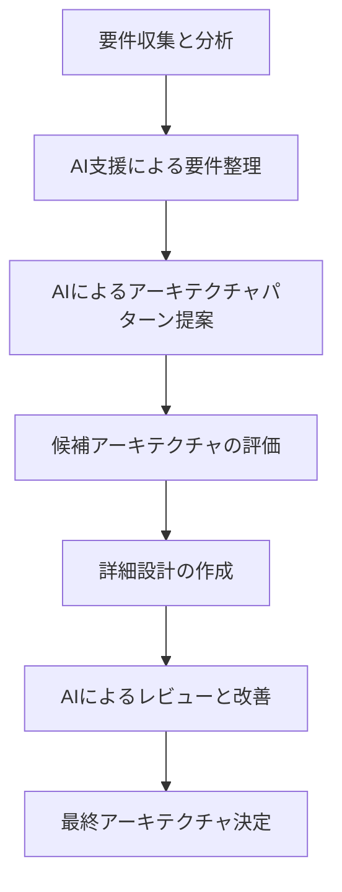
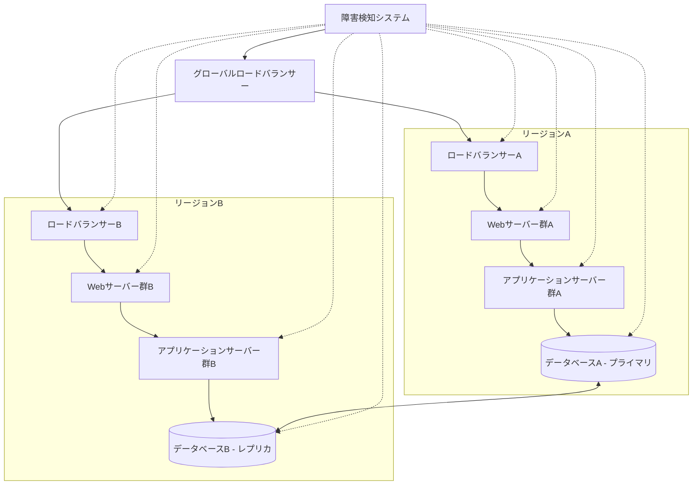
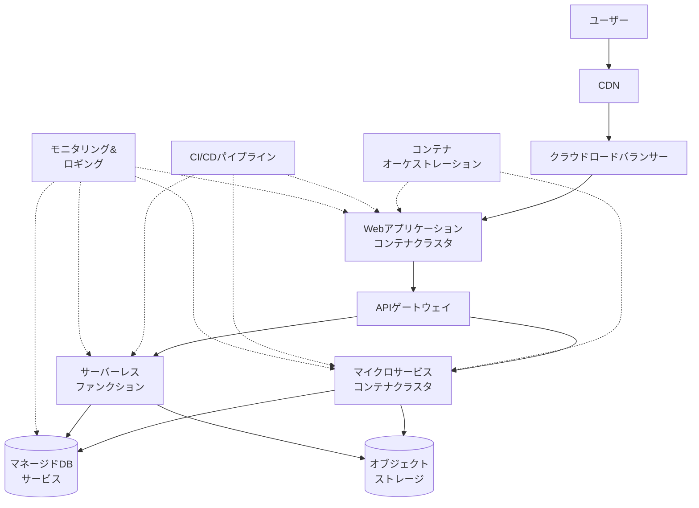

# システムアーキテクチャ設計支援

システムアーキテクチャは、ソフトウェアプロジェクトの成功を左右する重要な要素です。適切なアーキテクチャ設計は、システムの保守性、拡張性、性能、セキュリティなど、多くの品質特性に影響します。AI 駆動開発を活用することで、アーキテクチャ設計のプロセスを効率化し、より質の高い設計を実現することができます。

## システムアーキテクチャ設計の基本

### アーキテクチャ設計とは

システムアーキテクチャ設計とは、ソフトウェアシステムの基本構造を定義するプロセスです。これには以下のような要素が含まれます：

- コンポーネントの特定と責任範囲の定義
- コンポーネント間の関係と通信方法
- データの流れと保存方法
- システム全体の動作原理
- 非機能要件（性能、セキュリティ、スケーラビリティなど）の実現方法

### 一般的なアーキテクチャパターン

システム設計では様々なアーキテクチャパターンが使われます：

1. **レイヤードアーキテクチャ**: プレゼンテーション層、ビジネスロジック層、データアクセス層などに分離
2. **マイクロサービスアーキテクチャ**: 機能ごとに独立したサービスに分割
3. **イベント駆動アーキテクチャ**: イベントの生成と消費に基づく設計
4. **ヘキサゴナルアーキテクチャ（ポートとアダプターパターン）**: ビジネスロジックと外部依存を分離
5. **クライアント-サーバーアーキテクチャ**: 処理をクライアントとサーバーに分散
6. **パイプラインアーキテクチャ**: データ処理を順次行うステージの連鎖
7. **サーバーレスアーキテクチャ**: 必要に応じて実行されるファンクションに基づく設計

## AI を活用したアーキテクチャ設計プロセス

AI を活用してシステムアーキテクチャを設計する基本的なプロセスを紹介します。



### 要件に基づくアーキテクチャ推薦

AI は与えられた要件に基づいて、適切なアーキテクチャパターンを推薦することができます。以下は、そのためのプロンプト例です：

```
以下のシステム要件に基づいて、最も適切なアーキテクチャパターンを3つ提案し、それぞれの長所と短所を分析してください：

【機能要件】
- ユーザーは商品を検索・閲覧・購入できる
- 商品情報は定期的に更新される
- 決済は複数の方法（クレジットカード、電子マネー等）で行える
- 注文状況をリアルタイムで追跡できる
- 商品レコメンデーション機能がある

【非機能要件】
- ピーク時には1分間に1000リクエスト以上の処理が必要
- 99.9%以上の可用性が求められる
- データのバックアップと災害復旧対策が必要
- システムは段階的に機能拡張される予定
- モバイルとウェブの両方からアクセス可能
- 複数の外部システム（在庫管理、CRM等）と連携する

各アーキテクチャ提案には以下を含めてください：
1. アーキテクチャの概要と主要コンポーネント
2. なぜこのアーキテクチャが適しているか
3. 予想される課題と対策
4. 実装における注意点
```

### 具体的なアーキテクチャ設計支援

特定のアーキテクチャパターンが選択された後、AI はより詳細な設計を支援できます：

```
マイクロサービスアーキテクチャに基づいたEコマースシステムの詳細設計を支援してください。

【システム概要】
中規模のオンラインショップ（月間ユニークユーザー約50万人、商品数10万点）

【主要機能】
- ユーザー管理（登録、認証、プロファイル）
- 商品カタログ（検索、フィルタリング、詳細表示）
- ショッピングカート
- 注文処理
- 支払い処理
- 在庫管理
- 配送管理
- レビュー・評価

【技術スタック】
- フロントエンド: React
- バックエンド: Node.js/Java
- データベース: PostgreSQL, MongoDB, Redis
- メッセージングシステム: Kafka
- コンテナ化: Docker, Kubernetes

以下の内容を含むアーキテクチャ設計を提案してください：
1. サービス分割の方針と各マイクロサービスの責任範囲
2. データ管理戦略（どのサービスがどのデータを所有するか）
3. サービス間通信パターン（同期/非同期）
4. APIゲートウェイ設計
5. 認証・認可の仕組み
6. スケーラビリティ確保の方法
7. 障害対策と回復戦略
8. 監視とロギングの方針
```

## AI によるアーキテクチャの評価と最適化

既存のアーキテクチャや設計案を評価し、最適化するために AI を活用できます。

### アーキテクチャ評価のためのプロンプト

```
以下のアーキテクチャ設計を評価し、改善点を指摘してください：

[アーキテクチャ図またはコンポーネント説明を挿入]

特に以下の観点から評価してください：
1. スケーラビリティ - システムは負荷増大にどれだけ対応できるか
2. 保守性 - 変更や機能追加の容易さ
3. 堅牢性 - 障害に対する耐性
4. セキュリティ - 脆弱性や攻撃への対策
5. パフォーマンス - レスポンスタイムやスループット
6. 複雑性 - 不必要に複雑な部分はないか

各観点について、5段階評価（1=不十分、5=優れている）を行い、改善のための具体的な提案を提示してください。
```

### アーキテクチャのトレードオフ分析

システムアーキテクチャは常にトレードオフを伴います。AI はこのトレードオフの分析を支援できます：

```
以下のEコマースシステムでのアーキテクチャ決定に関するトレードオフを分析してください：

【検討中の決定】
1. データベースアーキテクチャ: リレーショナルDBのみ vs. マルチモデルアプローチ（RDBMSとNoSQL）
2. サービス粒度: より少ない大きなサービス vs. 多数の小さなマイクロサービス
3. データ一貫性: 強い一貫性 vs. 結果整合性
4. 通信パターン: REST API中心 vs. イベント駆動中心
5. デプロイ戦略: 複数環境での段階的デプロイ vs. カナリアリリース

各決定について以下を分析してください：
- 各選択肢の主なメリットとデメリット
- 短期的影響と長期的影響の違い
- どのような状況でどちらの選択肢が優れるか
- リスク軽減策
- この決定が他のアーキテクチャ選択に与える影響
```

## 特定の非機能要件に対応するアーキテクチャ設計

AI は特定の非機能要件に対応するアーキテクチャ設計のアドバイスも提供できます。

### 高可用性アーキテクチャ



高可用性アーキテクチャ設計のための AI プロンプト：

```
99.99%以上の可用性（年間ダウンタイム52分以内）を達成するための、Eコマースプラットフォームのアーキテクチャを設計してください。

考慮すべき障害シナリオ：
- サーバーハードウェア障害
- ネットワーク障害
- データセンター／アベイラビリティゾーン障害
- リージョン障害
- データベース障害
- 突発的なトラフィック増加

以下を含めた高可用性アーキテクチャの詳細を提供してください：
1. マルチリージョン展開戦略
2. ロードバランシングと自動スケーリングの設計
3. データレプリケーションと整合性の確保方法
4. 障害検知と自動復旧の仕組み
5. バックアップと災害復旧計画
6. CDNなどのエッジサービスの活用方法
7. 監視とアラートの設定
```

### スケーラブルなアーキテクチャ

スケーラブルなアーキテクチャ設計のための AI プロンプト：

```
急速に成長するSaaSアプリケーション（現在の月間アクティブユーザー1万人、1年後に10万人を見込む）のためのスケーラブルなアーキテクチャを設計してください。

【アプリケーション概要】
- プロジェクト管理ツール
- リアルタイムコラボレーション機能
- ファイル共有・ストレージ機能
- アナリティクスとレポート機能
- 外部ツールとの統合（20以上のAPIコネクタ）

【考慮すべき点】
- 水平スケーリングと垂直スケーリングの適切な組み合わせ
- データベースのスケーリング戦略
- キャッシュ層の設計
- マイクロサービスへの段階的移行の可能性
- 費用対効果の高いクラウドリソース活用

設計には以下を含めてください：
1. 初期アーキテクチャ（1万ユーザー向け）
2. 中間アーキテクチャ（5万ユーザー向け）
3. 目標アーキテクチャ（10万以上のユーザー向け）
4. 各段階での移行計画と注意点
5. 予想されるボトルネックと対策
6. 監視とアラートの重要指標
```

### セキュアなアーキテクチャ

セキュアなアーキテクチャ設計のための AI プロンプト：

```
金融系アプリケーション（個人向け資産管理サービス）のためのセキュアなアーキテクチャを設計してください。このアプリケーションは以下の機能を持ちます：

- ユーザーの銀行口座連携（Open Banking API利用）
- 資産状況の可視化・分析
- 支出の自動カテゴリ分類
- 予算設定と通知
- 投資アドバイス（ロボアドバイザー）

以下の脅威に対するセキュリティ対策を含めたアーキテクチャを設計してください：
1. データ漏洩
2. なりすまし攻撃
3. クロスサイトスクリプティング（XSS）
4. SQLインジェクション
5. CSRF攻撃
6. DDoS攻撃
7. 中間者攻撃
8. 内部不正

アーキテクチャ設計には以下の要素を含めてください：
- 認証・認可の仕組み（MFA、OAuthなど）
- データ暗号化戦略（保存時と転送時）
- セキュアな通信プロトコル
- セキュリティ監視とインシデント対応
- コンプライアンス対応（GDPR、PSD2など）
- セキュアなCI/CDパイプライン
- セキュリティテスト戦略
```

## AI を活用したアーキテクチャ設計の実践例

### Web アプリケーションのモダン化

レガシーなモノリシック Web アプリケーションをモダンアーキテクチャに移行する設計のための AI プロンプト：

```
以下のレガシーWebアプリケーションを段階的にモダン化するためのアーキテクチャ移行計画を立案してください：

【現状のアーキテクチャ】
- モノリシックなPHP/Laravelアプリケーション
- MySQLデータベース（単一インスタンス）
- Apache Webサーバー
- 物理サーバーでのホスティング
- CI/CDなし（手動デプロイ）

【課題】
- スケーラビリティの制限
- デプロイが遅く、リスクが高い
- 機能追加に時間がかかる
- パフォーマンス問題
- バージョンアップが困難

【目標アーキテクチャの要素】
- マイクロサービスまたはモジュラーモノリス
- コンテナベースのデプロイ
- クラウドネイティブ
- CI/CDパイプライン
- 自動スケーリング
- 高可用性
- モダンなフロントエンド（SPA）

段階的な移行計画を提案してください。各フェーズには以下を含めてください：
1. フェーズの目標と成果物
2. アーキテクチャの変更内容
3. 必要な技術スタックの変更
4. リスクと軽減策
5. 検証方法
6. 推定所要期間
```

### クラウドネイティブアーキテクチャ

クラウドネイティブアーキテクチャ設計のための AI プロンプト：



クラウドネイティブアーキテクチャ設計のための AI プロンプト：

```
AWSを利用したクラウドネイティブなアーキテクチャを設計してください。アプリケーションは以下の特性を持ちます：

【アプリケーション概要】
- ビデオストリーミングプラットフォーム
- ユーザーはビデオをアップロード、視聴、共有できる
- コンテンツのトランスコーディングが必要
- 視聴履歴や推奨アルゴリズムがある
- グローバルなユーザーベース
- アクセスパターンに大きな変動がある

以下のAWSサービスを活用したアーキテクチャ設計を提案してください：
- Amazon S3
- Amazon CloudFront
- AWS Lambda
- Amazon ECS/EKS
- Amazon DynamoDB
- Amazon RDS
- Amazon ElastiCache
- Amazon API Gateway
- AWS IAM
- Amazon CloudWatch
- AWS Step Functions

設計には以下の内容を含めてください：
1. 高レベルのアーキテクチャ図
2. 各AWSサービスの役割と構成
3. スケーリング戦略
4. 耐障害性の確保方法
5. コスト最適化のアプローチ
6. セキュリティ対策
7. デプロイと運用の考慮事項
```

## アーキテクチャ決定の文書化

アーキテクチャ決定の文書化も、AI を活用して効率化できます。

### アーキテクチャ決定記録（ADR）の生成

```
以下のアーキテクチャ決定について、アーキテクチャ決定記録（ADR）を作成してください：

【決定内容】
マイクロサービスの認証方式としてOpenID Connect（OIDC）と JWT を採用する

【ADR形式】
# タイトル
簡潔な決定の説明

## ステータス
提案済み/承認済み/廃止など

## コンテキスト
この決定が必要となった背景や状況

## 決定
具体的な決定内容の詳細

## 代替案
検討したが選ばなかった他の選択肢

## 結果
この決定による影響や結果

## 関連事項
関連する他の決定や考慮事項
```

### アーキテクチャドキュメントの自動生成

AI を活用して、設計の内容をドキュメント化することもできます：

```
以下の情報に基づいて、アーキテクチャドキュメントを作成してください：

【プロジェクト】
モバイルバンキングアプリケーション

【アーキテクチャ概要】
- iOS/Androidネイティブアプリ（フロントエンド）
- BFFパターンを使用したAPIレイヤー
- マイクロサービスバックエンド
- イベント駆動型の通知システム
- コマンドクエリ責任分離（CQRS）パターン

【主要コンポーネント】
（コンポーネントの詳細情報）

【技術スタック】
（技術スタックの詳細情報）

ドキュメントには以下のセクションを含めてください：
1. エグゼクティブサマリー
2. システム概要とコンテキスト
3. アーキテクチャの原則と制約
4. システムのステークホルダーと関心事
5. アーキテクチャビュー（コンテキスト、コンテナ、コンポーネント、コードの各レベル）
6. 主要なアーキテクチャ決定とその理由
7. 品質特性（性能、セキュリティ、可用性など）
8. リスクと軽減策
9. デプロイビューとランタイムビュー
10. 将来の展望と進化の方向性
```

## AI を活用したアーキテクチャ設計のベストプラクティス

### 効果的な AI 活用のコツ

AI を活用したアーキテクチャ設計を成功させるためのポイントは以下の通りです：

1. **適切なコンテキスト提供**: ビジネス要件、技術的制約、既存システムなどの情報を詳細に提供する
2. **段階的なアプローチ**: 全体像から詳細部分へと段階的に設計を進める
3. **複数の選択肢の検討**: AI に複数のアプローチを提案してもらい比較検討する
4. **ヒューマンレビュー**: AI 生成の設計を必ず人間の専門家がレビューする
5. **反復的改善**: AI との対話を通じて設計を繰り返し改善する
6. **ドメイン知識の補完**: AI が苦手とするドメイン固有の知識を人間が補う
7. **トレードオフの明確化**: デザインの選択肢の長所と短所を明確にする

### AI との効果的な対話例

複雑なシステムアーキテクチャを設計する際の効果的な AI との対話例：

```
【ステップ1: 全体像と要件の明確化】
「オンライン教育プラットフォームのシステムアーキテクチャを設計したいと思います。以下の要件があります...」

【ステップ2: アーキテクチャパターンの探索】
「提案いただいた3つのアーキテクチャパターンの中で、マイクロサービスアーキテクチャに興味があります。このパターンをベースに、さらに詳細な設計を進めたいと思います...」

【ステップ3: 特定領域の詳細設計】
「コンテンツ配信とユーザー管理のマイクロサービスについて、より詳細な設計を検討したいと思います。特に以下の点について提案をお願いします...」

【ステップ4: 懸念点の解決】
「コンテンツサービスとユーザーサービス間のデータ整合性について懸念があります。トランザクション管理の方法について複数のアプローチを提案してください...」

【ステップ5: 設計のレビューと改善】
「これまでの設計案をまとめました。全体を通して、パフォーマンスやスケーラビリティの観点から見直すべき点はありますか？...」
```

## まとめ

AI 駆動開発は、システムアーキテクチャ設計において強力な支援ツールとなります。適切に活用することで、以下のようなメリットが得られます：

1. **設計プロセスの効率化**: 複数のアーキテクチャパターンの迅速な検討と評価が可能になります
2. **より包括的な分析**: AI が様々な角度からトレードオフやリスクを分析します
3. **最新のベストプラクティスの適用**: 常に最新の技術トレンドやパターンを設計に取り入れられます
4. **ドキュメンテーションの自動化**: 設計の文書化や可視化を効率的に行えます
5. **学習と知識共有**: AI との対話を通じてチームのアーキテクチャ知識が高まります

ただし、AI はアーキテクト自身の経験や判断を代替するものではなく、それを補完・強化するツールとして活用すべきです。最終的なアーキテクチャ決定は、ビジネス要件やチームの技術力、組織の文化など、多くの要因を考慮して人間が行う必要があります。

AI 駆動開発を活用したシステムアーキテクチャ設計支援は、質の高いソフトウェアシステムを効率的に設計するための強力なアプローチです。適切に活用することで、より堅牢で拡張性のあるシステムを実現することができるでしょう。
