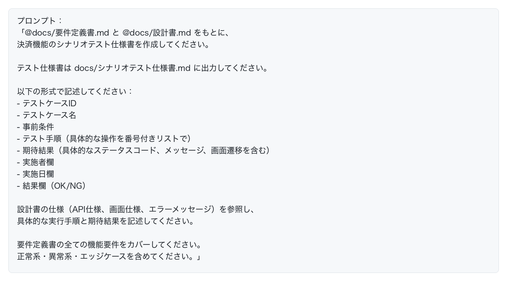
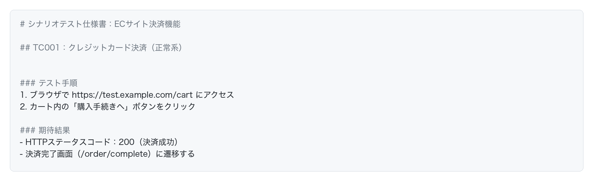

# シナリオテスト仕様書の自動生成

シナリオテストとは、要件定義書の内容を満たしているか？を最終チェックするテストです。
ユニットテストや統合テストはAIで自動化できますが、最終的な受け入れテスト（シナリオテスト）は人間が実施する必要があります。しかし、その**テスト仕様書**はAIで自動生成できます。

## 要件定義書と設計書の両方を活用する

シナリオテスト仕様書を生成する際、**要件定義書だけでなく設計書も参照させる**ことで、より詳細で実用的なテスト仕様書を作成できます。

### 要件定義書だけでは不十分な理由

要件定義書だけを参照すると、以下のような情報が不足します：

- **どういう振る舞いになれば正しいのか**（具体的なAPI仕様、画面遷移）
- **どういう実行手順でテストすれば良いのか**（具体的なボタン名、URL、パラメータ）
- **期待結果の詳細**（レスポンスステータスコード、エラーメッセージの具体的な文言）

設計書を追加で参照させることで、これらの具体的な情報を含んだテスト仕様書を生成できます。

## ECサイトのシナリオテスト仕様書を生成する

ECサイトの決済機能を例に、要件定義書と設計書の両方を活用してシナリオテスト仕様書を生成します。

### 要件定義書と設計書を参照させる

### 生成されるテスト仕様書の例

AIが以下のような詳細なテスト仕様書を生成します：

仕様書はExcelではなくマークダウンで出力されますが、無理にExcelに変換するよりも、マークダウンのまま、「結果：NG」などと記入していくのがおすすめです。

マークダウンなら、「結果NGの部分のバグを直して」とAIに修正依頼を出しやすいなどのメリットがあります。

## シナリオテスト仕様書もGitで管理

シナリオテスト仕様書もマークダウン形式なので、Gitで管理できます。これにより、過去のテスト結果も追跡でき、問題が発生した際に過去の状態と比較できます。
