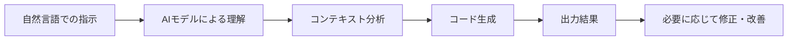
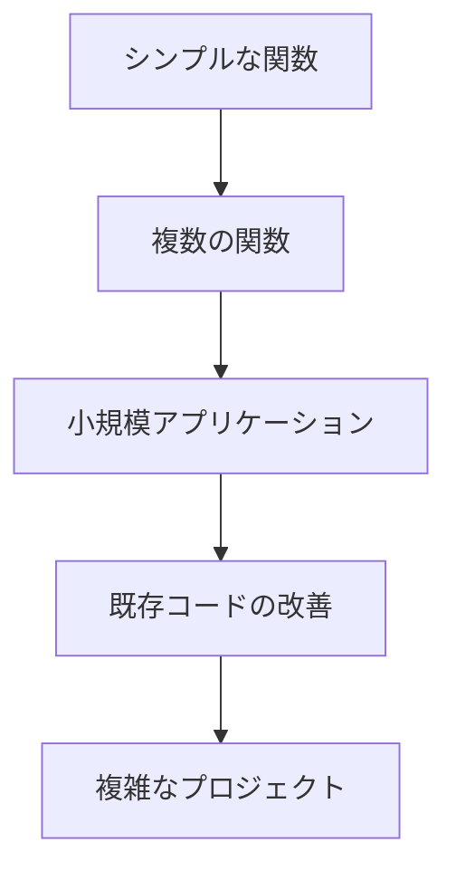

# シンプルなコード生成から始めよう

AI駆動開発において、最も基本的でありながら強力な機能が「コード生成」です。この記事では、AIを活用したシンプルなコード生成の方法とコツについて解説します。初心者の方でも気軽に始められるよう、基本から実践的な活用方法まで段階的に紹介していきます。

## AIコード生成の基本

AIによるコード生成とは、自然言語での指示をもとに、AIがプログラミングコードを生成する機能です。単純な関数の作成から複雑なアプリケーションの実装まで、幅広いコーディング作業を支援してくれます。

### AIコード生成の仕組み



AIはこれまでに学習した膨大なコードベースと言語データをもとに、あなたの指示を理解し、適切なコードを生成します。重要なのは、AIに「何を作りたいか」を明確に伝えることです。

## 最初の一歩：シンプルな関数の生成

AIコード生成を始める最も簡単な方法は、単一の目的を持った関数の作成から始めることです。

### 例 1：文字列処理関数

**AIへの指示例**：

```
JavaScriptで文字列を受け取り、その文字列が有効なメールアドレスかどうかを検証する関数を作成してください。
```

**AIが生成するコード例**：

```javascript
function isValidEmail(email) {
  const emailRegex = /^[^\s@]+@[^\s@]+\.[^\s@]+$/;
  return emailRegex.test(email);
}

// 使用例
console.log(isValidEmail("user@example.com")); // true
console.log(isValidEmail("invalid-email")); // false
```

### 例 2：計算ロジック

**AIへの指示例**：

```
Pythonで2つの数値を受け取り、最大公約数を計算する関数を作成してください。
```

**AIが生成するコード例**：

```python
def gcd(a, b):
    """
    2つの数値の最大公約数を計算する関数

    引数:
        a (int): 1つ目の数値
        b (int): 2つ目の数値

    戻り値:
        int: 最大公約数
    """
    while b:
        a, b = b, a % b
    return a

# 使用例
print(gcd(48, 18))  # 6
print(gcd(101, 103))  # 1
```

## コード生成の効果的な指示の出し方

AIからより良いコードを生成してもらうためには、指示の出し方が重要です。

### 明確な要件の提示

**基本的な指示**：

```
ユーザー登録機能を作ってください。
```

**改善された指示**：

```
Node.jsとExpressを使用して、ユーザー登録APIを実装してください。
要件:
- ユーザー名、メールアドレス、パスワードを受け取る
- パスワードはbcryptでハッシュ化する
- メールアドレスの重複チェックを行う
- 登録成功時にJWTトークンを発行する
- エラーハンドリングを適切に行う
```

### 具体的な入出力例の提供

AIにコードを生成してもらう際は、期待する入力と出力の例を示すことで、より正確なコードが得られます。

**基本的な指示**：

```
配列をソートする関数を作成してください。
```

**改善された指示**：

```
JavaScriptで、オブジェクトの配列を特定のプロパティでソートする関数を作成してください。

入力例:
const users = [
  { name: "田中", age: 30 },
  { name: "佐藤", age: 25 },
  { name: "鈴木", age: 40 }
];

期待する出力（ageでソートした場合）:
[
  { name: "佐藤", age: 25 },
  { name: "田中", age: 30 },
  { name: "鈴木", age: 40 }
]

関数はソートするプロパティ名を引数として受け取れるようにしてください。
```

## シンプルなプロジェクトの生成

単一の関数だけでなく、小規模なプロジェクト全体を生成することもできます。

### 例：シンプルな ToDo アプリ

**AIへの指示例**：

```
HTML、CSS、JavaScriptを使用した、シンプルなToDoリストアプリを作成してください。
機能:
- タスクの追加
- タスクの完了/未完了の切り替え
- タスクの削除
- ローカルストレージへの保存

すべてのコードを単一のHTMLファイルに含めてください。
```

AIはこの指示に基づいて、HTML の構造、CSS によるスタイリング、JavaScript による機能実装を含む完全なコードを生成します。

## コード生成時の注意点と対処法

### 1. 生成されたコードの検証

AIが生成したコードは常に検証が必要です。以下のポイントをチェックしましょう：

- 構文エラーがないか
- 指示通りの機能が実装されているか
- セキュリティ上の問題がないか
- パフォーマンス的に問題がないか

### 2. エラーが発生した場合の対処

生成されたコードでエラーが発生した場合は、エラーメッセージとともに AIに再度質問することで解決策を得られることが多いです。

**AIへの指示例**：

```
生成されたコードを実行したところ、以下のエラーが発生しました：
"ReferenceError: document is not defined"

このエラーを修正してください。このコードはNode.js環境で実行しています。
```

### 3. コードの改善と最適化

生成されたコードが動作しても、改善の余地がある場合は具体的にどのような改善が必要か指示しましょう。

**AIへの指示例**：

```
このコードは正しく動作していますが、以下の点を改善したいです：
1. エラーハンドリングの追加
2. コードのパフォーマンス最適化
3. より現代的なJavaScript構文（アロー関数、async/awaitなど）の使用

これらの改善点を考慮したコードを提案してください。
```

## 実践的なコード生成の例

ここでは、少し複雑な実践例を紹介します。

### 例：データ取得と表示機能

**AIへの指示例**：

```
React と fetch API を使用して、外部APIからデータを取得して表示するコンポーネントを作成してください。
要件:
- JSONPlaceholder API (https://jsonplaceholder.typicode.com/users) からユーザー情報を取得
- ロード中の状態を表示
- エラーハンドリング
- ユーザーリストの表示
- レスポンシブデザイン

React Hooks を使用して実装してください。
```

**AIが生成するコード例（一部）**：

```jsx
import React, { useState, useEffect } from "react";
import "./UserList.css";

const UserList = () => {
  const [users, setUsers] = useState([]);
  const [loading, setLoading] = useState(true);
  const [error, setError] = useState(null);

  useEffect(() => {
    const fetchUsers = async () => {
      try {
        const response = await fetch(
          "https://jsonplaceholder.typicode.com/users"
        );

        if (!response.ok) {
          throw new Error(`API error: ${response.status}`);
        }

        const data = await response.json();
        setUsers(data);
        setLoading(false);
      } catch (error) {
        setError(error.message);
        setLoading(false);
      }
    };

    fetchUsers();
  }, []);

  if (loading) {
    return <div className="loading">データを読み込み中...</div>;
  }

  if (error) {
    return <div className="error">エラーが発生しました: {error}</div>;
  }

  return (
    <div className="user-list-container">
      <h2>ユーザー一覧</h2>
      <div className="user-list">
        {users.map((user) => (
          <div className="user-card" key={user.id}>
            <h3>{user.name}</h3>
            <p>
              <strong>メール:</strong> {user.email}
            </p>
            <p>
              <strong>電話:</strong> {user.phone}
            </p>
            <p>
              <strong>ウェブサイト:</strong> {user.website}
            </p>
          </div>
        ))}
      </div>
    </div>
  );
};

export default UserList;
```

## シンプルなコード生成からステップアップするために

基本的なコード生成に慣れてきたら、以下のようなより高度な活用法にチャレンジしてみましょう。

### 1. 既存コードの改善

**AIへの指示例**：

```
以下のコードをリファクタリングして、可読性とパフォーマンスを向上させてください：

[既存のコード]

特に以下の点に注目してください：
1. 変数名とコメントの改善
2. 不要な処理の削除
3. パフォーマンス最適化
4. モダンなJavaScript構文の使用
```

### 2. ドキュメント生成

**AIへの指示例**：

```
以下の関数にJSDocコメントを追加してください：

function calculateTotal(items, tax, shipping) {
  const subtotal = items.reduce((sum, item) => sum + item.price * item.quantity, 0);
  const taxAmount = subtotal * tax;
  return subtotal + taxAmount + shipping;
}
```

### 3. テストコードの生成

**AIへの指示例**：

```
以下のユーザー認証関数に対するJestテストコードを作成してください：

async function authenticateUser(username, password) {
  // 関数の実装
}

以下のテストケースをカバーしてください：
1. 正しい認証情報での成功ケース
2. 誤った認証情報での失敗ケース
3. サーバーエラー時の処理
4. 空の入力値の処理
```

## AIコード生成の活用ステップ



このように段階的に AIコード生成の活用レベルを上げていくことで、AIとの効果的な協業スキルが身につきます。

## AI駆動開発における「シンプルなコード生成」の位置づけ

シンプルなコード生成は、AI駆動開発の入り口です。この基礎を固めることで、より複雑な開発タスクでも AIの力を最大限に引き出せるようになります。

具体的には、以下のような発展的な活用へとつながっていきます：

1. 複雑なアーキテクチャの設計支援
2. 最新技術や難しいアルゴリズムの実装
3. 大規模なコードベースの理解と修正
4. 高品質なテストの自動生成
5. パフォーマンス最適化の提案

## まとめ

シンプルなコード生成は、AI駆動開発の最初のステップです。この記事で紹介した以下のポイントを実践してみましょう：

1. 明確で具体的な指示を出す
2. 入出力例を提供する
3. 生成されたコードを必ず検証する
4. エラーが発生した場合は具体的にフィードバックする
5. 段階的に複雑なタスクに挑戦する

これらの基本を押さえることで、AIを活用したコード生成の効率と品質が大きく向上します。まずはシンプルな関数の生成から始めて、徐々に AIとの協業スキルを磨いていきましょう。AIはあなたの開発パートナーであり、指示の質が結果の質を決めることを忘れないでください。
