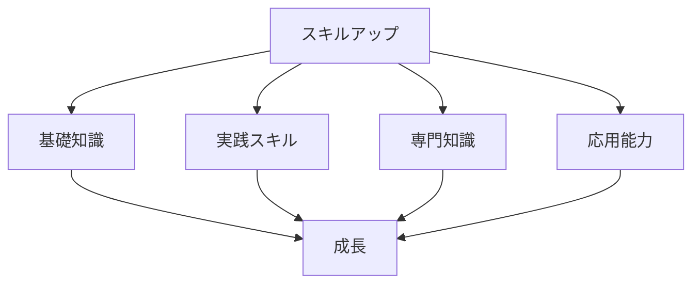

# スキルアップのロードマップ

## ロードマップの重要性

### ロードマップの目的

スキルアップのロードマップには以下のような目的があります：

- 目標の明確化
- 学習の体系化
- 進捗の管理
- 継続的な成長

### ロードマップの構成

## 段階的な学習計画

### 1. 基礎知識の習得

AI 駆動開発の基礎知識：

- プログラミングの基礎
- データ構造とアルゴリズム
- ソフトウェア設計の原則
- バージョン管理

### 2. 実践スキルの開発

実践的なスキルの開発：

- AI ツールの活用
- コード生成の実践
- テスト自動化
- デバッグ技術

### 3. 専門知識の深化

専門知識の深化：

- AI/ML の基礎
- クラウド技術
- セキュリティ
- パフォーマンス最適化

## 実践的なアプローチ

### 学習計画

効果的な学習計画の立て方：

- 目標の設定
- スケジュールの作成
- リソースの選択
- 進捗の管理

### 実践的な演習

実践的な演習の重要性：

- プロジェクトへの参加
- ハンズオン演習
- コードレビュー
- フィードバックの活用

## 成功のポイント

### 学習の最適化

学習を最適化するポイント：

- 集中学習
- 実践的な演習
- フィードバックの活用
- 継続的な改善

### モチベーションの維持

モチベーションを維持するポイント：

- 明確な目標設定
- 進捗の可視化
- コミュニティの活用
- 継続的な学習

## 実践的なアドバイス

### ロードマップの作成

効果的なロードマップを作成するステップ：

1. 目標の設定
2. 必要なスキルの特定
3. 学習計画の作成
4. 実践的な演習の計画
5. 評価と調整

### 成功への道筋

スキルアップを成功させるポイント：

- 明確な目標設定
- 計画的なアプローチ
- 継続的な学習
- 実践的な経験

## まとめ

効果的なスキルアップのロードマップは、AI 駆動開発のスキル向上に不可欠です。段階的な学習計画、実践的な演習、そして継続的な改善が重要です。
