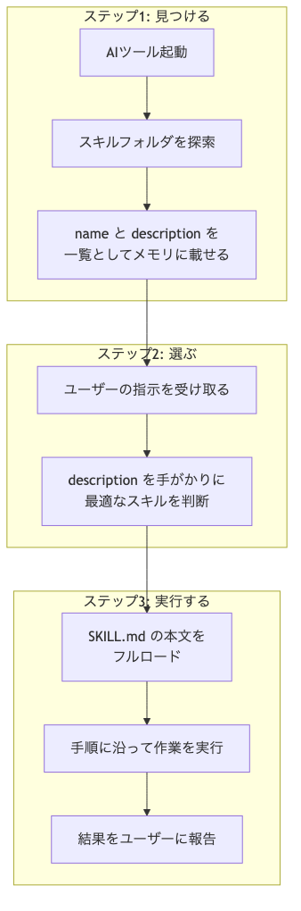

# スキル（Agent Skills）とは

前のセクションでは、ルールファイルを使ってAIにプロジェクトのルールを伝える方法を学びました。

ルールファイルは「社内規則」のように、AIが常に守るべきルールを記載するものでした。しかし、実際の開発現場では「ルール」だけでなく、「決まった作業手順」もAIに任せたい場面が出てきます。

そこで登場するのが「スキル（Agent Skills）」です。

## スキルとは

スキルは、AIエージェントに渡す「業務マニュアル」です。

会社で新人にPDFの作成を頼むとき、毎回やり方を口頭で説明するのは大変ですよね。そこで「PDFの作り方マニュアル」を渡して、あとはマニュアル通りにやってもらいます。

スキルはこれと同じ発想で、AIに渡すマニュアルを `SKILL.md` というマークダウンファイルとして用意しておく仕組みです。

たとえば、以下のようなスキルを作成できます。

- PDF作成スキル
- Excel作成スキル
- テスト実行スキル
- コミットメッセージ生成スキル

## なぜスキルが必要なのか

実はスキルがなくても、AIはPDF作成のようなタスクをこなせます。AIに「PDFを作って」と依頼すると、裏側ではこんなことが起きています。

1. AIがPDFを作成するためのPythonコードをその場で生成する
2. そのPythonコードをバックグラウンドで実行する
3. 実行結果としてPDFファイルが出力される

つまり、AIは「PDFの作り方を知っている」のではなく、「PDFを作るためのプログラムを毎回その場で書いている」のです。

一見うまくいきそうですが、このやり方には2つの問題があります。

**問題1：毎回コードを書き直す無駄**

同じ「PDF作成」でも、依頼のたびにPythonコードを一から生成するため、時間がかかります。

**問題2：出力が安定しない**

AIは同じ指示でも毎回異なるコードを生成します。昨日はうまくいった操作が、今日は微妙に違う結果になる、ということが起こり得ます。

### スキルを使うとどうなるか

スキルを導入すると、PDF作成に必要なPythonコードや手順があらかじめローカルに保存されます。AIは「PDF作成して」という依頼を受けると、保存済みのスキルを呼び出してタスクを実行します。

毎回同じ手順を使うので結果が安定し、コードを生成する時間も省けます。

**スキルなし：**

```
あなた：「PDFを作って」

AI：（Pythonコードを一から生成中...）
AI：（実行中...）
AI：「できました」

あなた：「もう一度同じものを作って」

AI：（また別のPythonコードを一から生成中...）
AI：（前回と微妙に違う結果に...）
```

**スキルあり：**

```
あなた：「PDFを作って」

AI：（保存済みのスキルを呼び出し）
AI：（いつも同じ手順で実行）
AI：「できました」

あなた：「もう一度同じものを作って」

AI：（同じスキルを呼び出し → 同じ結果）
```

## スキルの中身を見てみよう

スキルは1つのフォルダとして管理されます。フォルダの中には、指示書である `SKILL.md` と、必要に応じてスクリプトが入っています。

```
pdf/                        ← スキル名のフォルダ
├── SKILL.md                ← 指示書（これがスキルの本体）
└── scripts/
    └── create_pdf.py       ← 実際に使うPythonコード
```

AIは「PDFを作って」と依頼されると、このフォルダの中にある `SKILL.md` を読み、そこに書かれた手順に従って `create_pdf.py` を実行します。

### SKILL.mdの構造

`SKILL.md` は、大きく2つのパートで構成されています。

1. **設定ヘッダー**：`---` で囲んだ領域に、スキルの名前や説明を書く
2. **本文**：AIへの具体的な指示を書く領域

```markdown
---
name: pdf
description: PDFファイルを作成・編集する。PDF作成、PDF変換、ドキュメント出力を依頼されたときに使う。
allowed-tools: Read, Write, Bash(python scripts/create_pdf.py *)
---

PDFを作成するときは、以下の手順で進めてください。

1. ユーザーの指示から、出力するPDFの内容・レイアウトを整理する
2. scripts/create_pdf.py を使ってPDFを生成する
3. 生成したPDFのファイルパスをユーザーに伝える
```

`---` で囲まれた部分が設定ヘッダー、その下がすべて本文です。

設定ヘッダーの各項目には、それぞれ役割があります。

| 項目 | 役割 |
|------|------|
| `name` | スキル名。`/pdf` のようにスラッシュコマンドで呼び出すときの名前になる |
| `description` | 説明文。AIが「いつこのスキルを使うべきか」を判断する手がかりになる |
| `allowed-tools` | スキル実行中にAIが使える機能の制限 |

## スキルが動く仕組み

スキルの裏側の動作は、シンプルな3段階で進みます。



**ステップ1：見つける**

AIツールが起動すると、所定のフォルダにあるスキルを自動で探し出します。各スキルの `SKILL.md` から、`name` と `description` だけを読み取り、「どんなスキルが使えるか」の一覧をメモリに載せます。この段階で読み込むのはメタ情報だけなので、負荷はごくわずかです。

**ステップ2：選ぶ**

ユーザーからの指示を受け取ると、AIは一覧の中から「この作業に合うスキルはどれか」を判断します。`description` の記述が判断材料になるため、スキルの説明文の書き方が非常に重要です。

**ステップ3：実行する**

マッチしたスキルの `SKILL.md` 本文が全文読み込まれ、そこに書かれた手順に沿って作業が進みます。

### 自動呼び出しと手動呼び出し

スキルの呼び出し方は2通りあります。

- **自動呼び出し**：AIが状況を判断して、適切なスキルを自動で選んでくれる
- **手動呼び出し**：`/pdf` のようにスラッシュコマンドで直接実行する

たとえば「請求書を作って」と頼んだだけで、AIが自動でPDFスキルを起動してくれます。明示的に呼び出したい場合は `/pdf` と入力すれば確実です。

## スキルの保存場所

スキルをどこに保存するかで、使える範囲が変わります。

### プロジェクト専用のスキル

特定のプロジェクトだけで使いたいスキルは、そのプロジェクト内のスキルフォルダに保存します。ただし、スキルフォルダのパスはツールごとに異なります。

| ツール | プロジェクト用の保存先 |
|--------|-----------------|
| Claude Code | `.claude/skills/` |
| Cursor | `.cursor/skills/` |
| Gemini CLI | `.gemini/skills/` |

プロジェクトのスキルフォルダをGitにコミットしておけば、チームメンバー全員が同じスキルを使えるようになります。

### どのプロジェクトでも使えるスキル

プロジェクトを問わず使いたい汎用的なスキルは、ホームディレクトリに保存します。

| ツール | ユーザー用の保存先（全プロジェクト共通） |
|--------|--------------------------|
| Claude Code | `~/.claude/skills/` |
| Cursor | `~/.cursor/skills/` |
| Gemini CLI | `~/.gemini/skills/` |

ここに置いたスキルは「パーソナルスキル」と呼ばれ、どのプロジェクトでAIツールを起動しても自動で読み込まれます。

## descriptionの書き方がスキル成功の鍵

AIが起動時に読み込むのは、各スキルの `name` と `description` だけです。本文は選ばれるまで読み込まれません。

つまり、`description` が「このスキルを使うかどうか」を決める唯一の判断材料です。どれほど優秀な手順書を本文に書いても、`description` が曖昧ならそのスキルは永遠に眠ったままです。

`description` には、以下の2つの情報を含めましょう。

- **何をするスキルなのか**（What）
- **いつ使うべきなのか**（When）

### 悪い例と良い例

**悪い例：曖昧すぎる**

```
description: ドキュメントを作成する
```

「何のドキュメントを」「どう作成するのか」がわかりません。AIは判断できず、スキルを呼び出してくれません。

**悪い例：「何をするか」だけで「いつ使うか」がない**

```
description: 請求書をPDFファイルとして作成・出力する。
```

「何をするか」はわかりますが、AIの立場では「いつ発動させれば良いのか」が曖昧です。

**良い例：「何をするか」と「いつ使うか」の両方がある**

```
description: 請求書をPDFファイルとして作成する。ユーザーが請求書の作成を依頼したときに使う。
```

「何をするか」と「いつ使うか」が1文ずつ明確に書かれています。

## 情報量が増えたらreferencesフォルダで分割する

スキルを作り込むほど、手順書の内容は増えていきます。全部を1つの `SKILL.md` に詰め込むと、あっという間に巨大になってしまいます。

AIはスキルが選ばれた時点で `SKILL.md` の全文をコンテキストに読み込みます。ファイルが長ければ長いほど、コンテキストウィンドウを圧迫します。

解決策は、`SKILL.md` には「目次」と「要点」だけを残し、詳しい情報は別ファイルに分けて置くことです。

```
pdf/
├── SKILL.md                   ← 基本手順（メインファイル）
├── scripts/
│   └── create_pdf.py
└── reference/
    ├── overseas.md            ← 海外取引先向けの処理
    ├── correction.md          ← 請求書の修正・再発行ルール
    └── special-tax.md         ← 特殊な税処理
```

`SKILL.md` の中で「海外取引先の場合は `reference/overseas.md` を参照」と書いておけば、AIは必要なときだけ追加のファイルを読みに行きます。通常の国内請求書なら `reference/` フォルダのファイルは一切読み込まれず、コンテキストを消費しません。

公式のベストプラクティスでは、`SKILL.md` の本文を500行以内に収めることが推奨されています。

## ルールファイルとの違い

ルールファイルとスキルは似ているようで、役割が異なります。

| 項目 | ルールファイル | スキル |
|------|------------|--------|
| たとえ | 社内規則 | 業務マニュアル |
| 読み込みタイミング | AIツール起動時に常に読み込まれる | 必要に応じて読み込まれる |
| コンテキストへの影響 | 常にコンテキストを消費する | 使われたときだけ消費する |
| 主な用途 | コーディング規約、禁止事項、技術スタック | 決まった手順の実行、繰り返しタスクの自動化 |
| 例 | 「TypeScript strict mode を使用」 | 「請求書PDFを作成する手順」 |

ルールファイルは「常に守るべきルール」、スキルは「必要なときに参照する手順書」と覚えておきましょう。

## スキルを作ってみよう

スキルを自分で手書きする必要はありません。AIに作ってもらいましょう。

```
請求書をPDFとして作成するAgent Skillsを作って。
.claude/skills/pdf/ に保存して。

- descriptionには「何をするか」と「いつ使うか」の両方を含める
- 手順では、ユーザーの指示から請求内容を整理→Pythonスクリプトで生成→出力先を報告、の流れにする
```

これだけで、AIが `SKILL.md` とPDF生成用のPythonスクリプトを一式作ってくれます。

### 動作確認

スキルが保存できたら、AIツールを起動してテストします。

- **自動呼び出しのテスト**：`description` に合う質問をしてみる（例：「請求書を作って」）
- **手動呼び出しのテスト**：`/pdf` のようにスラッシュコマンドで直接実行する

どちらの方法でも、`SKILL.md` の本文に書いた手順どおりにAIが応答すれば成功です。

## まとめ

- **スキル**はAIに渡す「業務マニュアル」。`SKILL.md` に手順を書いておくだけで、AIが必要なタイミングで呼び出してくれる
- スキルがあると、**毎回コードを生成する無駄がなくなり、結果も安定**する
- `description` には**「何をするか」と「いつ使うか」の両方**を書くことが最重要
- 情報量が増えたら `reference/` フォルダで分割して、コンテキストウィンドウの圧迫を防ぐ
- ルールファイルは「社内規則」、スキルは「業務マニュアル」。役割が異なる
- スキルの作成はAIに任せてOK。`description` の書き方だけ指示すれば十分

次のセクションでは、スキルと対になるもう1つの仕組み「サブエージェント」について学び、両者の使い分けを解説します。
