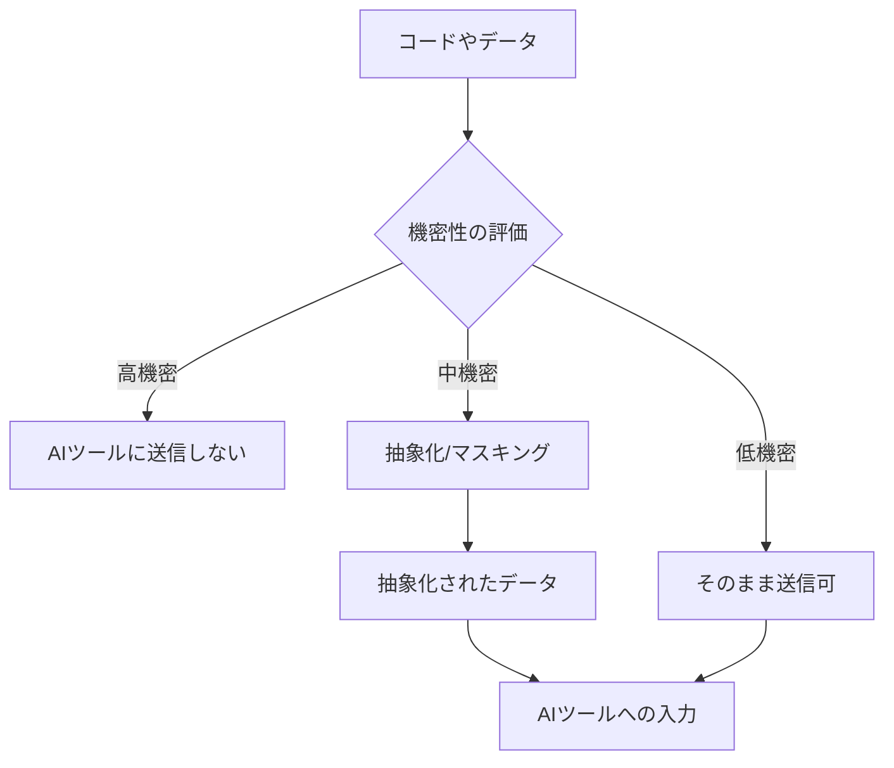
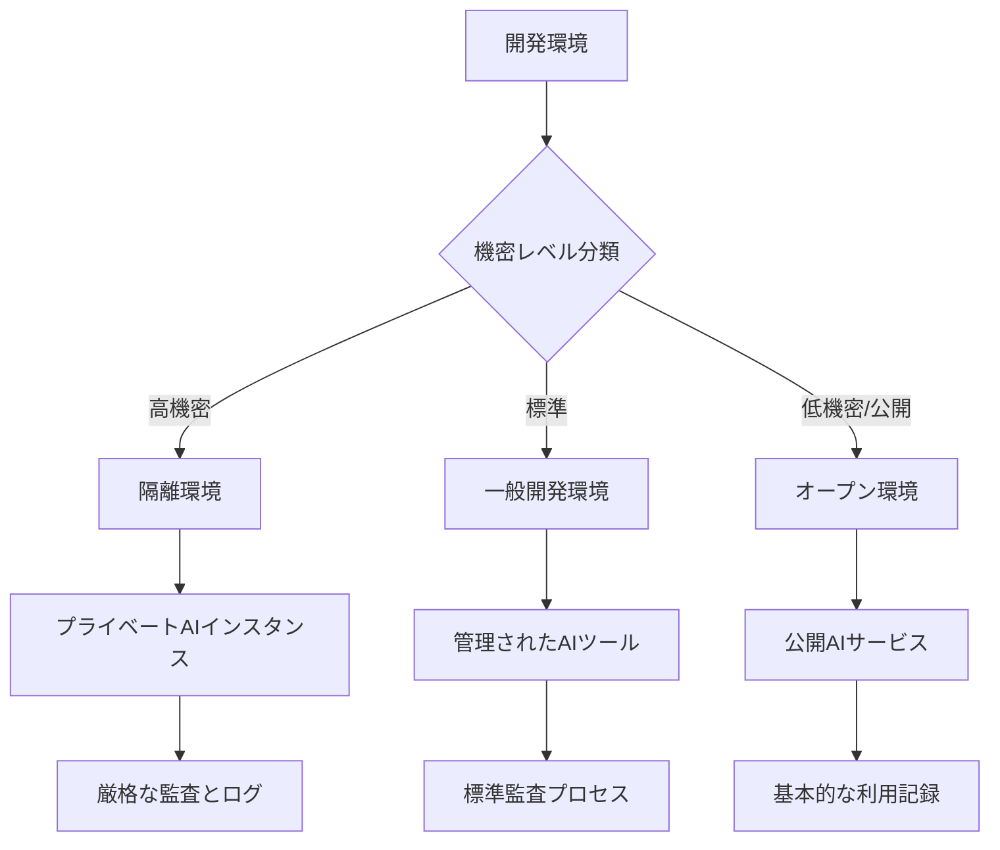
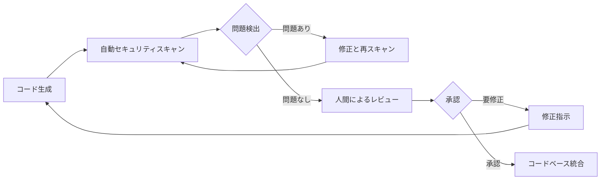
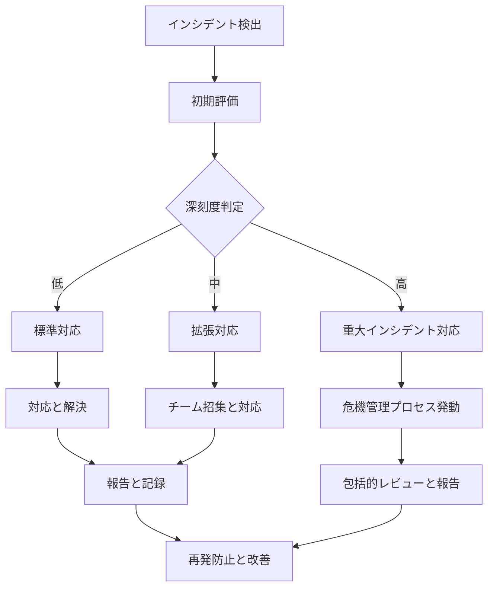

# セキュリティ上の注意点

## AI 駆動開発におけるセキュリティリスク

AI 駆動開発は開発効率を大幅に向上させる一方で、従来の開発手法にはなかった新たなセキュリティリスクをもたらします。これらのリスクを理解し適切に対策することが、安全な AI 活用の鍵となります。

本章では、AI 駆動開発で特に注意すべきセキュリティ上の注意点と、具体的な対策方法について解説します。

## 機密情報漏洩のリスク

### AI 開発ツールへのデータ送信リスク

AI 開発支援ツールの多くは、プロンプトやコンテキストとして入力された情報をクラウド上のサーバーに送信し、そこで処理を行います。この過程で意図せず機密情報が外部に送信されるリスクがあります。

**主なリスク**:

- **ソースコード漏洩**: 独自のアルゴリズムや知的財産を含むコードの漏洩
- **認証情報漏洩**: API キー、パスワード、アクセストークンなどの露出
- **個人情報漏洩**: ユーザーデータや個人を特定できる情報の漏洩
- **ビジネスロジック漏洩**: 競争優位性のあるビジネスロジックの流出
- **規制対象データ漏洩**: 法規制対象の機密データの意図しない送信

**対策方法**:

1. **データ分類と認識**:

   - 組織内の情報を機密レベルで分類
   - AI ツールに送信可能/不可の情報を明確化
   - 機密情報の自動検出ツールの導入

2. **情報マスキングと抽象化**:

   - コードを共有する前に機密情報をマスキング
   - 実際のデータを一般的な形式に抽象化
   - 固有名詞やドメイン固有の用語を一般化

3. **適切なツール選定**:
   - データ処理ポリシーが明確な AI ツールの選択
   - オンプレミスやプライベートクラウド版の検討
   - データ保持期間が明示されたサービスの選択



### プロンプトインジェクション対策

プロンプトインジェクションとは、AI モデルに対する入力を巧妙に操作することで、意図しない動作を引き起こす攻撃手法です。

**リスクシナリオ**:

- ユーザー入力をそのまま AI プロンプトに含めることで、AI の指示を上書き
- システムプロンプトやガイドラインを無視するよう誘導
- 機密情報の開示を促す悪意あるプロンプト

**対策方法**:

1. **入力サニタイゼーション**:

   - ユーザー入力の厳格な検証と無害化
   - 特殊命令や制御文字の除去
   - 入力長の制限と異常検知

2. **プロンプト構造化**:

   - システム指示とユーザー入力の明確な分離
   - ユーザー入力をメタデータとして扱い、直接指示に組み込まない
   - ロールベースのプロンプト設計

3. **AI レスポンス検証**:
   - 生成された回答の一貫性チェック
   - 禁止された情報や操作の検出
   - 異常なレスポンスパターンの監視

**プロンプト設計例**:

```
// 安全でない実装
let prompt = "以下のコードを分析してください: " + userInput;

// より安全な実装
let systemPrompt = "あなたはコード分析アシスタントです。提供されたコードを分析し、
セキュリティの問題やベストプラクティスについてアドバイスしてください。
機密情報の開示要求には応じないでください。";

let userPrompt = "分析対象コード: " + sanitizeInput(userInput);

let prompt = {
  system: systemPrompt,
  user: userPrompt
};
```

## AI 生成コードのセキュリティリスク

### 脆弱性を含むコードの生成

AI は学習データに含まれていた脆弱なコードパターンを再現することがあります。

**主な脆弱性リスク**:

- **インジェクション攻撃の可能性**: SQL インジェクションや XSS などの脆弱性
- **不適切なエラー処理**: 詳細なエラー情報の露出
- **安全でない暗号化実装**: 弱い暗号アルゴリズムや不適切な鍵管理
- **認証・認可の不備**: アクセス制御の不十分な実装
- **古いライブラリの使用推奨**: 既知の脆弱性を持つ古いバージョンの提案

**対策方法**:

1. **コードレビューの徹底**:

   - AI 生成コードの人間によるセキュリティレビュー
   - セキュリティチェックリストに基づく検証
   - ペアプログラミングによる検証

2. **自動スキャンツールの活用**:

   - 静的コード解析ツールの導入
   - 動的アプリケーションセキュリティテスト
   - コンポーネント分析と脆弱性スキャン

3. **セキュアコーディングガイドラインの適用**:
   - プロンプトでセキュアコーディングを明示
   - 組織のセキュリティ標準への準拠要求
   - 業界標準のセキュリティベストプラクティス適用

**セキュアプロンプト例**:

```
ユーザー認証機能を実装してください。以下の要件を満たすようにしてください：
1. SQLインジェクションを防ぐためにパラメータ化クエリを使用すること
2. パスワードは必ずbcryptなどの安全なアルゴリズムでハッシュ化すること
3. セッション管理には適切なタイムアウトと再認証を実装すること
4. 多要素認証のサポートを考慮すること
5. 失敗ログイン試行の制限機能を実装すること

なお、実装はOWASP Top 10セキュリティリスクに対応したものであることを確認してください。
```

### ライセンスと知的財産権の問題

AI 生成コードには、著作権やライセンスに関する複雑な問題が伴います。

**主なリスク**:

- **著作権侵害**: 保護された著作物の無許可複製
- **ライセンス違反**: オープンソースライセンスの要件不遵守
- **特許侵害**: 特許取得済み技術の無許可実装
- **帰属の混乱**: コードの真の作者とライセンスの不明確さ

**対策方法**:

1. **ライセンス検証**:

   - 生成コードの出典とライセンスの確認
   - ライセンススキャンツールの活用
   - 法的リスク評価プロセスの確立

2. **明確なポリシー策定**:

   - AI 生成コードの知的財産権ポリシーの策定
   - 組織内での生成コード使用ガイドラインの確立
   - コンプライアンス確認プロセスの整備

3. **開発プロセスへの統合**:
   - コードの出所を記録するコメント付与
   - ライセンス情報の明示的な追加
   - 依存関係とライセンスの文書化

**コード属性管理例**:

```java
/**
 * このファイルはAI支援により生成されました
 * 生成日: 2025-02-15
 * 使用ツール: GitHub Copilot
 * 人間による検証: 山田太郎 (2025-02-16)
 *
 * 含まれる外部コンポーネント:
 * - 暗号化モジュール: Apache License 2.0
 * - データ検証ユーティリティ: MIT License
 *
 * 組織内利用ポリシー: AIR-2025-001に準拠
 */
```

## 安全な AI 駆動開発のためのベストプラクティス

### セキュアな AI 開発環境の構築

AI ツールを安全に活用するための環境設定と運用方法です。

**環境設定のポイント**:

1. **AI ツールのアクセス制御**:

   - 適切な権限管理と認証の導入
   - 役割ベースのアクセス制御の実装
   - 機密プロジェクトでのアクセス制限

2. **環境分離**:

   - 機密度に応じた開発環境の分離
   - 本番環境データの AI ツールからの隔離
   - サンドボックス環境での安全な実験

3. **監査とログ記録**:
   - AI ツール利用の包括的なログ記録
   - センシティブな操作の監査証跡
   - 異常アクティビティの検出と警告



### セキュアな AI プロンプトエンジニアリング

セキュリティを考慮したプロンプト設計と実装方法です。

**セキュアプロンプト設計**:

1. **最小権限の原則適用**:

   - 必要最小限の情報だけを共有
   - 機能ごとに限定されたコンテキスト提供
   - 段階的な情報開示アプローチ

2. **入力検証と無害化**:

   - AI への入力の厳格な検証
   - 機密情報の自動検出と除去
   - パターンマッチングによるリスク検出

3. **出力検証**:
   - 生成されたコードやコンテンツの検証
   - セキュリティパターン違反の検出
   - ポリシー準拠の自動チェック

**実装例**:

```javascript
// セキュリティを考慮したAI活用関数の例
async function secureAICodeGeneration(userRequest, codeContext) {
  // 1. 入力検証と無害化
  const sanitizedRequest = sanitizeInput(userRequest);
  const sanitizedContext = removeSensitiveInfo(codeContext);

  // 2. 機密情報検出
  if (
    containsSensitiveData(sanitizedRequest) ||
    containsSensitiveData(sanitizedContext)
  ) {
    return {
      error: "機密情報が検出されました。入力を見直してください。",
      details: detectSensitiveDataDetails(sanitizedRequest, sanitizedContext),
    };
  }

  // 3. セキュアなプロンプト構築
  const securePrompt = buildSecurePrompt({
    systemInstructions: getSecurityGuidelines(),
    userRequest: sanitizedRequest,
    codeContext: sanitizedContext,
    securityLevel: getCurrentProjectSecurityLevel(),
  });

  // 4. AIモデル呼び出し
  const aiResponse = await callAIModel(securePrompt);

  // 5. 出力検証
  const securityScan = scanForSecurityIssues(aiResponse.code);
  if (securityScan.hasIssues) {
    return {
      warning: "セキュリティ上の懸念が検出されました",
      code: aiResponse.code,
      issues: securityScan.issues,
      suggestions: securityScan.suggestions,
    };
  }

  // 6. メタデータ追加
  const codeWithMetadata = addSecurityMetadata(aiResponse.code, {
    generatedAt: new Date(),
    securityScanResult: "PASS",
    requiresReview: securityScan.requiresHumanReview,
  });

  return {
    code: codeWithMetadata,
    securityNotes: securityScan.notes,
  };
}
```

### 組織的なセキュリティ対策

AI 駆動開発を安全に実施するための組織的なアプローチです。

**ガバナンスと教育**:

1. **ポリシーとガイドライン**:

   - AI 活用セキュリティポリシーの策定
   - 機密情報分類と取扱いルールの明確化
   - インシデント対応手順の確立

2. **開発者教育**:

   - AI セキュリティリスクの認識向上トレーニング
   - セキュアなプロンプト設計の教育
   - 生成コードのセキュリティ検証トレーニング

3. **監視と監査体制**:
   - AI ツール利用の定期的な監査
   - セキュリティコンプライアンスのチェック
   - リスク評価と対策の継続的改善

**セキュリティレビュープロセス**:



## 特定の開発シナリオでのセキュリティ対策

### 機密性の高いプロジェクトでの AI 活用

機密性の高い製品やサービスの開発における AI ツール活用方法です。

**主要アプローチ**:

1. **プライベート AI モデルの活用**:

   - 自社データでファインチューニングされたプライベートモデル
   - オンプレミスまたはプライベートクラウド環境での実行
   - データ保持と利用に関する厳格な管理

2. **限定的スコープでの活用**:

   - 非機密部分のみでの AI 活用
   - 機能単位での AI 活用是非判断
   - 抽象化されたコンテキストでの質問設計

3. **追加的保護対策**:
   - エンドツーエンド暗号化の実装
   - 匿名化と仮名化技術の活用
   - セキュリティ専門家による定期的なレビュー

**プライバシーバイデザインアプローチ**:

- 開発初期段階からのセキュリティ組み込み
- 最小限データ収集の原則適用
- デフォルトでのプライバシー保護設定

### 規制対象業界での AI 活用

金融、医療、政府機関など規制の厳しい業界での AI 活用方法です。

**コンプライアンス確保**:

1. **規制要件の理解と適用**:

   - 業界固有の規制への準拠確認
   - 個人情報保護法制への対応
   - 越境データ転送制限の考慮

2. **監査証跡の確立**:

   - AI ツール利用の包括的な記録
   - 意思決定プロセスの文書化
   - 変更管理と承認フローの厳格化

3. **影響評価の実施**:
   - AI 活用のデータプライバシー影響評価
   - セキュリティリスクアセスメント
   - コンプライアンスギャップ分析

**主要な考慮点**:

- GDPR、HIPAA、GLBA、PCI DSS などへの準拠
- データローカライゼーション要件への対応
- 説明責任と透明性の確保

## セキュリティインシデント対応計画

### 予防と検出

セキュリティインシデントを予防し早期に検出するためのアプローチです。

**予防対策**:

1. **事前リスク評価**:

   - AI 活用プロジェクトのリスク評価
   - 潜在的脆弱性の特定と軽減
   - 残存リスクの明確化と管理

2. **継続的モニタリング**:

   - 異常パターンの検出システム
   - データ漏洩検知ソリューション
   - アクセスと活動の監視

3. **定期的な評価**:
   - セキュリティ管理策の有効性評価
   - ペネトレーションテストとレッドチーム演習
   - コードとシステムの脆弱性スキャン

### インシデント発生時の対応

セキュリティインシデントが発生した場合の対応手順です。

**対応プロセス**:

1. **初動対応**:

   - インシデントの初期評価と封じ込め
   - 関係者への適切な通知
   - 証拠の保全と記録

2. **調査と分析**:

   - 根本原因の特定と分析
   - 影響範囲の評価
   - 再発防止策の検討

3. **是正措置**:

   - 脆弱性の修正と対策実施
   - 影響を受けたシステムの修復
   - プロセスと手順の見直し

4. **報告と学習**:
   - 経営層と規制当局への報告
   - 教訓の文書化と共有
   - 将来のインシデント防止策の強化

**インシデント対応フロー**:



## まとめ

AI 駆動開発は大きな可能性をもたらす一方で、従来とは異なるセキュリティリスクも伴います。これらのリスクを理解し、適切な対策を講じることで、AI ツールの恩恵を安全に享受することができます。

重要なポイントをまとめると：

1. **意識と理解**: AI ツール特有のセキュリティリスクを理解する
2. **予防的アプローチ**: 機密情報管理、コード検証、環境分離などの予防策を実施
3. **プロセス構築**: セキュリティを考慮した AI 活用プロセスを確立する
4. **組織的対応**: ポリシー、教育、監査体制などの組織的対策を整備
5. **継続的な改善**: 技術と脅威の進化に合わせて対策を継続的に更新

AI 駆動開発のセキュリティは、技術的対策だけでなく、人的要素とプロセスを含めた総合的なアプローチが必要です。セキュリティを開発プロセスに組み込み、チーム全体でセキュリティ意識を高めることが、安全な AI 活用の基盤となります。

最後に、AI ツールやモデルは急速に進化しているため、セキュリティに関する情報も常にアップデートし、最新の脅威と対策に関する知識を維持することが重要です。
