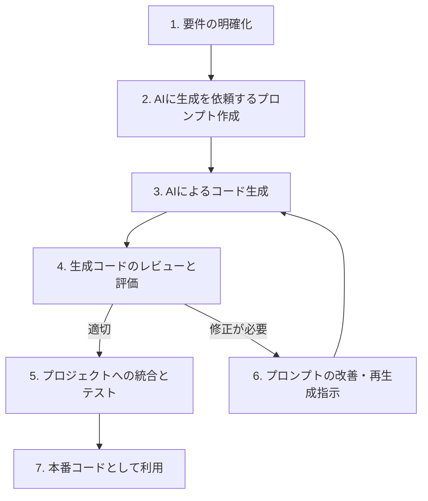
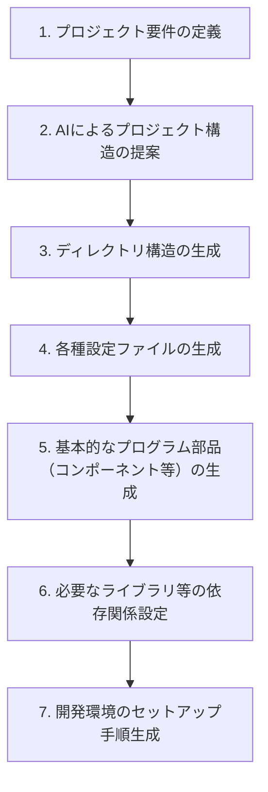

# ソースコードの自動生成

AI 駆動開発を活用することで、コーディング作業を大幅に効率化できます。

## 自動生成が有効なソースコードとは

ソースコード自動生成の対象となる、繰り返し現れるコードの代表的な例としては以下のようなものがあります。

- データ操作の基本機能（CRUD：作成、読み取り、更新、削除）を実装するコード
- データベースへの接続やクエリ発行を行うコード
- Web フォームなどで入力された値の妥当性を検証するコード
- Web API のエンドポイント（URL と処理の対応付け）を定義するコード
- ファイルの読み書きといった標準的な入出力処理を行うコード
- クラスやインターフェースといったプログラム部品の基本的な骨組み
- プロジェクトの初期設定や構成を記述したファイル

これらのコードは、アプリケーションの独自機能そのものではありませんが、システムが正しく動作するための「土台」となる重要な部分です。

## AI 駆動開発によるソースコード自動生成のメリット

AI を活用して定型的なソースコードを自動生成することで、以下のような多くのメリットが期待できます。

1. **開発時間の大幅な短縮**：繰り返しが多いコード記述にかかる時間を大幅に削減できます。
2. **人為的ミスの削減**：手入力に伴うタイプミスや、コピー＆ペーストによるエラーの発生を防ぎます。
3. **コードの一貫性確保**：プロジェクト全体を通じて、統一されたスタイルや規約に基づいたコードを維持しやすくなります。
4. **本質的な開発業務への集中**：開発者は、より創造性が求められる問題解決や、アプリケーションのコア機能開発に多くの時間を割けるようになります。
5. **学習コストの低減**：新しいフレームワークやライブラリを使用する際に、標準的な使い方や構造を AI が提示してくれるため、キャッチアップが容易になります。

## AI 駆動によるソースコード自動生成の実践例

### 例 1：React コンポーネントの自動生成

例えば、Web フロントエンド開発でよく使われる React のコンポーネントを作成する場合を考えてみましょう。

```jsx
// 手動で書く場合のReactコンポーネント
import React, { useState, useEffect } from "react";
import PropTypes from "prop-types";
import "./UserProfile.css";

const UserProfile = ({ userId, onUpdate }) => {
  const [user, setUser] = useState(null);
  const [loading, setLoading] = useState(true);
  const [error, setError] = useState(null);

  useEffect(() => {
    const fetchUser = async () => {
      try {
        setLoading(true);
        const response = await fetch(`/api/users/${userId}`);
        if (!response.ok) {
          throw new Error("ユーザー情報の取得に失敗しました");
        }
        const data = await response.json();
        setUser(data);
        setError(null);
      } catch (err) {
        setError(err.message);
      } finally {
        setLoading(false);
      }
    };

    fetchUser();
  }, [userId]);

  const handleSubmit = async (event) => {
    event.preventDefault();
    // 更新処理
    onUpdate(user);
  };

  if (loading) return <div className="loading">読込中...</div>;
  if (error) return <div className="error">{error}</div>;
  if (!user) return <div className="no-data">ユーザーが見つかりません</div>;

  return (
    <div className="user-profile">
      <h2>{user.name}のプロフィール</h2>
      <form onSubmit={handleSubmit}>
        {/* フォーム要素 */}
        <button type="submit">更新</button>
      </form>
    </div>
  );
};

UserProfile.propTypes = {
  userId: PropTypes.string.isRequired,
  onUpdate: PropTypes.func.isRequired,
};

export default UserProfile;
```

このようなコンポーネントの基本的な構造は、AI に対して「ユーザープロフィールを表示・編集する React コンポーネントを作成してください」といった指示を与えるだけで、自動的に生成させることが可能です。

### 例 2：SpringBoot の REST コントローラ自動生成

サーバーサイド開発で広く利用されている Java の SpringBoot フレームワークにおいて、REST API のコントローラを作成する場合も同様です。

```java
// AI生成によるSpring Bootのコントローラ
package com.example.demo.controller;

import com.example.demo.model.Product;
import com.example.demo.service.ProductService;
import org.springframework.beans.factory.annotation.Autowired;
import org.springframework.http.HttpStatus;
import org.springframework.http.ResponseEntity;
import org.springframework.web.bind.annotation.*;

import java.util.List;
import java.util.Optional;

@RestController
@RequestMapping("/api/products")
public class ProductController {

    private final ProductService productService;

    @Autowired
    public ProductController(ProductService productService) {
        this.productService = productService;
    }

    @GetMapping
    public ResponseEntity<List<Product>> getAllProducts() {
        List<Product> products = productService.findAll();
        return new ResponseEntity<>(products, HttpStatus.OK);
    }

    @GetMapping("/{id}")
    public ResponseEntity<Product> getProductById(@PathVariable Long id) {
        Optional<Product> product = productService.findById(id);
        return product.map(value -> new ResponseEntity<>(value, HttpStatus.OK))
                .orElseGet(() -> new ResponseEntity<>(HttpStatus.NOT_FOUND));
    }

    @PostMapping
    public ResponseEntity<Product> createProduct(@RequestBody Product product) {
        Product savedProduct = productService.save(product);
        return new ResponseEntity<>(savedProduct, HttpStatus.CREATED);
    }

    @PutMapping("/{id}")
    public ResponseEntity<Product> updateProduct(@PathVariable Long id, @RequestBody Product product) {
        if (!productService.existsById(id)) {
            return new ResponseEntity<>(HttpStatus.NOT_FOUND);
        }
        product.setId(id);
        Product updatedProduct = productService.save(product);
        return new ResponseEntity<>(updatedProduct, HttpStatus.OK);
    }

    @DeleteMapping("/{id}")
    public ResponseEntity<Void> deleteProduct(@PathVariable Long id) {
        if (!productService.existsById(id)) {
            return new ResponseEntity<>(HttpStatus.NOT_FOUND);
        }
        productService.deleteById(id);
        return new ResponseEntity<>(HttpStatus.NO_CONTENT);
    }
}
```

## 効果的な自動生成のためのプロンプト例

AI にソースコードを自動生成してもらう際に、より期待に近い結果を得るためのプロンプト（指示）の例を紹介します。

### 基本形

```
次のエンティティ（データ構造）に対するCRUD操作を行うコントローラを作成してください。
- エンティティ名: Product
- 構成要素: id (数値型、Long), name (文字列型), price (数値型、Double), description (文字列型)
- 使用する技術: Spring Boot (Java)
- 作成先のパッケージ名: com.example.demo
```

### より詳細な指定

```
React を使って、ユーザープロフィールの編集機能を持つコンポーネントを作成してください。
具体的な要件は以下の通りです。
- プログラミング言語: TypeScript
- UIの構築: React Hooks を使用
- フォームの実装: React Hook Form ライブラリを利用
- デザイン: Tailwind CSS を適用
- 表示するユーザー情報: REST API から取得（APIエンドポイント: /api/users/:id）
- 入力チェック:
    - 名前: 必須入力
    - メールアドレス: 正しい形式であるか検証
    - 電話番号: 入力は任意
- データの送信成功時、およびエラー発生時の状態を画面に表示できるようにする
```

## 自動生成されたソースコードのカスタマイズと改善

AI が生成したソースコードは、そのまま利用できる場合もありますが、プロジェクトの要件に合わせて以下のようなカスタマイズや改善を加えることで、より品質の高いコードになります。

1. **プロジェクト固有の命名規則への統一**: 変数名や関数名などを、プロジェクトで定められたルールに合わせて修正します。
2. **コメントの追加・調整**: コードの意図や処理内容をより明確にするために、コメントを追記したり、既存のコメントを修正したりします。
3. **エラーハンドリングの強化**: 想定されるエラーへの対応をより丁寧に行うように処理を追加・変更します。
4. **テストコードの追加**: 生成されたコードが正しく動作することを保証するためのテストコードを作成します。
5. **パフォーマンスの最適化**: 必要に応じて、処理速度やメモリ効率を改善するための修正を加えます。

例えば、AI が生成した Spring Boot のコントローラに、特定のログ出力機能を追加したい場合は、次のように指示できます。

```
このSpring Bootコントローラに、以下のログ出力機能を追加してください。
1. ログ出力ライブラリ: SLF4J を使用
2. 各メソッド（API処理）の実行にかかった時間をログに記録する
3. 例外が発生した場合は、その詳細な情報（スタックトレース）をデバッグレベルでログに出力する
```

## ソースコード自動生成のワークフロー

AI を活用して効率的にソースコードを自動生成するための典型的な作業の流れを以下に図で示します。



## プロジェクトテンプレートの自動生成

個別のファイルに含まれるソースコードだけでなく、新しいプロジェクトを開始する際の雛形となる全体のディレクトリ構造や設定ファイルなども、AI を活用して自動生成できます。



## 実践的なヒント：より効果的にソースコードを自動生成するために

1. **既存コードを参考に AI に指示する**: プロジェクト内に既にある他のソースコードのスタイルや書き方を AI に伝えることで、生成されるコードの一貫性を高めることができます。

2. **段階的な生成を心がける**: 複雑な機能や大規模なコードを一度にすべて生成させようとせず、まずは基本的な構造を AI に作ってもらい、その後で詳細な機能や要件を段階的に追加していくアプローチが有効です。

3. **プロンプトのパターンを蓄積する**: よく利用するソースコードの生成パターンや、効果的だったプロンプトを保存・整理しておくと、次回以降のコード生成作業がよりスムーズかつ迅速になります。

4. **生成されたコードは必ずレビューする**: AI が生成したコードは、必ず人間の目で確認し、品質や動作に問題がないか、セキュリティ上の懸念がないかなどを慎重にレビューしましょう。

5. **継続的にプロンプトを改善する**: 生成されたコードの品質を定期的に評価し、AI への指示（プロンプト）をより的確なものへと継続的に改善していくことが重要です。

## まとめ

定型的なソースコードの自動生成は、AI 駆動開発の中でも特に効果を実感しやすい活用方法の一つです。繰り返し発生するコーディング作業を AI に任せることで、開発者はより創造的で付加価値の高い業務に集中できるようになり、開発プロセス全体の生産性向上に繋がります。

次のステップとして、ご自身のプロジェクトで頻繁に手作業で記述している定型的なコードがないかを見直し、それらを AI で自動化する方法を検討してみてはいかがでしょうか。特に、新しいプロジェクトを立ち上げる際には、初期段階から AI を活用して基本的なコード部分を効率的に構築することで、開発期間の大幅な短縮が期待できます。
