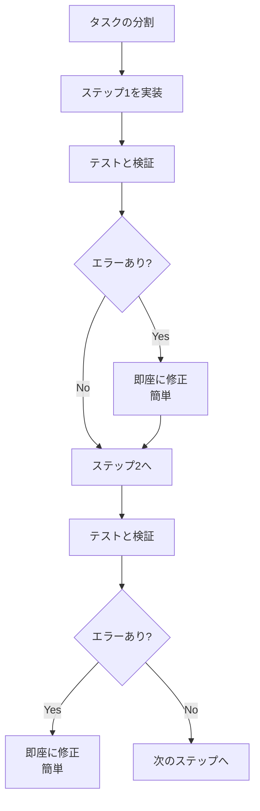
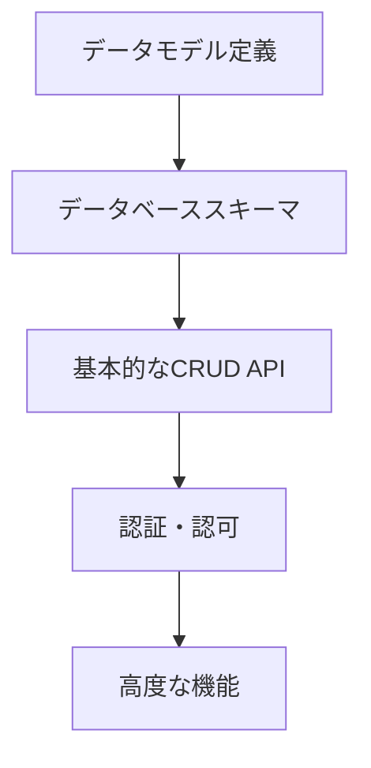
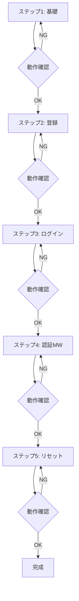
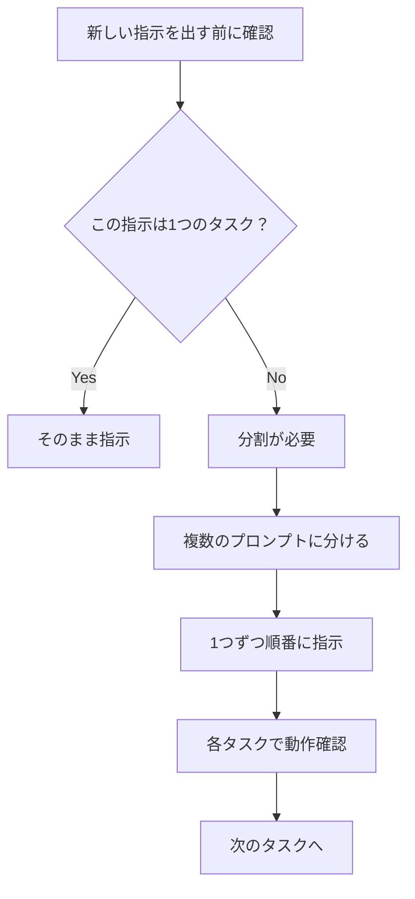

# タスク分割の技術

## タスク分割が重要な理由

AI駆動開発において、最も重要なスキルの一つが「タスクを分割する技術」です。

「1回のプロンプトで全部やってもらおう」と考えがちですが、実はこれが失敗の原因です。タスクを小さく分割して、1つずつ指示を出す方が、圧倒的に良い結果を生みます。

### 一括指示で失敗する理由

複数のタスクを一度に指示すると、以下のような問題が起こります。

```
❌ 悪い例：
「ユーザー管理、商品管理、決済機能を実装して」

起こる問題：
- 3つの機能すべてが中途半端になる
```

実際の開発でこういう指示を出すと、AIは3つの機能を同時に実装しようとします。その結果、それぞれの機能に対する注意が散漫になり、アウトプットが雑になります。

### 分割指示で成功する理由

タスクを1つずつ分割すると、以下のメリットがあります。

```
✅ 良い例：
指示1: 「ユーザー管理を実装して」
→ この機能だけに集中
→ 高品質な実装

指示2: 「次に商品管理を実装して」
→ この機能だけに集中
→ 高品質な実装

指示3: 「決済機能を実装して」
→ この機能だけに集中
→ 高品質な実装
```

1つのタスクに集中することで、AIはその機能に必要なすべての要素を丁寧に実装できます。また、あなた自身もAIの出力をしっかり確認でき、問題があればすぐに修正できます。

### エラーの早期発見

タスクを分割すると、エラーを早く見つけられます。

```
❌ 全て一度に実装した場合：
「全機能を実装して」
↓
全機能が完成
↓
テストしたら複数のエラー発見
↓
どこが原因か特定困難
↓
全体を作り直し（大変）
```

```
✅ 分割して実装した場合：
ステップ1: 「ユーザー登録を実装」
↓
テスト → エラー発見
↓
この機能だけ修正（簡単）
↓
ステップ2: 「ログイン機能を実装」
↓
テスト → エラー発見
↓
この機能だけ修正（簡単）

エラーの影響範囲が限定的
修正が簡単
```

ソフトウェア開発では、エラーは早く見つけるほど修正が簡単です。分割することで、各ステップでエラーを発見でき、すぐに修正できます。



### 段階的な検証

各ステップで動作を確認できることも重要です。

```
✅ 分割アプローチ

ステップ1: 基本機能実装
  → 動作確認
  → 問題があれば修正

ステップ2: 機能拡張
  → 動作確認
  → 問題があれば修正

各ステップで検証することで成功率が上がる
```

小さく作って、動かして、確認して、次に進む。このサイクルを回すことで、確実に前進できます。

## タスク分割の4つの原則

効果的なタスク分割には、4つの原則があります。

### 原則1：1プロンプト = 1タスク

1回のプロンプトでは、1つの明確なタスクのみを指示します。

判断基準は「〜して、〜して、〜して」と「and」が複数あれば分割すべきです。

NG例：複数タスク

```
❌ 「ユーザー登録機能を作って、メール認証も追加して、
   プロフィール編集も実装して」
```

OK例：1タスク

```
✅ 「ユーザー登録機能を実装してください。
   メールアドレス、パスワード、名前を入力できるようにして、
   バリデーションとエラーハンドリングも含めてください。」
```

1つのタスクの中に、関連する要素（バリデーション、エラーハンドリングなど）を含めるのは問題ありません。ただし、「登録」と「メール認証」と「プロフィール編集」のように、異なる機能を混ぜるのは避けましょう。

### 原則2：依存関係を考慮した順序

タスクには依存関係があります。基礎から順番に構築します。

推奨される順序：



悪い順序の例：

```
❌ いきなり高度な機能から
「OAuth連携とソーシャルログインを実装」
→ 基本のログイン機能がないのに？
```

良い順序の例：

```
✅ 段階的な順序

1. データモデル定義
   ↓
2. データベーススキーマ
   ↓
3. 基本的なCRUD API
   ↓
4. 認証・認可
   ↓
5. 高度な機能（OAuth連携）
```

家を建てるときと同じです。まず基礎を作り、柱を立て、壁を作り、屋根を乗せます。いきなり屋根から作り始める人はいません。ソフトウェア開発も同じです。

### 原則3：検証可能な単位で分割

各タスクは独立して動作確認できるべきです。

良い分割：

```
✅ タスク1：ユーザー登録API
→ Postmanでテスト可能

✅ タスク2：ログインAPI
→ Postmanでテスト可能

✅ タスク3：プロフィール取得API
→ Postmanでテスト可能
```

悪い分割：

```
❌ タスク1：データベース接続部分だけ
→ 単独でテストできない

❌ タスク2：ルーティング部分だけ
→ 単独でテストできない
```

「このタスクが終わったら、動かして確認できるか？」を考えてください。確認できないなら、分割の仕方が間違っています。

### 原則4：適切な粒度

タスクは大きすぎても小さすぎても効率が悪くなります。

大きすぎる例：

```
❌ 「ECサイトの全機能を実装」
→ 大きすぎて失敗する
```

小さすぎる例：

```
❌ 「import文を追加」
→ 細かすぎて非効率
```

適切な粒度：

```
✅ 「商品一覧ページのフロントエンドを実装」
→ 検証可能で、大きすぎない
```

適切な粒度の目安：

- 1タスクの実装時間：5〜15分
- 1タスクの出力：50〜200行程度
- 1タスクの複雑さ：明確に説明できる範囲

「このタスクを他の人に説明できるか？」と自問してください。説明が複雑になるなら、タスクが大きすぎます。

## 実践例：認証システムの段階的実装

具体的な実装例で、一括指示と分割指示の違いを見ていきます。

### 一括指示（失敗しやすい）

```
❌ 「完全な認証システムを実装してください。
   ユーザー登録、ログイン、パスワードリセット、
   メール認証、2FA、OAuth連携、セッション管理、
   権限管理を含めてください。」

予想される問題：
- 複雑すぎて実装ミス
- テストが困難
- デバッグが大変
- どこかで必ず抜け漏れ
```

このような指示を出すと、AIは8つの機能を同時に実装しようとします。結果、どれも中途半端になり、エラーが大量に発生します。

### 分割指示（成功しやすい）

ステップ1：基礎

```
「ユーザーモデルとデータベーススキーマを定義してください。

フィールド：
- email (unique)
- password (hashed)
- name
- created_at

Prisma を使用してください。」

→ 実装・確認・OK
```

ステップ2：登録

```
「ユーザー登録APIを実装してください。

エンドポイント：POST /api/auth/register
バリデーション、パスワードハッシュ化、
重複チェックを含めてください。」

→ 実装・テスト・OK
```

ステップ3：ログイン

```
「ログインAPIを実装してください。

エンドポイント：POST /api/auth/login
JWT トークンの生成と返却を含めてください。」

→ 実装・テスト・OK
```

ステップ4：保護されたルート

```
「JWT認証ミドルウェアを実装してください。

認証が必要なエンドポイントで使用できるように。」

→ 実装・テスト・OK
```

ステップ5：パスワードリセット

```
「パスワードリセット機能を実装してください。

フロー：
1. リセット要求 → トークン生成
2. トークン付きURL → メール送信
3. 新パスワード設定」

→ 実装・テスト・OK
```

各ステップで動作確認でき、問題があれば即座に修正できます。



### 分割のコツ

この例から学べるポイント：

1. **基礎から積み上げる**：まずデータモデルとスキーマ
2. **コア機能を優先**：登録とログインが最優先
3. **1つずつ確実に**：各ステップで必ず動作確認
4. **依存関係を意識**：認証ミドルウェアはログイン後
5. **追加機能は最後**：パスワードリセットは基本ができてから

## タスク分割の判断フロー

新しい指示を出す前に、以下のフローで判断します。



判断のポイント：

1. 「〜して、〜して」が3回以上あるか？
2. 複数の異なる機能を含んでいるか？
3. 自分でも全体像を把握しきれないか？
4. 実装時間が30分以上かかりそうか？

1つでも該当したら、分割を検討しましょう。

## チェックリスト

以下に該当したら分割すべきです：

- [ ] 「〜して、〜して、〜して」が3回以上
- [ ] 複数の機能を同時に実装
- [ ] 実装時間が30分以上かかりそう
- [ ] 出力が300行以上になりそう
- [ ] 自分でも全体像を把握しきれない
- [ ] テストが複雑になりそう
- [ ] 依存関係が複数ある
- [ ] エラーが発生したときの原因特定が困難そう

1つでも該当したら、タスクを分割することを検討してください。

## よくある失敗パターン

### 失敗パターン1：欲張りすぎ

```
❌ 「ユーザー管理、商品管理、注文管理、
   レビュー機能、お気に入り機能を実装」

なぜ失敗するか：
- 5つの機能は多すぎる
- それぞれの仕様が曖昧になる
- エラーだらけになる
```

改善策：

```
✅ 1つずつ実装する
1. ユーザー管理
2. 商品管理
3. 注文管理
4. レビュー機能
5. お気に入り機能
```

### 失敗パターン2：順序が逆

```
❌ 「レビュー機能を実装」
→ まだ商品管理もユーザー管理もないのに？

なぜ失敗するか：
- 基礎ができていない
- 依存する機能がない
- 動作確認できない
```

改善策：

```
✅ 依存関係を意識する
1. ユーザー管理（基礎）
2. 商品管理（基礎）
3. レビュー機能（これらに依存）
```

### 失敗パターン3：細かすぎる分割

```
❌ タスク1: 「import文を書いて」
❌ タスク2: 「関数の定義だけ書いて」
❌ タスク3: 「関数の中身を書いて」

なぜ失敗するか：
- 非効率
- コンテキストの引き継ぎが大変
- 時間の無駄
```

改善策：

```
✅ 適切な粒度で
「ユーザー登録APIを実装して（import、関数定義、実装を含む）」
```

## まとめ

タスク分割は、AI駆動開発における最も重要な技術の一つです。

分割のメリット：

1. **エラーの早期発見**
   - 各ステップで確認できる
   - 修正が簡単

2. **高品質な実装**
   - 1つのタスクに集中できる
   - 細かい仕様まで実装される

3. **効率的な開発**
   - デバッグ時間が減る
   - 手戻りが少ない

4. **理解しやすい**
   - 自分でも把握できる
   - レビューが容易

4つの原則：

1. **1プロンプト = 1タスク**
2. **依存関係を考慮した順序**
3. **検証可能な単位で分割**
4. **適切な粒度（5〜15分/タスク）**

実践のコツ：

- 基礎から積み上げる
- 1つずつ確実に
- 各ステップで動作確認
- 欲張らない

「分割は力なり」です。最初は分割の判断が難しいかもしれませんが、チェックリストを活用しながら実践を重ねることで、自然と適切な分割ができるようになります。

小さく作って、動かして、確認して、次に進む。このサイクルを繰り返すことで、確実に目標に到達できます。
