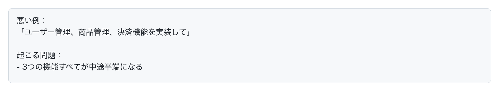
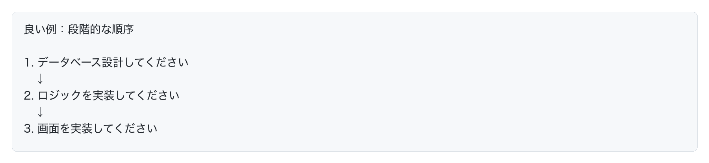

# タスク分割の技術

## タスク分割が重要な理由

AI駆動開発において、最も重要なスキルの一つが「タスクを分割する技術」です。

「1回のプロンプトで全部やってもらおう」と考えがちですが、実はこれが失敗の原因です。タスクを小さく分割して、1つずつ指示を出す方が、圧倒的に良い結果を生みます。

### 一括指示で失敗する理由

複数のタスクを一度に指示すると、以下のような問題が起こります。

実際の開発でこういう指示を出すと、AIは3つの機能を同時に実装しようとします。その結果、それぞれの機能に対する注意が散漫になり、アウトプットが雑になります。

## タスク分割の3原則

効果的なタスク分割には、3つの原則があります。

### 原則1：1プロンプト = 1タスク

1回のプロンプトでは、1つの明確なタスクのみを指示します。

判断基準は「〜して、〜して、〜して」と「and」が複数あれば分割すべきです。

NG例：複数タスク

OK例：1タスク

1つのタスクの中に、関連する要素（バリデーション、エラーハンドリングなど）を含めるのは問題ありません。ただし、「登録」と「メール認証」と「プロフィール編集」のように、異なる機能を混ぜるのは避けましょう。

### 原則2：順番を意識する

システム開発では、まずデータベース設計を行い、最後に画面を作る。といった構築の順序があります。

AIへの指示だしもこの順序で行います。

良い順序の例：

家を建てるときと同じです。まず基礎を作り、柱を立て、壁を作り、屋根を乗せます。いきなり屋根から作り始める人はいません。ソフトウェア開発も同じです。

### 原則3：適切な粒度

タスクは大きすぎても小さすぎても効率が悪くなります。

大きすぎる例：

小さすぎる例：

適切な粒度：

## まとめ

タスク分割は、AI駆動開発における最も重要な技術の一つです。

3つの原則：

1. **1プロンプト = 1タスク**
2. **順番を意識する**
3. **適切な粒度**

実践のコツ：

- 基礎から積み上げる
- 1つずつ確実に
- 各ステップで動作確認
- 欲張らない

「分割は力なり」です。最初は分割の判断が難しいかもしれませんが、実践を重ねることで、自然と適切な分割ができるようになります。
