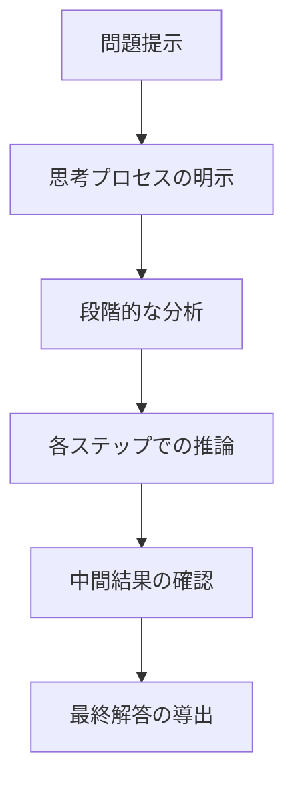

# チェーンオブソート（思考連鎖）の活用

AI駆動開発において、複雑な問題を解決するために非常に効果的な手法が「チェーンオブソート（Chain-of-Thought）」、いわゆる「思考連鎖」です。この記事では、思考連鎖の概念、効果的な活用方法、具体的な適用例についてわかりやすく解説します。

## 思考連鎖とは何か

思考連鎖とは、AIに対して複雑な問題を解決するとき、結論だけを求めるのではなく、「考える過程」も含めて回答を生成するよう促す手法です。人間が複雑な問題を解く際に、段階的に思考を積み重ねていくように、AIにも同様のプロセスを踏ませることで、より正確で論理的な答えを導き出すことができます。

### 通常のプロンプトと思考連鎖の違い

**通常のプロンプト**：

```
JavaScript関数を作成して、与えられた配列の中から重複する要素を削除してください。
```

**思考連鎖プロンプト**：

```
JavaScript関数を作成して、与えられた配列の中から重複する要素を削除してください。以下のステップで考えてみてください：

1. まず、この問題をどのようなアプローチで解決できるか検討してください
2. 考えられる実装方法をいくつか挙げてください
3. それぞれの方法の長所と短所を分析してください
4. 最適な実装方法を選び、その理由を説明してください
5. 選んだ方法でコードを実装してください
6. エッジケースや改善点を検討してください
```

思考連鎖プロンプトでは、AIに問題解決のプロセスを明示的に指示することで、より深い考察と質の高い解決策を引き出します。

## 思考連鎖のメカニズム

思考連鎖がなぜ効果的なのかを理解するために、そのメカニズムを見てみましょう：



1. **問題の分解**：複雑な問題を小さなステップに分解します
2. **段階的思考**：各ステップを順番に考えていきます
3. **中間結果の評価**：各段階で得られた結果を評価します
4. **修正と調整**：必要に応じて思考過程を修正します
5. **総合的判断**：すべての思考ステップを統合して最終的な結論を導きます

思考連鎖は特に、論理的推論や多段階の思考が必要な問題に効果的です。

## AI駆動開発での思考連鎖の活用シーン

### 1. 複雑なアルゴリズムの設計

複雑なアルゴリズムを設計する際、AIに思考連鎖で考えさせることで、より効率的で堅牢な解決策を得られます。

**思考連鎖プロンプト例**：

```
効率的な経路探索アルゴリズムを実装してください。以下のステップで考えてください：

1. まず、経路探索問題に適用できるアルゴリズムにはどのようなものがあるか列挙してください
2. この問題に最も適したアルゴリズムを選び、その理由を説明してください
3. アルゴリズムの時間複雑度と空間複雑度を分析してください
4. 実装の擬似コードを作成してください
5. 潜在的な最適化方法を提案してください
6. 実際のコードを実装してください
7. エッジケースとその対処法を説明してください
```

### 2. デバッグと問題解決

コードの問題を特定し解決する際に、思考連鎖を活用することで、より根本的な原因特定と適切な解決策を得られます。

**思考連鎖プロンプト例**：

```
以下のReactコンポーネントでメモリリークが発生しています。このバグを特定して修正してください。

[問題のコード]

以下のステップで分析してください：
1. コードの動作を順を追って説明してください
2. 潜在的なメモリリークのポイントを特定してください
3. なぜそこでメモリリークが発生するか、メカニズムを説明してください
4. 修正方法をいくつか考え、それぞれのトレードオフを分析してください
5. 最適な修正方法を選び、修正後のコードを提示してください
6. この問題を将来的に防ぐためのベストプラクティスを提案してください
```

### 3. アーキテクチャ設計

システムアーキテクチャの設計では、多くの要素を考慮する必要があります。思考連鎖を使うことで、より包括的な設計が可能になります。

**思考連鎖プロンプト例**：

```
ECサイトのバックエンドアーキテクチャを設計してください。
要件:
- 1日10万アクセス
- ユーザー認証
- 商品カタログ
- 注文処理
- 支払い連携

以下のステップで設計プロセスを進めてください：
1. システムの主要なコンポーネントを特定してください
2. 各コンポーネント間の関係とデータフローを図示してください
3. 各コンポーネントに適した技術スタックを選定し、理由を説明してください
4. スケーラビリティとパフォーマンス要件をどう満たすか説明してください
5. セキュリティに関する考慮事項を挙げてください
6. システムの障害時の対応策を検討してください
7. 最終的なアーキテクチャ図と技術選定結果をまとめてください
```

## 効果的な思考連鎖プロンプトの作り方

思考連鎖を最大限に活用するためのプロンプト作成のコツを紹介します。

### 1. 明確なステップの定義

思考のステップを明確に定義することで、AIがそれぞれのステップに集中できるようにします。

**例**：

```
以下の手順で考えてください：
ステップ1: [具体的な指示]
ステップ2: [具体的な指示]
...
```

### 2. 中間成果物の要求

各ステップでの思考結果を明示的に要求することで、思考過程を追跡しやすくなります。

**例**：

```
ステップ1が完了したら、その結果を「ステップ1の結論:」と明記してください。
ステップ2が完了したら...
```

### 3. 複数の視点からの検討

様々な角度から問題を考察するよう促すことで、より包括的な解決策が得られます。

**例**：

```
この問題を以下の視点から検討してください：
1. パフォーマンスの観点
2. メンテナンス性の観点
3. スケーラビリティの観点
4. セキュリティの観点
```

### 4. 具体例を通じた思考

具体例を用いて考えるよう指示することで、抽象的な概念をより具体的に理解できます。

**例**：

```
具体例として、ユーザーが商品をカートに追加してから決済完了までの流れを、各ステップでのデータ処理を含めて説明してください。
```

## 思考連鎖のパターンと応用例

### 1. 比較分析型

複数の選択肢を比較検討する際に有効なパターンです。

**例**：データベース選定での思考連鎖

```
新しいWebアプリケーションに適したデータベースを選定してください。
以下のステップで検討してください：

1. 要件に基づき、候補となるデータベース（SQL、NoSQL両方を含む）を5つ挙げてください
2. それぞれのデータベースの主な特徴、長所、短所を簡潔に説明してください
3. この特定のアプリケーションにとって重要な評価基準を定義してください
4. 各データベースを評価基準に基づいて評価してください
5. 最適なデータベースを選び、その選定理由を詳しく説明してください
6. 選んだデータベースを使用する際の実装上の注意点やベストプラクティスを提案してください
```

### 2. 逆向きエンジニアリング型

既存のコードや構造を理解し、その背後にある意図を解明する際に有効です。

**例**：コード理解での思考連鎖

```
以下のReactコンポーネントを分析し、その設計思想とパターンを説明してください。

[複雑なReactコンポーネント]

以下のステップで分析してください：
1. コンポーネントの全体構造を説明してください
2. 使用されている主要なReactの機能とフックを特定してください
3. 状態管理がどのように行われているか分析してください
4. このコンポーネントで採用されている設計パターンを特定してください
5. なぜこのような設計アプローチが選ばれたと思うか、推論してください
6. 現在の実装の強みと弱みを分析してください
7. 改善できる点があれば提案してください
```

### 3. 問題解決型

特定の問題を解決するための段階的アプローチを構築します。

**例**：パフォーマンス最適化での思考連鎮

```
このWebアプリケーションのロード時間が遅いです。パフォーマンス最適化を行ってください。

[現在のコードとパフォーマンス計測結果]

以下のステップでパフォーマンス最適化を進めてください：
1. パフォーマンスボトルネックを特定するためのアプローチを説明してください
2. 上記のデータから主要なボトルネックを特定してください
3. それぞれのボトルネックについて、なぜそれが問題なのかを説明してください
4. 各ボトルネックに対する解決策を複数提案してください
5. 提案した解決策の実装難易度と期待される効果を評価してください
6. 最も効果的な改善策から順に実装計画を立ててください
7. 最初に取り組むべき改善策のコード変更を具体的に示してください
```

## 思考連鎖活用の実践例

### 例 1: 複雑なバグの解決

実際のプロジェクトで発生した複雑なバグの解決を思考連鎖で行った例です。

**問題状況**:
React アプリケーションで、特定の条件下でコンポーネントがアンマウントされた後もデータフェッチが続き、"Warning: Can't perform a React state update on an unmounted component" エラーが発生しています。

**思考連鎖プロンプト**:

```
以下のReactコンポーネントで、アンマウント後の状態更新警告が発生しています。この問題を解決してください。

[問題のコードコンポーネント]

以下のステップで分析と修正を行ってください：

1. このコンポーネントの基本的な動作を説明してください
2. 警告が発生するシナリオを特定してください
3. なぜこの警告が発生するのか、Reactのライフサイクルと関連付けて説明してください
4. この問題を解決するための一般的なアプローチをいくつか挙げてください
5. このコンポーネントに最適な解決策を選び、理由を説明してください
6. 選んだ解決策を実装したコードを提示してください
7. この変更によって発生する可能性のある副作用やトレードオフを検討してください
8. 同様の問題を今後防ぐためのベストプラクティスを提案してください
```

**思考連鎖の効果**:
このように手順を分解することで、単に「useEffect のクリーンアップ関数を追加すれば良い」といった表面的な解決策だけでなく、根本的な原因の理解と、より包括的な解決策を得ることができます。

### 例 2: システムアーキテクチャの最適化

既存システムのアーキテクチャを最適化する際の思考連鎖の例です。

**問題状況**:
現在のモノリシックアプリケーションがスケーラビリティの問題に直面しており、マイクロサービスへの移行を検討しています。

**思考連鎖プロンプト**:

```
現在のモノリシックアプリケーションをマイクロサービスアーキテクチャに移行するための最適な戦略を考えてください。

[現在のシステム構成の説明]

以下のステップで検討を進めてください：

1. 現在のモノリシックアーキテクチャの課題点を分析してください
2. このシステムをマイクロサービスに分割する際の論理的な境界を特定してください
3. 各マイクロサービスの責任範囲と相互通信の方法を提案してください
4. マイクロサービスへの段階的な移行戦略を複数提案し、それぞれのメリットとリスクを評価してください
5. データ整合性と分散トランザクションをどのように扱うか説明してください
6. 移行中と移行後のモニタリングと障害検出の戦略を提案してください
7. 最終的にお勧めする移行計画とそのタイムラインを提示してください
```

## 思考連鎖を活用する際のコツとポイント

### 1. 適切な粒度で分解する

思考のステップは細かすぎても粗すぎても効果が薄れます。適切な粒度で問題を分解しましょう。

**Too Coarse（粗すぎる）**:

```
1. 問題を分析してください
2. 解決策を提案してください
```

**Too Fine（細かすぎる）**:

```
1. 変数の型を確認してください
2. 1行目の構文を確認してください
3. 2行目の...
```

**Just Right（適切）**:

```
1. コードの目的と全体構造を把握してください
2. エラーが発生している部分を特定してください
3. エラーの原因を複数の観点から分析してください
4. 解決策を提案してください
5. 実装してテストする方法を説明してください
```

### 2. 中間結果を明確にする

各ステップでの思考結果を明確に出力するよう指示することで、思考プロセスを追跡しやすくなります。

**例**:

```
各ステップの終わりに「ステップX結論：」として結果をまとめてください。
```

### 3. 反例や例外の検討を促す

AIに対して反例や例外ケースも考えるよう促すことで、より堅牢な解決策を得られます。

**例**:

```
ステップ4では、提案した解決策が機能しないような例外的なケースも考えてください。
```

### 4. 複数のアプローチを比較する

単一の解決策ではなく、複数のアプローチを検討するよう指示することで、より良い選択ができます。

**例**:

```
ステップ3では、少なくとも3つの異なるアプローチを提案し、それらを比較してください。
```

## まとめ

チェーンオブソート（思考連鎖）は、AI駆動開発において複雑な問題を解決するための強力なテクニックです。AIにステップバイステップで考えさせることで、より論理的で質の高い解決策を得ることができます。

思考連鎖は特に以下のような場面で効果を発揮します：

1. **複雑なアルゴリズムの設計**: 段階的に考えることで、効率的で堅牢な解決策を導き出せます
2. **デバッグと問題解決**: 根本原因の特定と適切な解決策の選択に役立ちます
3. **アーキテクチャ設計**: 多くの要素を考慮する必要がある設計作業をサポートします
4. **コードリファクタリング**: 既存コードの分析と改善策の提案を体系的に行えます

効果的な思考連鎖プロンプトを作成するには、明確なステップの定義、中間成果物の要求、複数の視点からの検討、具体例を通じた思考という 4 つのポイントを押さえましょう。

思考連鎖を日々の開発に取り入れることで、AIとのコラボレーションがより効果的になり、より質の高いソフトウェア開発が可能になります。複雑な問題に直面したときこそ、AIに「考える過程」を示してもらうことで、その真価を発揮できるのです。
