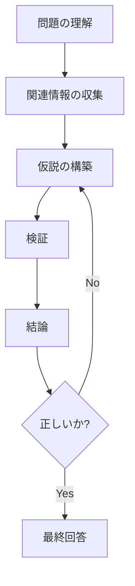
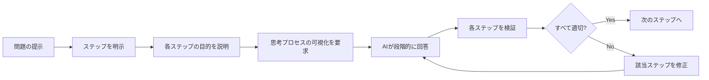

# チェーンオブソート（思考連鎖）の活用

## チェーンオブソートとは何か

チェーンオブソート（Chain-of-Thought）とは、AIに「段階的に考えさせる」テクニックです。

人間が複雑な問題を解くとき、いきなり答えを出すのではなく、一歩ずつ考えを進めていきます。AIも同じです。段階的に思考させることで、複雑な問題でも正確に解決できるようになります。

### 簡単な例で理解する

例えば、あなたが友人に「東京から大阪まで車で行くには何時間かかる?」と聞かれたとします。

即答する場合：
```
「だいたい6時間くらいじゃない？」
→ 曖昧で不正確
```

段階的に考える場合：
```
「えーと、距離が約500kmで、高速道路の平均速度が80km/hだから、
500 ÷ 80 = 6.25時間。休憩を1時間取るとして、約7時間半かな」
→ 明確で正確
```

AIも同じです。段階的に考えさせることで、より正確な答えを導き出せます。

## なぜ段階的思考が効果的なのか

AIは、複雑な問題を一度に処理しようとすると、重要な要素を見落としたり、論理が飛躍したりします。段階的に考えさせることで、以下のメリットがあります。

### メリット1：見落としが減る

一気に答えを出そうとすると、重要な確認事項を見逃します。

```
❌ 悪い例：
「このコードの問題を教えて」
→ 表面的な問題しか見つけられない

✅ 良い例：
「このコードを以下の順で分析してください。
1. まず全体の構造を確認
2. 次にロジックの正確性を検証
3. 次にエッジケースを検討
4. 最後にパフォーマンス上の問題を検証」
→ 多角的に分析できる
```

### メリット2：論理的な推論が可能になる

段階的に思考させることで、AIは論理的な推論を組み立てられます。



### メリット3：エラーの原因を追跡できる

答えが間違っていた場合、どの段階で間違ったのかが分かります。

```
通常の指示：
「このバグを修正して」
→ 間違った修正をしても、どこで判断ミスしたか分からない

段階的な指示：
「ステップバイステップでバグを分析してください」
→ 各段階の思考が見えるので、誤りを発見しやすい
```

## 基本的な使い方

チェーンオブソートの基本は、「ステップバイステップで考えてください」という指示を追加することです。

### パターン1：明示的に段階を指示する

```
以下の順序で分析してください。

1. エラーメッセージの内容を確認
2. エラーが発生している箇所を特定
3. 関連するコードを調査
4. 原因を推測
5. 修正案を提示
```

### パターン2：思考プロセスを要求する

```
このパフォーマンス問題を解決してください。

ただし、いきなり答えを出さず、以下のように段階的に考えてください：
- まず、現在のボトルネックがどこにあるか分析
- 次に、改善の優先順位を決定
- 最後に、具体的な改善案を提示
```

### パターン3：シンプルな指示

```
ステップバイステップで考えて、問題を解決してください。
```

この一文を追加するだけでも、AIの回答の質が大きく向上します。

## 実践例1：バグの原因究明

### Before：通常の指示

```
プロンプト：
「ユーザー登録APIが動かないので修正してください」

AIの回答：
「パスワードのバリデーションが間違っています。以下のように修正してください。
[修正コード]」

問題点：
- なぜその結論に至ったのか分からない
- 他に問題がないか不明
- 本当の原因が見つかっていない可能性
```

### After：チェーンオブソートを活用

```
プロンプト：
「ユーザー登録APIが動かない問題を、以下の手順で段階的に分析してください。

1. エラーメッセージから、どこで失敗しているか特定
2. 失敗している箇所のコードを確認
3. 入力データと期待される動作を比較
4. 根本原因を特定
5. 修正案を提示」

AIの回答：
「段階的に分析します。

【ステップ1：エラーメッセージの確認】
エラーログには "password validation failed" とあります。
HTTP ステータスコードは 400 です。

【ステップ2：該当コードの確認】
バリデーション部分のコード：
password.length >= 8 && password.match(/[0-9]/)

【ステップ3：入力データとの比較】
テストデータ：Password123
期待動作：英数字を含み8文字以上なので成功すべき

【ステップ4：根本原因】
正規表現が数字の存在をチェックしているが、
英字の存在をチェックしていません。
仕様は「英数字を含む」なので、両方必要です。

【ステップ5：修正案】
password.length >= 8 &&
password.match(/[0-9]/) &&
password.match(/[a-zA-Z]/)」

メリット：
- 思考プロセスが見える
- 原因が明確
- 他の問題も発見しやすい
```

## 実践例2：パフォーマンス最適化

### Before：通常の指示

```
プロンプト：
「このコードが遅いので最適化してください」

AIの回答：
「データベースクエリをバッチ処理に変更しましょう。
[最適化コード]」

問題点：
- なぜそれが最適なのか不明
- 他の最適化案があるかもしれない
- 効果の見積もりがない
```

### After：チェーンオブソートを活用

```
プロンプト：
「このコードのパフォーマンス問題を、段階的に分析して最適化してください。

1. まず、処理時間がかかっている箇所を特定
2. 次に、なぜ遅いのかを分析
3. 複数の最適化案を列挙
4. それぞれの案のメリット・デメリットを比較
5. 最適な解決策を選択して実装」

AIの回答：
「段階的に分析します。

【ステップ1：ボトルネックの特定】
プロファイリング結果から、getUserPosts関数が95%の時間を占めています。
1000件のユーザーに対して、それぞれデータベースクエリを実行しています。

【ステップ2：遅い理由】
N+1問題が発生しています。
- ユーザー取得：1回のクエリ
- 各ユーザーの投稿取得：1000回のクエリ
- 合計1001回のデータベースアクセス

【ステップ3：最適化案】
案A：JOINで一度に取得
案B：IN句でバッチ取得
案C：キャッシュの導入

【ステップ4：比較】
案A：
- メリット：1回のクエリで完結、最速
- デメリット：複雑なデータ構造の再構築が必要

案B：
- メリット：実装が簡単、高速
- デメリット：2回のクエリが必要

案C：
- メリット：再利用時は高速
- デメリット：初回は遅い、キャッシュ管理が必要

【ステップ5：最適解の選択】
案Aが最適です。理由：
- パフォーマンスが最も高い
- データ構造の再構築は一度実装すれば再利用可能
- キャッシュよりも保守性が高い

[最適化コード]」

メリット：
- 複数の選択肢を検討している
- 意思決定の理由が明確
- より最適な解を見つけやすい
```

## 実践例3：アーキテクチャ設計

### Before：通常の指示

```
プロンプト：
「ECサイトのバックエンドアーキテクチャを設計してください」

AIの回答：
「マイクロサービスアーキテクチャを推奨します。
- ユーザーサービス
- 商品サービス
- 注文サービス
[詳細設計]」

問題点：
- なぜマイクロサービスなのか不明
- 要件に合っているか分からない
- 他の選択肢が検討されていない
```

### After：チェーンオブソートを活用

```
プロンプト：
「ECサイトのバックエンドアーキテクチャを、段階的に考えて設計してください。

1. まず、必要な機能を列挙
2. 次に、トラフィック規模と成長予測を考慮
3. 複数のアーキテクチャパターンを検討
4. 各パターンのメリット・デメリットを比較
5. 最適なアーキテクチャを選択して詳細設計」

AIの回答：
「段階的に設計します。

【ステップ1：必要な機能】
- ユーザー管理（認証、プロフィール）
- 商品管理（検索、詳細、在庫）
- 注文管理（カート、決済、履歴）
- レビュー管理

【ステップ2：規模の想定】
- 初期：月間ユーザー 10万人
- 1年後：月間ユーザー 100万人
- ピーク時：通常の10倍のトラフィック

【ステップ3：アーキテクチャ候補】
候補A：モノリシック
候補B：マイクロサービス
候補C：モジュラーモノリス

【ステップ4：比較】
候補A（モノリシック）：
- メリット：開発速度が速い、デプロイが簡単
- デメリット：スケールしにくい、コードが肥大化

候補B（マイクロサービス）：
- メリット：独立したスケーリング、技術選択の自由
- デメリット：複雑、運用コスト高、開発初期は遅い

候補C（モジュラーモノリス）：
- メリット：モノリスの開発速度 + 後のマイクロサービス化が容易
- デメリット：設計の規律が必要

【ステップ5：最適解の選択】
現在の要件では、候補C（モジュラーモノリス）が最適です。

理由：
- 初期は開発速度を優先すべき
- 将来的な成長に備えて、サービス境界を明確にしておく
- ユーザー数が1000万人を超えた時点でマイクロサービス化を検討

[詳細設計]」

メリット：
- 意思決定のプロセスが透明
- 将来の拡張性も考慮されている
- 要件に最適な設計になっている
```

## 実践例4：複雑なロジックの実装

### Before：通常の指示

```
プロンプト：
「会員ランクに応じた割引計算ロジックを実装してください」

AIの回答：
[コードのみ提示]

問題点：
- エッジケースが考慮されているか不明
- ビジネスルールの解釈が正しいか不明
```

### After：チェーンオブソートを活用

```
プロンプト：
「会員ランクに応じた割引計算ロジックを、段階的に考えて実装してください。

仕様：
- ブロンズ：5%割引
- シルバー：10%割引
- ゴールド：15%割引
- プラチナ：20%割引
- セール期間中は追加で5%割引

手順：
1. まず、考慮すべきケースを列挙
2. 次に、計算ロジックを設計
3. エッジケースの処理を検討
4. テストケースを作成
5. 実装」

AIの回答：
「段階的に実装します。

【ステップ1：考慮すべきケース】
- 通常時の割引計算
- セール期間中の割引計算
- 割引後の価格が0円以下になる場合
- 会員ランクが不正な値の場合
- 商品価格が0円または負の場合
- 割引率の上限チェック

【ステップ2：計算ロジック設計】
基本割引率 = ランクに応じた割引率
セール割引率 = セール期間中なら5%、そうでなければ0%
合計割引率 = 基本割引率 + セール割引率
割引後価格 = 元の価格 × (1 - 合計割引率)

【ステップ3：エッジケース処理】
- 合計割引率は最大25%に制限
- 割引後価格は1円未満にならないようにする
- 不正なランクの場合は0%割引
- 元の価格が0円以下の場合はエラー

【ステップ4：テストケース】
- ブロンズ会員、1000円、通常時 → 950円
- ゴールド会員、1000円、セール時 → 800円
- プラチナ会員、100円、セール時 → 75円
- 不正なランク、1000円 → 1000円
- 元の価格が-100円 → エラー

【ステップ5：実装】
```typescript
enum MemberRank {
  Bronze = 'bronze',
  Silver = 'silver',
  Gold = 'gold',
  Platinum = 'platinum'
}

interface DiscountParams {
  price: number;
  rank: MemberRank;
  isSalePeriod: boolean;
}

function calculateDiscountedPrice(params: DiscountParams): number {
  const { price, rank, isSalePeriod } = params;

  // 価格の妥当性チェック
  if (price <= 0) {
    throw new Error('価格は0円より大きい必要があります');
  }

  // 基本割引率の取得
  const baseDiscountRate = getBaseDiscountRate(rank);

  // セール割引率
  const saleDiscountRate = isSalePeriod ? 0.05 : 0;

  // 合計割引率（最大25%）
  const totalDiscountRate = Math.min(
    baseDiscountRate + saleDiscountRate,
    0.25
  );

  // 割引後価格（最低1円）
  const discountedPrice = Math.max(
    Math.floor(price * (1 - totalDiscountRate)),
    1
  );

  return discountedPrice;
}

function getBaseDiscountRate(rank: MemberRank): number {
  const discountMap: Record<MemberRank, number> = {
    [MemberRank.Bronze]: 0.05,
    [MemberRank.Silver]: 0.10,
    [MemberRank.Gold]: 0.15,
    [MemberRank.Platinum]: 0.20
  };

  return discountMap[rank] ?? 0;
}
```」

メリット：
- エッジケースが漏れなく考慮されている
- ビジネスルールの解釈が明確
- テストケースも含まれている
```

## 段階的に考えさせるプロンプトの書き方

効果的なチェーンオブソートプロンプトには、以下の要素を含めます。

### 要素1：明確なステップの指定

```
以下の順序で分析してください：
1. [最初のステップ]
2. [次のステップ]
3. [最後のステップ]
```

### 要素2：各ステップの目的を明示

```
1. エラーメッセージから原因を推測（目的：問題の範囲を絞る）
2. 関連コードを確認（目的：仮説を検証）
3. 修正案を提示（目的：解決策を実装）
```

### 要素3：思考プロセスの可視化を要求

```
各ステップで、以下を明示してください：
- 何を確認したか
- どう判断したか
- 次に何をすべきか
```

### 実践的なテンプレート

```
# 問題分析用テンプレート

[問題の説明]

以下の手順で段階的に分析してください：

1. 現状の把握
   - 何が起きているか
   - 期待される動作は何か

2. 原因の仮説
   - 考えられる原因をすべて列挙
   - それぞれの可能性を評価

3. 検証
   - 各仮説を検証する方法
   - 実際に確認した結果

4. 解決策の検討
   - 複数の解決策を提示
   - それぞれのメリット・デメリット

5. 最適な解決策の選択
   - 選択した理由
   - 実装方法
```



## いつ使うべきか、いつ使わないべきか

### 使うべき場面

チェーンオブソートは、以下のような場面で特に効果的です。

**1. 複雑な問題の分析**
```
✅ 適している：
「この大規模なレガシーコードのバグを修正してください」

理由：
- 原因の特定が難しい
- 複数の要因が絡み合っている可能性
- 段階的な分析が必要
```

**2. 設計や意思決定**
```
✅ 適している：
「新機能のデータベース設計を行ってください」

理由：
- 複数の選択肢がある
- トレードオフの検討が必要
- 将来への影響を考慮すべき
```

**3. パフォーマンス最適化**
```
✅ 適している：
「このAPIのレスポンス時間を改善してください」

理由：
- ボトルネックの特定が必要
- 複数の最適化手法を比較すべき
- 効果の見積もりが重要
```

**4. セキュリティ監査**
```
✅ 適している：
「このコードのセキュリティ問題を洗い出してください」

理由：
- 多角的な視点が必要
- 見落としが致命的
- 段階的なチェックが有効
```

### 使わないべき場面

一方、チェーンオブソートが不要な場面もあります。

**1. 単純な質問**
```
❌ 不要：
「Pythonで現在時刻を取得する方法は？」

理由：
- 答えが単純明快
- 段階的に考える必要がない
```

**2. 定型的な作業**
```
❌ 不要：
「このREADMEファイルにインストール手順を追加してください」

理由：
- 手順が決まっている
- 複雑な判断が不要
```

**3. 既に明確な仕様がある実装**
```
❌ 不要：
「以下の仕様通りにAPIを実装してください
[詳細な仕様書]」

理由：
- 判断の余地がない
- 仕様に従うだけ
```

**4. 時間的制約が厳しい場合**
```
❌ 不要：
緊急のバグ修正で、原因が明らか

理由：
- 段階的分析の時間がない
- 直接修正する方が速い
```

### 判断の基準

```
チェーンオブソートを使うべきか？

以下のチェックリストで判断します：

□ 問題が複雑か？
□ 複数の選択肢があるか？
□ 見落としが致命的か？
□ 意思決定の理由が重要か？
□ 将来的な影響を考慮すべきか？

3つ以上Yes → チェーンオブソートを使う
2つ以下 → 通常の指示でOK
```

## よくある失敗

チェーンオブソートを使う際の、よくある失敗パターンと対策を紹介します。

### 失敗1：ステップが曖昧

```
❌ 悪い例：
「段階的に考えてバグを修正してください」

問題点：
- どう段階的に考えるのか不明確
- AIが適切なステップを選べない可能性

✅ 良い例：
「以下の手順でバグを分析してください：
1. エラーログから失敗箇所を特定
2. 該当コードを確認
3. 入力データを検証
4. 根本原因を特定
5. 修正案を提示」
```

### 失敗2：ステップが多すぎる

```
❌ 悪い例：
「以下の20ステップで分析してください：
1. [ステップ1]
2. [ステップ2]
...
20. [ステップ20]」

問題点：
- 細かすぎて本質を見失う
- AIの思考が機械的になる
- 時間がかかりすぎる

✅ 良い例：
「以下の3-5ステップで分析してください：
1. 問題の特定
2. 原因の分析
3. 解決策の提案」
```

### 失敗3：各ステップの関連性がない

```
❌ 悪い例：
「以下の順で作業してください：
1. データベース設計
2. フロントエンドのデザイン
3. テストコード作成」

問題点：
- ステップ間の論理的なつながりがない
- 順序が適切でない

✅ 良い例：
「以下の順で実装してください：
1. データベース設計
2. バックエンドAPI実装
3. フロントエンド実装
4. 統合テスト作成」
```

### 失敗4：結果の検証を忘れる

```
❌ 悪い例：
AIが段階的に回答したら、そのまま採用

問題点：
- 途中のステップで間違っている可能性
- 最終結果だけ見ても、どこが間違ったか分からない

✅ 良い例：
各ステップの結果を確認しながら進める
「ステップ1の分析結果を確認しました。
次のステップ2に進んでください」
```

### 失敗5：すべてに適用しようとする

```
❌ 悪い例：
単純な質問にも「段階的に考えてください」を追加

問題点：
- 不要な複雑さを生む
- 時間の無駄
- 回答がかえって分かりにくくなる

✅ 良い例：
問題の複雑さに応じて使い分ける
- 複雑な問題：チェーンオブソートを使う
- 単純な問題：直接的な指示
```

## まとめ

チェーンオブソート（思考連鎖）は、AIに段階的に考えさせることで、複雑な問題を正確に解決するテクニックです。

### 重要なポイント

**1. 基本原則**
- 複雑な問題は段階的に考えさせる
- 各ステップを明確に指定する
- 思考プロセスを可視化させる

**2. 効果的な使い方**
- 3-5ステップの明確な手順を提示
- 各ステップの目的を説明
- 結果を検証しながら進める

**3. 使うべき場面**
- 複雑な問題の分析
- 設計や意思決定
- パフォーマンス最適化
- セキュリティ監査

**4. 使わないべき場面**
- 単純な質問
- 定型的な作業
- 明確な仕様がある実装
- 時間的制約が厳しい場合

### 実践のコツ

**段階的思考の基本フォーマット：**
```
[問題や要求の説明]

以下の手順で段階的に進めてください：

1. [最初のステップ：状況把握]
2. [次のステップ：分析]
3. [次のステップ：解決策の検討]
4. [最後のステップ：実装または結論]

各ステップで、何を確認し、どう判断したかを明示してください。
```

**最もシンプルな指示：**
```
ステップバイステップで考えて、問題を解決してください。
```

この一文を追加するだけでも、AIの回答の質は大きく向上します。

チェーンオブソートは、AI駆動開発において非常に強力なテクニックです。適切な場面で活用することで、より正確で信頼性の高い結果を得られます。まずは簡単な問題から試して、段階的思考の効果を実感してみましょう。
