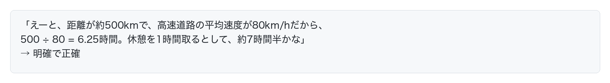
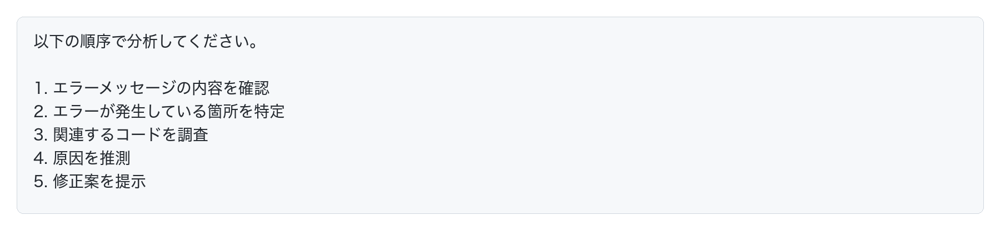
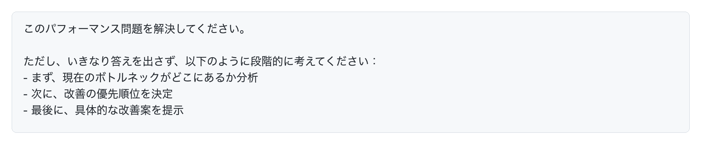
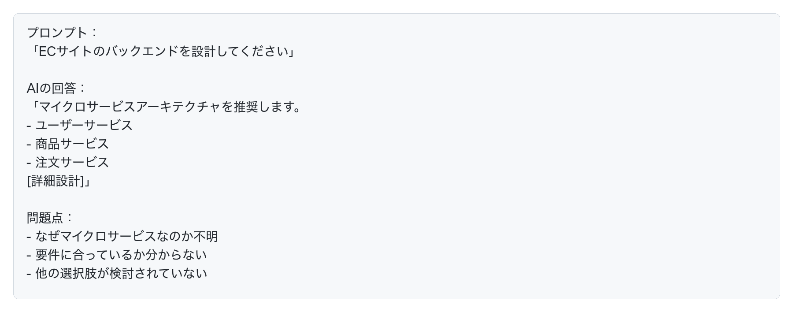

# チェーンオブソート（思考連鎖）の活用

## チェーンオブソートとは何か

チェーンオブソート（Chain-of-Thought）とは、AIに「段階的に考えさせる」テクニックです。

人間が複雑な問題を解くとき、いきなり答えを出すのではなく、一歩ずつ考えを進めていきます。AIも同じです。段階的に思考させることで、複雑な問題でも正確に解決できるようになります。

### 簡単な例で理解する

例えば、あなたが友人に「東京から大阪まで車で行くには何時間かかる?」と聞かれたとします。

即答する場合：

段階的に考える場合：

AIも同じです。段階的に考えさせることで、より正確な答えを導き出せます。

## 基本的な使い方

以下の例のように、段階的に思考するよう、AIに指示を出すことで、チェーンオブソートが発動します。

### パターン1：明示的に段階を指示する

### パターン2：思考プロセスを要求する

### パターン3：シンプルな指示

この一文を追加するだけでも、AIの回答の質が大きく向上します。

## 実践例：システム設計

### Before：通常の指示

### After：チェーンオブソートを活用

## いつ使うべきか、いつ使わないべきか

### 使うべき場面

チェーンオブソートは、以下のような場面で特に効果的です。

- **複雑な問題の分析**
- **設計などの重要なタスク**

### 使わないべき場面

一方、チェーンオブソートが不要な場面もあります。

- **単純な質問**：「Pythonで現在時刻を取得する方法は？」など、答えが単純明快な場合

## まとめ

チェーンオブソート（思考連鎖）は、AIに段階的に考えさせることで、複雑な問題を正確に解決するテクニックです。
時間がかかる代わりに、正確な答えが得られるようになります。
場面に応じて、積極的に活用しましょう。

### 重要なポイント

**1. 基本原則**
- 複雑な問題は段階的に考えさせる
- 各ステップを明確に指定する
- 思考プロセスを可視化させる

**2. 効果的な使い方**
- 3-5ステップの明確な手順を提示
- 各ステップの目的を説明
- 結果を検証しながら進める

