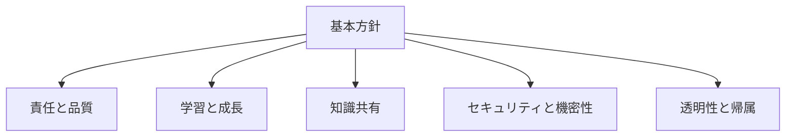
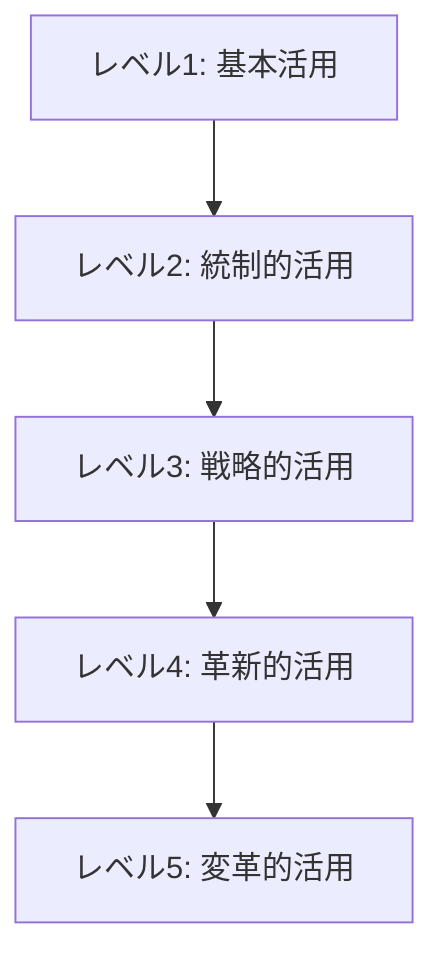

# チーム内での AI活用ルール

## AI活用の課題と必要性

開発チームで AIツールを活用する機会が急速に増えています。ChatGPT、GitHub Copilot、Cursor、Bard（Gemini）といった AIツールは、コード生成、バグ修正、ドキュメント作成など、さまざまな開発タスクを支援してくれます。しかし、チーム全体でこれらのツールを効果的に活用するためには、一定のルールやガイドラインが必要です。

チーム内での AI活用において、以下のような課題が発生しがちです：

- **一貫性の欠如**: チームメンバーごとに AIツールの使い方が異なり、コードスタイルや品質にばらつきが生じる
- **依存度の問題**: AIに過度に依存し、コードの理解や技術力の向上が阻害される
- **セキュリティリスク**: 機密情報や知的財産が AIツールに意図せず送信される
- **品質管理の課題**: AIが生成したコードの品質保証やレビュープロセスが不明確
- **チーム間の知識格差**: AIツールの効果的な活用方法に関する知識や経験の差

こうした課題に対応するため、チーム内での AI活用ルールを整備することが重要です。

## AI活用ルールの基本方針

チーム内で AIを効果的に活用するための基本方針を設定しましょう。

### 1. 責任と品質の原則

- **最終責任**: AIが生成したコードであっても、最終的な責任は開発者にあります
- **品質基準**: AIが生成したコードも同じ品質基準を適用し、必ずレビューを行います
- **理解の原則**: 追加するコードは必ず自分で理解し、説明できるようにします

### 2. 学習と成長の原則

- **バランス**: AIに頼りすぎず、自分で考える機会も大切にします
- **スキル向上**: AIをスキル向上のツールとして活用し、生成結果から学習します
- **実験と探求**: 新しい AI活用方法を積極的に探索することを奨励します

### 3. 知識共有の原則

- **有効な活用法の共有**: 効果的なプロンプトやテクニックをチーム内で共有します
- **学びの共有**: AIとの対話から得た知識やベストプラクティスを広めます
- **コラボレーション**: AIをチームコラボレーションを強化するツールとして活用します

### 4. セキュリティと機密性の原則

- **機密情報保護**: 機密情報や個人情報を AIツールに送信しません
- **コード所有権**: 著作権やライセンスに関する問題に注意します
- **セキュリティレビュー**: AIが生成したコードのセキュリティ脆弱性に特に注意します

### 5. 透明性と帰属の原則

- **透明性**: AIの活用を隠さず、オープンにコミュニケーションします
- **適切な帰属**: 必要に応じて、AIの支援を受けたことを明示します
- **評価の公平性**: AIツールの活用度ではなく、最終的な成果物で評価します

## 具体的な AI活用ルールとガイドライン

上記の基本方針に基づき、以下のような具体的なルールをチーム内で設定するとよいでしょう。

### コード開発におけるルール

1. **コードレビュープロセス**

   - AIが生成したコードも通常のレビュープロセスを経ること
   - レビュー時には AIが生成したコードである旨を明示すること
   - 特にエッジケースやエラーハンドリングの確認を徹底すること

2. **コードスタイルと品質**

   - AIが生成したコードもチームのコーディング規約に準拠させること
   - 無条件に受け入れず、必要に応じてリファクタリングすること
   - 複雑なロジックは適切にコメントを追加すること

3. **テストと検証**
   - AIが生成したコードには必ず適切なテストを作成すること
   - 境界値やエッジケースのテストを特に重視すること
   - テスト駆動開発（TDD）と組み合わせた活用を推奨

### 知識共有と学習のルール

1. **プロンプトとテクニックの共有**

   - 効果的なプロンプトはチームの知識ベースに保存すること
   - 定期的に AI活用のテクニックを共有する時間を設けること
   - プロジェクト固有のプロンプトテンプレートを整備すること

2. **学習目的の活用**

   - 新しい技術やライブラリの学習に AIを積極的に活用すること
   - AIの説明を鵜呑みにせず、公式ドキュメントで確認する習慣をつけること
   - AIを通じて学んだ内容をチームに共有すること

3. **ペアプログラミングと AI**
   - AI活用時のペアプログラミングを奨励し、知識の共有を促進
   - AIとの対話を通じた問題解決プロセスをチームで共有
   - 「AIモブプログラミング」セッションの定期的な実施

### セキュリティとコンプライアンスのルール

1. **禁止事項**

   - 社内の機密情報を AIに入力しないこと
   - 顧客データや個人情報を AIに送信しないこと
   - ライセンス違反の可能性があるコードをそのまま使用しないこと

2. **安全な使用方法**

   - 機密性の高いコードベースを扱う場合は、オンプレミス版の AIツールを検討
   - プロンプト内のコード例は抽象化し、実際のプロジェクト詳細を排除
   - AIベンダーのデータ使用ポリシーを理解し遵守すること

3. **コードの出所管理**
   - AIが生成したコードの出所を適切に記録すること
   - 外部ライブラリやオープンソースコードの使用は必ずライセンスを確認
   - 定期的に AI生成コードのセキュリティスキャンを実施

### プロジェクト管理と文書化のルール

1. **ドキュメント作成**

   - AIを活用したドキュメント作成を推奨するが、必ず内容を検証すること
   - 技術文書のドラフト作成に AIを活用し、効率化を図ること
   - ドキュメントの最終責任は人間にあることを認識すること

2. **タスク管理**

   - AIを活用したタスク分解や見積もり支援は参考情報として扱うこと
   - 複雑な問題の分析やアプローチ検討に AIを活用すること
   - AIの提案を無批判に受け入れず、チームの経験に基づいて判断すること

3. **振り返りと改善**
   - AIツールの活用効果を定期的に評価・検証すること
   - チーム内での AI活用のベストプラクティスを文書化・更新すること
   - AIツールへの依存度と効果のバランスを定期的に見直すこと

## AI活用の成熟度モデル

チーム内での AI活用レベルを評価し、段階的に向上させるための成熟度モデルを導入することが有効です。

### レベル 1: 基本活用（個人レベル）

- **特徴**: チームメンバーが個別に AIツールを試験的に活用
- **目標**: AIツールの基本的な使い方を学び、シンプルなタスクで活用
- **ルール整備**: 最低限のセキュリティガイドラインの策定

### レベル 2: 統制的活用（チームレベル）

- **特徴**: チーム全体で AI活用のルールとガイドラインを策定・遵守
- **目標**: 一貫性のある AI活用とナレッジ共有の仕組み確立
- **ルール整備**: 本格的な AI活用ルールとレビュープロセスの確立

### レベル 3: 戦略的活用（組織レベル）

- **特徴**: プロジェクトやタスクの特性に応じた戦略的な AI活用
- **目標**: AI活用による生産性と品質の定量的な向上
- **ルール整備**: 詳細なガイドラインと評価指標の確立

### レベル 4: 革新的活用（プロセスレベル）

- **特徴**: 開発プロセス全体に AIを統合し、継続的な革新
- **目標**: AI活用による開発プロセスの変革と新たな価値創出
- **ルール整備**: AIと人間の協業モデルの最適化

### レベル 5: 変革的活用（ビジネスレベル）

- **特徴**: AIとの協業を前提とした組織体制と文化の確立
- **目標**: AI活用によるビジネスモデルの変革と競争優位性の確立
- **ルール整備**: AIとの共創環境を最大化するガバナンスの確立

## AIとのコラボレーションを促進する実践例

チーム内での AI活用を促進するための具体的な実践例を紹介します。

### 1. AI活用事例共有会

定期的に（例：隔週）、チームメンバーが AIツールを活用して解決した課題や効果的だったプロンプトを共有する場を設けます。

**実施フォーマット例**:

- AI活用によって解決した問題の概要
- 使用したプロンプトと工夫した点
- 得られた結果と手動での修正点
- 学んだ教訓と次回への改善点

### 2. AIプロンプトライブラリの構築

チーム内で効果的だったプロンプトを集約し、カテゴリ別に整理したライブラリを構築します。

**カテゴリ例**:

- コード生成プロンプト
- デバッグ支援プロンプト
- テスト生成プロンプト
- コードレビュープロンプト
- ドキュメント作成プロンプト

### 3. AIペアプログラミングセッション

AIツールを活用したペアプログラミングセッションを定期的に実施し、効果的な活用方法を共有します。

**実施方法**:

- 経験者と初心者のペア構成
- 実際の開発タスクを AIと協力して解決
- 過程と結果を記録し、チーム内で共有
- 定期的なローテーションで全員が経験を積む

### 4. AIコードレビューガイドライン

AIが生成したコードのレビューに特化したガイドラインを整備します。

**チェックポイント例**:

- 生成コードがプロジェクトの命名規則に準拠しているか
- エラーハンドリングが適切に実装されているか
- パフォーマンスやセキュリティの考慮が適切か
- ライセンス的に問題のあるコードが含まれていないか
- テストカバレッジが十分か

### 5. AIスキルマップの作成

チームメンバーの AI活用スキルを可視化し、相互学習を促進します。

**マッピング項目例**:

- プロンプトエンジニアリングスキル
- 各 AIツールの活用経験と習熟度
- 得意な活用領域（コード生成、デバッグ、設計など）
- 共有可能なナレッジやテクニック

## まとめ：持続可能な AI活用文化の構築

チーム内での AI活用ルールを整備し、持続可能な活用文化を構築することは、単なる生産性向上だけでなく、チームの学習文化や協業環境の質を高めることにつながります。

重要なポイントは以下の通りです：

1. **バランスの取れた活用**: AIツールへの依存と自律的な問題解決能力のバランスを維持
2. **継続的な学習**: AIツールや活用方法の進化に合わせて、ルールや実践も更新
3. **透明性の文化**: AIの活用状況や効果を可視化し、オープンに共有する文化の醸成
4. **責任ある活用**: 最終的な責任は常に人間にあることを認識したルール作り
5. **創造性の尊重**: AIはツールであり、創造性や判断の主体はチームメンバーであることを重視

AIツールは急速に進化しています。チーム内のルールやガイドラインも、固定的なものではなく、新しいツールやテクニックの登場に応じて柔軟に見直していくことが大切です。AIとの協業を通じて、チームの技術力と創造性を高め、より価値の高いソフトウェア開発を実現しましょう。
