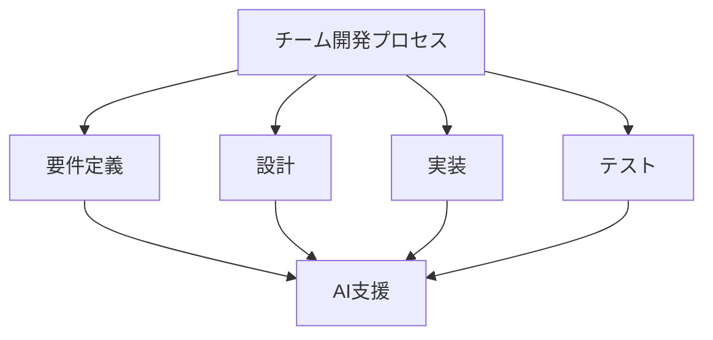

# チーム開発での実践例

## チーム開発の変革

### AI 導入による変化

AI の導入により、チーム開発は以下のように変化しています：

- 開発効率の向上
- コード品質の改善
- ナレッジ共有の促進
- チーム協業の深化

### 開発プロセスの革新

## 実践的なケーススタディ

### 1. 大規模プロジェクトでの活用

大規模プロジェクトでの AI 活用事例：

- コード生成の自動化
- テストケースの自動生成
- ドキュメント生成の自動化
- パフォーマンス最適化

### 2. アジャイル開発での活用

アジャイル開発での AI 活用事例：

- スプリント計画の最適化
- タスクの自動割り当て
- 進捗管理の自動化
- リスク予測

### 3. リモートチームでの活用

リモートチームでの AI 活用事例：

- コミュニケーションの効率化
- ナレッジ共有の自動化
- コードレビューの効率化
- チーム協業の促進

## 実践的な手法

### コードレビューの効率化

AI を活用したコードレビューの効率化：

- 自動レビューの導入
- レビュー基準の明確化
- フィードバックの自動化
- 品質の継続的な向上

### ナレッジ共有の自動化

AI を活用したナレッジ共有の自動化：

- ドキュメント生成の自動化
- ベストプラクティスの共有
- チーム内学習の促進
- ナレッジベースの構築

## 成功のポイント

### チームの準備

AI 導入に向けたチームの準備：

- スキルアップの計画
- ツールの習熟
- プロセスの確立
- 継続的な改善

### プロセスの最適化

AI を活用したプロセスの最適化：

- ワークフローの確立
- 品質基準の設定
- コミュニケーションの改善
- 継続的な評価

## 実践的なアドバイス

### 導入のステップ

AI をチーム開発に導入するステップ：

1. 現状分析
2. 目標設定
3. ツール選択
4. プロセス確立
5. 評価と改善

### 成功への道筋

チーム開発での AI 活用を成功させるポイント：

- 明確な目標設定
- 段階的な導入
- チームの理解と協力
- 継続的な改善

## まとめ

AI を活用したチーム開発は、開発効率と品質を大幅に向上させる可能性を秘めています。適切な導入と継続的な改善が重要です。
