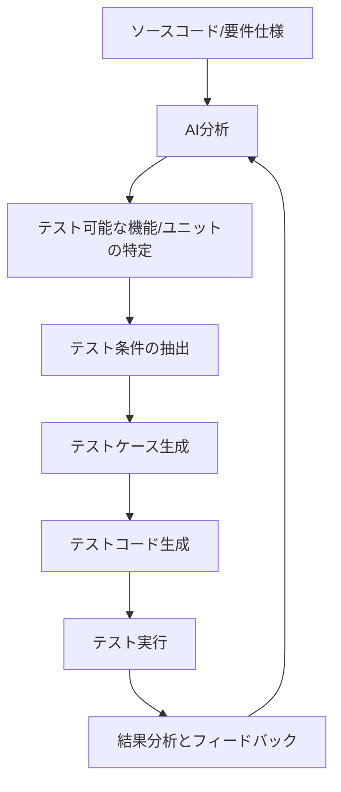

# テストケースの自動生成

ソフトウェア開発におけるテストは、品質を確保するために不可欠ですが、時間と労力がかかる作業でもあります。特にテストケースの設計と作成は、多くの開発者にとって骨の折れる作業です。AI 駆動開発を活用することで、このテストケース作成プロセスを大幅に効率化できます。

## テストケース自動生成の基本

### テストケース設計の課題

従来のテストケース設計では、以下のような課題があります：

1. **網羅性の確保**: すべての機能や条件を網羅したテストケースを作成するのは困難
2. **時間と労力**: 大量のテストケースを手動で作成するには多くの時間が必要
3. **専門知識**: 効果的なテストケースを設計するには専門的なテスト知識が必要
4. **保守性**: 仕様変更に伴うテストケースの更新が大変
5. **優先順位付け**: 重要度に応じたテストケースの選定が難しい

### AI を活用したテストケース自動生成のメリット

AI を活用することで、以下のようなメリットが得られます：

1. **網羅性の向上**: AI はさまざまな入力条件や境界値ケースを自動的に考慮
2. **効率化**: テストケース作成の時間を大幅に短縮
3. **専門知識の補完**: テスト設計のベストプラクティスを AI が適用
4. **適応性**: コード変更に合わせて迅速にテストケースを更新
5. **品質の一貫性**: 常に一定水準のテストケースを生成

## テストケース自動生成の基本的なアプローチ

AI を活用したテストケース自動生成の主なアプローチを解説します。



### 要件ベースのテストケース生成

仕様書や要件定義書などのドキュメントからテストケースを生成するアプローチです。

**AI プロンプト例**:

```
以下のユーザー登録機能の仕様に基づいて、テストケースを生成してください。

【機能仕様】
ユーザー登録機能：
1. ユーザーは名前、メールアドレス、パスワードを入力して登録できる
2. 名前は1文字以上50文字以下の文字列
3. メールアドレスは有効な形式である必要あり、既存ユーザーと重複不可
4. パスワードは8文字以上の英数字記号の組み合わせ、大文字小文字を含む

【テストケースの形式】
- テストケースID
- テスト目的
- 前提条件
- テスト手順
- 入力データ
- 期待される結果
- 優先度（高/中/低）
```

### コードベースのテストケース生成

既存のコードを分析して、そのコードをテストするためのテストケースを生成するアプローチです。

**AI プロンプト例**:

````
以下のユーザー認証に関するJavaコードに対するJUnitテストケースを生成してください。
すべての条件分岐と境界値をカバーするテストケースにしてください。

【対象コード】
```java
public class UserAuthenticator {
    public AuthResult authenticate(String username, String password) {
        if (username == null || password == null) {
            return AuthResult.INVALID_INPUT;
        }

        User user = userRepository.findByUsername(username);
        if (user == null) {
            return AuthResult.USER_NOT_FOUND;
        }

        if (user.isLocked()) {
            return AuthResult.ACCOUNT_LOCKED;
        }

        if (passwordEncoder.matches(password, user.getPasswordHash())) {
            user.setLastLoginDate(LocalDateTime.now());
            userRepository.save(user);
            return AuthResult.SUCCESS;
        } else {
            user.incrementFailedLoginAttempts();
            if (user.getFailedLoginAttempts() >= MAX_FAILED_ATTEMPTS) {
                user.setLocked(true);
            }
            userRepository.save(user);
            return AuthResult.INVALID_PASSWORD;
        }
    }
}
````

### ユースケースベースのテストケース生成

ユーザーストーリーやユースケースに基づいてテストケースを生成するアプローチです。

**AI プロンプト例**:

```
以下のECサイトの注文処理に関するユーザーストーリーに基づいて、テストケースを生成してください。

【ユーザーストーリー】
ユーザーとして、商品を購入するために、カートの商品を注文確定したい。

【受け入れ基準】
1. ユーザーはカート内の商品を確認してから注文できる
2. 配送先住所と支払い方法を選択する必要がある
3. 注文確定前に注文内容の確認画面が表示される
4. 注文成功時に注文番号を含む確認メールが送信される
5. 在庫不足の場合は注文できないメッセージを表示する
6. 支払い処理に失敗した場合はエラーメッセージを表示する

以下のフォーマットでテストケースを作成してください：
1. 正常系テストケース（すべての受け入れ基準を満たすケース）
2. 代替フロー（在庫不足などの例外ケース）
3. エラー条件（入力不備や支払い失敗など）
```

## 効果的なテストケース生成のための AI プロンプト設計

より良いテストケースを生成するためのプロンプト設計のコツを紹介します。

### 明確なテスト対象の特定

```
【テスト対象】
ログイン機能のパスワードリセット処理

【具体的な機能の説明】
- ユーザーがパスワードを忘れた場合にリセットする機能
- メールアドレス入力画面→リセットメール送信→新パスワード設定の流れ
- リセットトークンの有効期限は24時間
- 新パスワードは過去3回使用したものと同じものは使用不可

【技術的背景】
- SpringBootのWebアプリケーション
- JWTを使用したトークン管理
- PostgreSQLデータベース
```

### テスト対象の境界条件を明示

```
【テスト対象】
商品検索APIの検索結果ページング機能

【主要パラメータ】
- query: 検索キーワード（1〜100文字）
- category: 商品カテゴリ（オプション）
- page: ページ番号（1から開始、デフォルト1）
- size: 1ページあたりの件数（10、20、50のいずれか、デフォルト20）
- sort: ソート順（price_asc、price_desc、relevance、defalutはrelevance）

【境界条件】
- 検索結果が0件の場合
- 検索結果が1000件を超える場合（上限あり）
- 最終ページに満たない件数の場合
- 存在しないページが指定された場合
```

### テストレベルと種類の指定

```
【テスト種類】
単体テスト（JUnit 5を使用）

【テスト対象クラス】
OrderServiceImpl.java

【テスト観点】
以下の観点からテストケースを生成：
1. 機能テスト（各メソッドが期待通りの結果を返すか）
2. 境界値テスト（パラメータの境界値での動作確認）
3. 例外テスト（異常系の入力に対して適切な例外をスローするか）
4. モックを使用した外部依存の分離

【テストフレームワーク】
JUnit 5 + Mockito
```

### テスト優先度とカバレッジの指定

```
【テスト対象】
決済処理モジュール

【カバレッジ要件】
- ブランチカバレッジ90%以上
- ラインカバレッジ85%以上

【優先度付け】
以下の機能の優先度順にテストケースを生成してください
1. クレジットカード決済処理（最優先）
2. 決済キャンセル処理
3. 決済履歴取得
4. 決済情報検証
```

## 実践的なテストケース自動生成例

### ユニットテストケースの生成

JavaScript のユニットテストケース生成の例：

````
以下のJavaScript関数に対するJestテストケースを生成してください。

```javascript
/**
 * 商品の割引価格を計算する関数
 * @param {number} originalPrice - 元の価格
 * @param {number} discountRate - 割引率（0〜1の小数）
 * @param {boolean} isMemeber - メンバーシップ会員かどうか
 * @return {number} 割引後の価格（小数点以下は切り捨て）
 * @throws {Error} 無効な入力の場合
 */
function calculateDiscountPrice(originalPrice, discountRate, isMember) {
  if (typeof originalPrice !== 'number' || originalPrice < 0) {
    throw new Error('Original price must be a positive number');
  }

  if (typeof discountRate !== 'number' || discountRate < 0 || discountRate > 1) {
    throw new Error('Discount rate must be a number between 0 and 1');
  }

  let finalPrice = originalPrice * (1 - discountRate);

  // メンバーは追加で5%オフ
  if (isMember) {
    finalPrice *= 0.95;
  }

  // 最低価格は1円
  if (finalPrice < 1) {
    finalPrice = 1;
  }

  return Math.floor(finalPrice);
}
````

期待するテスト内容：

1. 正常系テスト（さまざまな入力での動作確認）
2. エラーケースのテスト
3. 境界値テスト
4. メンバー割引の適用確認
5. 最低価格制限の確認

```

### API/インテグレーションテストケースの生成

RESTful APIのテストケース生成例：

```

以下のユーザー API 仕様に基づいて、REST API インテグレーションテストケースを生成してください。

【API 仕様】

1. ユーザー登録 API

   - エンドポイント: POST /api/users
   - リクエストボディ: { "name": string, "email": string, "password": string }
   - レスポンス: 201 Created + { "id": string, "name": string, "email": string }
   - エラーケース: 400 Bad Request（入力検証エラー）, 409 Conflict（メールアドレス重複）

2. ユーザー情報取得 API

   - エンドポイント: GET /api/users/{id}
   - 認証: Bearer トークン必須
   - レスポンス: 200 OK + { "id": string, "name": string, "email": string, ... }
   - エラーケース: 401 Unauthorized, 403 Forbidden, 404 Not Found

3. ユーザー情報更新 API
   - エンドポイント: PUT /api/users/{id}
   - 認証: Bearer トークン必須
   - リクエストボディ: { "name": string, "email": string, ... }
   - レスポンス: 200 OK + 更新されたユーザー情報
   - エラーケース: 400 Bad Request, 401 Unauthorized, 403 Forbidden, 404 Not Found

【テスト環境】

- テストフレームワーク: Jest + Supertest
- データベース: テスト用の独立したデータベース（テスト前に初期化）
- 認証: JWT 認証

【期待するテスト内容】

- 各 API の正常系テスト
- 主要なエラーケースのテスト
- テスト前後のセットアップとクリーンアップ
- テストデータの準備方法

```

### E2Eテストシナリオの生成

Webアプリケーションの振る舞い駆動開発（BDD）スタイルのE2Eテストシナリオ生成例：

```

以下の EC サイトの「買い物かご」機能に対する、Cucumber 形式の BDD テストシナリオを生成してください。

【機能概要】

- ユーザーは商品をカートに追加できる
- カート内の商品の数量を変更できる
- カートから商品を削除できる
- カートの合計金額が正しく計算される
- ログインユーザーのカートは保存され、再ログイン時に復元される
- 非ログインユーザーのカートは一時的にブラウザに保存される

【技術スタック】

- フロントエンド: React
- バックエンド: Node.js + Express
- テストツール: Cypress + Cucumber

【生成してほしい内容】

1. Feature 定義
2. 主要なシナリオ（Scenario）
   - 商品をカートに追加するシナリオ
   - 商品の数量を変更するシナリオ
   - 商品を削除するシナリオ
   - カートの合計金額確認シナリオ
   - ログアウト後の再ログインでカートが保持されるシナリオ
3. 各シナリオのステップ（Given, When, Then）

Gherkin 構文で記述してください。

```

## テストデータの生成

効果的なテストには適切なテストデータが不可欠です。AIを活用したテストデータ生成の方法を紹介します。

### テストデータ生成のAIプロンプト例

```

以下の要件に基づくテストデータセットを生成してください。

【データモデル】
ユーザーテーブル:

- id: UUID
- name: 文字列（1〜50 文字）
- email: 有効なメールアドレス形式
- age: 数値（18〜80）
- membership_type: "free", "basic", "premium" のいずれか
- registration_date: 日付（過去 3 年以内）
- last_login: 日付時刻（registration_date 以降）

【データセット要件】

1. 各メンバーシップタイプ（free、basic、premium）が均等に分布するデータ
2. 年齢層別のデータ（18-30, 31-50, 51-80）
3. 最近（過去 7 日以内）ログインしたユーザーと長期（180 日以上）ログインしていないユーザー
4. 長期会員（2 年以上）と新規会員（1 ヶ月以内）

【生成するデータ量】
30 件のテストデータを以下のフォーマットで生成してください:

```json
[
  {
    "id": "uuid値",
    "name": "名前",
    "email": "メールアドレス",
    "age": 年齢,
    "membership_type": "会員種別",
    "registration_date": "YYYY-MM-DD",
    "last_login": "YYYY-MM-DD HH:MM:SS"
  },
  ...
]
```

```

### ランダムデータ vs 意味のあるデータ

テストデータには完全にランダムなデータと現実的な意味を持つデータの両方が必要です：

```

EC サイトのテストデータとして、以下の 2 種類のデータセットを生成してください：

1. 【ランダムデータセット】
   完全にランダムな値でエッジケースもカバーする、10 件の商品データ

2. 【現実的データセット】
   実際の EC サイトにありそうな現実的な値を持つ、10 件の商品データ

【データモデル】
商品:

- id: 商品 ID
- name: 商品名
- category: カテゴリー
- price: 価格
- stock_quantity: 在庫数
- description: 商品説明
- rating: 評価（0〜5 の小数）
- tags: タグの配列

各データセットで以下の点を含めてください：

- 特殊文字や極端に長いテキストを含むデータ（ランダムデータセット）
- 価格や在庫の境界値（0, 負数, 非常に大きな値）
- 現実的な商品名と適切なカテゴリー（現実的データセット）

````

## テストケース自動生成と既存テストフレームワークの連携

AIが生成したテストケースを既存のテストフレームワークと連携する方法について解説します。

### 単体テストフレームワークとの連携

```mermaid
graph TD
    A[対象コード] --> B[AIによるテストケース生成]
    B --> C[テストコード生成]
    C --> D[既存のテストプロジェクトに統合]
    D --> E[テスト実行]
    E --> F[結果分析]
    F --> G{テスト網羅性は十分か?}
    G -->|いいえ| H[追加テストケースの生成]
    H --> B
    G -->|はい| I[テストスイート完成]
````

典型的な単体テストフレームワークとの連携例：

1. **Jest (JavaScript)**
2. **JUnit (Java)**
3. **pytest (Python)**
4. **xUnit (C#)**
5. **RSpec (Ruby)**

AI を活用した JUnit テスト生成の例：

````
以下のJavaクラスに対するJUnit 5テストクラスを生成してください。
Mockitoを使用して依存関係をモック化し、テストカバレッジが高くなるようにしてください。

```java
@Service
public class OrderService {
    private final OrderRepository orderRepository;
    private final PaymentService paymentService;
    private final InventoryService inventoryService;
    private final NotificationService notificationService;

    @Autowired
    public OrderService(OrderRepository orderRepository,
                        PaymentService paymentService,
                        InventoryService inventoryService,
                        NotificationService notificationService) {
        this.orderRepository = orderRepository;
        this.paymentService = paymentService;
        this.inventoryService = inventoryService;
        this.notificationService = notificationService;
    }

    public OrderResult createOrder(OrderRequest request) {
        // 在庫確認
        if (!inventoryService.checkAvailability(request.getItems())) {
            return OrderResult.builder()
                .status(OrderStatus.FAILED)
                .message("Some items are out of stock")
                .build();
        }

        // 注文作成
        Order order = Order.from(request);
        order = orderRepository.save(order);

        // 支払い処理
        PaymentResult paymentResult = paymentService.processPayment(
            request.getPaymentDetails(), order.getTotalAmount());

        if (paymentResult.isSuccessful()) {
            // 在庫更新
            inventoryService.updateInventory(request.getItems());

            // 注文確定
            order.setStatus(OrderStatus.CONFIRMED);
            order = orderRepository.save(order);

            // 通知送信
            notificationService.sendOrderConfirmation(order);

            return OrderResult.builder()
                .orderId(order.getId())
                .status(OrderStatus.CONFIRMED)
                .build();
        } else {
            order.setStatus(OrderStatus.PAYMENT_FAILED);
            orderRepository.save(order);

            return OrderResult.builder()
                .orderId(order.getId())
                .status(OrderStatus.PAYMENT_FAILED)
                .message(paymentResult.getErrorMessage())
                .build();
        }
    }

    // その他のメソッド（省略）
}
````

テストコードでは以下の点をカバーしてください：

1. 在庫がある場合と在庫切れの場合
2. 支払い成功と支払い失敗のケース
3. すべての依存サービスの適切なモック化
4. 各分岐のテスト

```

### E2Eテストフレームワークとの連携

AIを活用したCypressのE2Eテスト生成例：

```

以下のユーザー登録フローに対する Cypress の E2E テストコードを生成してください。

【フロー概要】

1. ホームページからサインアップボタンをクリック
2. 登録フォームに必要事項を入力
   - 名前（20 文字以内）
   - メールアドレス（有効な形式）
   - パスワード（8 文字以上、英数字混在）
   - パスワード確認
   - 利用規約への同意チェックボックス
3. サインアップボタンをクリック
4. 登録成功時はメール確認画面に遷移
5. エラー時はフォーム上にエラーメッセージを表示

【セレクタ情報】

- サインアップボタン: [data-test="signup-button"]
- 名前入力フィールド: [data-test="name-input"]
- メールアドレス入力フィールド: [data-test="email-input"]
- パスワード入力フィールド: [data-test="password-input"]
- パスワード確認入力フィールド: [data-test="confirm-password-input"]
- 利用規約チェックボックス: [data-test="terms-checkbox"]
- 登録フォーム送信ボタン: [data-test="register-submit"]
- エラーメッセージ領域: [data-test="error-message"]
- 成功メッセージ: [data-test="success-message"]

【テストシナリオ】

1. 正常系：すべての入力が正しい場合
2. エラー系：メールアドレスの形式が不正の場合
3. エラー系：パスワードが要件を満たさない場合
4. エラー系：パスワードと確認用パスワードが一致しない場合
5. エラー系：利用規約に同意していない場合

【期待される動作】

- 正常系では成功メッセージが表示される
- エラー系ではフォームが送信されず、適切なエラーメッセージが表示される

```

## テストケース自動生成のベストプラクティス

AIを活用したテストケース自動生成を最大限に活用するためのベストプラクティスを紹介します。

### 段階的なテストケース生成

複雑なシステムでは、段階的にテストケースを生成することが効果的です：

1. まず基本的な正常系ケースを生成
2. 次に主要なエラーケースを追加
3. さらに境界値や特殊ケースを補完
4. 最後に高度な組み合わせテストを追加

```

大規模なユーザー管理システムのテストケースを段階的に生成したいと思います。
まずは基本的な正常系のテストケースから始めて、段階的に拡張していきます。

【システム概要】

- ユーザー登録・編集・削除・検索機能
- 役割ベースのアクセス制御（RBAC）
- ユーザーグループ管理
- アクセス権限の継承と上書き
- セッション管理と自動ログアウト

【ステップ 1: 基本的な正常系テストケース】
まずはユーザーの CRUD 操作の基本的な正常系テストケースを生成してください。
各機能が期待通りに動作することを確認するシンプルなケースに焦点を当てます。

```

その後、以下のようにテストケースを段階的に拡張していきます：

```

【ステップ 2: 主要なエラーケースの追加】
ステップ 1 で生成した基本テストケースに、主要なエラーケースを追加してください。
無効な入力、権限不足、存在しないリソースへのアクセスなどのケースを含めます。

```

以降、境界値テスト、組み合わせテスト、パフォーマンステストなどを段階的に追加していきます。

### テストケースの優先順位付け

テストケースには適切な優先順位を付けることが重要です：

```

以下の決済システムのテスト要件に基づいて、リスクベースでテストケースに優先順位をつけてください。

【システム概要】
オンライン決済処理システム

- クレジットカード決済処理
- デビットカード決済処理
- ギフトカード残高処理
- 決済失敗時のリトライ処理
- 返金処理
- 決済レポート生成

【リスク要因】

- 財務的影響（金銭の取り扱い）
- セキュリティリスク（カード情報の扱い）
- コンプライアンスリスク（PCI DSS など）
- ユーザー体験への影響
- システム安定性への影響

各テストケースを以下の優先度でラベル付けしてください：

- P0: 最優先（リリースブロッカー）
- P1: 高優先（リリース前に必ずテスト）
- P2: 中優先（可能ならリリース前にテスト）
- P3: 低優先（時間があればテスト）

```

### テストカバレッジの最適化

テストカバレッジを最適化するためのAIプロンプト：

```

以下の JavaScript コードのユニットテストを生成し、コードカバレッジを最適化してください。

【対象コード】

```javascript
// 金融商品の利回り計算ユーティリティ
class YieldCalculator {
  // 単利計算
  static calculateSimpleInterest(principal, rate, years) {
    if (principal < 0 || rate < 0 || years < 0) {
      throw new Error("All parameters must be positive");
    }
    return principal * (rate / 100) * years;
  }

  // 複利計算
  static calculateCompoundInterest(
    principal,
    rate,
    years,
    compoundingFrequency = 1
  ) {
    if (principal < 0 || rate < 0 || years < 0) {
      throw new Error("All parameters must be positive");
    }

    if (compoundingFrequency <= 0) {
      throw new Error("Compounding frequency must be positive");
    }

    const r = rate / 100;
    const n = compoundingFrequency;
    const t = years;

    return principal * Math.pow(1 + r / n, n * t) - principal;
  }

  // 年次平均利回り計算
  static calculateAnnualizedReturn(initialValue, finalValue, years) {
    if (initialValue <= 0 || finalValue < 0 || years <= 0) {
      throw new Error(
        "Initial value and years must be positive, final value must be non-negative"
      );
    }

    return (Math.pow(finalValue / initialValue, 1 / years) - 1) * 100;
  }

  // 投資リターン計算
  static calculateTotalReturn(investments, currentValue) {
    if (
      !Array.isArray(investments) ||
      investments.length === 0 ||
      currentValue < 0
    ) {
      throw new Error("Invalid input parameters");
    }

    const totalInvested = investments.reduce((sum, value) => sum + value, 0);
    return ((currentValue - totalInvested) / totalInvested) * 100;
  }
}
```

【要件】

1. すべてのメソッドをテストする
2. すべての条件分岐をカバーする
3. 例外スローのケースを含める
4. 境界値（0 を含む）をテストする
5. Jest を使用したテストコードを生成
6. コードカバレッジを 100%達成するようなテストケースの組み合わせを考える

```

### 継続的なテストケースのメンテナンス

AIを活用してテストケースを継続的にメンテナンスする例：

```

以下のテストケースと最新のコードの差分に基づいて、テストケースを更新してください。

【元の機能と現在のテストケース】
ユーザーログイン機能のテストケース:

- test_successful_login: ユーザー名とパスワードが正しい場合にログイン成功
- test_invalid_password: パスワードが間違っている場合にエラーメッセージ表示
- test_nonexistent_user: 存在しないユーザー名の場合にエラーメッセージ表示

【コードの変更点】

1. 2 要素認証機能が追加された
2. アカウントロック機能が追加（5 回連続ログイン失敗でロック）
3. パスワードの複雑性要件が強化された（最低 10 文字、大文字・小文字・数字・記号を含む）

【要件】

1. 既存のテストケースが新機能に対応しているか確認
2. 新機能をカバーする追加のテストケースを提案
3. 変更が必要なテストケースの更新案を提示

```

## まとめ

AIを活用したテストケース自動生成は、ソフトウェアテストを効率化し、品質を向上させるための強力なアプローチです。主なメリットをまとめると：

1. **効率性**: テストケース作成の時間と労力を大幅に削減
2. **網羅性**: 人間が見落としがちなエッジケースや境界条件を含むテストケースを網羅的に生成
3. **一貫性**: 常に一定の品質基準を満たすテストケースを生成
4. **保守性**: コード変更に合わせてテストケースを迅速に更新

ただし、AIが生成したテストケースは必ず人間のレビューを通し、実際のビジネスロジックや重要な品質要件を満たしているか確認することが重要です。AIはテスト作業を効率化するためのツールであり、テスターやQAエンジニアの専門的な判断を代替するものではありません。

AI駆動開発の一部としてテストケース自動生成を取り入れることで、より効率的で高品質なソフトウェア開発プロセスを実現できます。
```
