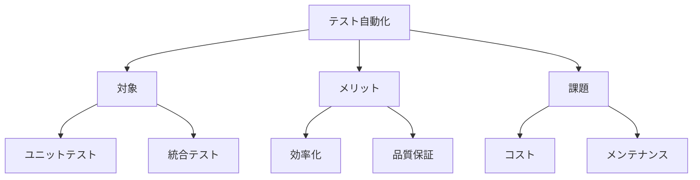

# テスト自動化の実践

## テスト自動化の重要性

AI駆動開発において、テストの自動化は、開発の効率性と品質を確保するために不可欠です。自動化されたテストにより、継続的な品質保証と迅速なフィードバックが可能になります。

## テスト自動化の基本

### 1. 自動化の対象

- ユニットテスト
- 統合テスト
- エンドツーエンドテスト
- パフォーマンステスト

### 2. 自動化のメリット

- テスト実行の効率化
- 人的ミスの削減
- 継続的な品質保証
- 迅速なフィードバック

### 3. 自動化の課題

- 初期コスト
- メンテナンスの必要性
- 環境の整備
- スキル要件



## テスト自動化の実践

### 1. ユニットテストの自動化

```python
# ユニットテストの自動化例
import unittest

class TestCalculator(unittest.TestCase):
    def setUp(self):
        self.calculator = Calculator()

    def test_addition(self):
        self.assertEqual(self.calculator.add(2, 3), 5)

    def test_subtraction(self):
        self.assertEqual(self.calculator.subtract(5, 3), 2)

    def test_multiplication(self):
        self.assertEqual(self.calculator.multiply(4, 3), 12)

    def test_division(self):
        self.assertEqual(self.calculator.divide(6, 2), 3)
        with self.assertRaises(ValueError):
            self.calculator.divide(6, 0)
```

### 2. 統合テストの自動化

```python
# 統合テストの自動化例
class TestUserService(unittest.TestCase):
    def setUp(self):
        self.user_service = UserService()
        self.db = Database()

    def test_user_creation(self):
        user = self.user_service.create_user("test_user", "test@example.com")
        self.assertIsNotNone(user)
        self.assertEqual(user.username, "test_user")
        self.assertEqual(user.email, "test@example.com")

    def test_user_deletion(self):
        user = self.user_service.create_user("test_user", "test@example.com")
        self.user_service.delete_user(user.id)
        self.assertIsNone(self.db.get_user(user.id))
```

### 3. エンドツーエンドテストの自動化

```python
# エンドツーエンドテストの自動化例
from selenium import webdriver

class TestWebApplication(unittest.TestCase):
    def setUp(self):
        self.driver = webdriver.Chrome()
        self.driver.get("http://localhost:5000")

    def test_user_registration(self):
        self.driver.find_element_by_id("username").send_keys("test_user")
        self.driver.find_element_by_id("email").send_keys("test@example.com")
        self.driver.find_element_by_id("submit").click()
        self.assertIn("Registration successful", self.driver.page_source)

    def tearDown(self):
        self.driver.quit()
```

## テスト自動化の最適化

### 1. テスト戦略の策定

- テストの優先順位付け
- カバレッジ目標の設定
- テスト環境の整備
- 継続的インテグレーション

### 2. テストデータの管理

- テストデータの生成
- データの再利用
- 環境依存の排除
- データのクリーンアップ

### 3. テスト実行の自動化

- CI/CD パイプラインの構築
- スケジュール実行の設定
- レポートの自動生成
- 通知の設定

## テスト自動化の効果測定

### 1. 定量的な評価

- テストカバレッジ
- テスト実行時間
- エラー検出率
- リグレッション率

### 2. 定性的な評価

- テストの信頼性
- メンテナンス性
- 拡張性
- チームの生産性

## まとめ

テスト自動化の実践は、AI駆動開発の品質を確保するために不可欠です。以下のポイントを意識することで、より効果的なテスト自動化を実現できます：

1. 適切なテスト戦略の策定
2. 効率的なテストデータの管理
3. 継続的なテスト実行の自動化
4. 効果的な測定と改善

これらの要素を組み合わせることで、より効率的で信頼性の高いテスト自動化を実現できます。
