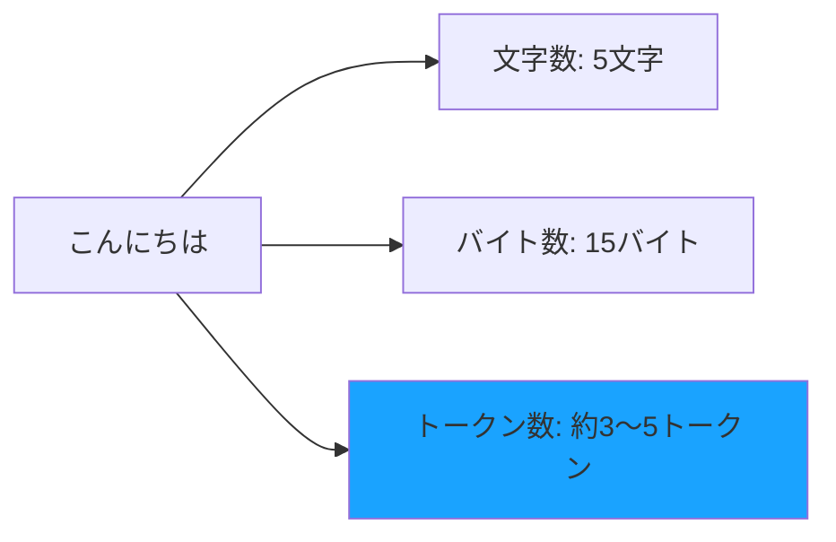

# トークンとは

LLMを使う際に必ず出てくる「トークン」という言葉。これは料金計算や使用量の基準となる重要な概念です。

## トークンとは何か

**トークン（Token）** とは、LLMがテキストを処理するための最小単位です。

人間は文章を「文字」や「単語」として認識しますが、LLMは文章を**トークン**という単位に分解して処理します。

## 文字数・バイト数との違い

トークンは、文字数やバイト数とは異なる概念です。

### 文字数

文字数は、単純に文字を1つずつ数えたものです。

例：「こんにちは」= 5文字

### バイト数

バイト数は、コンピュータが文字を保存するために必要なデータ量です。日本語は1文字3バイト（UTF-8の場合）です。

例：「こんにちは」= 15バイト

### トークン数

トークン数は、LLMが文章を理解するために分割した単位の数です。意味のあるまとまりで分割されます。

例：「こんにちは」= 約3〜5トークン



### なぜトークンで数えるのか？

LLMは、効率的に文章を処理するために、意味のあるまとまり（単語の一部、単語全体、よく使われる組み合わせなど）でテキストを分割します。

- 英語の「Hello」→ 1トークン（1単語として認識）
- 日本語の「こんにちは」→ 約3〜5トークン（複数の単位に分割）

日本語は英語に比べて、1文字あたりのトークン数が多くなる傾向があります。

## トークン数の目安

### 日本語の場合

- 1トークン ≈ 0.5〜1文字
- 100文字 ≈ 100〜200トークン
- 1,000文字 ≈ 1,000〜2,000トークン

### 英語の場合

- 1トークン ≈ 4文字（平均）
- 100単語 ≈ 75トークン
- 1,000単語 ≈ 750トークン

### 具体例

```
例文: "こんにちは、世界！"
トークン数: 約8〜10トークン

例文: "Hello, World!"
トークン数: 約4トークン
```


## まとめ

トークンは LLM の基本単位であり、コストやパフォーマンスに直接影響します。トークンを理解し、適切に管理することで、より効率的な AI 活用が可能になります。
