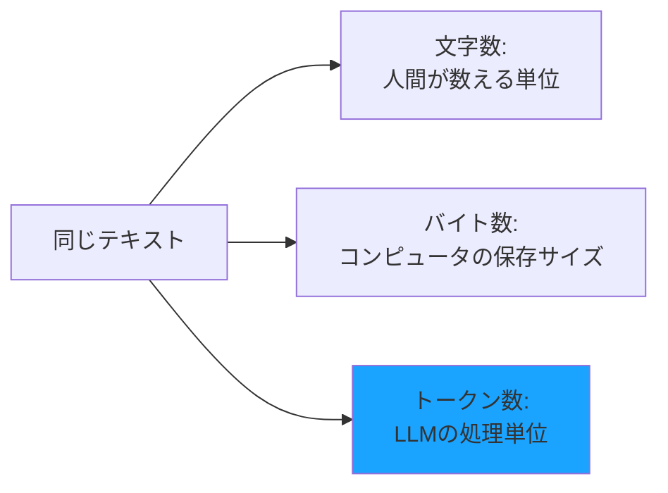

# トークンとは

LLMを使う際に必ず出てくる「トークン」という言葉。これは料金計算や使用量の基準となる重要な概念です。

## トークンとは何か

**トークン（Token）** とは、LLMがテキストを処理するための最小単位です。

人間は文章を「文字」や「単語」として認識しますが、LLMは文章を**トークン**という単位に分解して処理します。

### トークン分割の具体例

実際にどのように分割されるか見てみましょう。

**日本語の例：「こんにちは、世界！」**

```
[こん][にち][は][、][世界][！]
  ↓    ↓    ↓  ↓   ↓   ↓
トークン1 トークン2 トークン3 トークン4 トークン5 トークン6
```

約6トークンに分割されます。

**英語の例：「Hello, World!」**

```
[Hello][,][ World][!]
   ↓    ↓    ↓     ↓
トークン1 トークン2 トークン3 トークン4
```

約4トークンに分割されます。

**コードの例：「function add(a, b) { return a + b; }」**

```
[function][ add][(][a][,][ b][)][ {][ return][ a][ +][ b][;][ }]
    ↓       ↓    ↓  ↓ ↓  ↓ ↓  ↓    ↓     ↓  ↓  ↓ ↓  ↓
 トークン1  トークン2  トークン3...            約14トークン
```

約14トークンに分割されます。

このように、LLMは単語や記号、スペースなどを組み合わせて、意味のあるまとまりでテキストを分割しています。

## 文字数・バイト数との違い

トークンは、文字数やバイト数とは異なる概念です。具体例で比較してみましょう。

### 例1：「AIを使う」

**文字数で数えると**
```
A I を 使 う
1 2 3  4  5  → 5文字
```

**バイト数で数えると**
```
A(1) I(1) を(3) 使(3) う(3) → 11バイト（UTF-8）
```

**トークン数で数えると**
```
[AI][を][使う]
 ↓   ↓   ↓
トークン1 トークン2 トークン3  → 約3トークン
```

### 例2：「Hello World」

**文字数で数えると**
```
H e l l o   W o r l d
1 2 3 4 5 6 7 8 9 10 11  → 11文字（スペース含む）
```

**バイト数で数えると**
```
11バイト（UTF-8、半角英数字は1文字1バイト）
```

**トークン数で数えると**
```
[Hello][ World]
   ↓      ↓
トークン1 トークン2  → 約2トークン
```

### 例3：「プログラミング言語Python」

**文字数で数えると**
```
13文字
```

**バイト数で数えると**
```
プログラミング(18) 言語(6) Python(6) → 30バイト（UTF-8）
```

**トークン数で数えると**
```
[プログラ][ミング][言語][Python]
    ↓        ↓      ↓      ↓
 トークン1  トークン2 トークン3 トークン4  → 約4トークン
```

### まとめ：3つの違い



- **文字数**：人間が認識する文字の数
- **バイト数**：コンピュータがデータを保存する量
- **トークン数**：LLMが文章を理解するための単位

### なぜトークンで数えるのか？

LLMは、効率的に文章を処理するために、意味のあるまとまり（単語の一部、単語全体、よく使われる組み合わせなど）でテキストを分割します。

- 英語の「Hello」→ 1トークン（1単語として認識）
- 日本語の「こんにちは」→ 約3〜5トークン（複数の単位に分割）

日本語は英語に比べて、1文字あたりのトークン数が多くなる傾向があります。

## トークン数の目安

### 日本語の場合

- 1トークン ≈ 0.5〜1文字
- 100文字 ≈ 100〜200トークン
- 1,000文字 ≈ 1,000〜2,000トークン

### 英語の場合

- 1トークン ≈ 4文字（平均）
- 100単語 ≈ 75トークン
- 1,000単語 ≈ 750トークン

### 具体例

```
例文: "こんにちは、世界！"
トークン数: 約8〜10トークン

例文: "Hello, World!"
トークン数: 約4トークン
```


## まとめ

トークンは LLM の基本単位であり、コストやパフォーマンスに直接影響します。トークンを理解し、適切に管理することで、より効率的な AI 活用が可能になります。
