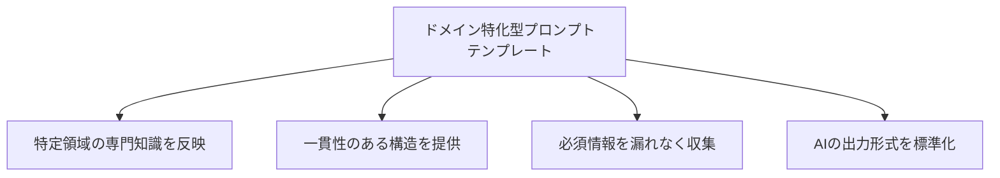

# ドメイン特化型プロンプトテンプレート設計

## はじめに

AIツールを効率的に活用するためには、特定のドメイン（領域）に特化したプロンプトテンプレートを設計することが効果的です。適切に設計されたテンプレートを使用することで、AIからの回答の質と一貫性が向上し、開発効率が大幅に改善されます。この記事では、ドメイン特化型プロンプトテンプレートの設計方法と実践例を紹介します。

## ドメイン特化型プロンプトテンプレートとは

ドメイン特化型プロンプトテンプレートとは、特定の技術領域や業務に特化した定型的な質問や指示の枠組みです。これは単なるテキストのひな形ではなく、特定のドメインで AIの能力を最大限に引き出すための構造化された指示セットと考えることができます。



## テンプレート設計の基本原則

### 1. 目的の明確化

テンプレートの目的と対象領域を明確にします。

**例**：

- API エンドポイント設計用テンプレート
- セキュリティコードレビュー用テンプレート
- データベースクエリ最適化用テンプレート

### 2. 必要な情報の特定

そのドメインで効果的な回答を得るために必要な情報を特定します。

**例（API エンドポイント設計の場合）**：

- 操作の種類（GET、POST、PUT、DELETE など）
- リソース名とその関係
- 認証要件
- 入出力データの形式
- エラーハンドリング要件

### 3. 構造化された形式

情報を論理的に整理し、セクションごとに構造化します。

**例**：

```
## リソース情報
[リソースの詳細]

## エンドポイント要件
[操作と期待される動作]

## データモデル
[関連するデータ構造]

## セキュリティ要件
[認証と認可の詳細]
```

### 4. 出力形式の指定

AIからどのような形式で回答を受け取りたいかを指定します。

**例**：

```
出力には以下を含めてください：
1. エンドポイントのURL設計
2. リクエスト/レスポンスの例（JSONフォーマット）
3. ステータスコードと対応するシナリオ
4. 考慮すべきエッジケース
```

## 主要なドメイン別テンプレート例

### フロントエンド開発テンプレート

```
# フロントエンドコンポーネント開発テンプレート

## コンポーネント情報
**名前**: [コンポーネント名]
**目的**: [コンポーネントの役割と目的]
**使用技術**: [React/Vue/Angular/その他、バージョン情報も]

## ユーザーインターフェース要件
**レイアウト**: [レイアウトの説明]
**レスポンシブ対応**: [必要なブレークポイントと対応内容]
**アクセシビリティ要件**: [WAI-ARIA準拠レベルなど]

## 動作要件
**ユーザーインタラクション**: [サポートするイベントと期待される挙動]
**状態管理**: [管理する状態とその変化]
**API連携**: [必要な場合、連携するAPIの詳細]

## 技術的制約
**パフォーマンス要件**: [ロード時間や最適化の要件]
**ブラウザサポート**: [対応するブラウザとバージョン]
**依存ライブラリ**: [使用可能な外部ライブラリ]

## 出力形式
コンポーネントのソースコード（TypeScript/JSX形式）
スタイリングコード（CSSまたはスタイリングライブラリ形式）
使用例のサンプルコード
テスト方法の提案
```

### バックエンド開発テンプレート

```
# API設計テンプレート

## 基本情報
**API目的**: [APIの目的と解決する問題]
**アーキテクチャ**: [REST/GraphQL/gRPC等]
**主要技術**: [使用言語、フレームワーク、バージョン]

## リソース定義
**リソース名**: [リソースの名前]
**リソース関係**: [他リソースとの関係]
**属性**: [主要属性とデータ型]

## エンドポイント仕様
**リクエストメソッド**: [GET/POST/PUT/DELETE等]
**URL構造**: [期待されるURLパターン]
**クエリパラメータ**: [必要なパラメータと説明]
**リクエストボディ**: [必要な場合の構造]
**レスポンス形式**: [JSONスキーマや例]
**ステータスコード**: [使用するHTTPステータスコード]

## 認証・認可
**認証方式**: [JWT/OAuth/API Key等]
**アクセス制御**: [権限レベルやロール]

## 非機能要件
**パフォーマンス**: [レスポンス時間や同時接続数]
**キャッシュ戦略**: [必要なキャッシュ方法]
**レート制限**: [APIコール制限]

## 出力形式
APIエンドポイント設計（表形式）
リクエスト/レスポンス例
実装コードのサンプル（選択した言語/フレームワーク）
考慮すべきエッジケースとエラーハンドリング
```

### データベース設計テンプレート

```
# データベース設計テンプレート

## プロジェクト概要
**システム名**: [システム名]
**目的**: [データベースの用途]
**データ量見込み**: [予想レコード数、成長率]

## データベース基本情報
**データベース種類**: [リレーショナル/NoSQL]
**具体的な製品**: [MySQL/PostgreSQL/MongoDB等]
**バージョン**: [使用バージョン]

## エンティティ情報
**エンティティ名**: [エンティティ名]
**説明**: [エンティティの役割]
**属性**:
  - [属性名]: [データ型], [制約(PK/FK/Not Null等)], [説明]
  - ...

## リレーションシップ
**関連するエンティティ**: [エンティティA] - [エンティティB]
**関係の種類**: [1対1, 1対多, 多対多]
**関係の説明**: [ビジネスルールや制約]

## パフォーマンス要件
**頻繁なクエリパターン**: [よく実行されるクエリ]
**インデックス要件**: [必要なインデックス]
**パーティション戦略**: [必要な場合]

## 出力形式
ER図（テキストまたはダイアグラム表現）
テーブル定義（DDL文）
インデックス定義
サンプルクエリ（頻繁に使用されるパターン）
スケーラビリティに関する推奨事項
```

## 特定の開発タスク向けテンプレート

### バグ修正テンプレート

```
# バグ修正支援テンプレート

## バグの基本情報
**現象**: [観察される問題の詳細な説明]
**期待される動作**: [正しい動作の説明]
**再現手順**: [バグを再現するための具体的な手順]
**発生頻度**: [常に発生/特定条件で発生/ランダム]

## 技術情報
**環境**: [OS/ブラウザ/デバイス等]
**コード関連部分**: [関連すると思われるコード]
**エラーメッセージ**: [存在する場合]
**スタックトレース**: [存在する場合]

## 試した解決策
**アプローチ1**: [試した解決策とその結果]
**アプローチ2**: [試した解決策とその結果]

## 制約条件
**変更可能な範囲**: [制限がある場合]
**パフォーマンス要件**: [考慮すべき性能面]

## 出力形式
バグの原因分析
推奨される修正方法（コード付き）
テスト方法の提案
類似バグを防ぐための提案
```

### コードレビューテンプレート

```
# コードレビューテンプレート

## コード情報
**言語/フレームワーク**: [使用技術]
**コードの目的**: [このコードが何をするためのものか]
**対象コード**: [レビュー対象のコード]

## レビュー観点
**品質**: [コードの品質に関する観点]
**セキュリティ**: [セキュリティに関する観点]
**パフォーマンス**: [性能に関する観点]
**保守性**: [将来の保守に関する観点]

## プロジェクト固有の基準
**コーディング規約**: [プロジェクト固有の規約]
**アーキテクチャルール**: [アーキテクチャに関するルール]

## 出力形式
重要度別の指摘事項（高/中/低）
具体的な修正案（コード例付き）
良い点・ベストプラクティスの指摘
全体的な改善提案
```

## ドメイン特化型テンプレートのカスタマイズ方法

### 1. プロジェクト固有の要素の追加

テンプレートをプロジェクト固有のニーズに合わせてカスタマイズします。

**例**：マイクロサービスアーキテクチャプロジェクトの場合

```
## サービス間通信
**同期通信方法**: [REST/gRPC等]
**非同期通信方法**: [Kafka/RabbitMQ等]
**サーキットブレーカー**: [使用する場合の設定]
```

### 2. 技術スタック固有の指示の追加

使用する技術スタックに合わせた指示を追加します。

**例**：Spring Boot プロジェクトの場合

```
## Spring固有の設定
**プロファイル設定**: [開発/テスト/本番環境の設定]
**依存性注入方法**: [コンストラクタ注入/フィールド注入等]
**トランザクション管理**: [トランザクション境界とプロパゲーション]
```

### 3. チームの経験レベルに応じた調整

チームの技術力や経験に合わせてテンプレートの詳細度を調整します。

**初心者向け**：より詳細な説明と具体例を含める
**上級者向け**：簡潔な指示と高度な最適化の観点を含める

## テンプレートの有効活用法

### 1. テンプレートライブラリの構築

よく使うテンプレートをチーム内で共有し、継続的に改善します。

**実践例**：

- 社内 Wiki やドキュメント管理システムにテンプレート集を作成
- 各テンプレートの使用例と効果的な結果例を添付
- テンプレートの効果に関するフィードバックを収集

### 2. テンプレートの段階的改良

実際の使用結果に基づいてテンプレートを継続的に改良します。

**改良ポイント**：

- 不足していた情報の追加
- 冗長だった項目の削除
- より具体的な指示への変更
- 新しい技術要素の追加

### 3. プロジェクト管理ツールとの統合

プロジェクト管理ツールにテンプレートを組み込むことで、チーム全体での活用を促進します。

**統合例**：

- Jira のチケットテンプレート
- GitHub の Issue/Pull Request テンプレート
- Confluence のページテンプレート

## ケーススタディ：実際の開発現場での活用例

### ケース 1：金融アプリケーション開発

金融系アプリケーション開発では、セキュリティと規制対応が特に重要です。

**特化したテンプレート要素**：

```
## セキュリティコンプライアンス
**適用規制**: [PCI DSS/GDPR等]
**データ保護要件**: [暗号化方式、保存期間等]
**監査ログ要件**: [ログに記録すべき情報と期間]

## リスク評価
**セキュリティリスク**: [想定されるリスクとその対策]
**データ漏洩シナリオ**: [考慮すべきシナリオ]
```

### ケース 2：マイクロサービスアーキテクチャ設計

マイクロサービスアーキテクチャでは、サービス分割と連携が重要なポイントです。

**特化したテンプレート要素**：

```
## サービス境界
**ドメイン分析**: [境界付けられたコンテキスト]
**サービス責務**: [各サービスの責任範囲]
**データ所有権**: [各データの所有サービス]

## 障害対策
**サービス分離戦略**: [障害隔離方法]
**フォールバック機構**: [各サービスのフォールバック戦略]
**回復パターン**: [障害からの回復方法]
```

## まとめ

ドメイン特化型プロンプトテンプレートは、AIツールを効率的に活用するための重要な手法です。適切に設計されたテンプレートを使用することで、以下のメリットが得られます：

1. より質の高い回答を一貫して得られる
2. 必要な情報が漏れなく収集される
3. チーム内での知識共有と標準化が促進される
4. ドメイン固有の考慮点が確実に反映される
5. AIとのコミュニケーション効率が大幅に向上する

テンプレートは固定的なものではなく、プロジェクトの進行やチームの経験、技術の進化に合わせて継続的に改良していくべきものです。効果的なテンプレート設計と活用は、AI駆動開発の質と効率を高める重要な要素となります。
