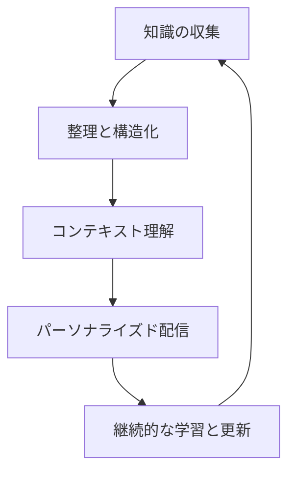
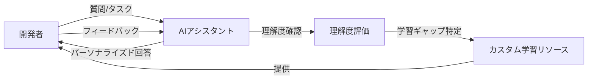

# ナレッジ共有の自動化

## ナレッジ共有の課題と重要性

ソフトウェア開発チームでは、知識やノウハウの共有が生産性と品質に大きく影響します。しかし、従来のナレッジ共有には多くの課題がありました：

- **時間の制約**: ドキュメント作成や知識共有に十分な時間を確保できない
- **形式化の難しさ**: 暗黙知を形式知に変換するプロセスが煩雑
- **情報の鮮度**: ドキュメントが更新されず、古い情報が残り続ける
- **検索性の低さ**: 必要な情報を見つけるのに時間がかかる
- **専門知識の偏り**: 特定の人にしか持ち得ない知識が組織内に分散している

AI を活用したナレッジ共有の自動化は、これらの課題を解決し、チーム全体の知識レベルを向上させる強力な手段となります。

## AI によるナレッジ共有自動化のアプローチ



### 1. 自動ドキュメント生成

AI は開発プロセスで生成される様々な情報源からドキュメントを自動的に生成することができます。

**主な情報源と生成方法**:

- **コードベース**: コメント、関数名、クラス構造などから API ドキュメントを自動生成
- **コミットメッセージ**: 変更履歴から機能説明や変更理由を抽出
- **チャットやミーティング**: チームディスカッションから重要な決定事項や知見を抽出
- **イシュートラッカー**: バグ報告や解決策から知識ベースを構築
- **開発者の操作履歴**: 開発中の試行錯誤からベストプラクティスを抽出

**実装例**:

```python
# コードからドキュメントを自動生成する例
def generate_documentation_from_code(codebase_path):
    # コードベースを解析
    code_analysis = ai_tool.analyze_codebase(codebase_path)

    # 主要なコンポーネントを特定
    components = code_analysis.identify_components()

    # 各コンポーネントのドキュメントを生成
    docs = {}
    for component in components:
        docs[component.name] = ai_tool.generate_component_doc(
            component,
            include_usage_examples=True,
            extract_design_patterns=True,
            identify_best_practices=True
        )

    # 全体アーキテクチャドキュメントを生成
    architecture_doc = ai_tool.generate_architecture_overview(
        components,
        code_analysis.dependencies
    )

    return {
        "components": docs,
        "architecture": architecture_doc
    }
```

### 2. コンテキスト認識型ナレッジベース

従来の検索ベースのナレッジベースとは異なり、AI を活用したナレッジベースは開発者のコンテキストを理解し、関連情報を自動的に提供します。

**主な特徴**:

- **コード理解**: 開発者が書いているコードを理解し、関連するナレッジを提示
- **問題予測**: 発生しそうな問題を予測し、事前に解決策を提案
- **パーソナライズ**: 開発者の経験レベルや過去の行動に基づいて情報をカスタマイズ
- **マルチソース統合**: 社内 Wiki、コードコメント、チャットログなど複数情報源を統合
- **インタラクティブ性**: 質問に対話形式で回答し、理解を深める

**コンテキスト認識の例**:

```javascript
// AIナレッジアシスタントの簡略化された例
async function provideContextualKnowledge(currentCode, userQuery, userProfile) {
  // 現在のコードコンテキストを分析
  const codeContext = await ai.analyzeCodeContext(currentCode);

  // ユーザープロファイルから習熟度と興味を抽出
  const { expertiseLevel, interests } = userProfile;

  // 社内ナレッジベースを検索
  const relevantDocs = await knowledgeBase.semanticSearch({
    query: userQuery,
    codeContext,
    filters: {
      relevanceThreshold: 0.7,
      maxResults: 5,
    },
  });

  // パーソナライズされた回答を生成
  const personalizedResponse = await ai.generateResponse({
    query: userQuery,
    relevantDocuments: relevantDocs,
    codeContext,
    expertiseLevel,
    adaptToInterests: interests,
  });

  return {
    directAnswer: personalizedResponse,
    relatedResources: relevantDocs.map((doc) => ({
      title: doc.title,
      summary: doc.generateSummary(expertiseLevel),
      link: doc.url,
    })),
  };
}
```

### 3. コードレビュー知識の抽出と共有

コードレビューは貴重な知識共有の機会ですが、そこで得られた知見は一過性になりがちです。AI を活用することで、コードレビューから得られた知識を体系化し、チーム全体で共有できます。

**主なアプローチ**:

- **レビューコメント分析**: レビューコメントからベストプラクティスやパターンを抽出
- **改善パターンの特定**: 頻繁に指摘される問題と解決策のパターンを学習
- **ナレッジグラフの構築**: コードの問題と解決策の関係性を視覚化
- **レビューガイドライン自動更新**: レビュー知見からチームのガイドラインを継続的に更新
- **パーソナライズドレコメンデーション**: 開発者ごとに改善点を提案

**レビュー知識抽出の例**:

```python
# コードレビューからナレッジを抽出する例
def extract_knowledge_from_reviews(review_data, code_changes):
    # レビューコメントを分析
    review_analysis = ai.analyze_review_comments(
        review_data,
        categorize=True
    )

    # 頻出パターンを特定
    common_patterns = review_analysis.identify_patterns(
        min_occurrences=3
    )

    # 各パターンに対する解決策を抽出
    solutions = {}
    for pattern in common_patterns:
        solutions[pattern.name] = ai.extract_solutions(
            pattern,
            review_data,
            code_changes
        )

    # ベストプラクティスとして文書化
    best_practices = ai.generate_best_practices(
        patterns=common_patterns,
        solutions=solutions,
        with_examples=True
    )

    return best_practices
```

### 4. インタラクティブな学習体験

AI を活用することで、単なる静的なドキュメントではなく、インタラクティブな学習体験を提供できます。

**主な特徴**:

- **対話型チュートリアル**: コードベースの理解を深めるための対話型ガイド
- **シミュレーション環境**: 実際のコードに変更を加えた場合の影響をシミュレート
- **パーソナライズド学習パス**: 個々の開発者のスキルと目標に基づくカスタム学習計画
- **実践的な演習**: 実際のプロジェクト課題に基づく実践演習
- **フィードバックループ**: 学習過程での理解度をモニタリングし、コンテンツを調整



### 5. 暗黙知の形式化と共有

開発者の頭の中にある暗黙知は、組織にとって貴重な資産ですが、従来は形式化が難しいものでした。AI はこの暗黙知を引き出し、形式化するプロセスを支援します。

**主なアプローチ**:

- **開発行動の観察**: 熟練開発者の作業パターンや意思決定プロセスを分析
- **インタビュー支援**: AI が適切な質問を生成し、知識抽出をサポート
- **思考プロセスの可視化**: 問題解決時の思考プロセスを記録し分析
- **ナレッジグラフ構築**: バラバラの知識を関連付け、構造化された知識ベースを構築
- **共有可能なフォーマット変換**: 専門的な内容を様々なレベルの読者向けに変換

**暗黙知形式化の例**:

```python
# 熟練開発者の問題解決プロセスを形式化する例
def formalize_tacit_knowledge(expert_sessions):
    # 問題解決セッションの分析
    session_analysis = ai.analyze_problem_solving_sessions(
        expert_sessions,
        track_decision_points=True
    )

    # 意思決定パターンの抽出
    decision_patterns = session_analysis.extract_decision_patterns()

    # 判断基準のモデル化
    decision_criteria = ai.model_decision_criteria(
        decision_patterns,
        with_examples=True
    )

    # 異なる経験レベル向けの説明生成
    explanations = {
        "beginner": ai.generate_explanation(decision_criteria, level="beginner"),
        "intermediate": ai.generate_explanation(decision_criteria, level="intermediate"),
        "advanced": ai.generate_explanation(decision_criteria, level="advanced")
    }

    # 実践演習の生成
    exercises = ai.generate_practice_exercises(
        decision_patterns,
        difficulty_levels=3
    )

    return {
        "decision_model": decision_criteria,
        "explanations": explanations,
        "practice_exercises": exercises
    }
```

## 実装パターンと具体例

### パターン 1: 自己更新型技術ドキュメント

コードベースの変更に合わせて自動的に更新されるドキュメントシステムです。

**実装のポイント**:

1. **変更検知**: コードリポジトリの変更を継続的に監視
2. **影響分析**: 変更がドキュメントのどの部分に影響するかを分析
3. **更新生成**: 影響を受ける部分のドキュメントを自動更新
4. **レビュー提案**: 主要な変更には人間によるレビューを提案

**GitHub ワークフローの例**:

```yaml
name: Auto-Update Documentation

on:
  push:
    branches: [main, develop]
    paths:
      - "**.py"
      - "**.js"
      - "**.java"
      - "**.ts"

jobs:
  update-docs:
    runs-on: ubuntu-latest
    steps:
      - uses: actions/checkout@v3
        with:
          fetch-depth: 0

      - name: Analyze code changes
        id: analyze
        run: |
          python scripts/analyze_code_changes.py

      - name: Generate documentation updates
        if: steps.analyze.outputs.has_significant_changes == 'true'
        run: |
          python scripts/update_documentation.py

      - name: Create Pull Request
        uses: peter-evans/create-pull-request@v4
        with:
          title: "docs: 自動更新されたドキュメント"
          body: |
            コードの変更に基づいて自動生成されたドキュメント更新です。
            以下の変更点が含まれています:
            ${{ steps.analyze.outputs.change_summary }}

            レビューをお願いします。
          branch: auto-doc-update
```

### パターン 2: 知識ベースと IDE 統合

開発者がコードを書いている最中に、関連する知識やベストプラクティスを提供する IDE 拡張機能です。

**主な機能**:

1. **コンテキスト認識**: 現在編集中のコードを理解
2. **関連知識提供**: 適切なタイミングで関連情報を表示
3. **インラインドキュメント**: コード内に直接ドキュメントを埋め込み
4. **質問応答**: コードに関する質問に直接回答

**VS Code 拡張の概念例**:

```typescript
// VS Code拡張のコアロジック（概念例）
export class KnowledgeAssistant {
  private context: vscode.ExtensionContext;
  private aiClient: AIKnowledgeClient;

  constructor(context: vscode.ExtensionContext) {
    this.context = context;
    this.aiClient = new AIKnowledgeClient(API_ENDPOINT);

    // エディタの変更を監視
    vscode.workspace.onDidChangeTextDocument(this.onDocumentChanged.bind(this));

    // カーソル位置の変更を監視
    vscode.window.onDidChangeTextEditorSelection(
      this.onSelectionChanged.bind(this)
    );
  }

  private async onDocumentChanged(
    event: vscode.TextDocumentChangeEvent
  ): Promise<void> {
    const editor = vscode.window.activeTextEditor;
    if (!editor || editor.document !== event.document) return;

    // 現在のコードコンテキストを分析
    const codeContext = await this.analyzeCurrentCode(editor);

    // 関連ナレッジを取得
    const relevantKnowledge = await this.aiClient.getRelevantKnowledge({
      codeContext,
      userProfile: await this.getUserProfile(),
      recentActivities: this.getRecentActivities(),
    });

    // 知識提案を表示（閾値を超える関連性がある場合）
    if (relevantKnowledge.relevanceScore > 0.7) {
      this.showKnowledgeSuggestion(relevantKnowledge);
    }
  }

  // 他のメソッド...
}
```

### パターン 3: オンボーディング自動化アシスタント

新しいチームメンバーのオンボーディングプロセスを自動化し、効率化する AI アシスタントです。

**主な機能**:

1. **パーソナライズドオンボーディングプラン**: 新メンバーのスキルと役割に基づいた計画作成
2. **プロジェクト構造ガイド**: コードベースの効率的な理解を支援
3. **インタラクティブチュートリアル**: 主要コンポーネントの使い方を対話形式で説明
4. **進捗追跡**: 理解度を追跡し、追加サポートが必要な領域を特定

**オンボーディングアシスタント例**:

```python
# オンボーディングアシスタントの例
class OnboardingAssistant:
    def __init__(self, repository_path, team_knowledge_base):
        self.repo_path = repository_path
        self.knowledge_base = team_knowledge_base
        self.ai_assistant = AIAssistant()

    def create_personalized_plan(self, new_member_profile):
        # スキルギャップ分析
        skill_gaps = self.analyze_skill_gaps(
            required_skills=self.knowledge_base.get_required_skills(),
            member_skills=new_member_profile.skills
        )

        # 学習パスの生成
        learning_path = self.ai_assistant.generate_learning_path(
            skill_gaps=skill_gaps,
            learning_style=new_member_profile.learning_preferences,
            time_constraint=15,  # 日数
            project_specifics=self.knowledge_base.get_project_overview()
        )

        # コードベース探索計画
        codebase_exploration = self.generate_codebase_exploration_guide(
            role=new_member_profile.role,
            experience_level=new_member_profile.experience
        )

        return {
            "learning_path": learning_path,
            "codebase_exploration": codebase_exploration,
            "key_resources": self.recommend_key_resources(new_member_profile),
            "mentorship_suggestions": self.suggest_mentors(new_member_profile)
        }

    # 他のメソッド...
```

## ナレッジ共有自動化の導入ステップ

チームでナレッジ共有の自動化を導入するための段階的なアプローチを紹介します。

### ステップ 1: 現状分析と目標設定

**アクション項目**:

- 現在のナレッジ共有の課題と弱点を特定
- チームが最も価値を得られる領域を優先付け
- 明確な目標と成功指標を設定

**AI の活用方法**:

- チームディスカッションの分析から課題を抽出
- 既存ドキュメントの質と網羅性を評価
- 類似組織の成功パターンを調査し提案

### ステップ 2: 情報源の準備と AI 学習

**アクション項目**:

- AI が学習すべき重要なドキュメントやコードを特定
- 過去のナレッジ資産を AI が処理しやすい形式に整理
- AI システムのプロンプトやチューニングを準備

**AI の活用方法**:

- 重要度に基づくドキュメントの優先順位付け
- 既存資料のギャップ分析と補完提案
- プロンプトの有効性テストと最適化

### ステップ 3: パイロット導入と検証

**アクション項目**:

- 特定の小さな領域で AI ナレッジシステムを試験導入
- ユーザーフィードバックを収集し改善点を特定
- 成功指標に基づいた効果測定

**AI の活用方法**:

- ユーザーフィードバックの自動分析
- 利用パターンからの改善点抽出
- A/B テストによる効果比較

### ステップ 4: 拡張と統合

**アクション項目**:

- 成功したパイロットを他領域に拡大
- 既存開発ツールやワークフローとの統合
- チーム全体への展開と教育

**AI の活用方法**:

- 拡張計画の優先順位付けと最適化
- 統合ポイントの特定と実装提案
- パーソナライズドトレーニング資料の生成

### ステップ 5: 継続的改善と発展

**アクション項目**:

- 利用状況とフィードバックの継続的モニタリング
- 定期的な内容更新と機能拡張
- ナレッジベースの品質と正確性の維持

**AI の活用方法**:

- 利用統計から改善点を自動提案
- 新しい情報と既存知識の矛盾検出
- トレンド分析に基づく新コンテンツ生成

## ナレッジ共有自動化の成功事例

### 事例 1: ソフトウェア企業でのオンボーディング時間短縮

ある大手ソフトウェア企業では、AI を活用したナレッジ共有システムを導入し、新入社員のオンボーディング時間を大幅に短縮しました。

**実装ポイント**:

- コードベース理解のためのインタラクティブガイド
- パーソナライズドラーニングパス
- 質問予測と先回りサポート

**成果**:

- オンボーディング期間が平均 12 週間から 4 週間に短縮
- 新入社員の初期生産性が 35%向上
- メンターの負担が 40%軽減

### 事例 2: 分散開発チームの知識格差解消

グローバルに分散した開発チームを持つ企業が、AI 駆動のナレッジ共有プラットフォームを導入し、チーム間の知識格差を解消した事例です。

**実装ポイント**:

- リアルタイム多言語翻訳と文化的コンテキスト適応
- 24 時間対応の質問回答システム
- 地域固有の知識の収集と共有

**成果**:

- チーム間のコミュニケーション効率が 50%向上
- クロスリージョンコラボレーションが 2 倍に増加
- 地域間での品質差異が 70%減少

## 倫理的配慮と課題

AI を活用したナレッジ共有には、いくつかの課題や配慮すべき点があります。

### プライバシーとセキュリティ

**考慮すべき点**:

- 機密情報や個人情報の適切な扱い
- AI モデルへの情報漏洩リスク
- アクセス制御と権限管理

**対応策**:

- センシティブ情報の自動検出と匿名化
- オンプレミスまたはプライベートクラウド環境での実行
- 細粒度のアクセス制御と監査ログ

### 情報の正確性と信頼性

**考慮すべき点**:

- AI が生成する情報の正確性検証
- 古い情報や誤った情報の混入リスク
- ハルシネーション（幻覚）の問題

**対応策**:

- 情報ソースの追跡と検証システム
- 定期的な情報の鮮度チェック
- 重要情報の人間によるレビュープロセス

### スキル依存と批判的思考

**考慮すべき点**:

- AI への過度の依存によるスキル低下リスク
- 批判的思考の重要性
- チームの自律性と AI のバランス

**対応策**:

- AI を補助ツールとして位置づけるガイドライン
- 批判的思考を促進する使用方法の教育
- 成長とスキル向上を支援する機能の強化

## まとめ

AI を活用したナレッジ共有の自動化は、開発チームの生産性と品質を大きく向上させる可能性を秘めています。単なるドキュメント作成の効率化だけでなく、暗黙知の形式化、パーソナライズド学習、コンテキスト認識型の情報提供などを通じて、チーム全体の知識レベルを向上させることができます。

導入に当たっては、段階的なアプローチと継続的な改善が重要です。また、AI はあくまでも支援ツールであり、最終的な判断や責任は人間にあることを忘れないようにしましょう。

効果的なナレッジ共有自動化は、チームの協働を促進し、イノベーションを加速させるだけでなく、働きやすい環境づくりにも貢献します。個々のメンバーが知識を共有し成長しやすい環境を整えることで、チーム全体のパフォーマンスと満足度を高めることができるでしょう。
