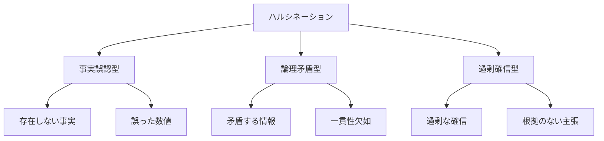

# ハルシネーションへの対策

## ハルシネーションとは

ハルシネーション（幻覚）は、AIモデルが実際には存在しない情報を生成したり、誤った情報を確信を持って提示したりする現象です。これは、AI駆動開発において重要な課題の一つです。

## ハルシネーションの種類

### 1. 事実誤認型ハルシネーション

- 存在しない事実の生成
- 誤った日付や数値の提示
- 架空の引用や参考文献の作成

### 2. 論理矛盾型ハルシネーション

- 矛盾する情報の生成
- 一貫性のない説明
- 文脈に合わない回答

### 3. 過剰確信型ハルシネーション

- 不確かな情報を確実に提示
- 誤った情報を強く主張
- 根拠のない自信



## ハルシネーションの原因

### 1. データの制限

- 学習データの不足
- データの品質問題
- 最新情報の欠如

### 2. モデルの特性

- 確率分布の過剰適合
- 文脈理解の限界
- 推論能力の制約

### 3. プロンプト設計の問題

- 曖昧な指示
- 不適切なコンテキスト
- 制約条件の不足

## ハルシネーション対策の実践

### 1. プロンプト設計の最適化

**明確な指示の提供**:

- 具体的な要件の明示
- 制約条件の設定
- 期待する出力形式の指定

**コンテキストの強化**:

- 関連情報の提供
- 背景知識の共有
- 前提条件の明確化

**検証可能な形式の要求**:

- 根拠の提示
- 情報源の明示
- 不確実性の表明

### 2. 検証メカニズムの実装

**自動検証**:

- 事実チェックの自動化
- 一貫性検証
- 矛盾検出

**人間による検証**:

- レビュープロセスの確立
- 専門家による確認
- フィードバックループ

### 3. モデルの改善

**データの強化**:

- 高品質な学習データの追加
- データの多様化
- 最新情報の取り込み

**モデルの最適化**:

- パラメータの調整
- アーキテクチャの改善
- 学習方法の最適化

## 実践的な対策例

### 1. プロンプトテンプレート

```python
# ハルシネーション対策を組み込んだプロンプトテンプレート
def create_secure_prompt(task: str, context: str) -> str:
    return f"""
    タスク: {task}

    コンテキスト:
    {context}

    制約条件:
    1. 確実な情報のみを提供すること
    2. 不確かな情報は「不確か」と明示すること
    3. 情報源を提示すること
    4. 矛盾する情報がある場合は指摘すること

    期待する出力形式:
    - 主要な回答
    - 情報源
    - 確信度
    - 代替案（該当する場合）
    """
```

### 2. 検証システム

```python
# ハルシネーション検証システムの例
class HallucinationChecker:
    def __init__(self):
        self.fact_checker = FactChecker()
        self.consistency_checker = ConsistencyChecker()
        self.confidence_analyzer = ConfidenceAnalyzer()

    def check_response(self, response: str, context: str) -> Dict:
        fact_check = self.fact_checker.verify(response)
        consistency_check = self.consistency_checker.analyze(response)
        confidence_analysis = self.confidence_analyzer.analyze(response)

        return {
            "fact_check": fact_check,
            "consistency": consistency_check,
            "confidence": confidence_analysis,
            "has_hallucination": any([
                not fact_check["is_valid"],
                not consistency_check["is_consistent"],
                confidence_analysis["is_overconfident"]
            ])
        }
```

### 3. フィードバックループ

```python
# フィードバックループの実装例
class FeedbackLoop:
    def __init__(self):
        self.feedback_history = []
        self.model_adapter = ModelAdapter()

    def process_feedback(self, response: str, feedback: Dict):
        self.feedback_history.append({
            "response": response,
            "feedback": feedback,
            "timestamp": datetime.now()
        })

        if feedback["has_hallucination"]:
            self.model_adapter.adjust_parameters(
                confidence_threshold=feedback["suggested_threshold"],
                context_weight=feedback["context_importance"]
            )

    def get_improvement_suggestions(self) -> List[str]:
        return self.analyze_feedback_patterns(self.feedback_history)
```

## 組織的な対策

### 1. ガイドラインの策定

- ハルシネーション対策の標準手順
- 検証プロセスの確立
- エスカレーションルールの設定

### 2. トレーニングと教育

- 開発者向けトレーニング
- レビュアー向けガイドライン
- 継続的な学習プログラム

### 3. モニタリングと改善

- ハルシネーション発生率の追跡
- 対策の効果測定
- 継続的な改善プロセス

## まとめ

ハルシネーションへの対策は、AI駆動開発の信頼性と品質を確保するために不可欠です。効果的な対策には、以下の要素が重要です：

1. 適切なプロンプト設計
2. 堅牢な検証メカニズム
3. 継続的なモデル改善
4. 組織的な取り組み

これらの対策を組み合わせることで、ハルシネーションのリスクを最小限に抑え、より信頼性の高い AI駆動開発を実現できます。
