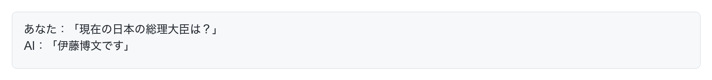
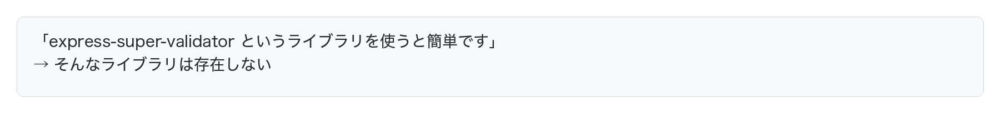
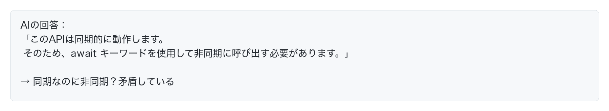
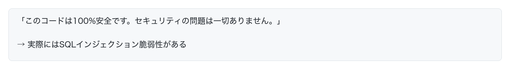
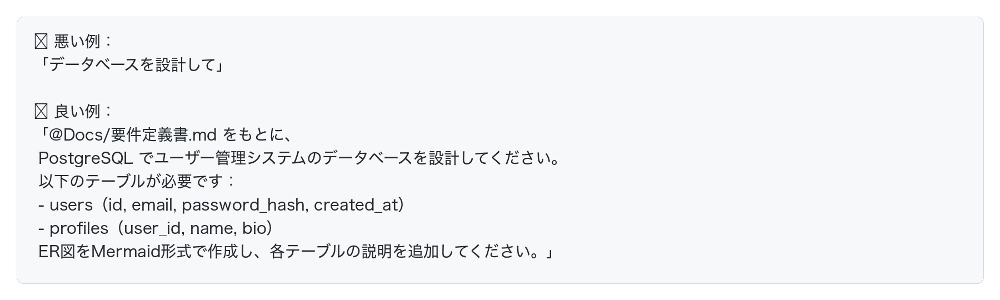
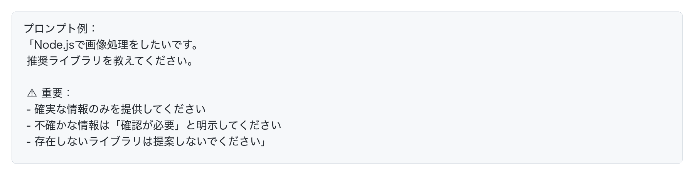
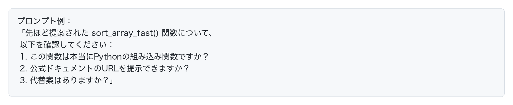

# ハルシネーションへの対策

## ハルシネーションとは

ハルシネーション（幻覚）とは、AIモデルが実際には存在しない情報を生成したり、誤った情報を確信を持って提示したりする現象です。これは、AI駆動開発において最も注意すべき課題の一つです。

### 具体例

## ハルシネーションの3つの種類

### 1. 事実誤認型ハルシネーション

存在しない情報や誤った情報を生成します。

**例**：
- 存在しないライブラリやAPIを提案
- 誤ったバージョン情報
- 架空の引用や参考文献

### 2. 論理矛盾型ハルシネーション

矛盾する情報や一貫性のない説明を生成します。

**例**：

### 3. 過剰確信型ハルシネーション

不確かな情報を確実であるかのように提示します。

**例**：

## ハルシネーションへの対策

### 対策1：具体的なプロンプトを書く

### 対策2：「不確かな場合は明示して」と指示

### 対策3：検証を依頼する

## **重要な原則**

1. **AIを過信しない**：AIも間違える。その前提でレビューやテストをする
2. **必ず検証する**：公式ドキュメントや動作の確認

ハルシネーションは完全には防げませんが、適切な対策と検証により、そのリスクを大幅に削減できます。
