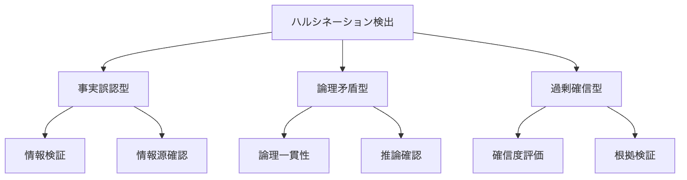
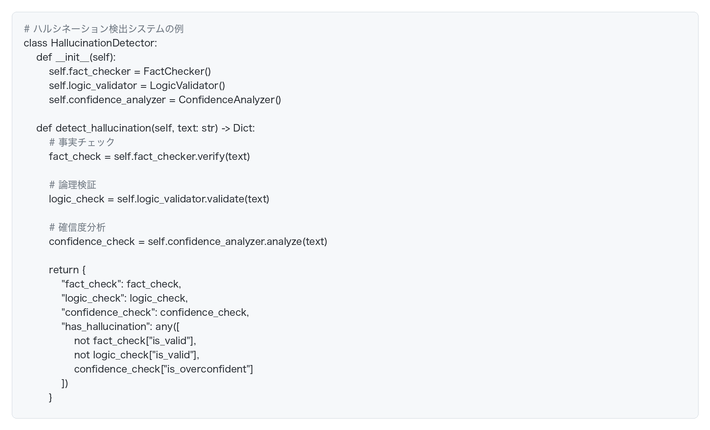
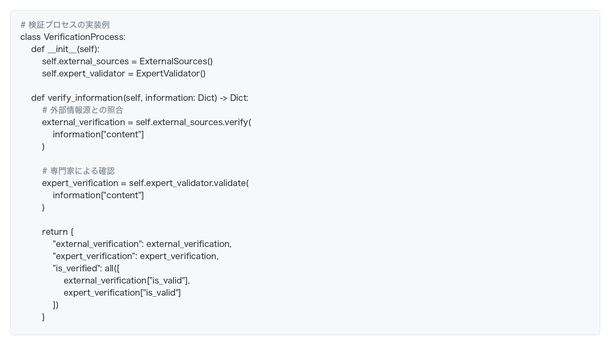
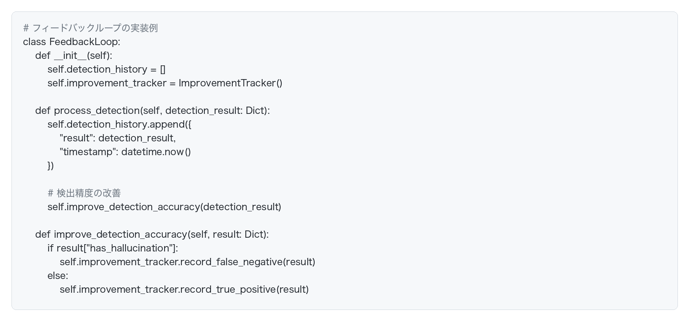

# ハルシネーション検出の判断基準

## ハルシネーション検出の重要性

AI駆動開発において、生成 AIが出力する情報の信頼性を確保するために、ハルシネーション（幻覚）を適切に検出することが重要です。明確な判断基準を持つことで、より効果的な検出が可能になります。

## ハルシネーションの種類と判断基準

### 1. 事実誤認型ハルシネーション

**判断基準**:
- 情報の検証可能性
- 情報源の信頼性
- 最新性の確認
- 一貫性の確認

**検出方法**:
- 外部情報源との照合
- 時系列の確認
- 論理的一貫性の検証
- 専門家による確認

### 2. 論理矛盾型ハルシネーション

**判断基準**:
- 論理的一貫性
- 前提条件の妥当性
- 推論の正当性
- 結論の妥当性

**検出方法**:
- 論理構造の分析
- 前提条件の検証
- 推論過程の確認
- 結論の妥当性評価

### 3. 過剰確信型ハルシネーション

**判断基準**:
- 確信度の適切性
- 不確実性の表明
- 根拠の提示
- 代替案の考慮

**検出方法**:
- 確信度の評価
- 根拠の検証
- 不確実性の確認
- 代替案の検討

## 検出プロセスの実装

### 1. 自動検出システム

### 2. 検証プロセス

### 3. フィードバックループ

## 判断基準の適用

### 1. コード生成での判断基準

**コードの妥当性**:
- 構文の正確性
- アルゴリズムの正当性
- パフォーマンスの適切性
- セキュリティの考慮

**実装の検証**:
- テストケースの実行
- エッジケースの確認
- パフォーマンステスト
- セキュリティチェック

### 2. ドキュメント生成での判断基準

**内容の正確性**:
- 技術的な正確性
- 最新性の確認
- 一貫性の検証
- 完全性の確認

**表現の適切性**:
- 専門用語の使用
- 説明の明確さ
- 構造の論理性
- 読者への配慮

## 継続的な改善

### 1. 検出精度の向上

- 検出アルゴリズムの改善
- 判断基準の更新
- フィードバックの活用
- 新しいパターンの学習

### 2. プロセスの最適化

- 検出プロセスの効率化
- 自動化の推進
- 人間による確認の最適化
- 継続的な評価と改善

## まとめ

ハルシネーション検出の判断基準は、AI駆動開発の信頼性を確保するために不可欠です。効果的な検出には、以下の要素が重要です：

1. 明確な判断基準の設定
2. 体系的な検証プロセス
3. 継続的な改善
4. 人間による確認

これらの要素を組み合わせることで、より信頼性の高い AI駆動開発を実現できます。
