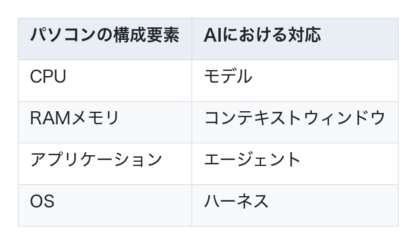
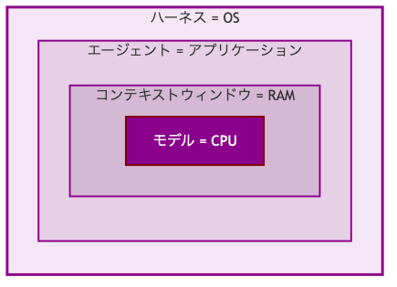
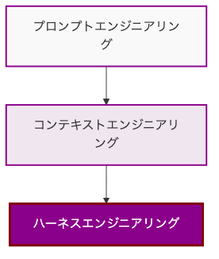
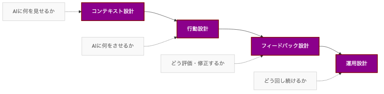
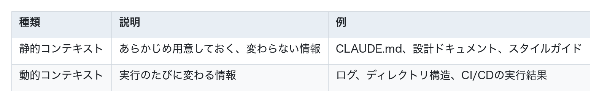
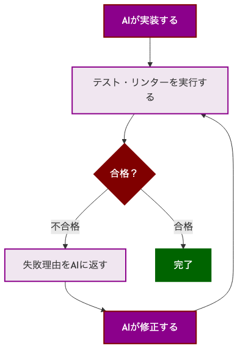
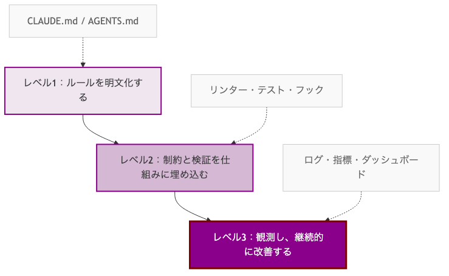
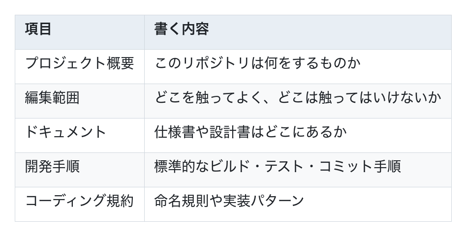
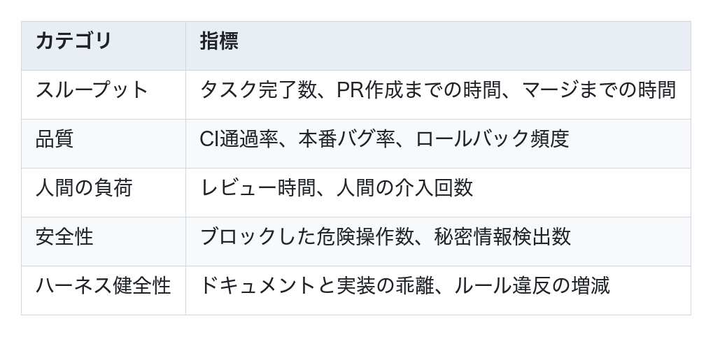
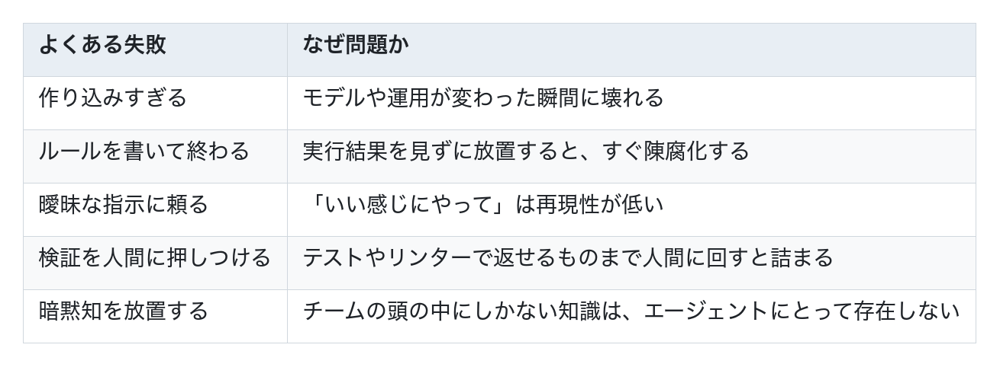

# ハーネスエンジニアリング

## AIの生産性を決めるのは「モデル」ではない

AIの生産性は、もはや異次元の領域に入っています。OpenAIでは3人のエンジニアで5ヶ月間、約100万行のコードを構築しました。Stripeでは週1,000件以上のPRがAIによってマージされています。

では、同じモデルやツールを使えば、誰でもこのレベルの生産性を出せるのかというと、そうではありません。
決定的な違いは、AIを取り巻く「環境」の差です。どんなルールを与えるか、どんな情報を見せるか、どんなツールを渡すか、どう検証し、どう修正ループを回すか。つまり、AIエージェントの動作環境そのものが精密に設計されています。

彼らが作っているのは、単なる「賢いプロンプト」ではありません。AIが安定して成果を出すための**実行環境**です。この環境設計こそが、**ハーネスエンジニアリング**と呼ばれるものです。

## ハーネスエンジニアリングとは

**ハーネスエンジニアリング**とは、AIエージェントが動作する環境そのものを設計する行為です。

ここでいう**ハーネス**とは、AIエージェントが動作する環境全体（ルール、動作フロー、学習の仕組みなど）を指します。

パソコンに置き換えると、イメージが掴みやすくなります。

LLMがどれだけ賢くても、周辺インフラが不十分ならタスク完了率は低いままです。ハーネスは、AIエージェントにとってのOSのような存在です。

### ハーネスの定義

ハーネスエンジニアリングの定義は論者によって異なりますが、いずれも「モデルの外側」に焦点を当てている点で共通しています。

- AIエージェントを制御するためのツールやルールなどの総称
- エージェントがミスを繰り返さないよう教育する仕組み
- 複数のコンテキストウィンドウにまたがるタスクでもAIモデルが効果的に作業するためのフレームワーク
- AIモデルをラップし、ツール実行・コンテキスト管理・安全性の担保などを行う仕組み

### 身近なハーネスの具体例

この定義だけだと抽象的に見えるかもしれませんが、実はすでに多くの人がハーネスに触れています。

たとえば`Claude Code`も、広い意味ではハーネスの一種です。モデル単体を使っているのではなく、モデルの外側にツール、ルール、権限管理、コンテキストの扱い、実行フローなどを組み合わせて、実務で動くエージェント体験に仕立てています。

つまり、普段「AIコーディングツール」や「コーディングエージェント」と呼んでいるものの多くは、実際にはハーネス込みのシステムです。ハーネスエンジニアリングとは、その外側の仕組みを意図して設計し、改善していく取り組みです。

## AI時代のエンジニアリングの進化

AI駆動開発のエンジニアリングは、以下の順番で進化してきました。

最初は**プロンプトエンジニアリング**でした。AIに「どう指示するか」が重要だった時代です。この本の第3章で学んだ内容がこれにあたります。

次に、AIへ「何を見せるか」を設計する**コンテキストエンジニアリング**が重要になりました。ルールファイルやMCPの章で扱った内容です。

そして今、さらに一段進んで、AIエージェントが安定して成果を出せる環境そのものを設計する**ハーネスエンジニアリング**が必須になってきています。

つまり、この本で学んできた知識は、ハーネスエンジニアリングへ至る階段を一歩ずつ登ってきたということです。

## ハーネスエンジニアリングの4つの設計領域

ハーネスエンジニアリングは、モデル自体を再訓練して性能を上げる話ではありません。AIエージェントに何を見せ、どう動かし、どう評価し、どう運用するかを設計して、能力を引き出しながら安全性と再現性を担保する取り組みです。

実務では、この環境設計を次の4つに分けて考えると整理しやすくなります。

### 1. コンテキスト設計 — AIに何を見せるか

コンテキストとは、AIが判断材料として受け取る情報全体のことです。プロンプト、ルールファイル、ソースコード、ログ、MCP経由の情報などが含まれます。

重要なのは、「たくさん渡すこと」ではなく「必要なものだけを、わかる形で渡すこと」です。情報を丸ごと投げると、AIはかえって迷います。
コンテキストは2種類に分けられます。

設計の勘所は次の4つです。

1. **書き出し** : 状態や進捗を外部ファイルに記録する。エージェントのコンテキストウィンドウには限りがあるので、忘れても読み返せるようにしておく
2. **選択** : タスクに必要な情報だけを渡し、不要な情報は見せない
3. **圧縮** : 長い情報を要約して短くし、コンテキストウィンドウを節約する
4. **分離** : サブエージェントに別のコンテキストウィンドウを割り当て、関係ない情報が混ざるのを防ぐ

### 2. 行動設計 — AIに何をさせ、どこまで許すか

行動設計は、AIに「何をさせるか」と「どこまで動いてよいか」を決める領域です。エージェントに自由を与えすぎると、コードは急速にカオスに向かいます。

ここで重要なのは、AIに渡すツールや権限、ガードレール、アーキテクチャ制約をセットで設計することです。たとえば「このディレクトリしか編集できない」「本番DBには触れない」といったルールを決めておきます。

制約は、口約束ではなく仕組みとして埋め込みます。

- **自動リンター**（ESLint等）: コーディング規約を機械的にチェックする
- **LLMベースのレビュー** : リンターでは見つけられない設計レベルの問題を別のAIが検出する
- **自動チェックのトリガー** : コミット前やPUSH時に自動で走るチェック

制約はAIを縛るためではなく、正しい道に乗せるためにあります。選択肢が整理されるほど、エージェントは迷走しにくくなります。

### 3. フィードバック設計 — AIの出力をどう評価し、修正させるか

AIエージェントは、一発で完璧な答えを出す前提で使うより、「出力を評価して軌道修正させる」前提で設計したほうが安定します。ここが、単なるプロンプト設計とハーネス設計の大きな違いです。

このフィードバックループが、ハーネスの中核です。テストだけでなく、リンター、型チェック、E2Eテスト、レビュー用エージェント、監視ログなどを組み合わせて、「何がダメだったのか」をAIが読み取れる形で返す必要があります。

この領域では、評価そのものよりも「失敗を次の行動につながる信号に変えること」が重要です。

### 4. 運用設計 — セッションをまたいでどう回し続けるか

運用設計は、セッションをまたいでもエージェント開発を継続できるようにする領域です。1回の会話で終わる小タスクなら問題ありませんが、実務の開発は何日も続きます。

そのためには、記憶を外に出し、進捗を管理し、コードの劣化を定期的に掃除する仕組みが必要です。

- 進捗や判断を外部ファイルに残し、次のセッションで途中から再開できるようにする
- 要件を小さな単位に分解し、1セッション1機能のように、AIが扱える粒度にする
- 実装とドキュメントのズレを検出する
- 小さな修正PRを自動で作成し、人間が短時間でレビューできるサイズに保つ

部屋と同じで、「散らかったら片づける」では追いつきません。AI時代のコードでは、運用そのものを設計し、継続的に回すことが前提になります。

## ハーネスは3段階で導入する

ハーネスの全体像が見えたところで、次に知りたいのは「実際には何から作り始めればよいのか」です。

重要なのは、最初から巨大な仕組みを作らないことです。次の3段階で階段を登るように進めると失敗しにくくなります。

### レベル1：ルールを明文化する

最初の一歩は、AIが迷わないための地図を作ることです。ここで効くのが`CLAUDE.md`や`AGENTS.md`のようなAI向け指示書です。これはルールファイルの章で学んだ内容そのものです。

書くべき内容は、難しいことではありません。

ポイントは、百科事典を書かないことです。入口になる短いファイルを置き、詳細は別ドキュメントへ案内します。ルールファイルは、仕様書そのものというより「何をどこで読めばいいか」を教える地図として設計したほうがうまくいきます。

また、ルールファイルは一度書いて終わりではありません。エージェントが同じ失敗をしたら、その失敗を二度と繰り返さないように1行ずつルールを追加して育てていくのが実践的です。

### レベル2：制約と検証を仕組みに埋め込む

次にやることは、人間のレビューに頼らず、システム側でミスを防ぐことです。ここで初めてハーネスが「ガイド」から「ガードレール」に変わります。

具体的には、次のような制約と検証を自動化します。

- **リンターや型チェック** : コーディング規約違反を機械的に止める
- **自動テスト** : 期待される動作を合否で返す
- **アーキテクチャ制約** : 依存方向や禁止importをチェックする
- **レビュー用エージェント** : 人間が見る前に怪しい変更をふるいにかける
- **コミット前のフック** : チェックが通らない変更を先に止める

この段階で大事なのは、「実装して終わり」ではなく「実装 → 検証 → 修正」のループを作ることです。

さらに、安全性のガードレールもこの段階で入れます。たとえば、本番環境への直接アクセス禁止、最小権限、危険コマンドの制限、実行ログの保存などです。良いハーネスは、AIを自由にさせる前に「どこまでは自律、どこからは停止か」を決めています。

### レベル3：観測し、継続的に改善する

3段階目は、ハーネスを運用しながら改善する段階です。ここまで来ると、実行ログと評価指標を使ってハーネス自体を育てていくフェーズに入ります。

見るべき指標の例を挙げます。

実務では、セッションをまたぐ運用設計もここに入ります。AIは会話をまたぐと記憶を失うので、進捗や判断は外部ファイルに残し、1セッション1機能のように小さく区切り、次の実行で続きを再開できるようにします。

この段階で初めて、ログ、トレース、観測ダッシュボード、カスタムツール、マルチエージェント連携の投資が効いてきます。いきなりここから始めるのではなく、レベル1と2を整えたうえで入るのが順番です。

## 実務のワークフロー

3段階の土台ができたら、次は日々の開発フローに落とし込みます。おすすめは、エージェントにいきなり「作って」と投げるのではなく、次の順番で動かすことです。

1. **Explore** : 関連コード、仕様、ディレクトリ構造を読む
2. **Plan** : 何をどう変えるかを小さな作業単位に分ける
3. **Implement** : 1タスクずつ実装する
4. **Verify** : テスト、lint、レビューで検証する
5. **Record** : 進捗と判断を記録し、次回に引き継ぐ

この流れにしておくと、エージェントは場当たり的にコードを書き散らしにくくなります。

また、セッションをまたぐ場合は、1回で全部やらせないことも大切です。要件を小さく分割し、1セッション1機能、1PR1目的の粒度に落とすと、精度も再現性も大きく上がります。

## ハーネス設計の3原則

最後に、ハーネスを設計するうえで忘れてはいけない3つの原則をまとめます。

### 1. 軽量に始める

AIの世界は変化が速いので、最初から壮大な仕組みを作るとすぐ陳腐化します。まずは薄く始めて、必要なものだけを足していく設計のほうが強いです。

### 2. 失敗を前提に多層防御する

1つのガードが破られても、次の層で止める設計にします。ルールファイル、権限制御、リンター、テスト、レビューエージェント、人間承認は、どれか1つで完全に守るものではなく、重ねて効かせるものです。

### 3. 人間を最後の承認者に残す

自律性を高めても、人間を完全に外すべきではありません。とくに本番変更、権限操作、顧客影響の大きい差分は、人間が最終承認する前提で設計したほうが安全です。

## 避けるべきミス

ハーネスエンジニアリングでよくある失敗も整理しておきます。

## まずは触ってみよう

ここまで読んでも、まだハーネスが完全には腑に落ちていない人は多いと思います。それは自然なことです。

たとえば、プログラミングを学び始めた頃に「オブジェクト指向」や「フレームワーク」という言葉を聞いても、座学だけではなんとなくわかったようで、実感は持ちにくかったはずです。けれど実務で実際に触ってみると、「こういうことだったのか」と一気に解像度が上がります。

ハーネスも同じです。定義や分類を読むだけで完全に理解するのは難しく、実際に動いているものを触って初めて、「どこまでがモデルで、どこからがハーネスなのか」「なぜツールやガードレールやフィードバック設計が重要なのか」が見えてきます。

おすすめは、自分でゼロから作り始める前に、まずは既存のハーネスを一度触ってみることです。実際に動かし、ログを見て、どんなルールが入り、どう評価され、どう修正ループが回っているかを観察すると、理解のスピードが大きく変わります。

ハーネスエンジニアリングは、読むだけで身につく知識というより、触って初めて腹落ちする実践知です。まずは他の人が作ったハーネスを体験し、そのうえで自分たちの開発現場に合う形へ作り変えていくのが、最も現実的な入り方です。
