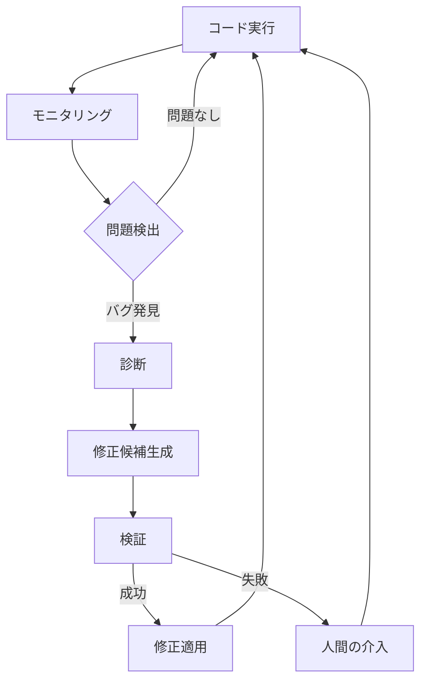
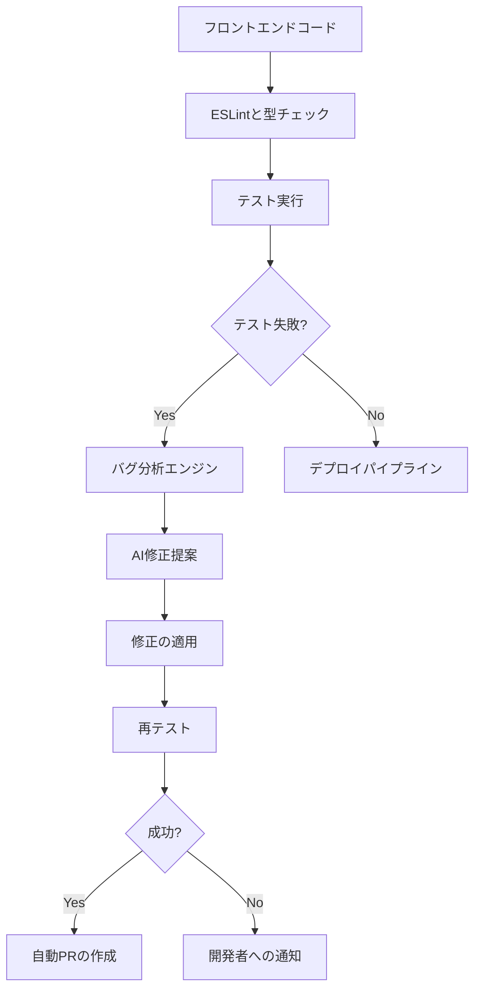

# バグの自動検出と修正

## はじめに

ソフトウェア開発において、バグの検出と修正は最も時間を消費する作業の一つです。伝統的にこのプロセスは手動で行われてきましたが、AIと機械学習の進歩により、バグの自動検出と修正の可能性が大きく広がっています。この記事では、最新の自動バグ検出・修正技術と、それらをソフトウェア開発ワークフローに統合する方法について詳しく解説します。

## バグの自動検出技術

### 静的コード解析

静的コード解析は、コードを実行せずにソースコードを分析してバグや潜在的な問題を特定する技術です。

#### 主な静的解析ツール

- **ESLint/TSLint**: JavaScript/TypeScript コードのスタイルとバグを検出
- **SonarQube**: マルチ言語対応の品質管理プラットフォーム
- **CodeQL**: セキュリティ脆弱性の検出に特化
- **FindBugs/SpotBugs**: Java コードのバグパターン検出

#### AIを活用した静的解析の進化

最新の AI駆動静的解析ツールは、単純なルールベースの検査を超え、コードの文脈を理解し、より複雑なバグパターンを検出できます：

```python
# 従来の静的解析では検出が難しい例
def process_data(data):
    if data:
        result = data.process()
        if data.is_valid():  # データが有効かチェック
            return result
    # data.closeが呼ばれていない潜在的なリソースリーク
```

AIベースの静的解析は、このようなリソースリークや条件付きの実行パスの問題を特定できます。

### 動的解析とランタイム監視

動的解析は、アプリケーションの実行時に問題を検出します。

#### 主な技術とツール

- **メモリプロファイラー**: Valgrind（C/C++）、MemLeaks（Java）
- **カバレッジ分析**: JaCoCo、Istanbul
- **故障注入テスト**: Chaos Monkey、Jepsen
- **ランタイム例外モニタリング**: Sentry、Rollbar

#### AIによる異常検出

AIは通常の動作パターンを学習し、異常を検出することができます：

```python
# 異常検出の例
def monitor_application_performance(metrics_stream):
    model = load_anomaly_detection_model()
    for metrics in metrics_stream:
        is_anomaly = model.predict(metrics)
        if is_anomaly:
            alert("異常なアプリケーション動作を検出しました")
            collect_diagnostics()
```

### 自動テスト生成

AIを活用したテスト生成は、人間が見落としがちなエッジケースを発見するのに役立ちます。

```python
# AIによる自動テスト生成の例
def generate_tests_for_function(function_code):
    prompt = f"""
    次の関数のテストケースを生成してください：
    {function_code}

    特に以下を考慮したテストを含めてください：
    - 境界値
    - エッジケース
    - 例外ハンドリング
    - 通常の入力値
    """

    test_cases = ai_model.generate(prompt)
    return test_cases
```

## バグの自動修正技術

### パターンベースの自動修正

特定のバグパターンに対して、事前定義された修正テンプレートを適用します。

```java
// 修正前: NullPointerException の可能性
if (user.getAddress().getZipCode() == "12345") {
    // 処理
}

// 自動修正後: Null チェックを追加
if (user != null && user.getAddress() != null &&
    user.getAddress().getZipCode() == "12345") {
    // 処理
}
```

### AIを活用したコード修正

現代の AIモデルは、バグの修正候補を生成できます。

#### 修正プロセス

1. **バグの特定**: テスト失敗やクラッシュレポートからバグを特定
2. **コンテキスト収集**: 関連するコード、エラーメッセージ、スタックトレース
3. **修正候補生成**: AIモデルが複数の修正候補を提案
4. **検証**: 提案された修正がテストをパスするか検証
5. **適用**: 最適な修正をコードベースに適用

#### 実装例

```python
def auto_fix_bug(bug_report, failing_test, source_code):
    # コンテキスト収集
    context = {
        "bug_report": bug_report,
        "failing_test": failing_test,
        "source_code": source_code,
        "error_message": extract_error_message(failing_test)
    }

    # AIに修正候補を生成させる
    prompt = f"""
    次のバグを修正するコードを生成してください：

    バグレポート: {context['bug_report']}
    失敗したテスト: {context['failing_test']}
    エラーメッセージ: {context['error_message']}

    問題のあるコード:
    {context['source_code']}

    修正コードを提供してください。
    """

    fix_candidates = ai_model.generate_fixes(prompt, num_candidates=3)

    # 各修正候補をテスト
    for fix in fix_candidates:
        if validate_fix(fix, failing_test):
            return fix

    return None  # 有効な修正が見つからなかった
```

### 自己修復システム

より高度なシステムでは、検出と修正が自動化されたループで行われます。



## 開発ワークフローへの統合

### CI/CD パイプラインとの統合

自動バグ検出と修正を CI/CD パイプラインに統合することで、継続的な品質保証が可能になります。

```yaml
# GitHub Actions での自動バグ検出と修正の例
name: Bug Detection and Auto-Fix

on:
  push:
    branches: [main, develop]
  pull_request:
    branches: [main]

jobs:
  detect-and-fix:
    runs-on: ubuntu-latest
    steps:
      - uses: actions/checkout@v2

      - name: Setup Node.js
        uses: actions/setup-node@v2
        with:
          node-version: "16"

      - name: Install dependencies
        run: npm install

      - name: Run static analysis
        run: npm run lint

      - name: Run tests with coverage
        run: npm run test:coverage

      - name: Auto-fix detected issues
        if: failure()
        run: |
          npm run auto-fix
          git config --local user.email "autofix@example.com"
          git config --local user.name "AutoFix Bot"
          git add .
          git commit -m "Auto-fix: Addressing detected issues" || echo "No changes to commit"
          git push
```

### 開発者体験の向上

IDE 統合により、開発者は即座にフィードバックと修正提案を受け取ることができます。

#### VSCode 拡張機能の例

```javascript
// バグ検出と自動修正のVSCode拡張機能の概念
export function activate(context) {
  // バックグラウンドで静的解析を実行
  const diagnosticCollection =
    vscode.languages.createDiagnosticCollection("auto-fix");

  // ファイル変更時に解析を実行
  vscode.workspace.onDidChangeTextDocument((event) => {
    const diagnostics = analyzeDocument(event.document);
    diagnosticCollection.set(event.document.uri, diagnostics);
  });

  // クイックフィックスアクションを提供
  context.subscriptions.push(
    vscode.languages.registerCodeActionsProvider("*", {
      provideCodeActions(document, range, context) {
        return context.diagnostics
          .filter((diagnostic) => diagnostic.source === "auto-fix")
          .map((diagnostic) => {
            const fix = generateFix(document, diagnostic);
            return {
              title: `自動修正: ${fix.description}`,
              edit: fix.edit,
              kind: vscode.CodeActionKind.QuickFix,
            };
          });
      },
    })
  );
}
```

## ベストプラクティスと課題

### 効果的な実装のためのベストプラクティス

1. **段階的導入**: まず特定の領域や一般的なバグタイプに焦点を当てる
2. **人間によるレビュー**: 自動修正は必ず人間によるレビューを経るべき
3. **フィードバックループ**: 修正の成功・失敗から学習する仕組みを構築
4. **コンテキスト保持**: バグ修正時にコードスタイルや設計意図を尊重
5. **透明性**: 開発者が自動修正の理由と内容を理解できるようにする

### 現在の限界と課題

- **複雑なバグ**: 複数のコンポーネントにまたがる複雑なバグの検出は困難
- **ドメイン知識**: 特定のビジネスロジックに関連するバグの理解が限定的
- **誤検出**: 特に静的解析では誤検出が発生する可能性
- **修正の品質**: 生成された修正が最適でない、または新たな問題を導入する可能性
- **開発者の依存**: 過度な依存による開発者のスキル低下リスク

## まとめ

バグの自動検出と修正技術は急速に進化しており、開発者の生産性と品質保証プロセスを大幅に向上させています。静的解析から、AI駆動の修正生成、自己修復システムに至るまで、様々なアプローチが利用可能です。

これらのツールを効果的に活用するには、開発ワークフローへの適切な統合と、人間の監督とのバランスが重要です。技術の限界を認識しつつ、自動化のメリットを最大化することで、より効率的で信頼性の高いソフトウェア開発が可能になります。

今後、AIモデルの進化とともに、より高度で文脈を理解したバグ検出・修正が実現されていくでしょう。開発者はこれらのツールを自分のスキルを補完するものとして活用し、より創造的な問題解決に集中できるようになるでしょう。

## 実装例：実際のプロジェクトでの活用方法

### 1. TypeScript プロジェクトでの自動バグ修正システム

TypeScript ベースの Web アプリケーションで、AIを活用した自動バグ検出・修正システムを構築する例を見てみましょう。

#### システム構成



#### 修正エンジンの実装

```typescript
// バグ修正エンジンのコア実装
interface BugContext {
  failingTest: string;
  errorMessage: string;
  sourceFile: string;
  sourceCode: string;
  stackTrace?: string;
}

class AutoBugFixer {
  private aiClient: AIClient;
  private codeRepository: CodeRepository;

  constructor(aiClient: AIClient, codeRepository: CodeRepository) {
    this.aiClient = aiClient;
    this.codeRepository = codeRepository;
  }

  async analyzeBug(testResult: TestResult): Promise<BugContext> {
    // テスト結果からバグコンテキストを抽出
    const failingTest = testResult.failingTests[0];
    const errorMessage = failingTest.errorMessage;
    const stackTrace = failingTest.stackTrace;

    // スタックトレースから問題のあるファイルを特定
    const sourceFile = this.extractSourceFileFromStackTrace(stackTrace);
    const sourceCode = await this.codeRepository.getFileContent(sourceFile);

    return {
      failingTest: failingTest.testCode,
      errorMessage,
      sourceFile,
      sourceCode,
      stackTrace,
    };
  }

  async generateFixes(bugContext: BugContext): Promise<string[]> {
    // AIに修正案を生成させる
    const prompt = this.buildPromptFromContext(bugContext);
    const fixCandidates = await this.aiClient.generateCodeFixes(prompt, 3);
    return fixCandidates;
  }

  async validateFix(fix: string, bugContext: BugContext): Promise<boolean> {
    // 修正案をテスト環境に適用してテスト
    await this.codeRepository.applyTemporaryFix(bugContext.sourceFile, fix);
    const testResult = await this.runTest(bugContext.failingTest);
    return testResult.success;
  }

  private buildPromptFromContext(context: BugContext): string {
    return `
      以下のバグを修正するコードを生成してください。

      失敗したテスト:
      ${context.failingTest}
      
      エラーメッセージ:
      ${context.errorMessage}
      
      問題のあるコード（${context.sourceFile}）:
      ${context.sourceCode}
      
      ${context.stackTrace ? `スタックトレース:\n${context.stackTrace}` : ""}
      
      修正コードを提供してください。元のコードスタイルと一貫性を保つようにしてください。
    `;
  }
}
```

### 2. 実際のユースケース：API エンドポイントのバグ修正

バックエンド API で発生した入力検証のバグを自動的に検出・修正する例：

```typescript
// 問題のあるAPIハンドラ
export async function createUser(req: Request, res: Response) {
  const { name, email, age } = req.body;

  // 入力検証（バグあり）
  if (!name || !email) {
    return res.status(400).json({ error: "名前とメールは必須です" });
  }

  // 年齢が負の値でも処理が続行してしまう
  const user = new User({ name, email, age });
  await user.save();

  return res.status(201).json(user);
}

// 失敗テスト
test("負の年齢が指定された場合はエラーを返すべき", async () => {
  const response = await request(app)
    .post("/api/users")
    .send({ name: "テスト太郎", email: "test@example.com", age: -5 });

  expect(response.status).toBe(400);
  expect(response.body).toHaveProperty("error");
});
```

#### AIによる自動修正結果

```typescript
// 修正後のAPIハンドラ
export async function createUser(req: Request, res: Response) {
  const { name, email, age } = req.body;

  // 入力検証（修正済み）
  if (!name || !email) {
    return res.status(400).json({ error: "名前とメールは必須です" });
  }

  // 年齢の検証を追加
  if (age !== undefined && (typeof age !== "number" || age < 0)) {
    return res
      .status(400)
      .json({ error: "年齢は0以上の数値である必要があります" });
  }

  const user = new User({ name, email, age });
  await user.save();

  return res.status(201).json(user);
}
```

### 3. フロントエンドでのメモリリーク自動検出と修正

React コンポーネントでのメモリリークを検出し修正する例：

#### 問題のあるコンポーネント

```tsx
// メモリリークの可能性があるコンポーネント
function DataFetcher({ userId }: { userId: string }) {
  const [data, setData] = useState<UserData | null>(null);

  useEffect(() => {
    let isMounted = true;

    // 非同期データ取得
    const fetchData = async () => {
      const response = await fetch(`/api/users/${userId}`);
      const userData = await response.json();

      // コンポーネントがアンマウントされた後でも状態を更新してしまう可能性
      setData(userData);
    };

    fetchData();

    // クリーンアップ関数がisMountedフラグを使用していない
    return () => {
      isMounted = false;
    };
  }, [userId]);

  return <div>{data ? data.name : "Loading..."}</div>;
}
```

#### AIによる修正結果

```tsx
// 修正されたコンポーネント
function DataFetcher({ userId }: { userId: string }) {
  const [data, setData] = useState<UserData | null>(null);

  useEffect(() => {
    let isMounted = true;

    // 非同期データ取得
    const fetchData = async () => {
      try {
        const response = await fetch(`/api/users/${userId}`);
        const userData = await response.json();

        // マウント状態チェックを追加
        if (isMounted) {
          setData(userData);
        }
      } catch (error) {
        if (isMounted) {
          console.error("データ取得エラー:", error);
        }
      }
    };

    fetchData();

    // クリーンアップ関数
    return () => {
      isMounted = false;
    };
  }, [userId]);

  return <div>{data ? data.name : "Loading..."}</div>;
}
```

### 4. 複数バグの同時検出と修正の優先順位付け

大規模プロジェクトでは、複数のバグが同時に存在することが一般的です。AIを活用して、バグの重要度とリスクに基づいて修正の優先順位を付ける例：

```typescript
interface BugPriority {
  bugId: string;
  severity: "critical" | "high" | "medium" | "low";
  impactScope: "security" | "functionality" | "performance" | "ui";
  estimatedFixComplexity: number; // 1-10のスケール
  userImpact: number; // 影響を受けるユーザー割合（0-1）
  priorityScore: number;
}

class BugPrioritizer {
  prioritizeBugs(detectedBugs: DetectedBug[]): BugPriority[] {
    const prioritizedBugs = detectedBugs.map((bug) => {
      // AIを使用してバグの特性を分析
      const analysis = this.analyzeWithAI(bug);

      // 優先度スコアを計算
      const severityWeight = this.getSeverityWeight(analysis.severity);
      const impactWeight = this.getImpactWeight(analysis.impactScope);

      const priorityScore =
        severityWeight * 0.4 +
        impactWeight * 0.3 +
        analysis.userImpact * 0.2 -
        (analysis.estimatedFixComplexity / 10) * 0.1;

      return {
        ...analysis,
        priorityScore,
      };
    });

    // 優先度順にソート
    return prioritizedBugs.sort((a, b) => b.priorityScore - a.priorityScore);
  }

  // AIを使用してバグの特性を分析
  private analyzeWithAI(bug: DetectedBug): Omit<BugPriority, "priorityScore"> {
    // AIモデルを使用してバグの特性を分析するロジック
    // ...
  }

  private getSeverityWeight(severity: BugPriority["severity"]): number {
    const weights = {
      critical: 1.0,
      high: 0.8,
      medium: 0.5,
      low: 0.2,
    };
    return weights[severity];
  }

  private getImpactWeight(impact: BugPriority["impactScope"]): number {
    const weights = {
      security: 1.0,
      functionality: 0.8,
      performance: 0.6,
      ui: 0.4,
    };
    return weights[impact];
  }
}
```

これらの実装例は、様々な開発環境やプロジェクト種類に適用できる自動バグ検出・修正システムの基本的な構成要素を示しています。実際のプロジェクトでは、特定の要件やツールセットに合わせてカスタマイズすることで、より効果的なバグ管理が可能になります。
