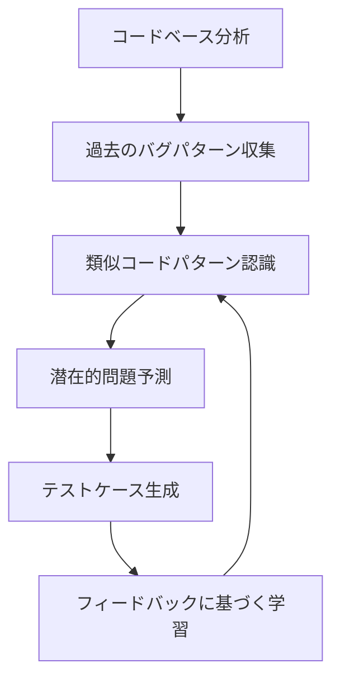
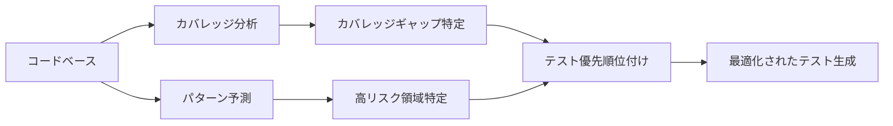
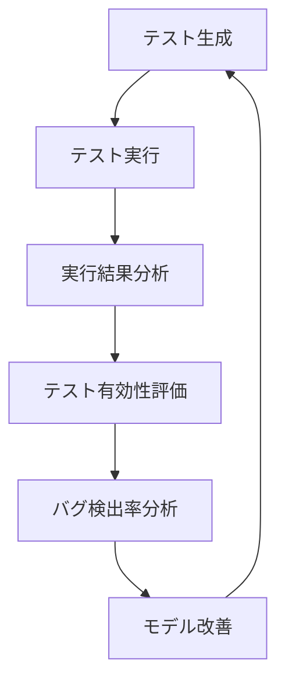

# パターン予測型テスト生成

## はじめに

ソフトウェアテストは品質保証の重要な要素ですが、効果的なテストケースを作成するには時間と専門知識が必要です。パターン予測型テスト生成は、AIを活用して過去のコードパターンや一般的なエラーパターンから学習し、より効率的で効果的なテストケースを自動的に生成する革新的なアプローチです。この章では、AIによるパターン予測型テスト生成の仕組みと実践方法について解説します。

## パターン予測型テスト生成の基本

### 従来のテスト生成と何が違うのか

従来のテスト生成手法とパターン予測型テスト生成の主な違いは以下の通りです：

| 従来のテスト生成                           | パターン予測型テスト生成                             |
| ------------------------------------------ | ---------------------------------------------------- |
| 事前定義されたルールやテンプレートに基づく | 過去のデータパターンから学習し予測                   |
| 明示的に指定された入力と期待される出力     | コードの構造や履歴から可能性のあるエッジケースを予測 |
| 主に正常系のテストに焦点                   | 過去のバグパターンに基づいた異常系テストも強化       |
| 静的な分析に基づく生成                     | プロジェクト固有の特性を学習し改善していく           |

### パターン予測型テスト生成の仕組み



AIはコードベースやバージョン管理システムからのデータを分析し、以下のような情報を学習します：

1. **過去のバグ修正パターン**: 過去に発生したバグとその修正方法
2. **コード構造パターン**: 特定の構造を持つコードで発生しやすい問題
3. **エッジケースパターン**: 過去にエッジケースで発生した問題
4. **テストカバレッジパターン**: 既存のテストが不十分な領域

そして、これらの学習データに基づいて、新しいコードやリファクタリングされたコードに対して効果的なテストケースを予測・生成します。

## AIによるパターン学習と予測

### 学習データの収集と分析

AIが効果的なパターン予測を行うためには、以下のようなデータを収集・分析します：

1. **コミット履歴**: バグ修正に関するコミットの分析
2. **バグレポート**: 過去のバグトラッキングシステムからの情報
3. **コードメトリクス**: 複雑度や変更頻度などのメトリクス
4. **既存のテスト**: 既存のテストと発見されたバグの関係

例えば、特定の関数が以下のようなパターンを持つ場合：

```javascript
function processData(data) {
  if (!data) return [];

  return data.map((item) => {
    return {
      id: item.id,
      name: item.name.toUpperCase(),
      value: calculateValue(item),
    };
  });
}
```

AIは以下のようなパターンを認識します：

1. null/undefined チェックがあるが、空の配列チェックがない
2. `item.name`が`null`または`undefined`の場合のエラー処理がない
3. `calculateValue`関数の戻り値のエラーハンドリングがない

### 学習モデルによるテストケース予測

AIは認識したパターンに基づいて、以下のようなテストケースが必要だと予測します：

1. `data`が`null`または`undefined`の場合のテスト
2. `data`が空配列の場合のテスト
3. `data`の中に`name`が`null`または`undefined`の項目がある場合のテスト
4. `calculateValue`が例外をスローする場合のテスト

## パターン予測型テスト生成の実践方法

### 1. プロジェクト固有のパターン学習

AIにプロジェクト固有のパターンを学習させるためのプロンプト例：

```
以下のGitリポジトリをスキャンして、過去のバグフィックスパターンを分析してください。
特に、最も頻繁に修正されたバグのタイプと、それらが発生しやすいコードパターンを特定してください。

リポジトリURL: [URLを入力]
主要言語: TypeScript
フレームワーク: React, Express
```

AIの分析結果例：

```
分析結果:

1. 最も頻繁なバグパターン:
   - Null/Undefinedチェックの欠如 (32%)
   - 非同期処理のエラーハンドリング不足 (27%)
   - 境界条件の考慮不足 (18%)
   - 状態管理の問題 (14%)
   - その他 (9%)

2. 特に注意すべきコードパターン:
   - 外部APIからのデータを処理する関数
   - 複数の条件分岐を含むユーザー入力処理
   - Reduxステート更新ロジック
   - ネストされたオブジェクトのプロパティアクセス

3. よく見落とされるエッジケース:
   - 空の配列やオブジェクト
   - 特殊文字を含む文字列
   - タイムゾーンやロケールに依存する日付処理
   - モバイルデバイスでの入力値
```

これらの情報に基づいて、AIはプロジェクト固有のテストパターンを生成できます。

### 2. コードパターンに基づいたテスト生成

特定のコードパターンを分析してテストを生成する例：

```typescript
// テスト対象のユーザー認証関数
async function authenticateUser(
  email: string,
  password: string
): Promise<User | null> {
  try {
    if (!email || !password) {
      return null;
    }

    const user = await userRepository.findByEmail(email);
    if (!user) {
      return null;
    }

    const isPasswordValid = await bcrypt.compare(password, user.password);
    if (!isPasswordValid) {
      return null;
    }

    return user;
  } catch (error) {
    logger.error("Authentication error", error);
    return null;
  }
}
```

AIによるパターン分析結果：

```
このコードに対して、以下のパターンを検出しました:

1. 入力バリデーション: email, passwordの存在チェック
2. データベースアクセス: userRepositoryを通じたデータ取得
3. パスワード検証: bcryptによる比較
4. エラーハンドリング: try-catchによる例外処理
5. 一般化されたエラー応答: 認証失敗の理由を区別しない

過去のバグパターンに基づいて、以下のテストケースを推奨します:
```

AIが生成するテストコード例：

```typescript
describe("authenticateUser", () => {
  // 入力バリデーションテスト
  test("should return null when email is empty", async () => {
    const result = await authenticateUser("", "password123");
    expect(result).toBeNull();
  });

  test("should return null when password is empty", async () => {
    const result = await authenticateUser("user@example.com", "");
    expect(result).toBeNull();
  });

  // データベースアクセステスト
  test("should return null when user not found", async () => {
    // Arrange
    userRepository.findByEmail = jest.fn().mockResolvedValue(null);

    // Act
    const result = await authenticateUser(
      "nonexistent@example.com",
      "password123"
    );

    // Assert
    expect(userRepository.findByEmail).toHaveBeenCalledWith(
      "nonexistent@example.com"
    );
    expect(result).toBeNull();
  });

  // パスワード検証テスト
  test("should return null when password is invalid", async () => {
    // Arrange
    const mockUser = {
      id: 1,
      email: "user@example.com",
      password: "hashedPassword",
    };
    userRepository.findByEmail = jest.fn().mockResolvedValue(mockUser);
    bcrypt.compare = jest.fn().mockResolvedValue(false);

    // Act
    const result = await authenticateUser("user@example.com", "wrongPassword");

    // Assert
    expect(bcrypt.compare).toHaveBeenCalledWith(
      "wrongPassword",
      "hashedPassword"
    );
    expect(result).toBeNull();
  });

  // 正常系テスト
  test("should return user when credentials are valid", async () => {
    // Arrange
    const mockUser = {
      id: 1,
      email: "user@example.com",
      password: "hashedPassword",
    };
    userRepository.findByEmail = jest.fn().mockResolvedValue(mockUser);
    bcrypt.compare = jest.fn().mockResolvedValue(true);

    // Act
    const result = await authenticateUser(
      "user@example.com",
      "correctPassword"
    );

    // Assert
    expect(result).toEqual(mockUser);
  });

  // エラーハンドリングテスト
  test("should return null when an exception occurs", async () => {
    // Arrange
    userRepository.findByEmail = jest
      .fn()
      .mockRejectedValue(new Error("DB connection failed"));

    // Act
    const result = await authenticateUser("user@example.com", "password123");

    // Assert
    expect(result).toBeNull();
    // ロガーの呼び出しも検証することができる
    expect(logger.error).toHaveBeenCalled();
  });
});
```

### 3. 歴史的バグパターンに基づくテスト生成

過去のバグパターンに基づいてテストを生成する例：

```
このプロジェクトでは、以下のような関連するバグが過去に報告されています:

1. Issue #127: ユーザー認証時にデータベース接続エラーが正しく処理されない
2. Issue #156: メールアドレスの大文字小文字が異なると同じユーザーとして認識されない
3. Issue #203: パスワードが8文字未満の場合のバリデーションが不十分

これらの過去のバグパターンに基づいて、以下の追加テストを推奨します:
```

AIが生成する追加テストコード例：

```typescript
// Issue #127に対応するテスト
test("should handle database connection errors gracefully", async () => {
  // Arrange
  const dbError = new Error("Connection refused");
  dbError.name = "SequelizeConnectionError"; // 具体的なエラータイプ
  userRepository.findByEmail = jest.fn().mockRejectedValue(dbError);

  // Act
  const result = await authenticateUser("user@example.com", "password123");

  // Assert
  expect(result).toBeNull();
  expect(logger.error).toHaveBeenCalledWith(
    "Authentication error",
    expect.any(Error)
  );
});

// Issue #156に対応するテスト
test("should be case-insensitive for email addresses", async () => {
  // Arrange
  const mockUser = {
    id: 1,
    email: "user@example.com",
    password: "hashedPassword",
  };
  userRepository.findByEmail = jest.fn().mockImplementation(async (email) => {
    return email.toLowerCase() === "user@example.com" ? mockUser : null;
  });
  bcrypt.compare = jest.fn().mockResolvedValue(true);

  // Act
  const result = await authenticateUser("USER@Example.Com", "correctPassword");

  // Assert
  expect(userRepository.findByEmail).toHaveBeenCalledWith("USER@Example.Com");
  // これがnullを返す場合、Issue #156と同様のバグがある可能性がある
});

// Issue #203に対応するテスト
test("should validate password length before authentication", async () => {
  // Arrange
  const shortPassword = "123";

  // Act
  const result = await authenticateUser("user@example.com", shortPassword);

  // Assert
  // 現在の実装ではパスワード長のチェックがない
  // Issue #203のようなバグを防ぐためには、以下のようなアサーションが必要
  // expect(result).toBeNull();
  // expect(userRepository.findByEmail).not.toHaveBeenCalled();
});
```

## パターン予測型テスト生成の高度な活用

### 1. テストカバレッジ分析との組み合わせ

カバレッジ分析結果とパターン予測を組み合わせることで、テスト戦略を最適化できます：



例えば、以下のような AIプロンプトで分析できます：

```
次のコードのテストカバレッジレポートと、過去のバグ修正履歴を分析し、
テストの優先度が最も高い部分を特定してください。

[コードとカバレッジレポートを貼り付け]
```

AIの分析結果例：

```
テスト優先度分析:

以下の関数には、カバレッジが低く、過去に関連するバグが多いため
優先的にテストを追加すべきです:

1. `handleUserSubmission()` - カバレッジ: 45%, 関連バグ: 7件
   - 特にエラーハンドリングとデータバリデーションのパスがテストされていない

2. `processPayment()` - カバレッジ: 62%, 関連バグ: 5件
   - 特に境界条件と例外ケースのテストが不足

3. `synchronizeData()` - カバレッジ: 58%, 関連バグ: 4件
   - 非同期処理とリトライロジックのテストが不足
```

### 2. CI/CD パイプラインへの統合

パターン予測型テスト生成を CI/CD パイプラインに統合して、継続的にテストカバレッジを改善できます：

```yaml
# GitHub Actions ワークフロー例
name: AITest Generation

on:
  pull_request:
    branches: [main, develop]

jobs:
  generate-tests:
    runs-on: ubuntu-latest
    steps:
      - uses: actions/checkout@v2
        with:
          fetch-depth: 0 # 履歴情報を取得するために必要

      - name: Setup Node.js
        uses: actions/setup-node@v2
        with:
          node-version: "16"

      - name: Install dependencies
        run: npm ci

      - name: Run existing tests and collect coverage
        run: npm test -- --coverage

      - name: Identify changed files
        id: changed-files
        run: |
          CHANGED_FILES=$(git diff --name-only origin/main...HEAD | grep "\.js$\|\.ts$" | tr '\n' ' ')
          echo "::set-output name=files::$CHANGED_FILES"

      - name: Generate tests with AI
        if: steps.changed-files.outputs.files != ''
        run: |
          for file in ${{ steps.changed-files.outputs.files }}; do
            node scripts/generate-ai-tests.js "$file" --coverage-report=coverage/lcov.info --history=10
          done

      - name: Create PR with generated tests
        uses: peter-evans/create-pull-request@v3
        with:
          commit-message: "test: Add AI-generated tests"
          title: "Add AI-generated tests"
          body: "AIhas generated tests for recently changed files."
          branch: "ai-tests/${{ github.event.pull_request.number }}"
```

### 3. フィードバックループの構築

テスト品質を継続的に改善するためのフィードバックループを構築します：



バグが発見されるたびに、対応するテストケースが存在したかどうかを分析し、AIモデルにフィードバックすることで、テスト生成の精度を向上させます。

## 実践的なテクニック

### 1. 効果的なプロンプト設計

AIにコードパターンを認識させるための効果的なプロンプト例：

```
以下のコードを分析し、テストすべきケースを特定してください。
特に以下の観点を考慮してください:

1. 関数の入力バリデーション
2. 条件分岐の網羅性
3. エラーハンドリングのパス
4. エッジケースやコーナーケース
5. 非同期処理のエラーパターン

また、このコードと類似した関数で過去に発生したバグパターンがあれば、
それらに対応するテストケースも提案してください。

[コードを貼り付け]
```

### 2. プロジェクト固有の学習データの活用

プロジェクト固有の学習データを活用するための方法：

1. **バグデータベースの構築**: 過去のバグとその修正パターンのデータベースを構築
2. **コードメトリクスの追跡**: 複雑度、変更頻度、バグ発生率などのメトリクスを追跡
3. **テスト効果の計測**: 各テストがどのようなバグを検出したかを記録

### 3. ドメイン知識の組み込み

ドメイン固有のテストを生成するためのプロンプト例：

```
以下は金融アプリケーションの取引処理関数です。
金融ドメインでよく見られる以下のような考慮事項を含めたテストケースを
生成してください:

1. 通貨の丸め誤差
2. 取引限度額の境界値
3. 重複取引の防止
4. トランザクション整合性
5. 監査記録の検証

[コードを貼り付け]
```

## パターン予測型テスト生成の限界と対処法

### 現在の限界

1. **新しいパターンの検出**: 過去のパターンに基づいているため、まったく新しいタイプのバグの予測は難しい
2. **コンテキスト理解の制限**: 複雑なビジネスルールやドメイン固有の要件の理解が限定的
3. **学習データの品質依存**: 過去のコードやバグデータの品質に依存する
4. **過剰適合**: 特定のプロジェクトのパターンに過度に適合し、一般化できない可能性

### 対処法と今後の展望

1. **人間と AIの協業**: AIの提案を人間がレビューし、ドメイン知識を追加
2. **継続的学習**: 新しいバグパターンを継続的に学習させる仕組みの構築
3. **複数の AIモデルの組み合わせ**: 異なる強みを持つ AIモデルを組み合わせる
4. **動的なテスト生成**: 実行結果に基づいて動的にテストを調整・生成

## まとめ

パターン予測型テスト生成は、AIを活用して過去のコードパターンやバグパターンから学習し、より効果的なテストケースを自動的に生成する革新的なアプローチです。プロジェクト固有のパターンを学習し、継続的に改善していくことで、テスト品質を向上させながら開発効率を高めることができます。

AIを活用したテスト生成は人間のテスターを置き換えるものではなく、テスターの能力を拡張し、より創造的で価値の高いテスト活動に集中できるようにするものです。過去のパターンからの学習と、人間のドメイン知識や創造性を組み合わせることで、より堅牢なソフトウェア開発が可能になります。

パターン予測型テスト生成技術は急速に進化しており、今後はより高度なコンテキスト理解や動的なテスト生成能力を持つ AIモデルの登場が期待されます。これらの技術を積極的に取り入れながら、継続的に学習・改善していくことが、品質の高いソフトウェア開発の鍵となるでしょう。
