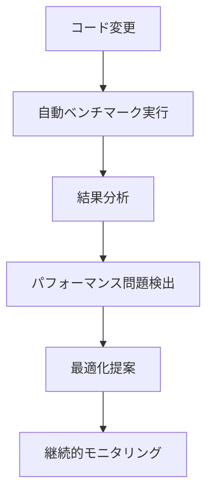

# パフォーマンスベンチマーク自動化

## 概要

パフォーマンスベンチマークの自動化は、ソフトウェア開発において非常に重要な役割を果たします。手動でのパフォーマンステストには限界があり、継続的に行うことが難しいですが、AI を活用した自動化によって効率的かつ正確なパフォーマンス監視が可能になります。



## パフォーマンス自動計測の重要性

パフォーマンスベンチマークを自動化する主な理由：

- **継続的な監視**: 開発サイクル全体を通じてパフォーマンスの変化を追跡
- **早期問題検出**: パフォーマンス低下を早い段階で発見し、修正コストを削減
- **客観的な評価**: 一貫した環境での測定により、主観に左右されない評価が可能
- **比較分析**: 異なるバージョン間の比較や競合製品との比較が容易
- **リソース最適化**: 過剰なリソース使用を早期に発見し、コスト削減に貢献

## AI によるベンチマーク自動化のアプローチ

### 1. ベンチマークシナリオの自動生成

従来のベンチマークでは、テストシナリオの作成に多大な労力が必要でした。AI を活用することで：

- **ユースケース分析**: 実際のユーザー行動パターンを分析し、現実的なシナリオを生成
- **エッジケース特定**: 極端な状況や負荷条件を自動的に特定
- **データセット生成**: テスト用の現実的なデータセットを自動生成
- **シナリオの多様化**: 様々な条件下でのテストカバレッジを向上

例：

```python
# AIによるベンチマークシナリオ自動生成の簡易例
def generate_benchmark_scenarios(application_type, user_patterns):
    # AIモデルを使用して、アプリケーションタイプとユーザーパターンに基づき
    # 適切なベンチマークシナリオを生成
    scenarios = ai_model.analyze_and_generate_scenarios(
        application_type,
        user_patterns,
        complexity_levels=['simple', 'moderate', 'complex'],
        edge_cases=True
    )
    return scenarios
```

### 2. 継続的パフォーマンス測定の自動化

- **CI/CD パイプライン統合**: コード変更ごとに自動的にベンチマークを実行
- **環境正規化**: 異なる実行環境での結果を正規化し、比較可能にする
- **分散テスト**: 複数環境での並行テスト実行による時間短縮
- **負荷シミュレーション**: 実環境に近い負荷条件を自動的に再現


### 3. AI 駆動のパフォーマンス分析

- **異常検出**: 過去のパターンと比較して異常なパフォーマンス変化を検出
- **根本原因分析**: パフォーマンス低下の原因となるコード変更や設定を特定
- **トレンド予測**: 将来的なパフォーマンス問題を予測
- **相関分析**: 複数メトリクス間の関係性を分析し、隠れた問題を発見

例：

```javascript
// パフォーマンスデータからの異常検出
function detectPerformanceAnomalies(currentMetrics, historicalData) {
  // AIモデルを使用して異常を検出
  const anomalies = aiModel.detectAnomalies({
    current: currentMetrics,
    historical: historicalData,
    sensitivity: 0.8,
    contextFactors: ["time_of_day", "system_load", "code_changes"],
  });

  return anomalies.map((anomaly) => ({
    metric: anomaly.metricName,
    severity: anomaly.severity,
    possibleCauses: anomaly.relatedChanges,
    recommendation: anomaly.suggestedAction,
  }));
}
```

## 実装例：AI ベースのパフォーマンスベンチマーク自動化

### GitHub Actions を使用した自動ベンチマーク

```yaml
name: Automated Performance Benchmark

on:
  push:
    branches: [main, develop]
  pull_request:
    branches: [main]

jobs:
  benchmark:
    runs-on: ubuntu-latest
    steps:
      - uses: actions/checkout@v3

      - name: Setup benchmark environment
        run: |
          # ベンチマーク環境のセットアップ

      - name: Run automated benchmarks
        run: |
          # ベンチマークの実行
          ./run_benchmarks.sh

      - name: AI Analysis
        run: |
          # AIを使用した結果分析
          python analyze_benchmarks.py

      - name: Upload benchmark results
        uses: actions/upload-artifact@v3
        with:
          name: benchmark-results
          path: ./benchmark-results/
```

### ベンチマーク結果の視覚化と分析

```python
# ベンチマーク結果の視覚化と分析の例
import pandas as pd
import matplotlib.pyplot as plt
from sklearn.ensemble import IsolationForest

def analyze_benchmark_history(results_df):
    # 異常検出モデルの適用
    model = IsolationForest(contamination=0.05)
    results_df['anomaly_score'] = model.fit_predict(results_df[['response_time', 'throughput', 'cpu_usage', 'memory_usage']])

    # 異常の可視化
    plt.figure(figsize=(10, 6))
    plt.scatter(results_df['date'], results_df['response_time'],
                c=results_df['anomaly_score'], cmap='coolwarm')
    plt.title('Response Time Trend with Anomaly Detection')
    plt.xlabel('Date')
    plt.ylabel('Response Time (ms)')
    plt.colorbar(label='Anomaly Score')
    plt.savefig('response_time_anomalies.png')

    # 異常があった場合の詳細分析
    anomalies = results_df[results_df['anomaly_score'] == -1]
    if not anomalies.empty:
        # 異常の詳細分析と原因特定
        return analyze_anomaly_causes(anomalies)

    return "No significant anomalies detected"
```

## 効果的なパフォーマンスメトリクスの設計

AI を活用したパフォーマンスベンチマークでは、適切なメトリクス設計が重要です：

1. **ユーザー体感メトリクス**

   - ページ読み込み時間
   - 応答時間
   - インタラクション遅延

2. **システムリソースメトリクス**

   - CPU 使用率
   - メモリ消費
   - ディスク I/O
   - ネットワーク使用量

3. **スケーラビリティメトリクス**

   - 同時ユーザー数と応答時間の関係
   - リソース増加に対するパフォーマンス向上率

4. **ビジネス関連メトリクス**
   - 処理完了率
   - エラー率
   - ユーザーあたりのコスト

## パフォーマンスベンチマーク自動化の導入ステップ

1. **現状分析**

   - 既存のパフォーマンス問題の特定
   - 重要なユースケースとメトリクスの定義

2. **自動化ツールの選定と構築**

   - ベンチマークフレームワークの選択
   - AI モデルの選定または開発
   - CI/CD パイプラインへの統合

3. **ベースライン確立**

   - 初期パフォーマンス計測
   - 許容範囲の設定

4. **段階的な拡張**

   - シンプルなシナリオから開始
   - 複雑なシナリオへ徐々に拡大
   - メトリクスの追加と調整

5. **継続的改善**
   - 定期的なベンチマーク結果のレビュー
   - AI 分析モデルの精度向上
   - 新たなシナリオの追加

## 実際の適用事例

### Web アプリケーションでの例

ある E コマースサイトでは、AI ベースのパフォーマンスベンチマーク自動化を導入し：

- コミットごとにショッピングカートのパフォーマンスを自動測定
- 週次のトレンド分析により、徐々に低下するデータベースクエリのパフォーマンスを早期発見
- 負荷のピーク時のシミュレーションにより、必要なスケーリング戦略を事前に特定

結果：

- パフォーマンス関連の本番環境での問題が 45%減少
- 開発者のパフォーマンステストにかかる時間が 75%削減
- ピーク時のインフラコストが 20%削減

### モバイルアプリでの例

モバイルゲーム開発会社では：

- 様々なデバイス環境を自動的にシミュレートしてパフォーマンスを測定
- バッテリー消費とフレームレートの関係を AI が分析して最適化ポイントを提案
- ユーザーの実際の使用パターンに基づいたシナリオを自動生成

結果：

- アプリのクラッシュ率が 60%減少
- バッテリー効率が 35%向上
- アップデート後のネガティブレビューが減少

## 課題と対応策

### 環境差異の問題

**課題**: 異なる環境での実行結果の差異がパフォーマンス評価を複雑にする

**対応策**:

- 環境の標準化とコンテナ化
- 相対的なパフォーマンス変化に注目
- 環境要因を考慮した正規化アルゴリズムの適用

### 適切なシナリオ設計

**課題**: 現実のユースケースを反映したシナリオ設計が難しい

**対応策**:

- 実際のユーザーログデータからシナリオを生成
- A/B テストからの知見を活用
- 徐々にシナリオを複雑化・多様化

### ノイズと偽陽性

**課題**: 環境ノイズによる偽陽性アラートが多発する可能性

**対応策**:

- 統計的有意性テストの適用
- 複数回の実行結果の平均化
- AI による異常検出の精度向上と閾値の最適化

## まとめ

パフォーマンスベンチマークの自動化は、現代のソフトウェア開発において不可欠な要素となっています。AI の活用により、単なる数値の測定から、インテリジェントな分析、予測、最適化提案までを自動化することが可能になりました。

継続的なパフォーマンス監視と自動化されたベンチマークを導入することで、開発チームは：

- パフォーマンス問題を早期に発見し修正できる
- 手動テストの負担を大幅に削減できる
- データに基づいた意思決定が可能になる
- ユーザー体験の一貫した質を確保できる

AI との協働により、パフォーマンステストはより賢く、より効率的に、そしてより有意義なものになっています。
