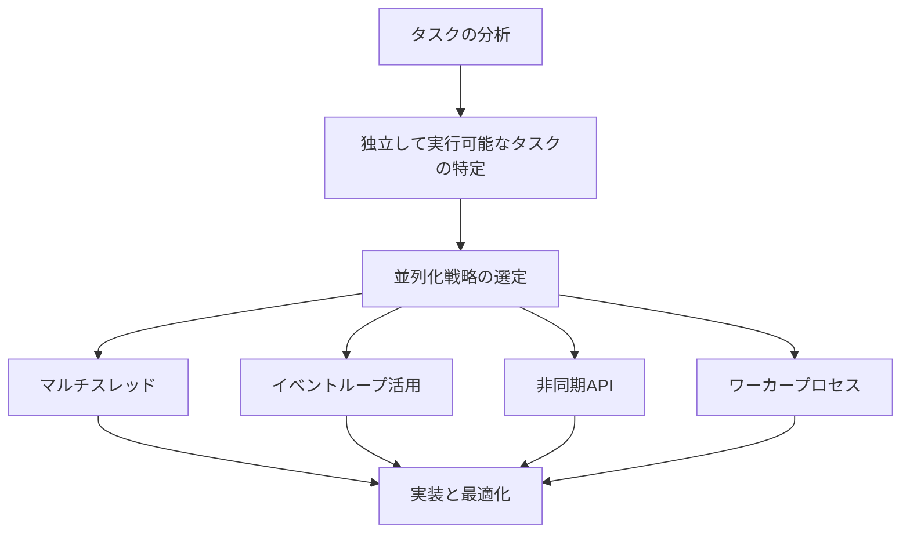

# パフォーマンス最適化

## パフォーマンス最適化の重要性

ソフトウェア開発において、パフォーマンス最適化は非常に重要な側面です。ユーザーエクスペリエンスの向上、運用コストの削減、スケーラビリティの確保など、多くのメリットをもたらします。特に現代のアプリケーションは機能が複雑化し、扱うデータ量も増大しているため、効率的な処理が求められています。

パフォーマンス最適化の主な目的は以下の通りです：

- **応答時間の短縮**: ユーザーの操作に対する反応速度を向上させる
- **スループットの向上**: 単位時間あたりの処理能力を増加させる
- **リソース使用効率の改善**: CPU、メモリ、ストレージ、ネットワーク帯域幅などの効率的な利用
- **スケーラビリティの確保**: 負荷増大時にも適切に対応できる設計の実現
- **コスト削減**: クラウドリソースなどの運用コストを最小化

AI駆動開発を活用することで、これらのパフォーマンス最適化をより効率的かつ効果的に進めることができるようになりました。

## AI駆動開発によるパフォーマンス分析

### 1. パフォーマンスのボトルネック特定

AI技術を活用して、アプリケーションのパフォーマンスボトルネックを特定することができます。


**AIによるボトルネック特定の例**：

```
以下のパフォーマンスプロファイリングデータを分析し、主要なボトルネックを
特定してください。また、それぞれのボトルネックの原因と影響度を評価し、
優先的に対処すべき問題を提案してください。

[パフォーマンスプロファイリングデータ]
```

AIは以下のような観点からボトルネックを分析できます：

- **時間分析**: 実行時間が長い処理や頻繁に呼び出される処理の特定
- **メモリ使用**: メモリリークや過剰なメモリ使用の特定
- **I/O 操作**: ディスク I/O やネットワーク I/O のボトルネック検出
- **CPU 使用率**: CPU 負荷の高い処理の特定
- **スレッド競合**: マルチスレッド環境での競合状態や待機時間の分析

### 2. ホットパスの特定と最適化

アプリケーションで最も頻繁に実行される「ホットパス」を特定し、重点的に最適化することが効果的です。

**AIを活用したホットパス分析の例**：

```
以下のコードベースから、最も頻繁に実行される処理パスを特定し、
パフォーマンス最適化の候補を提案してください。特に、
ループ処理、データ構造の選択、アルゴリズムの複雑性に注目してください。

[コードベース]
```

## AIによるパフォーマンス最適化テクニック

### 1. アルゴリズムの改善

AI駆動開発を活用して、より効率的なアルゴリズムへの改善を支援できます。

**改善前のコード例（O(n²)の複雑度）**:

```javascript
// 重複要素を削除する関数（非効率な実装）
function removeDuplicates(array) {
  const result = [];

  for (let i = 0; i < array.length; i++) {
    let isDuplicate = false;

    // 重複チェック - O(n²)の時間複雑度
    for (let j = 0; j < result.length; j++) {
      if (array[i] === result[j]) {
        isDuplicate = true;
        break;
      }
    }

    if (!isDuplicate) {
      result.push(array[i]);
    }
  }

  return result;
}
```

**AIによる最適化例（O(n)の複雑度）**:

```javascript
// 重複要素を削除する関数（最適化実装）
function removeDuplicates(array) {
  // Setを使用してO(n)の時間複雑度で重複を排除
  return [...new Set(array)];

  // 別の実装方法
  // const uniqueItems = {};
  // array.forEach(item => uniqueItems[item] = item);
  // return Object.values(uniqueItems);
}
```

AIに最適化を依頼する例：

```
以下の重複要素削除関数のパフォーマンスを改善してください。
現在の実装は大きな配列に対して非効率です。
時間複雑度と空間複雑度を考慮した最適な実装を提案してください。

[コードを提示]
```

### 2. データ構造の最適化

適切なデータ構造の選択は、パフォーマンスに大きな影響を与えます。AIを活用して、特定のユースケースに最適なデータ構造を選択できます。


**データ構造選択の例**:

| 操作       | 配列（Array） | 連結リスト（LinkedList） | ハッシュマップ（HashMap） | 二分探索木（BST） |
| ---------- | ------------- | ------------------------ | ------------------------- | ----------------- |
| 検索       | O(n)          | O(n)                     | O(1)                      | O(log n)          |
| 挿入       | O(1)\*        | O(1)                     | O(1)                      | O(log n)          |
| 削除       | O(n)          | O(1)\*                   | O(1)                      | O(log n)          |
| 順序維持   | はい          | はい                     | いいえ                    | はい              |
| メモリ効率 | 高い          | 低い                     | 中程度                    | 中程度            |

*末尾挿入の場合。途中挿入は O(n)  
*要素参照がある場合。検索が必要な場合は O(n)

**AIによるデータ構造最適化の例**:

```
以下のコードでは、ユーザーデータを格納して頻繁に検索・更新する処理を
行っています。現在の実装では配列を使用していますが、パフォーマンスに
問題があります。ユースケースに最適なデータ構造を提案し、
コードをリファクタリングしてください。

[コードを提示]
```

### 3. メモリ使用の最適化

メモリ使用の最適化は、特に大規模データを扱うアプリケーションやメモリ制約のある環境で重要です。

**AIによるメモリ最適化支援の例**:

```
以下の画像処理アプリケーションでは、大量のメモリを消費しています。
メモリプロファイリングの結果を分析し、メモリリークや非効率なメモリ使用を
特定して、改善案を提案してください。

[メモリプロファイリング結果]
```

**一般的なメモリ最適化テクニック**:

1. **オブジェクトプーリング**: 一時オブジェクトの再利用による GC 負荷軽減
2. **遅延読み込み**: 必要になるまでデータをロードしない
3. **ストリーム処理**: 大きなデータセットをストリームとして処理
4. **メモリマッピングファイル**: 大きなファイルをメモリにマップして効率的にアクセス
5. **不要なデータの解放**: 不要になったデータの明示的な解放

**メモリ最適化コード例（JavaScript での大きな配列処理）**:

```javascript
// 改善前: 大量のメモリを一度に消費
function processLargeArray(largeArray) {
  // 全ての要素を一度に処理 - メモリ使用量大
  const processed = largeArray.map(item => transform(item));
  return processed;
}

// 改善後: チャンク処理によるメモリ使用量削減
function processLargeArrayInChunks(largeArray, chunkSize = 1000) {
  const results = [];

  // 配列をチャンクに分割して処理
  for (let i = 0; i < largeArray.length; i += chunkSize) {
    const chunk = largeArray.slice(i, i + chunkSize);
    const processedChunk = chunk.map(item => transform(item));
    results.push(...processedChunk);

    // 必要に応じてガベージコレクションを促進
    if (i % (chunkSize * 10) === 0) {
      await new Promise(resolve => setTimeout(resolve, 0));
    }
  }

  return results;
}
```

### 4. 非同期処理と並列化の最適化

非同期処理と並列化を適切に活用することで、パフォーマンスを大幅に向上させることができます。



**AIによる並列処理最適化の例**:

```
以下の画像処理パイプラインは現在シングルスレッドで実行されており、
処理に時間がかかっています。このコードを分析し、並列処理を
活用したより効率的な実装を提案してください。Node.js環境で
実行されることを前提としています。

[シングルスレッドのコード]
```

**並列処理最適化の例（Node.js のワーカースレッド）**:

```javascript
// ワーカースレッドを利用した画像処理の並列化
const {
  Worker,
  isMainThread,
  parentPort,
  workerData,
} = require("worker_threads");
const numCPUs = require("os").cpus().length;

if (isMainThread) {
  // メインスレッド: 画像を分割して各ワーカーに分配
  async function processImagesInParallel(images) {
    const chunkSize = Math.ceil(images.length / numCPUs);
    const workers = [];

    // 結果を保持する配列
    const results = new Array(images.length);

    // CPUコア数に応じてワーカーを作成
    for (let i = 0; i < numCPUs; i++) {
      const start = i * chunkSize;
      const end = Math.min(start + chunkSize, images.length);
      const imageChunk = images.slice(start, end);

      // ワーカー作成
      const worker = new Worker(__filename, {
        workerData: { imageChunk, startIndex: start },
      });

      // 結果受信時の処理
      worker.on("message", ({ index, processedImage }) => {
        results[index] = processedImage;
      });

      workers.push(
        new Promise((resolve) => {
          worker.on("exit", resolve);
        })
      );
    }

    // 全ワーカーの完了を待機
    await Promise.all(workers);
    return results;
  }

  // 処理開始
  const images = loadImages(); // 画像を読み込む処理
  processImagesInParallel(images).then((processedImages) => {
    saveImages(processedImages); // 処理後の画像を保存
  });
} else {
  // ワーカースレッド: 画像処理を実行
  const { imageChunk, startIndex } = workerData;

  // 各画像を処理
  imageChunk.forEach((image, i) => {
    const processedImage = processImage(image); // 実際の画像処理

    // 処理結果をメインスレッドに送信
    parentPort.postMessage({
      index: startIndex + i,
      processedImage,
    });
  });
}
```

### 5. キャッシュ戦略の最適化

キャッシュを適切に活用することで、計算コストの高い処理や頻繁に使用されるデータのパフォーマンスを向上できます。

**AIによるキャッシュ戦略提案の例**:

```
以下のWebアプリケーションでは、データベースからの読み取りが頻繁に
発生しパフォーマンスに影響しています。適切なキャッシュ戦略を提案し、
実装例を示してください。キャッシュの有効期限管理、容量制限、
無効化戦略なども考慮してください。

[アプリケーションコード]
```

**キャッシュ戦略の例**:

1. **メモリキャッシュ**: アプリケーションメモリ内で頻繁にアクセスされるデータをキャッシュ
2. **分散キャッシュ**: Redis、Memcached などを使用した複数サーバー間での共有キャッシュ
3. **HTTP/CDN キャッシュ**: 静的コンテンツの配信最適化
4. **データベースクエリキャッシュ**: 頻繁に実行されるクエリ結果のキャッシュ
5. **計算結果キャッシュ**: 複雑な計算結果のキャッシュ（メモ化）

**キャッシュ実装例（メモ化による再計算防止）**:

```javascript
// メモ化を使用したフィボナッチ数列計算
function createFibonacciCalculator() {
  // キャッシュを保持するクロージャ
  const cache = new Map();

  return function fibonacci(n) {
    // キャッシュにある場合はキャッシュから返す
    if (cache.has(n)) {
      return cache.get(n);
    }

    // ベースケース
    if (n <= 1) {
      return n;
    }

    // 再帰的に計算
    const result = fibonacci(n - 1) + fibonacci(n - 2);

    // 結果をキャッシュに格納
    cache.set(n, result);

    return result;
  };
}

const fib = createFibonacciCalculator();
console.log(fib(50)); // 非メモ化だと非常に遅いが、メモ化により高速に計算
```

## パフォーマンスモニタリングとプロファイリング

パフォーマンス最適化の前提として、現状のパフォーマンスを正確に測定することが重要です。AIを活用することで、プロファイリングデータの解析や最適化候補の特定が効率化されます。


### 主要なパフォーマンスメトリクス

1. **応答時間 (Response Time)**

   - ユーザーのリクエストから応答までの時間
   - パーセンタイル（p50、p95、p99）で測定するのが一般的

2. **スループット (Throughput)**

   - 単位時間あたりの処理量（リクエスト/秒など）
   - システムの処理能力を示す指標

3. **リソース使用率**

   - CPU 使用率
   - メモリ使用量
   - ディスク I/O
   - ネットワーク使用量

4. **エラー率**
   - 失敗したリクエストの割合
   - タイムアウトの頻度

### AIによるプロファイリングデータ解析の例

```
以下のアプリケーションプロファイリングデータを分析し、
次の観点から最適化の機会を特定してください：

1. 実行時間の長い処理
2. 頻繁に呼び出される関数
3. メモリリークの可能性がある箇所
4. I/Oのボトルネック
5. 最も効果的な最適化ターゲット

[プロファイリングデータ]
```

## パフォーマンス最適化の実践例

### 例 1: Web アプリケーションのフロントエンド最適化

**AIによるフロントエンド最適化提案の例**:

```
以下のReactアプリケーションのパフォーマンスを分析し、
レンダリング最適化の提案を行ってください。特に、
不要な再レンダリングやメモリリークに注目してください。

[Reactコンポーネントコード]
```

**主要なフロントエンド最適化テクニック**:

1. **コード分割とレイジーローディング**: 必要なコードのみを初期ロード
2. **メモ化**: `React.memo`, `useMemo`, `useCallback`を使用した不要な再計算の防止
3. **仮想化リスト**: 大量のリスト項目を扱う際の最適化
4. **画像最適化**: 適切なフォーマットとサイズの使用、遅延読み込み
5. **CSS/JavaScript 最適化**: バンドルサイズの削減、クリティカル CSS の抽出

**React 最適化コード例**:

```javascript
// 最適化前
function ExpensiveComponent({ data, onItemClick }) {
  // データを加工する重い処理
  const processedData = expensiveCalculation(data);

  return (
    <div>
      {processedData.map((item) => (
        <div key={item.id} onClick={() => onItemClick(item.id)}>
          {item.name}
        </div>
      ))}
    </div>
  );
}

// 最適化後
const ExpensiveComponent = React.memo(({ data, onItemClick }) => {
  // メモ化による再計算の防止
  const processedData = useMemo(() => {
    return expensiveCalculation(data);
  }, [data]);

  // コールバックのメモ化
  const handleClick = useCallback(
    (id) => {
      onItemClick(id);
    },
    [onItemClick]
  );

  return (
    <div>
      {processedData.map((item) => (
        <div key={item.id} onClick={() => handleClick(item.id)}>
          {item.name}
        </div>
      ))}
    </div>
  );
});
```

### 例 2: データベースクエリの最適化

**AIによるデータベース最適化支援の例**:

```
以下のSQLクエリはテーブルサイズが大きくなると遅くなります。
クエリの実行計画と以下のテーブル構造を分析し、
インデックス設計を含む最適化案を提案してください。

[SQLクエリと実行計画]
[テーブル構造]
```

**データベース最適化の主なアプローチ**:

1. **インデックス最適化**: 適切なインデックスの作成と不要なインデックスの削除
2. **クエリ書き換え**: より効率的な SQL クエリへの変換
3. **データモデル最適化**: 正規化/非正規化の適切な使い分け
4. **キャッシュ戦略**: 頻繁に実行されるクエリの結果キャッシュ
5. **パーティショニング**: 大規模テーブルの分割

**SQL クエリ最適化例**:

```sql
-- 最適化前のクエリ
SELECT o.order_id, o.order_date, c.customer_name, p.product_name, oi.quantity
FROM orders o
JOIN customers c ON o.customer_id = c.customer_id
JOIN order_items oi ON o.order_id = oi.order_id
JOIN products p ON oi.product_id = p.product_id
WHERE o.order_date BETWEEN '2023-01-01' AND '2023-12-31'
ORDER BY o.order_date DESC;

-- 最適化後のクエリ
SELECT o.order_id, o.order_date, c.customer_name, p.product_name, oi.quantity
FROM orders o
-- インデックス付きの日付範囲を先に絞り込み
INNER JOIN (
    SELECT order_id
    FROM orders
    WHERE order_date BETWEEN '2023-01-01' AND '2023-12-31'
) filtered_orders ON o.order_id = filtered_orders.order_id
JOIN customers c ON o.customer_id = c.customer_id
JOIN order_items oi ON o.order_id = oi.order_id
JOIN products p ON oi.product_id = p.product_id
ORDER BY o.order_date DESC
LIMIT 1000; -- 必要な結果だけに制限
```

**インデックス設計の提案**:

```sql
-- パフォーマンス向上のためのインデックス
CREATE INDEX idx_orders_date ON orders(order_date);
CREATE INDEX idx_order_items_order_id ON order_items(order_id);
CREATE INDEX idx_order_items_product_id ON order_items(product_id);
```

## パフォーマンス最適化のベストプラクティス

### 1. 計測主導の最適化

- 常にデータに基づいて最適化を行う
- 推測ではなく計測結果に従って優先順位付け
- 最適化前後で効果を測定し、ROI を確認

### 2. ホットパスに集中

- アプリケーションの中で最も頻繁に実行される部分を特定
- 80/20 の法則を意識（20%のコードが 80%の実行時間を占める）
- 最も大きな効果が得られる部分から着手

### 3. 段階的な最適化

- 一度にすべてを最適化しようとせず、段階的に進める
- 各最適化ステップの効果を個別に測定
- 複数の最適化の相互作用を考慮

### 4. トレードオフの意識

- パフォーマンスと他の品質特性（可読性、メンテナンス性など）のバランス
- メモリ使用量と処理速度のトレードオフ
- 開発時間と最適化効果のトレードオフ

## AIを活用したパフォーマンス最適化のプロセス


1. **計測**:

   - パフォーマンスメトリクスの収集
   - プロファイリングツールの活用
   - ベンチマークの実施

2. **分析**:

   - AIによるパフォーマンスデータの解析
   - ボトルネックの特定
   - 根本原因の理解

3. **最適化候補の特定**:

   - AIによる最適化提案の生成
   - 各提案の効果予測と実装難易度の評価
   - 優先順位付け

4. **実装**:

   - 選択した最適化の実装
   - コードの変更と最適化
   - リファクタリング

5. **効果検証**:
   - 最適化前後の比較測定
   - ユーザー体験への影響評価
   - 次の最適化ターゲットの特定

## まとめ

パフォーマンス最適化は、単なる技術的な詳細ではなく、ユーザー体験とビジネス成果に直結する重要な要素です。AI駆動開発を活用することで、以下のような利点が得られます：

- ボトルネックの正確かつ迅速な特定
- 最適化候補の効果的な提案
- コードの自動最適化と変換
- パフォーマンスデータの効率的な分析と解釈

パフォーマンス最適化は継続的なプロセスであり、アプリケーションの進化とともに定期的に見直す必要があります。AIツールはこのプロセスを支援する強力なパートナーとなりますが、最終的な判断や設計の決定は開発者が行うことが重要です。

効果的なパフォーマンス最適化は、常に測定可能なデータに基づいて行い、最適化のコストと得られる効果のバランスを考慮する必要があります。AI駆動開発のアプローチを取り入れることで、このバランスをより効率的に達成できるでしょう。
