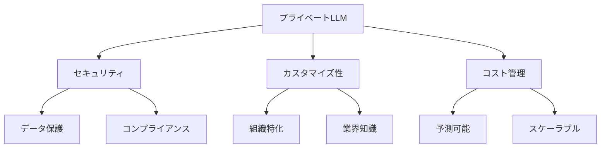
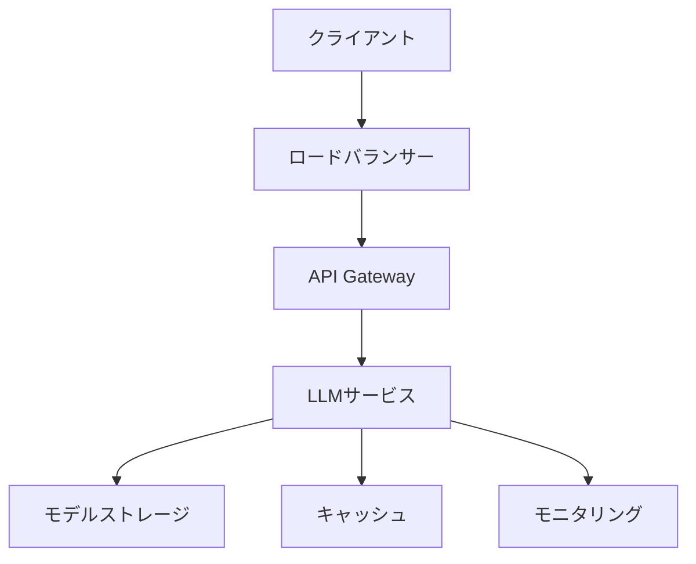

# プライベート LLM とオンプレミスソリューション

## プライベート LLM とは

プライベート LLM（Large Language Model）は、組織内で独自に構築・運用する大規模言語モデルです。公開されている LLM とは異なり、組織のデータや要件に特化したモデルを構築できます。

## プライベート LLM のメリット

### 1. データセキュリティの向上

- 機密データの外部流出リスクの排除
- データの完全な制御が可能
- コンプライアンス要件への適合

### 2. カスタマイズ性

- 組織特有の用語や文脈の理解
- 業界特有の知識の組み込み
- 特定のタスクに最適化

### 3. コスト管理

- 使用量に応じた柔軟なコスト管理
- 長期的な運用コストの予測可能性
- スケーリングの制御



## オンプレミスソリューションの実装

### 1. インフラストラクチャ要件

**ハードウェア要件**:

- 高性能 GPU/TPU
- 大容量メモリ
- 高速ストレージ
- 冗長性のあるネットワーク

**ソフトウェア要件**:

- コンテナ化環境（Docker/Kubernetes）
- モデル管理システム
- モニタリングツール
- バックアップシステム

### 2. モデルの選択と最適化

**モデル選択の考慮点**:

- タスクの複雑さ
- リソース要件
- パフォーマンス要件
- カスタマイズの必要性

**最適化アプローチ**:

- 量子化（モデルサイズの削減）
- 蒸留（知識の転移）
- プルーニング（不要な重みの削除）
- ハードウェア特化の最適化

### 3. データ管理と学習

**データ準備**:

- データの収集と前処理
- 品質管理と検証
- アノテーションとラベリング
- バージョン管理

**学習プロセス**:

- 転移学習の活用
- 継続的な学習と更新
- パフォーマンスモニタリング
- モデルの評価と改善

## 実装例

### 1. 基本的なインフラ構成



### 2. コンテナ化されたデプロイメント

```yaml
# docker-compose.ymlの例
version: "3.8"
services:
  llm-service:
    image: private-llm:latest
    deploy:
      resources:
        reservations:
          devices:
            - driver: nvidia
              count: 4
              capabilities: [gpu]
    volumes:
      - model-data:/app/models
      - training-data:/app/data
    environment:
      - MODEL_PATH=/app/models/llm
      - BATCH_SIZE=32
      - MAX_SEQUENCE_LENGTH=512

volumes:
  model-data:
  training-data:
```

### 3. モデル管理システム

```python
# モデル管理システムの例
from typing import Dict, List
import torch
from transformers import AutoModel, AutoTokenizer

class ModelManager:
    def __init__(self, model_path: str):
        self.model_path = model_path
        self.model = None
        self.tokenizer = None
        self.model_config = {}

    def load_model(self):
        self.model = AutoModel.from_pretrained(self.model_path)
        self.tokenizer = AutoTokenizer.from_pretrained(self.model_path)
        self.model_config = self.model.config.to_dict()

    def save_model(self, output_path: str):
        self.model.save_pretrained(output_path)
        self.tokenizer.save_pretrained(output_path)

    def update_model(self, new_data: List[Dict]):
        # モデルの更新ロジック
        pass

    def get_model_info(self) -> Dict:
        return {
            "model_size": self.model.num_parameters(),
            "config": self.model_config,
            "last_updated": self.model_config.get("last_updated")
        }
```

## 運用と保守

### 1. モニタリングとロギング

- パフォーマンスメトリクスの収集
- リソース使用状況の監視
- エラーと例外の追跡
- ユーザー行動の分析

### 2. バックアップと復旧

- 定期的なモデルのバックアップ
- データの冗長化
- 障害復旧計画の策定
- 定期的な復旧テスト

### 3. セキュリティ対策

- アクセス制御の実装
- 暗号化の適用
- セキュリティ監査の実施
- 脆弱性スキャンの定期実行

## コスト最適化

### 1. リソース管理

- 自動スケーリングの設定
- 使用率の最適化
- コスト効率の良いハードウェア選択
- リソースの共有と統合

### 2. 運用効率化

- 自動化されたデプロイメント
- 効率的なバックアップ戦略
- メンテナンスの自動化
- 監視の自動化

## まとめ

プライベート LLM とオンプレミスソリューションは、組織の特定のニーズに合わせた AI ソリューションを実現するための強力なアプローチです。セキュリティ、カスタマイズ性、コスト管理の面で多くのメリットがありますが、適切なインフラストラクチャ、運用体制、セキュリティ対策が必要です。

成功するためには、以下の点に注意が必要です：

1. 明確な要件定義と計画
2. 適切なリソースの確保
3. 継続的なモニタリングと改善
4. セキュリティとコンプライアンスの確保
5. コスト効率の良い運用

これらの要素を適切に管理することで、組織に最適化された AI ソリューションを実現できます。
