# プロンプトのチューニングと最適化

AI駆動開発において、プロンプト（AIへの指示）の質は出力結果の質に直結します。この記事では、より効果的な開発を実現するためのプロンプトのチューニングと最適化手法について解説します。

## プロンプト最適化の基本原則

### 1. 明確さと具体性

AIに曖昧な指示を与えると、曖昧な結果が返ってきます。指示は可能な限り明確かつ具体的であるべきです。

**改善前**：

**改善後**：
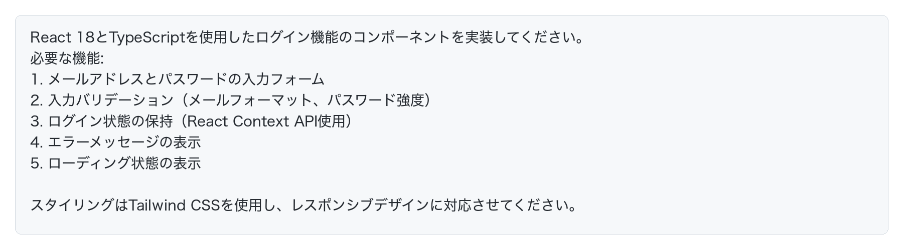

### 2. コンテキストの提供

AIはあなたのプロジェクトを知りません。関連する背景情報を提供することで、より適切な回答を得られます。

**改善前**：

**改善後**：
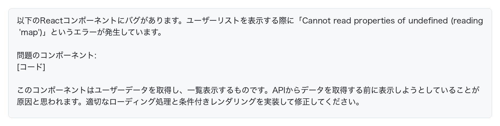

### 3. 出力形式の指定

AIにどのような形式で回答して欲しいかを明示することで、より使いやすい結果を得られます。

## プロンプトのチューニング手法

### 1. 反復的なフィードバックループ

プロンプトは一度で完璧にする必要はありません。以下のサイクルを繰り返すことで最適化できます。

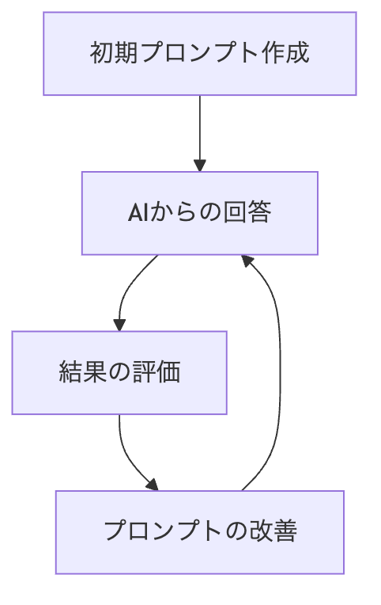

**実践例**：
1. 初期プロンプトを送信
2. AIの回答を確認し、足りない点や問題点を特定
3. フィードバックを含めて追加質問や指示を出す
4. より良い回答が得られるまで繰り返す

### 2. ロールプレイの活用

AIに特定の役割を与えることで、その専門性に基づいた回答を得られます。

**改善前**：

**改善後**：

### 3. 例示の活用（Few-shot learning）

AIに期待する出力形式や質を具体例として示すことで、より適切な回答を引き出せます。

**改善前**：

**改善後**：
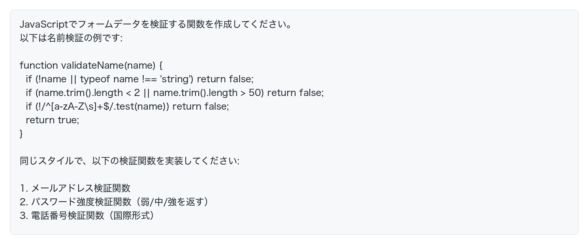

### 4. チェーン・オブ・ソート（Chain-of-Thought）

複雑な問題は、段階的に思考プロセスを展開するよう指示することで、より優れた結果を得られます。

**改善前**：
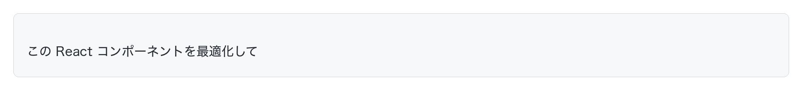

**改善後**：
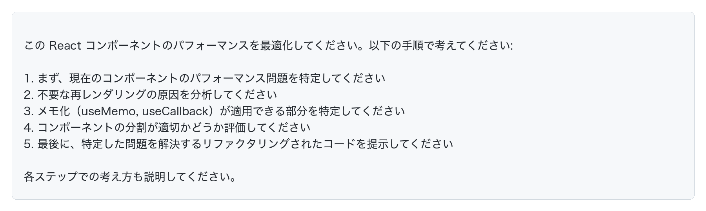

## プロンプトの構造化テンプレート

効果的なプロンプトには一定のパターンがあります。以下のテンプレートを活用し、自分のニーズに合わせてカスタマイズしましょう。

### コード生成テンプレート

### デバッグテンプレート

[完全なエラーメッセージ]

[問題のあるコード]
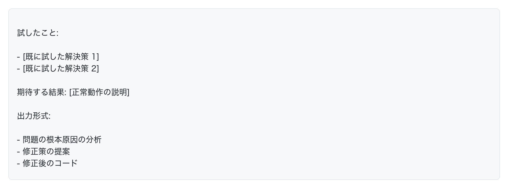

## プロンプト最適化の高度なテクニック

### 1. A/Bテスト

異なる表現や構造のプロンプトを試し、どれが最良の結果をもたらすか比較する方法です。

**手順**：
1. 同じ質問に対して異なる表現や構造のプロンプトを複数用意
2. それぞれのプロンプトをAIに送信
3. 結果を評価し、最も効果的なプロンプトを特定
4. 特定したパターンを今後のプロンプト作成に活用

### 2. プロンプトの組み合わせ

複数の質問を一度に行うのではなく、段階的に質問することで、より質の高い結果を得られます。

**例**：
1. まず、問題の分析を依頼
2. 次に、解決策の提案を依頼
3. 最後に、実装コードの生成を依頼

### 3. プロンプト・エンジニアリング・パターン

効果的なパターンを認識し、再利用することでプロンプトの質を向上させます。

#### パターン例：転写力（Translation）

一つの形式から別の形式へ変換する際に効果的です。

**具体例**：
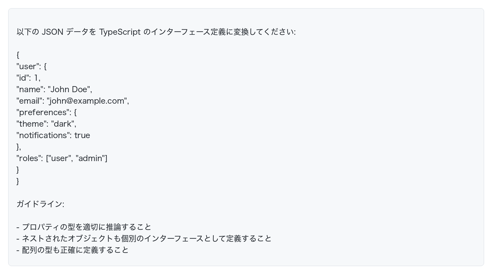

#### パターン例：ペルソナ・シフト（Persona Shift）

AIに特定のペルソナを与えることで、より専門的な回答を得られます。

**具体例**：

## コード開発のための特殊なプロンプト技術

### 1. テスト駆動プロンプト（TDP）

テスト駆動開発（TDD）をAIプロンプトに応用する手法です。

**手順**：
1. まず、機能の要件とテストケースを定義したプロンプトを作成
2. AIにテストが通るコードを生成してもらう
3. 必要に応じてテストケースを追加・修正し、コードを改善

**例**：

test("validatePassword should reject passwords shorter than 8 characters", () => {
  expect(validatePassword("short")).toBe(false);
});

test("validatePassword should reject passwords without numbers", () => {
  expect(validatePassword("onlyletters")).toBe(false);
});

test("validatePassword should reject passwords without letters", () => {
  expect(validatePassword("12345678")).toBe(false);
});

test("validatePassword should accept passwords with letters, numbers and minimum length", () => {
  expect(validatePassword("good1pass")).toBe(true);
});

### 2. 段階的抽象化（Progressive Abstraction）

複雑な問題を扱う際に、徐々に抽象度を上げていく方法です。

**手順**：
1. まず具体的な実装の詳細について質問
2. 次に設計パターンやアーキテクチャについて質問
3. 最後に高レベルの概念や原則について質問

**例**：
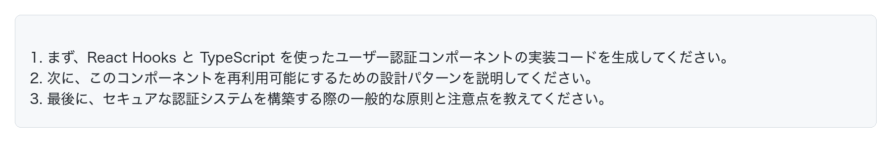

### 3. リファクタリング誘導（Refactoring Guidance）

既存のコードを改善するための段階的な指示を出す方法です。

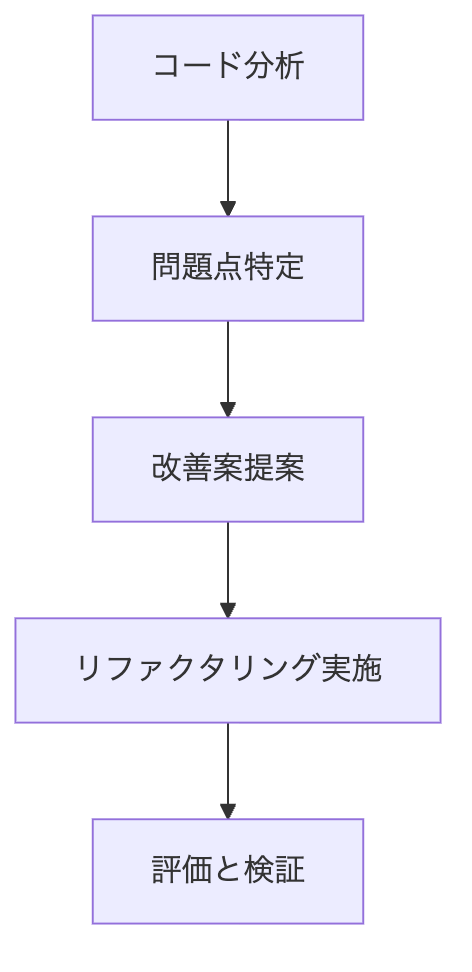

以下のReactコンポーネントをリファクタリングしてください:

[コード]

リファクタリングのステップ:
1. コードの問題点を分析して列挙してください
2. 各問題に対する改善案を提案してください
3. リファクタリング後のコードを生成してください
4. 改善点と期待される効果を説明してください
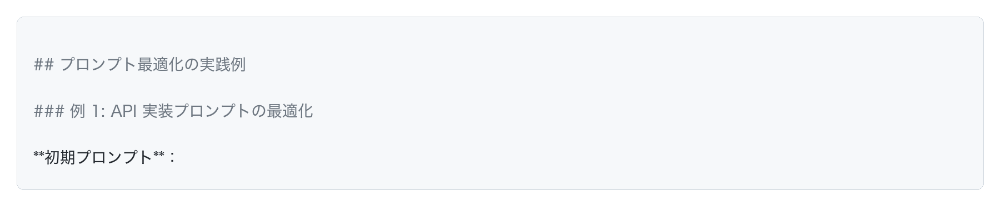
Express APIを作ってください

Node.js 16とExpress 4.18を使用して、ユーザー管理のRESTful APIを実装してください。

必要なエンドポイント:
1. ユーザー登録 (POST /api/users)
2. ユーザーログイン (POST /api/auth/login)
3. ユーザー情報取得 (GET /api/users/:id)
4. ユーザー情報更新 (PUT /api/users/:id)
5. ユーザー削除 (DELETE /api/users/:id)

技術要件:
- TypeScriptの使用
- MongoDBとMongooseでのデータ保存
- JWT認証の実装
- エラーハンドリングの徹底
- 入力バリデーション (express-validator使用)

追加情報:
- ユーザーモデルには、name, email, password, roleフィールドが必要
- パスワードはbcryptでハッシュ化
- APIレスポンスはJSONフォーマット
- セキュリティのベストプラクティスに従う (OWASP)

出力形式:
1. プロジェクト構造の説明
2. 各ファイルのコード
3. APIの使用例 (curlコマンド)
4. セットアップと実行手順

このバグを直して
[コード]

以下のReactコンポーネントでバグが発生しています:

[コード]
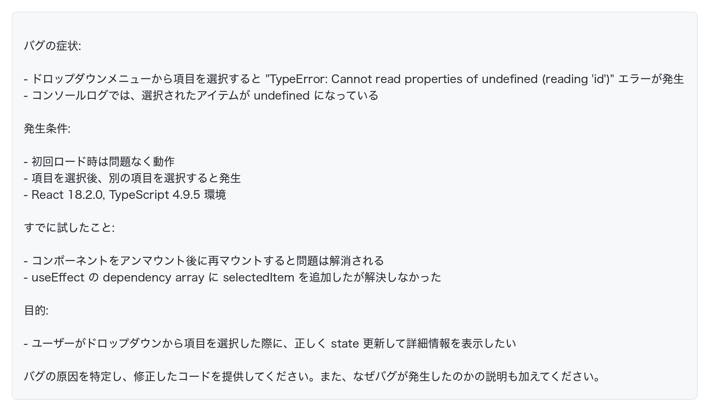

## プロンプト最適化のためのチェックリスト

効果的なプロンプトを作成する際は、以下のチェックリストを活用しましょう:

- [ ] **明確さと具体性**: 指示は明確で具体的か
- [ ] **コンテキスト**: 必要な背景情報を提供しているか
- [ ] **技術情報**: 使用言語、フレームワーク、バージョンを明記しているか
- [ ] **出力形式**: 期待する回答の形式を指定しているか
- [ ] **制約条件**: 守るべき制約や条件を明示しているか
- [ ] **例示**: 必要に応じて例を提供しているか
- [ ] **構造化**: 情報が整理されて提示されているか
- [ ] **専門性**: 適切なロールやペルソナを指定しているか
- [ ] **段階的思考**: 複雑な問題には思考手順を指示しているか
- [ ] **フィードバック**: 以前の回答の問題点を指摘しているか

## まとめ

プロンプトのチューニングと最適化は、AI駆動開発の効率と品質を大きく左右します。以下のポイントを意識しましょう:

1. **明確かつ具体的な指示**: AIに何を求めているかを具体的に伝えましょう
2. **コンテキストの提供**: 関連する背景情報を包括的に提供しましょう
3. **構造化されたプロンプト**: テンプレートを活用し、情報を整理しましょう
4. **反復的な改善**: 一度で完璧を求めず、フィードバックを通じて改善しましょう
5. **高度な技術の活用**: ロールプレイ、例示、チェーン・オブ・ソートなどを状況に応じて使いましょう

プロンプトエンジニアリングは実践を通じて上達するスキルです。様々な技術を試し、効果的なパターンを発見することで、より質の高いAI駆動開発が実現できます。
