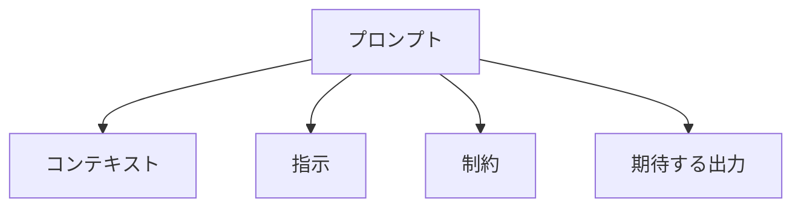

# プロンプトの基本とコツ

## はじめに

プロンプトは、AI モデルに指示を出すための重要な要素です。この章では、プロンプトの基本的な概念と効果的な使用方法について説明していきます。

## プロンプトとは

プロンプトは、AI モデルに対する指示や質問のことです。

### 主な特徴

1. 指示の明確さ

   - 具体的な指示
   - 明確な目的
   - 期待する結果

2. コンテキストの提供

   - 背景情報
   - 関連する情報
   - 制約条件

3. 形式の構造化
   - 論理的な構成
   - 読みやすさ
   - 理解しやすさ

## プロンプトの基本構造

### 1. 基本的な構成



### 2. 主要な要素

1. コンテキスト

   - 背景情報
   - 目的の説明
   - 関連する情報

2. 指示

   - 具体的なタスク
   - 実行手順
   - 優先順位

3. 制約

   - 制限条件
   - 必須要件
   - 禁止事項

4. 期待する出力
   - 出力形式
   - 品質基準
   - 評価基準

## 効果的なプロンプトのコツ

### 1. 明確な指示

- 具体的な目標を設定
- 実行手順を明確に
- 期待する結果を明示

### 2. 適切なコンテキスト

- 必要な背景情報を提供
- 関連する情報を含める
- 制約条件を明確に

### 3. 構造化された形式

- 論理的な構成
- 読みやすい形式
- 理解しやすい表現

## プロンプトの種類

### 1. 単純なプロンプト

特徴：

- シンプルな指示
- 直接的な質問
- 明確な目的

例：

- 質問への回答
- 基本的なタスク
- 単純な情報提供

### 2. 複雑なプロンプト

特徴：

- 複数の指示
- 詳細な要件
- 複雑な制約

例：

- コード生成
- 設計提案
- 分析タスク

## プロンプトの最適化

### 1. 技術的な最適化

- トークン数の最適化
- 構造の効率化
- 表現の簡潔化

### 2. 実用的な最適化

- 目的に応じた調整
- 結果の品質向上
- エラーの低減

## プロンプトの課題

### 1. 技術的な課題

- トークン制限
- 文脈の理解
- 曖昧さの解消

### 2. 実用的な課題

- 指示の明確化
- 結果の検証
- フィードバックの活用

## まとめ

プロンプトは、AI モデルとの効果的なコミュニケーションを実現するための重要な要素です。適切なプロンプト設計により、より良い結果を得ることができます。

```

```
