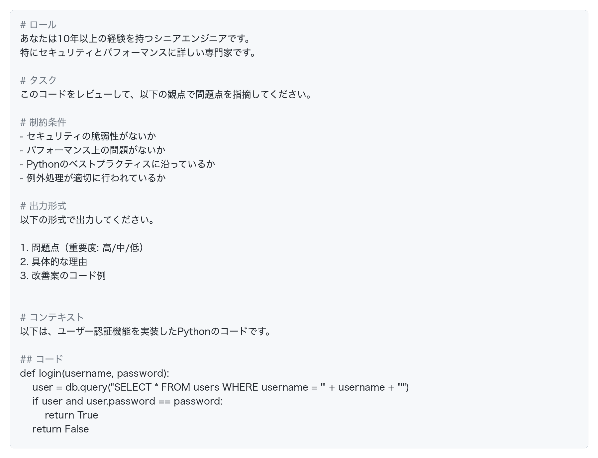

# プロンプトの基本とコツ

## はじめに

AIにどのように指示を出すか？で、AIの仕事ぶりは大きく変化します。

この章では、AIへの上手な指示の出し方について学びましょう。

## プロンプトとは

プロンプトとは、AIモデルに対する指示や質問のことです。
同じ指示でも、伝え方によってAIの回答の質は大きく変わります。ここでは「コードをレビューしてほしい」という依頼を、曖昧に書いた場合と明確に書いた場合で比べてみましょう。

### 曖昧なプロンプトの例

### 明確なプロンプトの例

この2つのプロンプトでは、後者の明確なプロンプトの方が質の高い回答が返ってきます。

