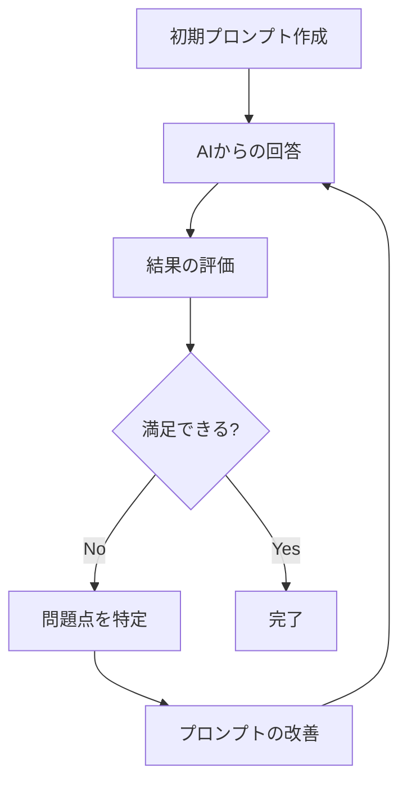

# プロンプトの最適化テクニック

AI駆動開発では、AIに対する指示（プロンプト）の質が、そのまま開発の生産性と品質に直結します。同じ機能を実装する場合でも、プロンプトの書き方次第で、AIからの回答の質は大きく変わります。

このページでは、プロンプトの効果を最大化するための高度なテクニックを解説します。基本的な指示の出し方を理解した上で、さらに一歩進んだ最適化手法を学びましょう。

## プロンプト最適化の意義

プロンプトを最適化することで、以下のような効果が得られます。

**1. 作業時間の短縮**

最適化されたプロンプトは、AIから一度で正確な回答を引き出します。修正や再指示の繰り返しが減り、開発スピードが向上します。

**2. コード品質の向上**

詳細で構造化されたプロンプトは、エッジケースを考慮した、より堅牢なコードを生成します。バグの発生を未然に防ぐことができます。

**3. 学習効果の最大化**

効果的なプロンプトパターンを習得することで、AIから得られる知識や洞察の質が向上します。単なるコード生成だけでなく、技術的な理解も深まります。

**4. コストの削減**

無駄なやり取りが減ることで、トークン消費量が減少し、API利用料金を節約できます。

## 反復的なフィードバックループ

プロンプトは一度で完璧にする必要はありません。むしろ、反復的に改善していくプロセスこそが重要です。

### フィードバックループの仕組み



このサイクルを回すことで、AIの理解を深め、より精度の高い回答を引き出せます。

### 実践例：API実装の最適化プロセス

**第1回：初期プロンプト**

```
Express APIを作ってください
```

AIの回答：基本的なサーバーのコードのみが生成される。認証やエラーハンドリングが不足。

**第2回：フィードバックを反映**

```
Express APIを作ってください。
JWT認証とエラーハンドリングを含めてください。
```

AIの回答：認証とエラーハンドリングが追加されるが、エンドポイントの詳細が曖昧。

**第3回：さらに詳細化**

```
Node.js 16とExpress 4.18を使用して、ユーザー管理のRESTful APIを実装してください。

必要なエンドポイント：
1. ユーザー登録 (POST /api/users)
2. ユーザーログイン (POST /api/auth/login)
3. ユーザー情報取得 (GET /api/users/:id)
4. ユーザー情報更新 (PUT /api/users/:id)
5. ユーザー削除 (DELETE /api/users/:id)

技術要件：
- TypeScriptの使用
- MongoDBとMongooseでのデータ保存
- JWT認証の実装
- エラーハンドリングの徹底
- 入力バリデーション (express-validator使用)

追加情報：
- ユーザーモデルには、name, email, password, roleフィールドが必要
- パスワードはbcryptでハッシュ化
- APIレスポンスはJSONフォーマット
- セキュリティのベストプラクティスに従う (OWASP)
```

AIの回答：完全で実用的なAPIコードが生成される。

このように、段階的に改善することで、最終的に高品質な結果を得られます。

### フィードバックのポイント

**1. 具体的な問題点を指摘する**

```
❌ 曖昧：「もっと良くして」

✅ 具体的：「パスワードのバリデーションが弱いです。
最低8文字、大文字・小文字・数字を含む条件を追加してください」
```

**2. 期待する動作を明示する**

```
❌ 曖昧：「エラーハンドリングを追加」

✅ 具体的：「以下のエラーを処理してください：
- 400: バリデーションエラー（フィールドごとのエラーメッセージ）
- 401: 認証エラー（トークン無効・期限切れ）
- 404: リソースが見つからない
- 500: サーバーエラー（詳細はログに記録、ユーザーには汎用メッセージ）」
```

**3. 良かった点も伝える**

```
「エラーハンドリングの実装は素晴らしいです。
ただし、ログイン失敗時のレート制限も追加してください（5回失敗で15分ロック）」
```

良かった点を伝えることで、AIはどの方向性が正しいかを学習します。

## ロールプレイの活用

AIに特定の役割や専門性を与えることで、その分野に特化した質の高い回答を得られます。これは「ペルソナシフト」とも呼ばれる手法です。

### 改善前 vs 改善後の例

**例1：セキュリティレビュー**

❌ **改善前：**

```
このコードのセキュリティ問題を指摘して
```

この指示では、一般的なセキュリティチェックしか行われません。

✅ **改善後：**

```
あなたはセキュリティの専門家です。
以下のNode.js/Expressコードを分析し、OWASP Top 10に関連するセキュリティ脆弱性を特定してください。

各脆弱性について、以下を含めて説明してください：
1. 脆弱性の種類（OWASP分類）
2. 重大度（Critical/High/Medium/Low）
3. 潜在的なリスク（攻撃者が何をできるか）
4. 具体的な修正方法（コード例付き）
5. 追加のセキュリティ対策の推奨事項

[コード]
```

この指示では、専門的で網羅的なセキュリティレビューが得られます。

**例2：パフォーマンス最適化**

❌ **改善前：**

```
このコードを高速化して
```

✅ **改善後：**

```
あなたはパフォーマンス最適化の専門家です。
以下のReactコンポーネントを分析し、最適化の機会を特定してください。

分析の観点：
1. 不要な再レンダリングの特定
2. メモ化（useMemo、useCallback）の適用箇所
3. コンポーネント分割の最適化
4. 重い計算処理の特定と最適化
5. バンドルサイズへの影響

各最適化について：
- 現在の問題点
- 改善後の期待効果（定量的に）
- 実装コード例
- トレードオフ（あれば）

を説明してください。

[コード]
```

**例3：リファクタリング**

❌ **改善前：**

```
このコードをきれいにして
```

✅ **改善後：**

```
あなたは経験豊富なシニアエンジニアです。
以下のコードをリファクタリングして、保守性を向上させてください。

リファクタリングの方針：
1. 関数の責任を明確に分離（Single Responsibility Principle）
2. 重複コードの排除（DRY原則）
3. 適切な命名（変数名、関数名を自己説明的に）
4. 複雑な条件分岐の簡素化
5. エラーハンドリングの統一

既存のテストは全て通る必要があります。
各変更について、なぜその変更が必要かを説明してください。

[コード]
```

### 効果的なロールの設定方法

**1. 専門分野を明確に**

```
あなたは[専門分野]の専門家です
```

例：
- セキュリティの専門家
- フロントエンドパフォーマンスの専門家
- データベース設計のスペシャリスト
- テスト自動化のエキスパート

**2. 経験レベルを指定**

```
あなたは10年の経験を持つシニアバックエンド開発者です
```

経験レベルを指定することで、より実践的で深い知見を引き出せます。

**3. 特定の観点を指示**

```
本番環境へのデプロイという観点から分析してください
```

特定の文脈を与えることで、焦点を絞った分析が得られます。

## 例示の活用（Few-shot learning）

AIに期待する出力形式や質を具体例として示すことで、より適切な回答を引き出せます。これは「Few-shot learning（少数例学習）」と呼ばれる手法です。

### 基本パターン

**構造：**

1. 期待する出力の例を1〜3個示す
2. 同じパターンで実装して欲しい内容を指示する

### 実践例1：バリデーション関数

❌ **改善前：**

```
JavaScriptでデータ検証関数を作成して
```

✅ **改善後：**

````
JavaScriptでフォームデータを検証する関数を作成してください。
以下は名前検証の例です：

```javascript
/**
 * ユーザー名が有効かどうかを検証する
 * @param {string} name - 検証する名前
 * @returns {boolean} 名前が有効な場合はtrue、そうでない場合はfalse
 */
function validateName(name) {
  if (!name || typeof name !== 'string') return false;
  if (name.trim().length < 2 || name.trim().length > 50) return false;
  if (!/^[a-zA-Z\s]+$/.test(name)) return false;
  return true;
}
```

同じスタイル（JSDoc、型チェック、範囲チェック、パターンチェック）で、
以下の検証関数を実装してください：

1. メールアドレス検証関数（validateEmail）
   - RFC 5322準拠のメールアドレス形式
   - 最大254文字

2. パスワード強度検証関数（validatePassword）
   - 8文字以上
   - 大文字、小文字、数字を各1文字以上含む
   - 戻り値：'weak' | 'medium' | 'strong'

3. 電話番号検証関数（validatePhone）
   - 国際形式（+81-90-1234-5678など）
   - ハイフンはあってもなくてもOK
````

このように例を示すことで、AIは期待される：
- コードスタイル
- ドキュメンテーションの形式
- エラーチェックの厳密さ
- 命名規則

を正確に理解します。

### 実践例2：APIレスポンスの形式統一

❌ **改善前：**

```
REST APIのエンドポイントを作成して
```

✅ **改善後：**

````
REST APIのエンドポイントを作成してください。
レスポンス形式は以下の例に従ってください：

**成功時の例：**

```json
{
  "success": true,
  "data": {
    "id": 123,
    "name": "田中太郎",
    "email": "tanaka@example.com"
  },
  "message": "ユーザー情報を取得しました"
}
```

**エラー時の例：**

```json
{
  "success": false,
  "error": {
    "code": "VALIDATION_ERROR",
    "message": "入力内容に誤りがあります",
    "details": [
      {
        "field": "email",
        "message": "有効なメールアドレスを入力してください"
      }
    ]
  }
}
```

この形式で、以下のエンドポイントを実装してください：
1. POST /api/users - ユーザー作成
2. GET /api/users/:id - ユーザー取得
3. PUT /api/users/:id - ユーザー更新
4. DELETE /api/users/:id - ユーザー削除
````

### 実践例3：テストコードのパターン

````
以下のテストパターンに従って、UserService のテストを作成してください：

```javascript
describe('AuthService', () => {
  describe('login', () => {
    it('正しい認証情報でログイン成功', async () => {
      // Arrange
      const email = 'test@example.com';
      const password = 'password123';

      // Act
      const result = await authService.login(email, password);

      // Assert
      expect(result.success).toBe(true);
      expect(result.token).toBeDefined();
    });

    it('間違ったパスワードでログイン失敗', async () => {
      // Arrange
      const email = 'test@example.com';
      const password = 'wrongpassword';

      // Act & Assert
      await expect(
        authService.login(email, password)
      ).rejects.toThrow('認証に失敗しました');
    });
  });
});
```

同じパターン（Arrange-Act-Assert、日本語の説明）で、
UserService の以下のメソッドのテストを作成してください：
- createUser
- getUserById
- updateUser
- deleteUser
````

### Few-shot learningのコツ

**1. 例の数は1〜3個が最適**

例が多すぎると、かえってAIが混乱します。代表的なパターンを1〜3個示せば十分です。

**2. エッジケースも例示する**

正常系だけでなく、異常系の例も含めると、より堅牢なコードが生成されます。

**3. コメントで意図を明示**

例の中にコメントを含めることで、なぜそのような実装になっているかを伝えられます。

## チェーン・オブ・ソート（Chain-of-Thought）

複雑な問題を解決する際は、AIに段階的に思考させることで、より質の高い回答を得られます。これは「思考の連鎖」とも呼ばれる手法です。

### 基本原理

人間が問題を解決する際、いきなり答えを出すのではなく、段階的に考えます。AIにも同じプロセスを踏ませることで、より論理的で正確な回答を引き出せます。


### 実践例1：パフォーマンス最適化

❌ **改善前：**

```
この React コンポーネントを最適化して
```

✅ **改善後：**

```
この React コンポーネントのパフォーマンスを最適化してください。
以下の手順で段階的に考えてください：

ステップ1：現状分析
- 現在のコンポーネントのレンダリング頻度を分析してください
- 不要な再レンダリングが発生している箇所を特定してください

ステップ2：問題の特定
- 各問題がパフォーマンスに与える影響を評価してください
- 優先度の高い問題から順にリストアップしてください

ステップ3：メモ化の検討
- useMemo が適用できる計算処理を特定してください
- useCallback が適用できるコールバック関数を特定してください
- React.memo が適用できる子コンポーネントを特定してください

ステップ4：コンポーネント分割
- 責任が混在している部分を特定してください
- どのように分割すべきか提案してください

ステップ5：最適化の実装
- 特定した問題を解決する最適化されたコードを提示してください
- 各最適化の期待効果を説明してください

各ステップでの考え方と根拠も説明してください。

[コード]
```

このように段階を明示することで、AIは：
1. 問題を体系的に分析
2. 優先順位を考慮
3. 複数の最適化手法を検討
4. 最適な解決策を導出

というプロセスを踏みます。

### 実践例2：バグの原因究明

❌ **改善前：**

```
このバグを修正して
```

✅ **改善後：**

````
以下のコードでバグが発生しています。段階的に原因を特定し、修正してください：

```javascript
[バグのあるコード]
```

**発生している症状：**
ユーザーがログインボタンをクリックすると、
"Cannot read properties of null (reading 'id')" エラーが発生します。

**段階的な分析手順：**

ステップ1：エラーメッセージの分析
- エラーメッセージから何がわかりますか？
- どの変数がnullになっている可能性がありますか？

ステップ2：コードフローの追跡
- ログインボタンクリックから、エラー発生までの処理の流れを説明してください
- どの時点で問題が発生している可能性が高いですか？

ステップ3：根本原因の特定
- なぜその変数がnullになっているのですか？
- タイミングの問題ですか？それとも条件分岐の問題ですか？

ステップ4：修正方法の検討
- 考えられる修正方法を複数提示してください
- それぞれのメリット・デメリットを説明してください

ステップ5：修正の実装
- 最適な修正方法を選択し、コードを提示してください
- 同様のバグを防ぐための追加の対策も提案してください

各ステップでの思考プロセスを明示してください。
````

### 実践例3：アーキテクチャ設計

```
新しいマイクロサービスのアーキテクチャを設計してください。
以下の手順で段階的に検討してください：

ステップ1：要件の分析
- 機能要件から必要なサービスを洗い出してください
- 各サービスの責任範囲を明確にしてください

ステップ2：サービス間の依存関係
- サービス間の通信パターンを特定してください
- 同期通信と非同期通信をどう使い分けるか検討してください

ステップ3：データ管理戦略
- 各サービスのデータベースをどう分割するか検討してください
- データの整合性をどう保つか検討してください

ステップ4：スケーラビリティとレジリエンス
- どのサービスがスケールする必要がありますか？
- 障害発生時の対策（Circuit Breaker、Retryなど）を検討してください

ステップ5：アーキテクチャ図と実装指針
- 最終的なアーキテクチャを図で示してください
- 実装時の注意点をまとめてください

各ステップで考慮した点と意思決定の理由を説明してください。
```

### Chain-of-Thoughtを使うべき場面

**適している場面：**
- 複雑なバグの原因究明
- アーキテクチャ設計
- パフォーマンス最適化
- セキュリティ監査
- 既存コードの大規模リファクタリング

**適していない場面：**
- 単純なコード生成（ボイラープレート）
- 明確な正解がある簡単な質問
- 迅速な回答が必要な場合

## プロンプトテンプレート集

効果的なプロンプトには一定のパターンがあります。以下のテンプレートを活用し、自分のニーズに合わせてカスタマイズしましょう。

### コード生成テンプレート

```
役割: [専門分野]の開発者
タスク: [機能の詳細]を実装してください
コンテキスト: [プロジェクトの背景情報、使用技術、制約条件]

技術要件:
- [使用する言語/フレームワーク/ライブラリ]
- [バージョン情報]
- [コーディング規約や特定のパターン]

機能要件:
- [要件 1]
- [要件 2]
- [要件 3]

制約条件:
- [パフォーマンス要件]
- [セキュリティ要件]
- [互換性要件]

出力形式:
1. 実装コード（コメント付き）
2. 使用方法の説明
3. テスト例
4. 注意事項

[必要に応じて具体例を提示]
```

**使用例：**

```
役割: フロントエンドエンジニア
タスク: 再利用可能なモーダルコンポーネントを実装してください
コンテキスト: React + TypeScript のプロジェクトで使用します。
複数の画面で様々な用途に使用できる汎用的なモーダルが必要です。

技術要件:
- React 18 + TypeScript
- TailwindCSS でスタイリング
- アクセシビリティ対応（ARIA属性）
- ポータルを使用してbodyの直下にレンダリング

機能要件:
- 開閉制御（制御コンポーネント）
- カスタマイズ可能なタイトル、コンテンツ、フッター
- オーバーレイクリックで閉じる（オプション）
- ESCキーで閉じる
- フォーカストラップ（モーダル内でタブ移動）
- アニメーション（フェードイン・アウト）

制約条件:
- バンドルサイズを最小限に（外部ライブラリ不使用）
- IE11は非対応でOK
- レスポンシブ対応必須

出力形式:
1. Modal.tsx のコード
2. useModal カスタムフック
3. 使用例（3パターン）
4. Props の型定義と説明
```

### デバッグテンプレート

```
役割: デバッグ専門家
問題: [バグの症状を具体的に]
コンテキスト: [発生状況、環境情報、再現手順]

エラー情報:
```
[完全なエラーメッセージ、スタックトレース]
```

関連コード:
```
[問題のあるコード]
```

環境情報:
- OS: [バージョン]
- 言語/ランタイム: [バージョン]
- フレームワーク: [バージョン]
- ブラウザ（該当する場合）: [バージョン]

試したこと:
- [既に試した解決策 1]
  結果: [どうなったか]
- [既に試した解決策 2]
  結果: [どうなったか]

期待する動作: [正常に動作した場合、どうなるべきか]

出力形式:
1. 問題の根本原因の分析
2. なぜそのエラーが発生するのかの説明
3. 修正方法（複数ある場合は比較）
4. 修正後のコード
5. 同様のバグを防ぐための推奨事項
```

**使用例：**

````
役割: デバッグ専門家
問題: Reactコンポーネントで無限ループが発生し、ブラウザがフリーズする
コンテキスト: ユーザープロフィール編集画面で、「保存」ボタンをクリックすると発生。
開発環境でもステージング環境でも再現。

エラー情報:
```
Warning: Maximum update depth exceeded. This can happen when a component
calls setState inside useEffect, but useEffect either doesn't have a
dependency array, or one of the dependencies changes on every render.
```

関連コード:
```typescript
function UserProfile() {
  const [user, setUser] = useState(null);
  const [formData, setFormData] = useState({});

  useEffect(() => {
    fetchUser().then(data => {
      setUser(data);
      setFormData(data);
    });
  }, [formData]); // 問題はここにある可能性

  const handleSave = () => {
    updateUser(formData);
  };

  return (/* JSX */);
}
```

環境情報:
- OS: macOS 14.0
- Node.js: 18.17.0
- React: 18.2.0
- TypeScript: 5.1.6
- ブラウザ: Chrome 118

試したこと:
- dependency arrayを空にする → useEffectが一度しか実行されず、データが更新されない
- dependency arrayにuserを追加 → 無限ループは解消されないまま

期待する動作:
初回レンダリング時にユーザーデータを取得し、フォームに表示。
ユーザーが編集して保存ボタンをクリックすると、APIにデータが送信される。

出力形式:
1. 問題の根本原因の分析
2. なぜ無限ループが発生するのかの説明
3. 修正方法（複数ある場合は比較）
4. 修正後のコード全体
5. 同様のバグを防ぐための推奨事項（React Hooksの使い方）
````

### リファクタリングテンプレート

```
対象: [ファイルパスまたはコンポーネント名]

現状の問題点:
- [問題点 1]
- [問題点 2]
- [問題点 3]

リファクタリングの目的:
- [可読性の向上 / 保守性の向上 / パフォーマンス改善 など]

改善方針:
1. [改善点 1]
2. [改善点 2]
3. [改善点 3]

制約:
- 既存のインターフェースは維持（破壊的変更なし）
- 既存のテストは全て通ること
- パフォーマンスは維持または向上すること
- [その他の制約]

対象コード:
```
[リファクタリング対象のコード]
```

出力形式:
1. 現状の詳細な分析
2. 各改善点の説明と期待効果
3. リファクタリング後のコード
4. 変更点のサマリー
5. テスト時の注意点
```

**使用例：**

````
対象: src/components/UserDashboard.tsx

現状の問題点:
- 1つのコンポーネントが500行を超えている
- ビジネスロジックとUI層が混在
- 複数の責任を持っている（データ取得、状態管理、UI表示）
- テストが困難（モック化できない）
- 似たようなコードが重複している

リファクタリングの目的:
- 保守性の向上（機能追加・修正を容易に）
- テスタビリティの向上
- コンポーネントの再利用性向上

改善方針:
1. カスタムフックでビジネスロジックを分離（useUserData, useUserStats）
2. UI コンポーネントを小さく分割（UserHeader, UserStats, UserActivity）
3. 重複コードを共通関数として抽出
4. propsの型定義を明確化
5. コンポーネントツリーを浅くする

制約:
- 既存のprops インターフェースは維持
- 既存の UserDashboard.test.tsx は全て通ること
- レンダリングパフォーマンスは低下させない
- 外部から見た動作は完全に同じであること

対象コード:
```typescript
[500行のコード]
```

出力形式:
1. 現状の詳細な分析（責任の分離、依存関係など）
2. リファクタリング後のディレクトリ構造
3. 各ファイルのコード（分割後）
4. 変更点のサマリー（Before/After比較）
5. 既存テストの修正が必要な箇所
````

## プロンプト最適化のためのチェックリスト

プロンプトを送信する前に、以下の項目を確認することで、質の高い回答を得やすくなります。

### 基本情報の確認

- [ ] **タスクの明確さ**: 何を実装/修正/分析するのかが明確か
- [ ] **技術スタックの指定**: 言語、フレームワーク、ライブラリ、バージョンを明記したか
- [ ] **ファイルパスの指定**: どこに配置するか、またはどのファイルを修正するか明記したか
- [ ] **出力形式の指定**: どのような形式で回答して欲しいか指定したか

### 詳細情報の確認

- [ ] **入力・出力の定義**: 関数の引数、戻り値、APIのリクエスト・レスポンスを明記したか
- [ ] **制約条件の明示**: パフォーマンス、セキュリティ、互換性の要件を明記したか
- [ ] **エラーハンドリング**: どのようなエラーを処理するか指定したか
- [ ] **エッジケースの考慮**: 特殊なケースや境界値について言及したか

### 品質向上のための確認

- [ ] **例示の提供**: 期待する出力の具体例を示したか（Few-shot learning）
- [ ] **ロールの設定**: 必要に応じてAIに専門的な役割を与えたか
- [ ] **段階的思考**: 複雑な問題では、思考手順を指示したか（Chain-of-Thought）
- [ ] **テストの言及**: テストコードや検証方法について言及したか

### コンテキスト管理の確認

- [ ] **関連コードの提示**: 既存のコードで関連する部分を提示したか
- [ ] **背景情報の提供**: なぜこの機能が必要か、どのような文脈で使われるか説明したか
- [ ] **優先順位の明示**: 複数の要件がある場合、優先順位を示したか

### フィードバックサイクルの確認

- [ ] **前回の問題点**: 以前の回答で不足していた点を指摘したか
- [ ] **良かった点**: 以前の回答で良かった点も伝えたか
- [ ] **改善の方向性**: どのように改善して欲しいか具体的に指示したか

## まとめ

プロンプトの最適化は、AI駆動開発の効率と品質を大きく左右する重要なスキルです。このページで紹介したテクニックを実践することで、AIとのコミュニケーションの質が飛躍的に向上します。

### 重要なポイント

**1. 反復的なフィードバックループ**
- 一度で完璧を求めない
- AIの回答を評価し、具体的なフィードバックを返す
- 段階的に改善していく

**2. ロールプレイの活用**
- AIに専門的な役割を与える
- 分析の観点や評価基準を明確にする
- 経験レベルや専門分野を指定する

**3. 例示の活用（Few-shot learning）**
- 期待する出力の具体例を1〜3個示す
- コードスタイル、形式、品質の基準を例で示す
- 正常系だけでなく異常系も例示する

**4. チェーン・オブ・ソート**
- 複雑な問題では段階的な思考を指示する
- 各ステップで考えるべきことを明示する
- 思考プロセスも説明させる

**5. テンプレートの活用**
- 効果的なパターンを再利用する
- 自分のプロジェクトに合わせてカスタマイズする
- チェックリストで品質を担保する

### 実践のために

プロンプト最適化は、実践を通じて上達するスキルです。最初は時間がかかるかもしれませんが、効果的なパターンを習得すれば、自然と質の高いプロンプトを書けるようになります。

まずは、このページで紹介したテンプレートを使ってみてください。そして、自分のプロジェクトで効果的だったパターンを記録し、再利用できるようにしておきましょう。

AIは強力なツールですが、その力を引き出すのは、あなたのプロンプトです。効果的な指示を出せるようになることで、AI駆動開発の真の価値を実感できるようになります。
