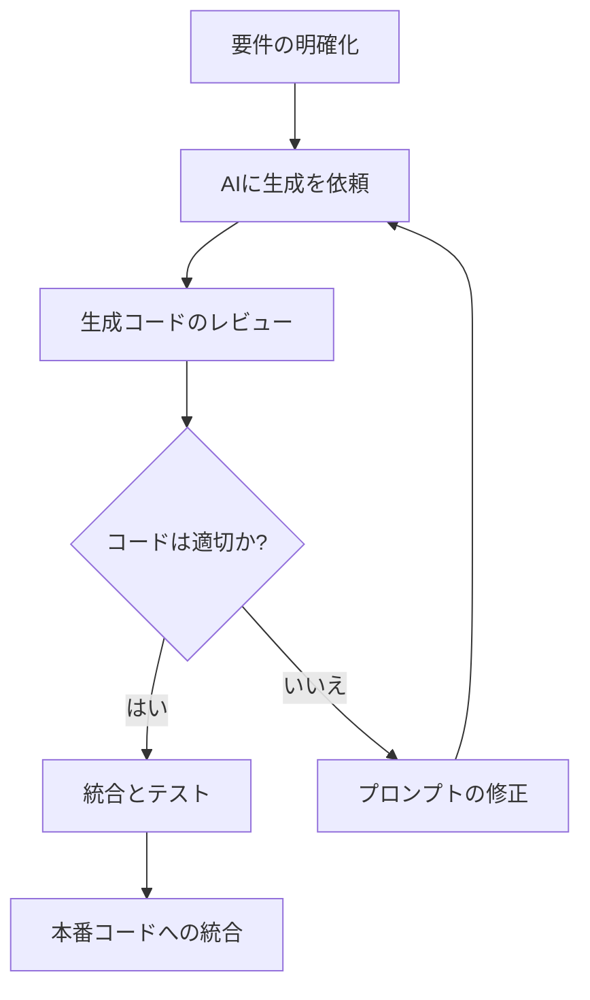
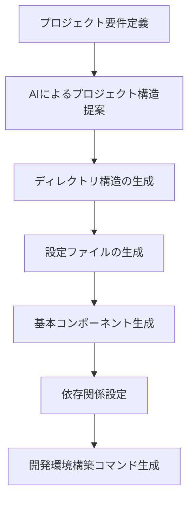

# ソースコード自動生成

ソフトウェア開発において「ソースコード」とは、ほとんど変更せずに繰り返し使用される定型的なコードのことを指します。これらのコードは必要ではあるものの、毎回手動で書くのは時間の無駄になりがちです。AI 駆動開発では、こうした退屈な作業を劇的に効率化できます。

## ソースコードとは

ソースコードの代表的な例としては以下のようなものがあります：

- 基本的な CRUD 操作（作成・読取・更新・削除）のコード
- データベース接続とクエリ処理
- フォームのバリデーション処理
- API エンドポイントの定義
- 標準的なファイル入出力処理
- クラスやインターフェースの基本構造
- プロジェクト設定ファイル

これらのコードは、アプリケーションの中核機能ではありませんが、システムが正常に動作するために不可欠な「土台」となる部分です。

## AI 駆動開発によるソースコード自動生成のメリット

AI を活用してソースコードを自動生成することで、以下のようなメリットが得られます：

1. **開発時間の大幅な短縮**：定型的なコードを書く時間を節約できます
2. **ミスの削減**：手動入力によるタイプミスやコピー＆ペーストのエラーを防止できます
3. **一貫性の確保**：プロジェクト全体で統一された書き方を維持できます
4. **本質的な機能開発への集中**：創造的な問題解決に時間を割けるようになります
5. **知識の補完**：不慣れなフレームワークやライブラリの標準的な使い方を学べます

## AI 駆動によるソースコード生成の実践例

### 例 1：React コンポーネントの自動生成

例えば、React コンポーネントを作成する場合を考えてみましょう。

```jsx
// 手動で書く場合のReactコンポーネント
import React, { useState, useEffect } from "react";
import PropTypes from "prop-types";
import "./UserProfile.css";

const UserProfile = ({ userId, onUpdate }) => {
  const [user, setUser] = useState(null);
  const [loading, setLoading] = useState(true);
  const [error, setError] = useState(null);

  useEffect(() => {
    const fetchUser = async () => {
      try {
        setLoading(true);
        const response = await fetch(`/api/users/${userId}`);
        if (!response.ok) {
          throw new Error("ユーザー情報の取得に失敗しました");
        }
        const data = await response.json();
        setUser(data);
        setError(null);
      } catch (err) {
        setError(err.message);
      } finally {
        setLoading(false);
      }
    };

    fetchUser();
  }, [userId]);

  const handleSubmit = async (event) => {
    event.preventDefault();
    // 更新処理
    onUpdate(user);
  };

  if (loading) return <div className="loading">読込中...</div>;
  if (error) return <div className="error">{error}</div>;
  if (!user) return <div className="no-data">ユーザーが見つかりません</div>;

  return (
    <div className="user-profile">
      <h2>{user.name}のプロフィール</h2>
      <form onSubmit={handleSubmit}>
        {/* フォーム要素 */}
        <button type="submit">更新</button>
      </form>
    </div>
  );
};

UserProfile.propTypes = {
  userId: PropTypes.string.isRequired,
  onUpdate: PropTypes.func.isRequired,
};

export default UserProfile;
```

このようなコンポーネントは、AI に対して「ユーザープロフィールを表示・編集する React コンポーネントを作成して」と指示するだけで、基本構造を自動生成できます。

### 例 2：SpringBoot の REST コントローラ自動生成

Java の SpringBoot フレームワークで REST コントローラを作成する場合：

```java
// AI生成によるSpring Bootのコントローラ
package com.example.demo.controller;

import com.example.demo.model.Product;
import com.example.demo.service.ProductService;
import org.springframework.beans.factory.annotation.Autowired;
import org.springframework.http.HttpStatus;
import org.springframework.http.ResponseEntity;
import org.springframework.web.bind.annotation.*;

import java.util.List;
import java.util.Optional;

@RestController
@RequestMapping("/api/products")
public class ProductController {

    private final ProductService productService;

    @Autowired
    public ProductController(ProductService productService) {
        this.productService = productService;
    }

    @GetMapping
    public ResponseEntity<List<Product>> getAllProducts() {
        List<Product> products = productService.findAll();
        return new ResponseEntity<>(products, HttpStatus.OK);
    }

    @GetMapping("/{id}")
    public ResponseEntity<Product> getProductById(@PathVariable Long id) {
        Optional<Product> product = productService.findById(id);
        return product.map(value -> new ResponseEntity<>(value, HttpStatus.OK))
                .orElseGet(() -> new ResponseEntity<>(HttpStatus.NOT_FOUND));
    }

    @PostMapping
    public ResponseEntity<Product> createProduct(@RequestBody Product product) {
        Product savedProduct = productService.save(product);
        return new ResponseEntity<>(savedProduct, HttpStatus.CREATED);
    }

    @PutMapping("/{id}")
    public ResponseEntity<Product> updateProduct(@PathVariable Long id, @RequestBody Product product) {
        if (!productService.existsById(id)) {
            return new ResponseEntity<>(HttpStatus.NOT_FOUND);
        }
        product.setId(id);
        Product updatedProduct = productService.save(product);
        return new ResponseEntity<>(updatedProduct, HttpStatus.OK);
    }

    @DeleteMapping("/{id}")
    public ResponseEntity<Void> deleteProduct(@PathVariable Long id) {
        if (!productService.existsById(id)) {
            return new ResponseEntity<>(HttpStatus.NOT_FOUND);
        }
        productService.deleteById(id);
        return new ResponseEntity<>(HttpStatus.NO_CONTENT);
    }
}
```

## AI によるソースコード生成の効果的なプロンプト例

AI にソースコードを生成してもらう際の効果的なプロンプト例を紹介します：

### 基本形

```
次のEntityに対するCRUDコントローラを作成してください：
- エンティティ名: Product
- フィールド: id (Long), name (String), price (Double), description (String)
- 使用フレームワーク: Spring Boot
- パッケージ名: com.example.demo
```

### より詳細な指定

```
Reactでユーザープロフィール編集コンポーネントを作成してください。
要件:
- TypeScriptを使用
- React Hooksを使用
- フォームはReact Hook Formで実装
- スタイルはTailwind CSSで適用
- ユーザー情報はREST APIから取得（エンドポイント: /api/users/:id）
- バリデーション：名前は必須、メールアドレスは形式チェック、電話番号は任意
- 送信成功/エラー時の状態管理を含める
```

## ソースコード自動生成のカスタマイズと改善

AI が生成したソースコードは、そのままでも使えますが、以下のようなカスタマイズを加えるとより良いコードになります：

1. **プロジェクト固有の命名規則への調整**
2. **コメントの追加・調整**
3. **エラーハンドリングの強化**
4. **テストケースの追加**
5. **パフォーマンス最適化**

例えば、生成されたコードに特定のロギング機能を追加したい場合：

```
このSpring Bootコントローラに、以下の機能を追加してください：
1. SLF4Jを使ったロギング
2. 全メソッドの実行時間をログに記録
3. 例外発生時のスタックトレースをデバッグレベルでログ出力
```

## ソースコード自動生成のワークフロー

効率的なソースコード生成のワークフロープロセスを図解します：



## プロジェクトテンプレートの自動生成

個別のファイルだけでなく、プロジェクト全体のテンプレート生成にも AI を活用できます：



## 実践的なヒント

1. **既存コードを参考に**: すでにプロジェクトに存在するコードのスタイルを AI に伝えることで、一貫性のあるコードを生成できます。

2. **段階的な生成**: 複雑なコードは一度に生成せず、基本構造を作ってから詳細を追加していくアプローチが効果的です。

3. **パターンライブラリの構築**: 頻繁に使うパターンのプロンプトを保存しておくと、次回からの生成が容易になります。

4. **コードレビュー**: 自動生成されたコードも必ず人間がレビューし、問題がないか確認しましょう。

5. **継続的な改善**: 生成したコードの品質を評価し、プロンプトを継続的に改善していきましょう。

## まとめ

ソースコードの自動生成は、AI 駆動開発の中でも特に効果がわかりやすい活用方法の一つです。定型的なコードを AI に任せることで、開発者はより創造的で価値の高い業務に集中できるようになります。

次のステップとして、自分のプロジェクトで頻繁に書いているソースコードを洗い出し、AI を使ってそれらを自動化する方法を考えてみましょう。特に新しいプロジェクトを始める際には、最初から AI を活用して基本的な部分を効率よく構築することで、大幅な時間短縮が期待できます。
