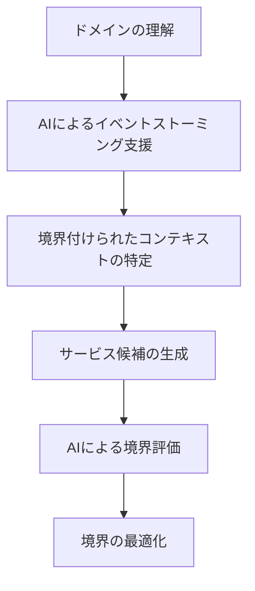
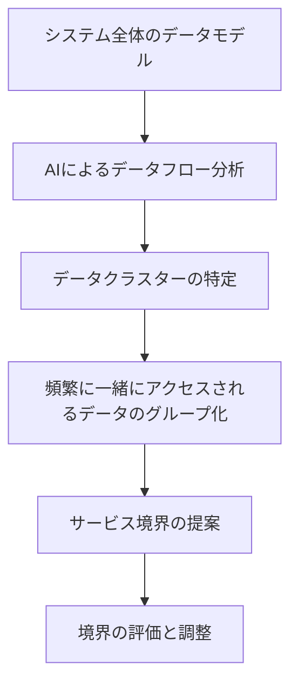
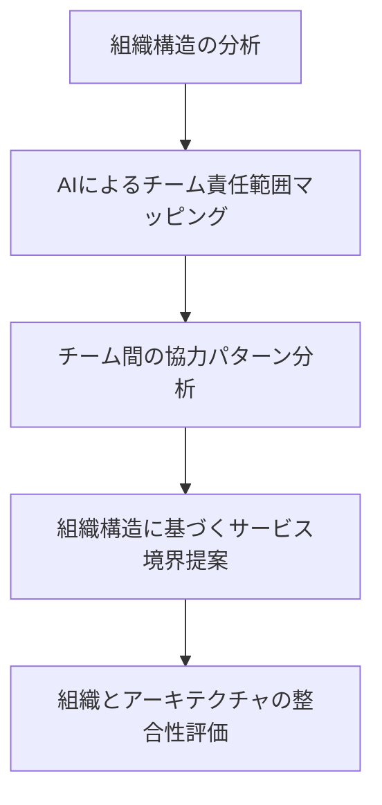
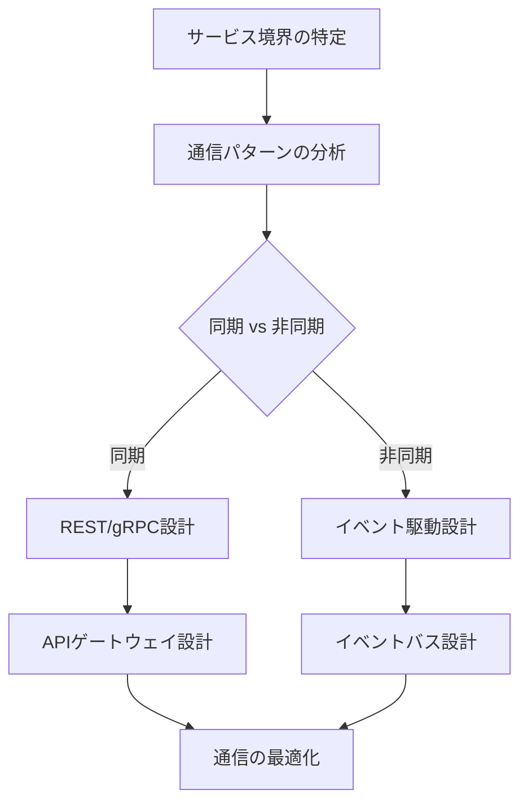
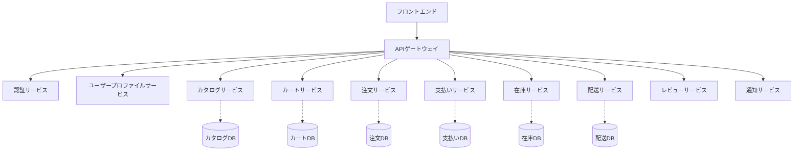
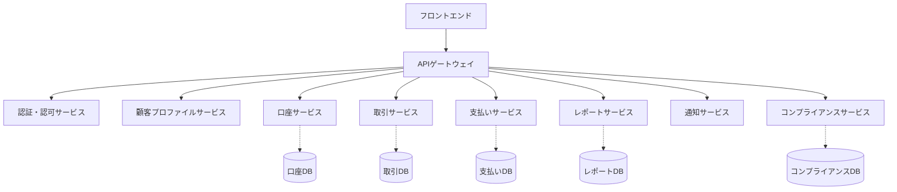
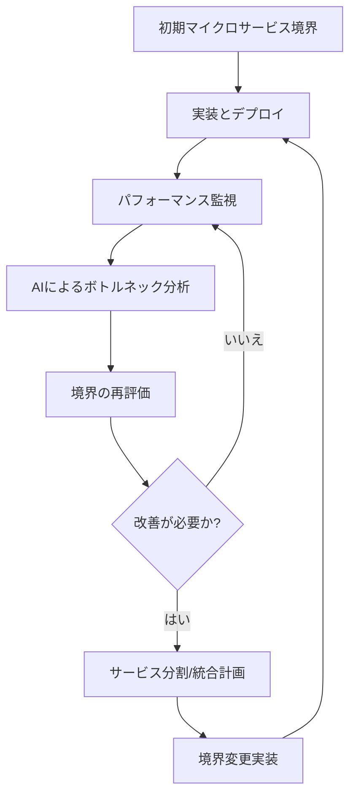

# マイクロサービス境界設計

マイクロサービスアーキテクチャの採用が増える中、最も難しい課題の一つが適切なサービス境界の設計です。サービスの境界を適切に設計することは、システムの保守性、拡張性、および全体的なパフォーマンスに大きな影響を与えます。AI駆動開発を活用することで、この境界設計をより効率的かつ効果的に行うことができるようになりました。

## マイクロサービス境界設計の基本

### マイクロサービスとは

マイクロサービスとは、一つの大きなアプリケーションを複数の小さな独立したサービスに分割するアーキテクチャスタイルです。各サービスは特定のビジネス機能に焦点を当て、独自のデータベースを持ち、他のサービスとは疎結合な形で連携します。

### 良い境界設計の特徴

効果的なマイクロサービス境界設計には、以下の特徴があります：

1. **高い凝集性**: 各サービスは明確に定義された単一の責任を持つ
2. **低い結合度**: サービス間の依存関係が少ない
3. **ビジネスドメインとの整合性**: ビジネスの構造や組織を反映している
4. **データの自律性**: 各サービスが自身のデータを管理できる
5. **独立したスケーラビリティ**: 各サービスが個別にスケールできる
6. **独立したデプロイ**: サービスごとに独立してデプロイが可能

### 一般的な境界設計の間違い

マイクロサービス設計でよく見られる問題点：

1. **過度な細分化**: サービスを小さくしすぎて管理オーバーヘッドが増加
2. **データの断片化**: 関連するデータが複数のサービスに分散しすぎる
3. **非効率なサービス間通信**: 頻繁な通信が必要な設計
4. **共有データベース**: 複数のサービスが同じデータベースを使用する
5. **アナミックサービス**: 明確な責任を持たない中途半端なサービス

## AIを活用した境界設計のアプローチ

AI駆動開発を用いてマイクロサービスの境界を設計する主なアプローチを紹介します。

### ドメイン駆動設計（DDD）と AI

ドメイン駆動設計はマイクロサービスの境界を定義するための強力なフレームワークを提供します。AIはこのプロセスを支援できます：



AIは以下のようなプロンプトで、DDD のコンセプトを活用した境界分析を支援できます：

```
以下のビジネスドメインについて、境界付けられたコンテキストを特定し、マイクロサービスの候補を提案してください：

ビジネスドメイン：ECサイト

主要な業務プロセス：
- ユーザー登録・認証
- 商品検索・閲覧
- カート管理
- 注文処理
- 支払い処理
- 在庫管理
- 配送管理
- レビュー・評価

各プロセスについて、主要なエンティティ、イベント、コマンドを特定し、境界付けられたコンテキストに整理してください。
また、各コンテキスト間の関係（パートナーシップ、顧客-サプライヤー、順応者など）も明示してください。
```

### データフロー分析アプローチ

システム内のデータの流れを分析することで、自然なサービス境界を見つけることができます：



AIを活用したデータフロー分析のプロンプト例：

```
以下のシステムのデータモデルとアクセスパターンを分析し、マイクロサービスの境界を提案してください：

[データモデル]
- ユーザー（ID, 名前, メール, パスワード, 住所, 電話番号）
- 商品（ID, 名前, 説明, 価格, カテゴリID, 在庫数）
- カテゴリ（ID, 名前, 親カテゴリID）
- 注文（ID, ユーザーID, 合計金額, 状態, 作成日, 支払い方法）
- 注文明細（ID, 注文ID, 商品ID, 数量, 単価）
- 支払い（ID, 注文ID, 金額, 状態, 支払い日）
- 配送（ID, 注文ID, 配送先住所, 配送状態, 追跡番号）
- レビュー（ID, ユーザーID, 商品ID, 評価, コメント, 投稿日）

[主要なアクセスパターン]
1. ユーザーログイン時：ユーザー情報の取得
2. 商品検索時：商品情報とカテゴリの取得
3. カート操作時：商品情報と在庫数の取得
4. 注文作成時：ユーザー情報、商品情報、在庫数の更新
5. 支払い処理時：注文情報、支払い情報の更新
6. 配送管理時：注文情報、配送情報の更新
7. レビュー投稿時：ユーザー情報、商品情報、レビュー情報の更新

データの凝集度と結合度を考慮し、適切なサービス境界を提案してください。また、各サービスに含まれるデータエンティティとその理由も説明してください。
```

### 組織構造分析（コンウェイの法則）

組織の構造がシステムの設計に影響するというコンウェイの法則を考慮したアプローチ：



AI駆動の組織構造分析プロンプト：

```
以下の組織構造に基づいて、マイクロサービスの境界設計を提案してください：

[開発チーム構成]
- ユーザー体験チーム：UI/UX設計、フロントエンド開発
- アカウント管理チーム：ユーザー登録、認証、プロファイル管理
- カタログチーム：商品管理、カテゴリ管理、検索機能
- 取引チーム：注文処理、カート機能、価格計算
- 在庫チーム：在庫管理、倉庫管理
- 決済チーム：支払い処理、請求書管理
- ロジスティクスチーム：配送管理、追跡機能
- データ分析チーム：レポート生成、ユーザー行動分析

各チームの責任範囲とチーム間の協力パターンを考慮して、マイクロサービスアーキテクチャの境界設計を提案してください。
コンウェイの法則に基づき、組織構造とシステム構造の整合性を最大化する設計を心がけてください。
```

## AIを活用したサービス境界の評価と最適化

設計したサービス境界の品質を評価し、最適化するための AI活用法を紹介します。

### 境界の評価基準

AIは以下の基準に基づいてサービス境界の評価を支援できます：

1. **凝集度スコア**: サービス内の機能とデータの関連性
2. **結合度スコア**: サービス間の依存関係の度合い
3. **自律性スコア**: サービスが独立して機能できる程度
4. **スケーラビリティ予測**: 負荷増大時の対応しやすさ
5. **変更容易性**: 要件変更に対応しやすいか
6. **デプロイ独立性**: 独立してデプロイできるか
7. **チーム整合性**: 開発チーム構造との整合性

### 境界最適化 AI分析プロンプト

```
以下のマイクロサービス設計案について、境界の最適性を評価し、改善案を提示してください：

[現在のサービス境界]
1. ユーザーサービス：ユーザー情報管理、認証、プロファイル
2. カタログサービス：商品情報、カテゴリ、検索
3. カートサービス：カート管理、品目追加/削除
4. 注文サービス：注文処理、注文履歴
5. 在庫サービス：在庫管理、在庫更新
6. 支払いサービス：支払い処理、請求
7. 配送サービス：配送管理、配送状況
8. レビューサービス：商品レビュー、評価

[サービス間データフロー]
- カートサービスは商品情報と在庫確認のためにカタログサービスと在庫サービスに頻繁にアクセス
- 注文サービスはカートサービス、ユーザーサービス、支払いサービスとのやり取りが多い
- 支払いサービスは注文サービスとのやり取りが多い
- 配送サービスは注文サービスと在庫サービスにアクセス
- レビューサービスはユーザーサービスとカタログサービスにアクセス

以下の観点から境界の最適性を評価し、改善案を提示してください：
1. 高凝集・低結合の原則に基づく評価
2. サービス間通信の頻度とオーバーヘッド
3. トランザクション管理の複雑さ
4. データの一貫性維持の難易度
5. スケーラビリティとパフォーマンスへの影響
```

### シナリオベーステスト

AIを活用して、さまざまなビジネスシナリオに対するサービス境界の適合性をテストできます：

```
以下のビジネスシナリオに対して、現在のマイクロサービス境界設計がどのように対応するか分析してください：

[マイクロサービス境界]
（前述のサービス境界設計を記載）

[ビジネスシナリオ]
1. 商品の在庫切れ時にユーザーが購入ボタンをクリックした場合
2. ユーザーが配送途中の注文をキャンセルしようとした場合
3. 特定カテゴリの全商品に対して10%割引キャンペーンを実施する場合
4. 新しい支払い方法（仮想通貨）を追加する場合
5. ユーザーが同じ商品を複数回レビューしようとした場合の重複チェック
6. 会員ランク制度を導入し、ランクによって送料や割引率を変更する場合

各シナリオについて：
1. データフローと処理の流れを説明
2. 必要なサービス間通信
3. 潜在的な問題点（レイテンシ、一貫性など）
4. 改善案（必要であれば）

を提示してください。
```

## マイクロサービス間の通信パターン設計

適切なサービス境界に加えて、サービス間の効果的な通信パターンの設計も重要です。AIはこれを支援できます：



AIプロンプト例：

```
以下のマイクロサービス構成において、最適な通信パターンを設計してください：

[サービス一覧]
（前述のサービス境界設計を記載）

各サービス間の通信に対して、以下を判断してください：
1. 同期通信（REST/gRPC）と非同期通信（メッセージキュー/イベント）のどちらが適切か
2. 適切な通信プロトコルとデータフォーマット
3. 再試行とフォールバック戦略
4. 通信エラーの処理方法

特に以下のケースに注目してください：
- 注文作成プロセスでの在庫確認と支払い処理
- 配送状況の更新と顧客への通知
- 商品情報の更新と関連サービスへの反映

また、サービスメッシュやAPIゲートウェイの活用方法についても提案してください。
```

## 実践的な境界設計ケーススタディ

### EC サイトのマイクロサービス境界設計

典型的な EC サイトのマイクロサービス境界設計例：



このような設計に至る AIとの対話プロセスの例：

```
ECサイトのマイクロサービス設計について、以下の要件に基づいて境界を提案してください：

[ビジネス要件]
- 商品カタログの管理と表示
- ユーザー登録・認証・プロファイル管理
- ショッピングカート機能
- 注文処理と履歴管理
- 複数の支払い方法対応
- リアルタイム在庫管理
- 配送追跡機能
- 商品レビュー・評価システム
- パーソナライズドレコメンデーション
- メールおよびプッシュ通知

[技術的制約]
- Kubernetesクラスタでの運用
- ポリグロットな言語・フレームワーク（Java、Node.js、Python）
- データベースも用途に応じて選択（PostgreSQL、MongoDB、Redis）
- メッセージングシステムとしてKafkaを使用
- APIゲートウェイによる外部からのアクセス一元化
```

### 金融システムのマイクロサービス境界設計

金融システムは、トランザクションの整合性が特に重要なドメインです：



このようなより複雑なドメインでの AIを活用した境界設計プロンプト：

```
金融機関のコアバンキングシステムをマイクロサービスアーキテクチャで再設計するための境界設計を提案してください。

[ビジネス要件]
- 顧客管理（個人・法人）
- 口座管理（普通、当座、定期預金、投資口座など）
- 取引処理（入金、出金、振込、引落など）
- ローン管理
- カード管理（デビット・クレジット）
- 外国為替
- 投資・証券取引
- 顧客向けオンラインバンキング
- モバイルバンキング
- コンプライアンス・監査対応
- リスク管理

[特別な考慮事項]
- 厳格なトランザクション整合性要件
- 高可用性（99.999%）要件
- 強固なセキュリティ要件
- 規制遵守（KYC、AML、GDPR等）
- レガシーシステムとの統合

これらの要件を踏まえた上で、以下を提供してください：
1. マイクロサービスの境界と責任範囲
2. サービス間のデータ共有の最適な方法
3. 整合性を保ちながら分散トランザクションを処理する方法
4. サービス間の通信パターン
5. 特に注意すべき設計上の課題とその対応策
```

## マイクロサービス境界の進化と保守

マイクロサービスの境界は固定されたものではなく、時間とともに進化していきます。AIを活用した境界の評価と改善の継続的なプロセスが重要です：



境界の進化を AIで支援するプロンプト：

```
以下の運用データに基づいて、現在のマイクロサービス境界の評価と改善案を提示してください：

[現在のサービス境界]
（前述のサービス境界設計を記載）

[運用メトリクス]
- サービス間の呼び出し頻度マトリックス
- 各サービスの平均レスポンスタイム
- 各サービスのCPU/メモリ使用率
- サービスごとのエラー率
- サービスごとのデプロイ頻度
- 各サービスの変更頻度と理由

[問題点]
- カートサービスと在庫サービス間の通信が頻繁で、レイテンシが高い
- 注文サービスがピーク時に過負荷になる
- 支払いサービスと注文サービス間で整合性の問題が時々発生する
- カタログサービスのデータサイズが急速に増大している

これらの情報を基に、以下を提案してください：
1. どのサービスを分割すべきか
2. どのサービスを統合すべきか
3. データの重複を許容すべき箇所
4. キャッシュ戦略
5. 非同期処理に移行すべき部分
6. 境界変更の優先順位と実施計画
```

## まとめ

マイクロサービスの境界設計は、アーキテクチャ全体の成功を左右する重要な要素です。AI駆動開発を活用することで、以下のような利点があります：

1. **ドメイン分析の効率化**: AIがビジネスドメインの理解を助け、適切な境界を提案
2. **データフローの可視化**: 複雑なデータの流れを AIが分析し、最適な境界を見つける
3. **通信パターンの最適化**: サービス間の効率的な通信方法を AIが提案
4. **進化する境界のサポート**: 運用データを基に AIが継続的に境界の改善案を提供
5. **チーム構造との整合性確保**: コンウェイの法則を考慮した実践的な境界設計

ただし、AIの提案は必ず人間の専門家によるレビューと判断が必要です。ビジネスの特殊性や長期的な戦略、チームのスキルセットなど、AIだけでは把握しきれない要素も境界設計には影響します。

マイクロサービスの境界設計は一度で完成するものではなく、継続的に評価・改善していくプロセスです。AI駆動開発はこのプロセスを支援し、より効率的で品質の高いマイクロサービスアーキテクチャの実現に貢献します。
