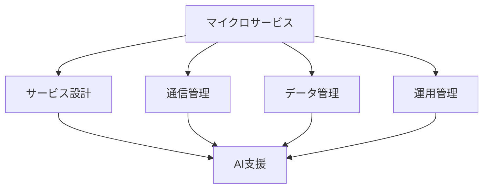

# マイクロサービス開発

## マイクロサービスアーキテクチャ

### アーキテクチャの特徴

マイクロサービスアーキテクチャには以下のような特徴があります：

- サービスの独立性
- スケーラビリティ
- 技術の多様性
- デプロイの柔軟性

### 開発の課題

## AI を活用した開発

### 1. サービス設計

AI を活用したサービス設計：

- 境界の最適化
- 依存関係の分析
- スケーラビリティの予測
- パフォーマンスの最適化

### 2. コード生成

AI を活用したコード生成：

- サービステンプレートの生成
- API の自動設計
- データモデルの最適化
- テストコードの生成

### 3. テスト自動化

AI を活用したテスト自動化：

- 統合テストの自動化
- パフォーマンステスト
- 負荷テスト
- セキュリティテスト

## 実践的な手法

### サービス設計

AI を活用したサービス設計：

- ドメイン分析
- 境界の定義
- インターフェース設計
- データモデリング

### 開発プロセス

AI を活用した開発プロセス：

- コード生成
- テスト自動化
- デプロイ自動化
- モニタリング

## 成功のポイント

### 設計の最適化

サービス設計の最適化：

- ドメイン駆動設計
- マイクロサービスパターン
- スケーラビリティ
- 保守性

### 運用管理

AI を活用した運用管理：

- モニタリング
- ログ分析
- パフォーマンス最適化
- インシデント対応

## 実践的なアドバイス

### 導入のステップ

AI をマイクロサービス開発に導入するステップ：

1. 現状分析
2. 目標設定
3. ツール選択
4. プロセス確立
5. 評価と改善

### 成功への道筋

マイクロサービス開発での AI 活用を成功させるポイント：

- 明確な目標設定
- 段階的な導入
- チームの理解と協力
- 継続的な改善

## まとめ

AI を活用したマイクロサービス開発は、開発効率と品質を大幅に向上させる可能性を秘めています。適切な設計と継続的な改善が重要です。
