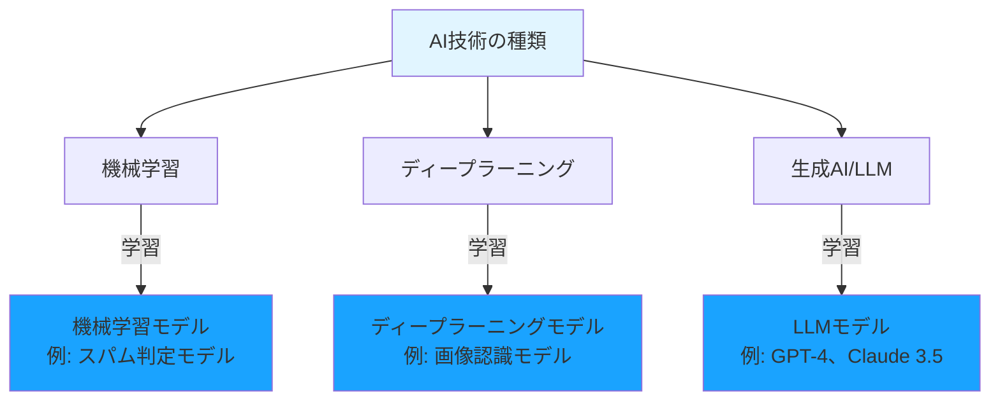
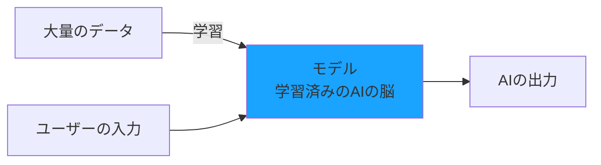
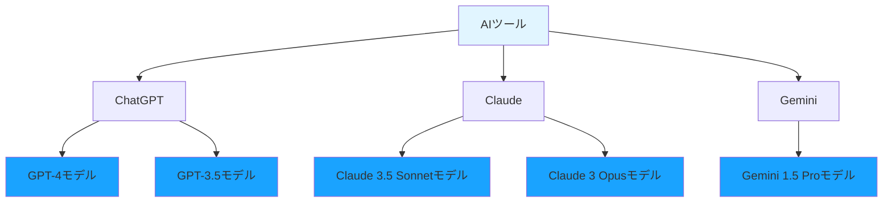
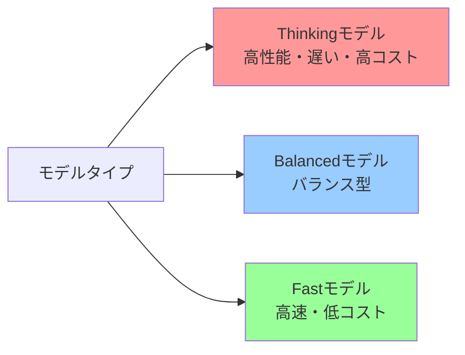
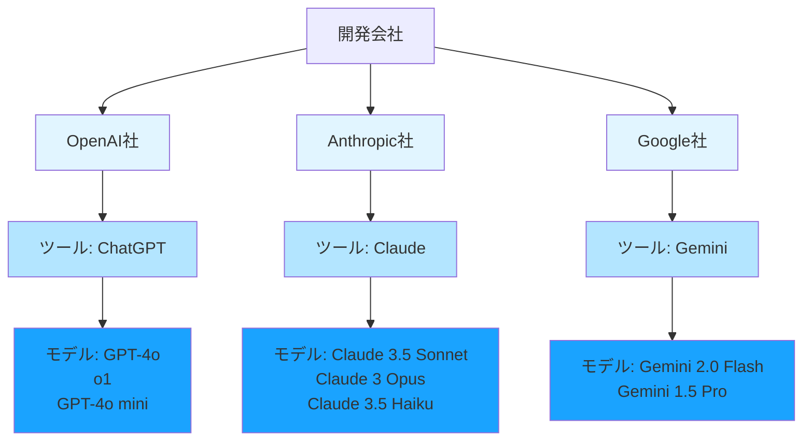

# モデルとは

ここまでAIの種類について学んできましたが、「モデル」という言葉も頻繁に耳にします。この「モデル」とは何でしょうか？

## モデルは「学習済みのAIの脳」

**モデル（Model）** とは、大量のデータで学習を完了したAIのことです。言い換えれば、「AIの脳」です。

先ほど説明した「機械学習」「ディープラーニング」「生成AI」「LLM」は**技術の種類**でした。一方、「モデル」はこれらの技術を使って**学習を行ったAI**です。

## モデルの作成プロセス

例えば、ChatGPTで使われている「GPT-4」は、インターネット上の膨大なテキストデータで学習を完了したモデルです。このモデルがあるからこそ、私たちの質問に答えたり、コードを生成したりできます。

## モデルとAIツールの違い

**モデル**と**AIツール**は違うものです。

- **AIツール**：ChatGPT、Claude、Geminiなど、私たちが使うサービスやアプリケーション
- **モデル**：そのツールの中で動いているAIの脳（GPT-4、Claude 3.5 Sonnetなど）

同じツールでも、複数のモデルを選択できることがあります。

## モデルによって何が違う？

同じAIツールでも、モデルが違うと以下の点が変わります。実は、モデルには大きく分けて3つのタイプがあります。

### モデルの3つのタイプ

**1. Thinkingモデル（思考型）**

高度な推論や複雑な問題を解くことに特化したモデルです。時間をかけて深く考え、正確な答えを導き出します。

- **特徴**：高性能、高精度、応答は遅め、コストは高め
- **用途**：複雑なコード生成、難しいバグ修正、設計の相談

**2. Balancedモデル（バランス型）**

性能、速度、コストのバランスが取れたモデルです。多くの開発タスクで使える万能タイプです。

- **特徴**：そこそこ高性能、そこそこ速い、コストは中程度
- **用途**：通常のコード生成、リファクタリング、ドキュメント作成

**3. Fastモデル（高速型）**

応答速度を重視した軽量モデルです。シンプルなタスクを素早く処理します。

- **特徴**：応答が速い、低コスト、性能は控えめ
- **用途**：コードの説明、簡単な質問、コメント生成

## AI駆動開発で使う主なモデル

その前に、会社名、ツール名、モデル名の関係を整理しておきましょう。

### 会社・ツール・モデルの関係

LLMを提供している主要な3社があります。

**OpenAI社**
- **会社名**：OpenAI
- **ツール名**：ChatGPT、GitHub Copilot
- **モデル名**：GPT-4o、o1、GPT-4o miniなど

**Anthropic社**
- **会社名**：Anthropic
- **ツール名**：Claude
- **モデル名**：Claude 3.5 Sonnet、Claude 3 Opusなど

**Google社**
- **会社名**：Google
- **ツール名**：Gemini
- **モデル名**：Gemini 2.0 Flash、Gemini 1.5 Proなど

**重要なポイント**

- **OpenAI社**が開発したモデルシリーズの名前が**GPT**（Generative Pre-trained Transformer）
- **Anthropic社**が開発したツールとモデルの両方が**Claude**という名前
- **Google社**が開発したツールとモデルの両方が**Gemini**という名前

混乱しやすいのは、AnthropicとGoogleの場合、ツール名とモデル名が同じ「Claude」「Gemini」という名前を使っている点です。OpenAIは、ツール名が「ChatGPT」で、モデル名が「GPT-4o」などと区別されています。

それでは、各社のLLMモデルを、この3つのタイプに分類して紹介します。

### モデル比較表

| タイプ | OpenAI | Anthropic | Google |
|--------|--------|-----------|--------|
| **Thinking （思考型）** | o1-preview o1 | Claude 3 Opus | Gemini 2.0 Flash Thinking Gemini 1.5 Pro |
| **Balanced （バランス型）** | GPT-4o GPT-4 Turbo | Claude 3.5 Sonnet | - |
| **Fast （高速型）** | GPT-4o mini GPT-3.5 Turbo | Claude 3.5 Haiku Claude 3 Haiku | Gemini 2.0 Flash Gemini 1.5 Flash |

### 各社のモデル詳細

**OpenAI（ChatGPT、GitHub Copilot）**

- **o1-preview / o1**（Thinking）
  - 最も高度な推論能力を持つ
  - 複雑な問題を段階的に考えて解く
  - 数学、論理、複雑なコードに強い

- **GPT-4o / GPT-4 Turbo**（Balanced）
  - 高性能で汎用性が高い
  - 画像も理解できる（GPT-4o）
  - 多くの開発タスクに最適

- **GPT-4o mini / GPT-3.5 Turbo**（Fast）
  - 素早い応答が得意
  - シンプルなコード生成に十分な性能
  - コストを抑えたい場合に最適

**Anthropic（Claude）**

- **Claude 3 Opus**（Thinking）
  - 最高性能だが応答は遅い
  - 長文の理解と生成が得意
  - 複雑な推論に優れる

- **Claude 3.5 Sonnet**（Balanced）
  - 高性能と速度のバランスが良い
  - 長文理解に優れる
  - コード生成の精度が高い

- **Claude 3.5 Haiku / Claude 3 Haiku**（Fast）
  - 最も高速で低コスト
  - シンプルなタスクに最適
  - リアルタイムの応答が必要な場合に有効

**Google（Gemini）**

- **Gemini 2.0 Flash Thinking / Gemini 1.5 Pro**（Thinking）
  - 長いコンテキスト（100万トークン超）を扱える
  - Thinkingモードで深い推論ができる
  - Google検索との統合が得意

- **Gemini 2.0 Flash / Gemini 1.5 Flash**（Fast）
  - 非常に高速で低コスト
  - マルチモーダル（画像、動画も理解）
  - リアルタイム処理に強い

### どのモデルを選ぶべきか

タスクに応じて、以下のように使い分けます。

**Thinkingモデルを使う場面**
- 複雑なアルゴリズムの実装
- 難しいバグの原因究明
- アーキテクチャ設計の相談
- セキュリティの脆弱性分析

**Balancedモデルを使う場面**
- 通常のコード生成
- リファクタリング
- テストコード作成
- ドキュメント作成
- コードレビュー

**Fastモデルを使う場面**
- コードの説明
- 簡単な質問
- コメントの生成
- 変数名の提案
- ちょっとした修正

## なぜモデルを理解する必要があるのか

AI駆動開発では、**適切なモデルを選ぶこと**が重要です。

- **複雑なコード生成**：高性能モデル（GPT-4、Claude 3.5 Sonnet）を使う
- **シンプルな質問**：低コストモデル（GPT-3.5、Claude 3 Haiku）で十分
- **長いコードの理解**：長文が得意なモデル（Claude 3.5 Sonnet）を使う

モデルの特徴を理解することで、タスクに応じて最適なAIを選択でき、開発効率とコストのバランスを取れます。
