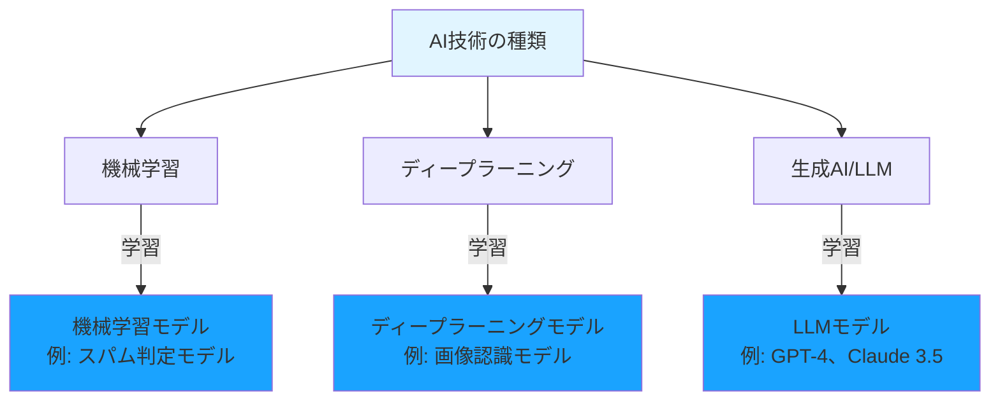
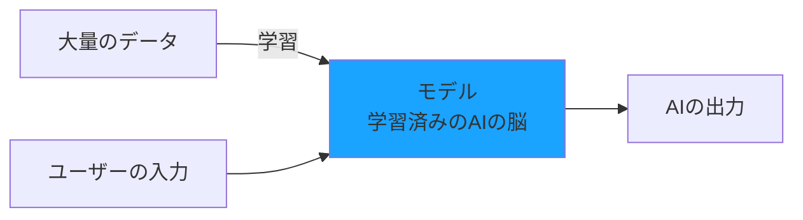
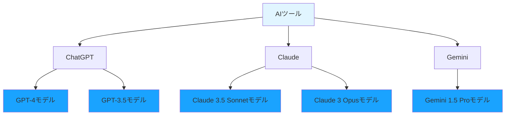

# モデルとは

ここまでAIの種類について学んできましたが、「モデル」という言葉も頻繁に耳にします。この「モデル」とは何でしょうか？

## モデルは「学習済みのAIの脳」

**モデル（Model）** とは、大量のデータで学習を完了したAIのことです。言い換えれば、「AIの脳」です。

先ほど説明した「機械学習」「ディープラーニング」「生成AI」「LLM」は**技術の種類**でした。一方、「モデル」はこれらの技術を使って**学習した結果できあがるもの**です。

- **技術**：AI、機械学習、ディープラーニング、生成AI、LLM（学習の方法）
- **モデル**：GPT-4、Claude 3.5 Sonnet、Gemini 1.5 Pro（学習の成果物）

## モデルの作成プロセス

例えば、ChatGPTで使われている「GPT-4」は、インターネット上の膨大なテキストデータで学習を完了したモデルです。このモデルがあるからこそ、私たちの質問に答えたり、コードを生成したりできます。

## モデルとAIツールの違い

**モデル**と**AIツール**は違うものです。

- **AIツール**：ChatGPT、Claude、Geminiなど、私たちが使うサービスやアプリケーション
- **モデル**：そのツールの中で動いているAIの脳（GPT-4、Claude 3.5 Sonnetなど）

同じツールでも、複数のモデルを選択できることがあります。

## モデルによって何が違う？

同じAIツールでも、モデルが違うと以下の点が変わります。

### 1. 性能（賢さ）

新しいモデルや大規模なモデルほど、複雑な問題を解けます。

- **GPT-4**：高度な推論や複雑なコード生成が得意
- **GPT-3.5**：シンプルな質問やコード生成に対応

### 2. 速度

小さいモデルほど、応答が速い傾向があります。

- **GPT-3.5**：応答が速い
- **GPT-4**：応答に時間がかかるが高精度

### 3. コスト

大規模なモデルほど、利用料金が高くなります。

- **GPT-3.5**：低コスト
- **GPT-4**：高コスト

### 4. 得意分野

モデルによって、得意な分野が異なります。

- **Claude 3.5 Sonnet**：長文の理解と生成が得意
- **GPT-4**：幅広いタスクに対応
- **Gemini 1.5 Pro**：Google検索との統合が得意

## AI駆動開発で使う主なモデル

AI駆動開発で使われる代表的なLLMモデルを紹介します。

### OpenAIのモデル（ChatGPT、GitHub Copilot）
- **GPT-4 Turbo**：最も高性能。複雑なコード生成に最適
- **GPT-4o**：高性能で高速。バランスが良い
- **GPT-3.5 Turbo**：低コストで高速。シンプルなタスク向け

### Anthropicのモデル（Claude）
- **Claude 3.5 Sonnet**：長文理解に優れ、複雑な推論が得意
- **Claude 3 Opus**：最高性能だが応答が遅い
- **Claude 3 Haiku**：高速で低コスト

### Googleのモデル（Gemini）
- **Gemini 1.5 Pro**：長いコンテキストを扱える
- **Gemini 1.5 Flash**：高速で低コスト

## なぜモデルを理解する必要があるのか

AI駆動開発では、**適切なモデルを選ぶこと**が重要です。

- **複雑なコード生成**：高性能モデル（GPT-4、Claude 3.5 Sonnet）を使う
- **シンプルな質問**：低コストモデル（GPT-3.5、Claude 3 Haiku）で十分
- **長いコードの理解**：長文が得意なモデル（Claude 3.5 Sonnet）を使う

モデルの特徴を理解することで、タスクに応じて最適なAIを選択でき、開発効率とコストのバランスを取れます。
