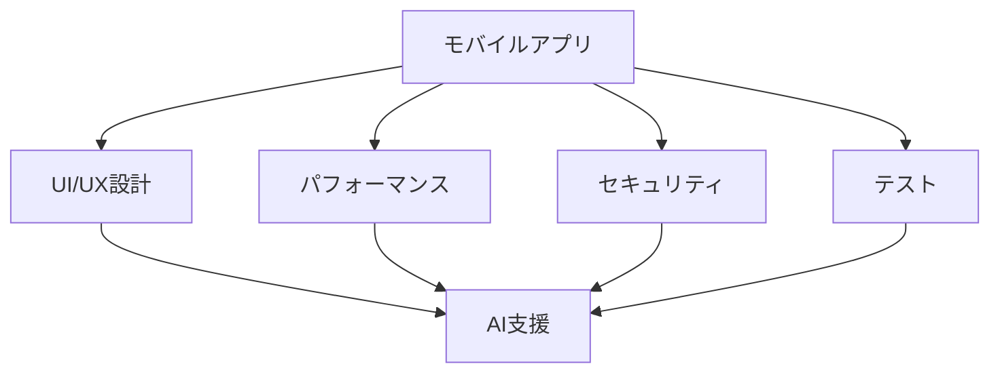

# モバイルアプリ開発

## モバイルアプリ開発の特徴

### 開発の特徴

モバイルアプリ開発には以下のような特徴があります：

- プラットフォームの多様性
- ユーザー体験の重要性
- パフォーマンスの最適化
- セキュリティの確保

### 開発の課題

## AI を活用した開発

### 1. UI/UX 設計

AI を活用した UI/UX 設計：

- デザインパターンの生成
- ユーザーフィードバックの分析
- A/B テストの自動化
- パーソナライゼーション

### 2. コード生成

AI を活用したコード生成：

- 画面遷移の自動生成
- データモデルの最適化
- ネットワーク層の実装
- テストコードの生成

### 3. テスト自動化

AI を活用したテスト自動化：

- UI テストの自動化
- パフォーマンステスト
- セキュリティテスト
- ユーザビリティテスト

## 実践的な手法

### 開発プロセス

AI を活用した開発プロセス：

- 要件定義
- 設計
- 実装
- テスト
- デプロイ

### 品質管理

AI を活用した品質管理：

- コードレビュー
- パフォーマンス最適化
- セキュリティチェック
- ユーザーフィードバック

## 成功のポイント

### 設計の最適化

アプリ設計の最適化：

- ユーザー体験
- パフォーマンス
- セキュリティ
- 保守性

### 運用管理

AI を活用した運用管理：

- モニタリング
- クラッシュレポート
- ユーザー行動分析
- パフォーマンス最適化

## 実践的なアドバイス

### 導入のステップ

AI をモバイルアプリ開発に導入するステップ：

1. 現状分析
2. 目標設定
3. ツール選択
4. プロセス確立
5. 評価と改善

### 成功への道筋

モバイルアプリ開発での AI 活用を成功させるポイント：

- 明確な目標設定
- 段階的な導入
- チームの理解と協力
- 継続的な改善

## まとめ

AI を活用したモバイルアプリ開発は、開発効率と品質を大幅に向上させる可能性を秘めています。適切な設計と継続的な改善が重要です。
