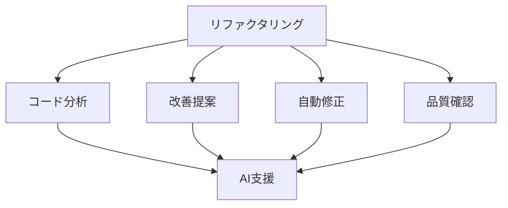

# リファクタリング支援の活用

## リファクタリングの重要性

### リファクタリングの目的

リファクタリングには以下のような目的があります：

- コードの可読性向上
- 保守性の改善
- パフォーマンスの最適化
- バグの削減

### AI 支援の可能性

## AI を活用したリファクタリング

### 1. コード分析

AI を活用したコード分析：

- コードの構造分析
- パターンの特定
- 問題点の検出
- 改善点の特定

### 2. 改善提案

AI を活用した改善提案：

- リファクタリングパターンの提案
- 最適化の提案
- セキュリティ改善
- パフォーマンス最適化

### 3. 自動修正

AI を活用した自動修正：

- コードの自動改善
- パターンの適用
- テストの自動生成
- ドキュメントの更新

## 実践的な手法

### リファクタリングプロセス

AI を活用したリファクタリングプロセス：

- 現状分析
- 改善計画
- 実装
- テスト
- レビュー

### 品質管理

AI を活用した品質管理：

- コードレビュー
- パフォーマンス分析
- セキュリティチェック
- バグ修正

## 成功のポイント

### リファクタリングの最適化

コードリファクタリングの最適化：

- リファクタリングパターン
- テスト戦略
- パフォーマンス
- セキュリティ

### 運用管理

AI を活用した運用管理：

- モニタリング
- パフォーマンス最適化
- セキュリティ管理
- インシデント対応

## 実践的なアドバイス

### 導入のステップ

AI をリファクタリングプロセスに導入するステップ：

1. 現状分析
2. 目標設定
3. ツール選択
4. プロセス確立
5. 評価と改善

### 成功への道筋

AI を活用したリファクタリングを成功させるポイント：

- 明確な目標設定
- 段階的な導入
- チームの理解と協力
- 継続的な改善

## まとめ

AI を活用したリファクタリング支援は、コードの品質と保守性を大幅に向上させる可能性を秘めています。適切な活用と継続的な改善が重要です。
