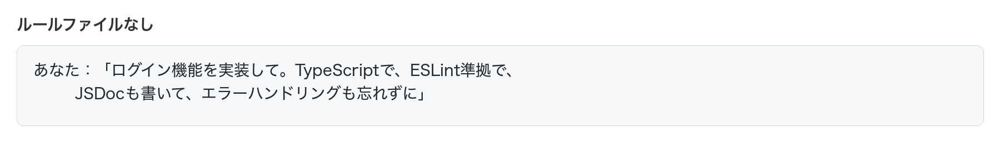
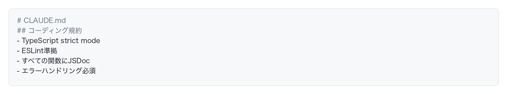
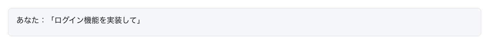
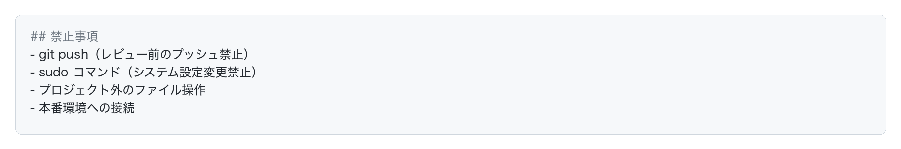
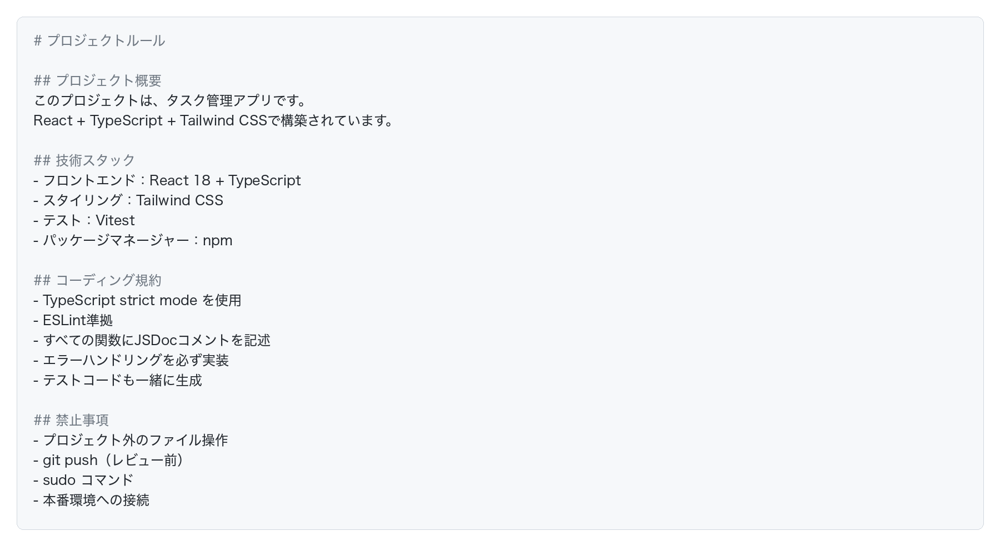

# ルールファイルの設定

## ルールファイルとは

ルールファイルとは、**AIに対してプロジェクト固有のルールを事前に伝えるためのマークダウンファイル**です。

### なぜルールファイルが必要なのか

AIツールは様々なプロジェクトで使われるため、デフォルトでは汎用的な動作をします。しかし、実際の開発では様々な独自ルールが存在します。

- プロジェクトごとにコーディング規約が異なる
- 使用する技術スタックが違う
- 禁止事項や制約がある
- チーム独自のルールが存在する

**ルールファイルを設定することで、AIがそのルールに従って動作するようになります。**

## ルールファイルを設定するメリット

### メリット1：毎回同じ指示を繰り返さなくて良い

**ルールファイルなし：**

毎回これらの指示を繰り返す必要があります。

**ルールファイルあり：**

たったこれだけで、AIがルールファイルに従って実装してくれます。

### メリット2：禁止事項を明確にできる

AIは強力ですが、誤って危険な操作をしてしまう可能性もあります。

このように禁止事項を明記することで、**AIが誤って危険な操作をすることを防げます。**

## エディタによる設定方法の違い

ルールファイルの**設定場所やファイル名は、使用するエディタやツールによって異なります。**

**自分が使っているツールのルールファイルの設定方法は、必ず公式ドキュメントや検索で調べてください。**

## Claude Codeでの設定方法

ここでは、Claude Codeを例に具体的な設定方法を説明します。

### 手順1：CLAUDE.mdを作成

プロジェクトのルートディレクトリに `CLAUDE.md` というファイルを作成します。

### 手順2：ルールを記述

作成した `CLAUDE.md` に、マークダウン形式でルールを記述します。

**基本的な構成例：**

これでAIがルール通りに動作します。ただし100%ルールに従うわけではないので注意しましょう。
