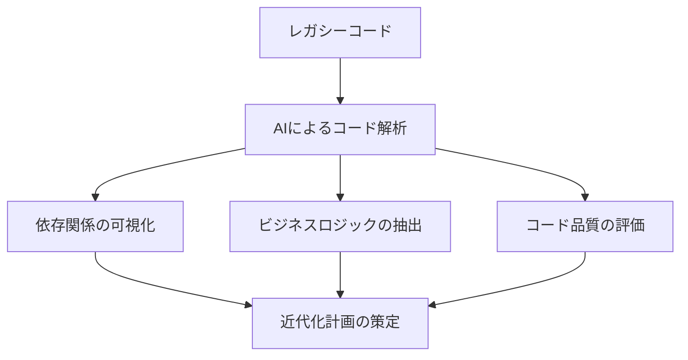
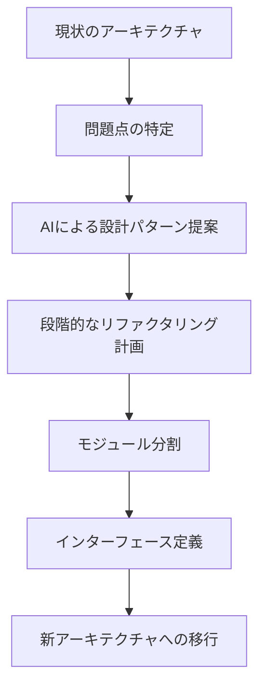
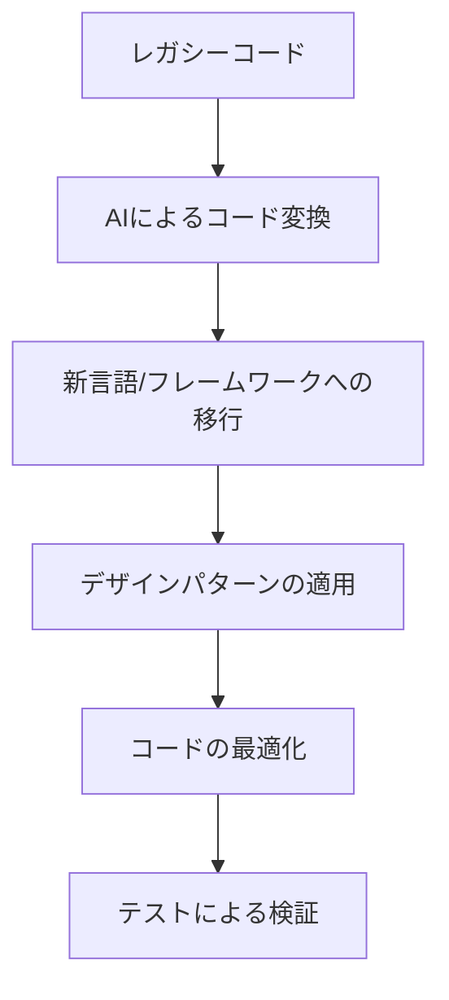
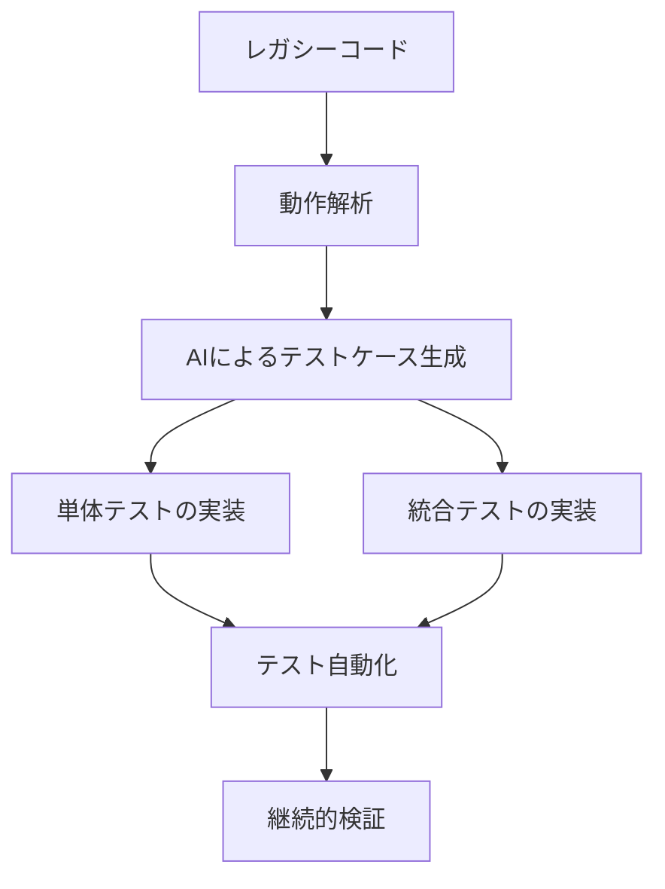
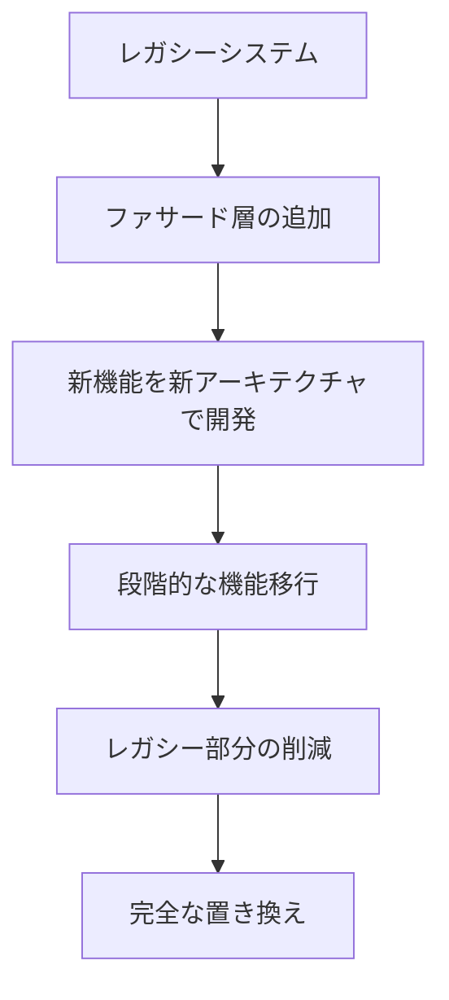
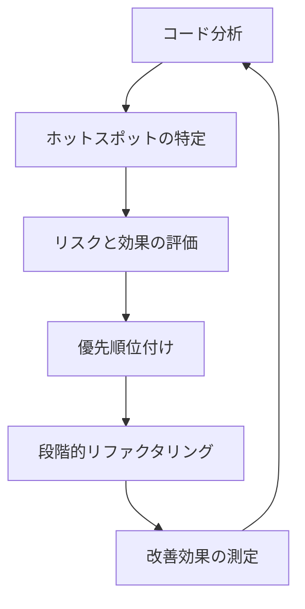
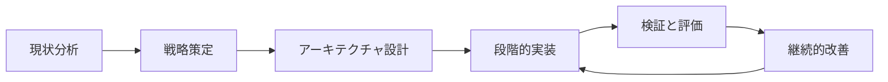

# レガシーコードの近代化

## レガシーコードとは

レガシーコードとは、一般的に以下のような特徴を持つコードベースを指します：

- **古い技術スタック**：サポートが終了した言語やフレームワークのバージョンを使用
- **複雑な依存関係**：機能間の結合度が高く、変更の影響範囲を予測しづらい
- **不十分なドキュメント**：設計思想や機能の仕様が明確に記録されていない
- **テストの欠如**：自動テストが不足しており、変更による影響を検証しづらい
- **技術的負債の蓄積**：短期的な解決策の積み重ねによる複雑さの増大

こうしたレガシーコードは企業の競争力を低下させる要因となりますが、一方で多くの企業にとって重要なビジネスロジックを含んでいることも事実です。そのため、レガシーコードを単純に書き換えるのではなく、計画的に「近代化（モダナイゼーション）」していくアプローチが重要になります。

## レガシーコード近代化の重要性

レガシーコードの近代化がもたらす主なメリットは以下の通りです：

1. **保守性の向上**：コードの理解や修正が容易になり、開発者の生産性が向上
2. **セキュリティの強化**：古いライブラリやフレームワークの脆弱性を解消
3. **機能拡張の迅速化**：新機能の追加や変更がスムーズに行えるように
4. **パフォーマンスの改善**：現代的な技術の恩恵を受けることでシステム全体のパフォーマンスが向上
5. **人材確保の容易さ**：最新技術を使用することで優秀な開発者の採用・維持が容易に

しかし、近代化プロジェクトは複雑で挑戦的なものでもあります。そこで AI駆動開発を活用することで、このプロセスを効率化し、リスクを低減することができます。

## AI駆動開発によるレガシーコード近代化の手法

### 1. コード解析と理解

レガシーコードの近代化の第一歩は、既存コードを深く理解することです。AIはこのプロセスを大幅に効率化できます。



**AIを活用したコード理解の例**：

```
以下のレガシーJavaコードの主要なビジネスロジックを抽出し、
コードの流れと責務を説明してください。また、このコードの
技術的負債や潜在的な問題点も指摘してください。

[レガシーコードを貼り付け]
```

AIは以下のような情報を提供できます：

- コードの主要な機能と処理フロー
- 隠れた依存関係やサイドエフェクト
- 複雑さの高い領域や再構築が必要な部分
- ビジネスロジックとプレゼンテーション層の混在箇所

### 2. アーキテクチャの再設計

レガシーシステムのアーキテクチャを現代的な設計パターンに合わせて再設計します。



**AIを活用したアーキテクチャ再設計の例**：

```
以下のシステム構成のモノリシックアプリケーションをマイクロサービスアーキテクチャに
移行するための設計案を提案してください。段階的な移行を考慮し、
どのコンポーネントから着手すべきかも含めて提案をお願いします。

[システム概要とコンポーネント構成]
```

AIによるアーキテクチャ再設計支援では以下のようなことが可能です：

- 現代的なアーキテクチャパターンの提案（マイクロサービス、イベント駆動など）
- ドメイン駆動設計に基づくモジュール分割
- 依存関係の逆転など、堅牢な設計原則の適用
- 段階的な移行計画の策定

### 3. コードの変換と最適化

既存コードを新しい言語やフレームワークに変換し、最適化します。



**AIを活用したコード変換の例**：

```
以下のJava 6で書かれたコードをJava 17に移行し、最新の機能（Optional、
Stream API、レコード、パターンマッチングなど）を活用してリファクタリングしてください。
また、可読性とメンテナンス性を高めるための改善点も提案してください。

[レガシーJavaコード]
```

コード変換における主な AI活用ポイント：

- 古い構文から現代的な構文への書き換え
- レガシー API から最新 API への移行
- コードスタイルの最適化と標準化
- パフォーマンス向上のための最適化提案

**具体的な変換例**（Java 6 から Java 17 への変換）：

```java
// レガシーコード（Java 6）
public List<Customer> getActiveCustomers(List<Customer> customers) {
    List<Customer> result = new ArrayList<Customer>();
    for (Customer customer : customers) {
        if (customer != null && customer.isActive()) {
            result.add(customer);
        }
    }
    return result;
}

// 近代化されたコード（Java 17）
public List<Customer> getActiveCustomers(List<Customer> customers) {
    return Optional.ofNullable(customers)
        .orElse(List.of())
        .stream()
        .filter(Objects::nonNull)
        .filter(Customer::isActive)
        .toList();
}
```

### 4. テスト自動化とカバレッジ向上

レガシーコードの近代化において、適切なテストの導入は非常に重要です。



**AIを活用したテスト生成の例**：

```
以下のレガシーメソッドに対する包括的な単体テストを作成してください。
境界値テスト、エラーケース、正常系のテストを含め、可能な限り高いカバレッジを
達成するテストケースを提案してください。テストフレームワークはJUnitを使用します。

[テスト対象のメソッド]
```

テスト自動化における主な AI活用ポイント：

- 既存の動作を理解してテストケースを生成
- 境界値や特殊条件のテストケース提案
- モックやスタブの作成支援
- テストカバレッジの分析と改善提案

### 5. ドキュメント生成と知識の体系化

レガシーシステムの暗黙知をドキュメント化し、知識の体系化を行います。

**AIを活用したドキュメント生成の例**：

```
以下のレガシーコードベースから、システムアーキテクチャドキュメントを
生成してください。主要なコンポーネント、それらの関係、データフロー、
外部システムとの連携などを含めてください。また、システムの制約条件や
将来的な拡張ポイントも記載してください。

[コードベースの概要情報]
```

ドキュメント生成における主な AI活用ポイント：

- システム設計の可視化と文書化
- API ドキュメントの自動生成
- ビジネスロジックの説明とフロー図作成
- 技術的な負債と今後の改善点のマッピング

## 段階的なレガシーコード近代化戦略

レガシーコードの近代化は、一度に全てを刷新するよりも段階的なアプローチが効果的です。

### 1. ストラングラーフィグパターン

新旧システムを共存させながら、徐々に新システムに機能を移行していく方法です。



**AIによる支援例**：

```
以下のモノリシックなEコマースシステムに対して、ストラングラーフィグパターンを
適用するための実装案を提案してください。特に、商品カタログ機能を最初に
新アーキテクチャに移行する計画です。ファサード層の設計と、
段階的な移行ステップを詳細に説明してください。

[システム概要]
```

### 2. リファクタリングと改善の優先順位付け

改善効果の高い部分から段階的にリファクタリングしていく方法です。



**AIによる優先順位付けの支援例**：

```
以下のコードベースの分析結果に基づいて、リファクタリングの優先順位を
付けてください。変更頻度、複雑度、依存関係、バグ発生率などの指標を
考慮して、最も投資対効果の高い改善順序を提案してください。

[コード分析データ]
```

## 実践的なレガシーコード近代化の例

### 例 1: データアクセス層の近代化

JDBC を直接使用した古いデータアクセス層を Spring Data JPA に移行する例を見てみましょう。

**レガシーコード例**:

```java
// レガシーなデータアクセスコード
public List<Customer> findCustomersByStatus(String status) {
    List<Customer> customers = new ArrayList<>();
    Connection conn = null;
    PreparedStatement pstmt = null;
    ResultSet rs = null;

    try {
        conn = DriverManager.getConnection(DB_URL, USER, PASS);
        pstmt = conn.prepareStatement("SELECT * FROM customers WHERE status = ?");
        pstmt.setString(1, status);
        rs = pstmt.executeQuery();

        while (rs.next()) {
            Customer customer = new Customer();
            customer.setId(rs.getLong("id"));
            customer.setName(rs.getString("name"));
            customer.setEmail(rs.getString("email"));
            customer.setStatus(rs.getString("status"));
            customers.add(customer);
        }
    } catch (SQLException e) {
        e.printStackTrace();
    } finally {
        try {
            if (rs != null) rs.close();
            if (pstmt != null) pstmt.close();
            if (conn != null) conn.close();
        } catch (SQLException e) {
            e.printStackTrace();
        }
    }

    return customers;
}
```

**AIによるモダン化コードの提案**:

```java
// Spring Data JPAを使用した近代的なアプローチ

// エンティティ定義
@Entity
@Table(name = "customers")
public class Customer {
    @Id
    @GeneratedValue(strategy = GenerationType.IDENTITY)
    private Long id;

    private String name;
    private String email;
    private String status;

    // getters, setters, constructors
}

// リポジトリインターフェース
public interface CustomerRepository extends JpaRepository<Customer, Long> {
    List<Customer> findByStatus(String status);
}

// サービス層
@Service
public class CustomerService {
    private final CustomerRepository customerRepository;

    public CustomerService(CustomerRepository customerRepository) {
        this.customerRepository = customerRepository;
    }

    public List<Customer> findCustomersByStatus(String status) {
        return customerRepository.findByStatus(status);
    }
}
```

### 例 2: フロントエンドの近代化

古い jQuery ベースの UI を React に段階的に移行する例です。

**AIによる移行戦略の提案**:

1. **API ファサードの作成**:

   - レガシーバックエンドの前に、モダンな RESTful API レイヤーを構築
   - 新旧システム間のデータ変換を担当

2. **コンポーネント別の段階的移行**:

   - 最初に独立した小さな UI コンポーネントから移行開始
   - 各コンポーネントに対して React の実装を作成
   - 新旧 UI を共存させる仕組みを実装

3. **移行のための技術選択**:
   - React + TypeScript による型安全性の確保
   - ステート管理には Redux または Context API を採用
   - スタイリングには Styled Components や Tailwind CSS を使用

## レガシーコード近代化のベストプラクティス

### 1. ビジネス価値を優先する

- 最も頻繁に変更が必要な部分や、ビジネスにとって重要な部分から着手
- 顧客や利用者に直接的な価値をもたらす改善を優先
- 純粋に技術的な理由だけではなく、ビジネス目標に合わせた判断

### 2. リスクを管理する

- 一度に大きな変更を行わず、小さなステップで進める
- 各ステップでテストを充実させ、改修による副作用を最小化
- 本番環境での並行稼働と段階的な移行

### 3. チームの知識を向上させる

- レガシーコードとモダンなアプローチの橋渡しができる人材の育成
- ナレッジシェアリングのセッションを定期的に実施
- AI支援ツールの活用方法をチーム全体で学習

### 4. 適切なメトリクスで成果を測定

- コード品質メトリクス（複雑度、重複、カバレッジなど）の追跡
- 開発速度とリリースサイクルの変化を測定
- バグ発生率や解決時間の変化をモニタリング

## AIを活用したレガシーコード近代化のプロセス



1. **現状分析**:

   - AIによるコードベースの解析
   - 依存関係と複雑さのマッピング
   - 技術的負債の可視化

2. **戦略策定**:

   - 優先順位の決定
   - 移行アプローチの選択
   - ロードマップの作成

3. **アーキテクチャ設計**:

   - 新アーキテクチャの設計
   - インターフェースと統合ポイントの定義
   - 移行パスの詳細化

4. **段階的実装**:

   - コンポーネント単位での移行
   - 継続的なテスト自動化
   - フィードバックに基づく調整

5. **検証と評価**:

   - 品質メトリクスの測定
   - パフォーマンスと機能の検証
   - チームフィードバックの収集

6. **継続的改善**:
   - 学んだ教訓の適用
   - プロセスの最適化
   - 新たな技術動向の取り込み

## まとめ

レガシーコードの近代化は、単なる技術的なアップグレードではなく、ビジネスの競争力を維持・向上させるための戦略的な取り組みです。AI駆動開発を活用することで、このプロセスをより効率的かつ効果的に進めることができます。

成功のカギは、一度に全てを変えようとするのではなく、ビジネス価値に基づいた優先順位付けと段階的なアプローチです。また、チーム全体がプロセスに関与し、知識を共有していくことも重要です。

AI技術は日々進化しており、レガシーコードの理解、設計、実装、テストの各フェーズで強力な支援ツールとなっています。これらを賢く活用することで、レガシーコードの近代化プロジェクトの成功確率を高め、より持続可能なソフトウェア開発を実現できるでしょう。
