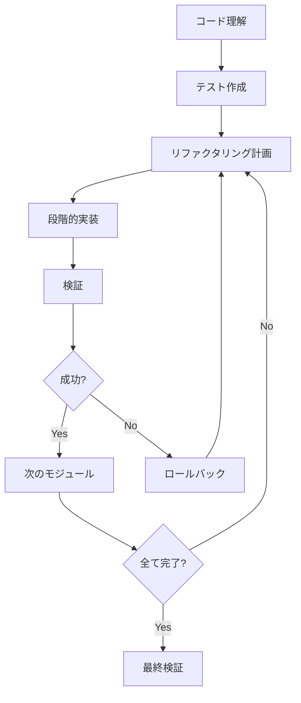
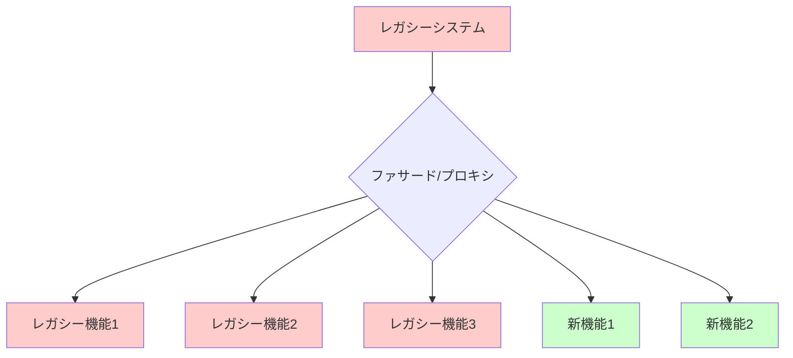
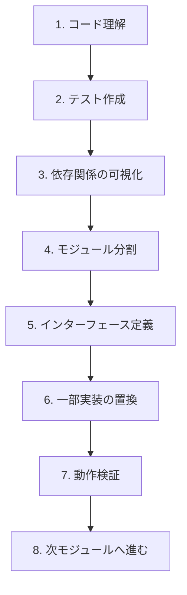

# レガシーコード理解・移行

多くの企業やプロジェクトでは、何年も前に書かれた「レガシーコード」と日々向き合わなければなりません。これらのコードは、ドキュメントが不足していたり、現代的な設計パターンに従っていなかったりと、理解や修正が難しいことがよくあります。AI駆動開発は、このレガシーコードの理解と現代的なコードへの移行を大幅に効率化できます。

## レガシーコードとは

レガシーコードとは、一般的に以下のような特徴を持つコードベースを指します：

- 古い技術や言語で書かれている
- ドキュメントが不足している
- 複雑で理解しづらい構造になっている
- テストが不足している
- セキュリティリスクが潜在している
- スケーラビリティに制限がある
- 保守が困難

これらのコードは企業の重要な業務を支えていることが多く、一から書き直すのではなく、理解し、段階的に改善する必要があります。

## AI駆動開発によるレガシーコード解析のメリット

AI駆動開発は、以下のようなレガシーコード対応のメリットをもたらします：

1. **コードの迅速な理解**: AIがコードの構造や機能を説明してくれる
2. **暗黙知の形式化**: ドキュメントがない部分も推測して説明できる
3. **リファクタリングの提案**: 現代的なパターンへの移行案を提示
4. **テストケースの自動生成**: レガシー機能を確保するテストの作成
5. **段階的な移行計画**: リスクを最小限に抑えた移行計画の立案

## レガシーコード理解の AI活用事例

### 例 1: 構造把握と文書化

古い COBOL プログラムや複雑なレガシー Java コードなど、構造を理解するのが難しいコードでも、AIを使えば迅速に概要を把握できます。

```
次のレガシーコードの機能を説明してください：

[ここに理解したいコードを貼り付け]

以下の項目について解説してください：
1. このコードの主な機能
2. 入力と出力の仕様
3. 主要なロジックの流れ
4. 潜在的な問題点
5. モジュール間の依存関係
```

AIはコードを分析し、機能的な説明を提供するだけでなく、暗黙的な設計意図やビジネスルールも推測してくれます。

### 例 2: 現代的なコードへの変換例

例えば、古い JavaScript のコードをモダンな ES6+に変換する場合：

**変換前（レガシーコード）:**

```javascript
// レガシーなJavaScript
function UserManager() {
  this.users = [];
}

UserManager.prototype.addUser = function (name, age, email) {
  if (!name || !age || !email) {
    return false;
  }

  var user = {
    id: new Date().getTime(),
    name: name,
    age: age,
    email: email,
  };

  this.users.push(user);
  return true;
};

UserManager.prototype.findUserByEmail = function (email) {
  for (var i = 0; i < this.users.length; i++) {
    if (this.users[i].email === email) {
      return this.users[i];
    }
  }
  return null;
};

// 使用例
var manager = new UserManager();
manager.addUser("山田太郎", 25, "taro@example.com");
var user = manager.findUserByEmail("taro@example.com");
```

**変換後（モダンなコード）:**

```javascript
// モダンなJavaScript (ES6+)
class UserManager {
  constructor() {
    this.users = [];
  }

  addUser(name, age, email) {
    if (!name || !age || !email) {
      return false;
    }

    const user = {
      id: Date.now(),
      name,
      age,
      email,
    };

    this.users.push(user);
    return true;
  }

  findUserByEmail(email) {
    return this.users.find((user) => user.email === email) || null;
  }
}

// 使用例
const manager = new UserManager();
manager.addUser("山田太郎", 25, "taro@example.com");
const user = manager.findUserByEmail("taro@example.com");
```

AIに「このレガシー JavaScript をモダンな ES6+に変換してください」と依頼するだけで、このような変換を自動的に行うことができます。

## レガシーコード移行のプロセス

レガシーコードからモダンなコードへの移行は、一度に行うべきではありません。段階的なアプローチが推奨されます：



## AIを使ったレガシーコード分析手法

### 1. コードベースのマッピング

大規模なレガシーシステムでは、まずコードベースの全体像を把握することが重要です：

```
このプロジェクトのファイル構造を分析し、主要なモジュールとその関係を図示してください。
特に以下の点に注目してください：
1. 核となるビジネスロジックはどこにあるか
2. データアクセス層の実装
3. モジュール間の依存関係
4. 最も複雑な部分はどこか
```

### 2. ビジネスロジックの抽出

レガシーコードからビジネスルールを抽出することで、移行時の機能保全が容易になります：

```
このコードに含まれるビジネスルールを抽出し、自然言語で説明してください。
条件分岐やループの中に隠れた暗黙的なルールも含めてください。
```

### 3. テストケースの自動生成

レガシーコードにテストがない場合、AIを使って機能を保全するためのテストを生成できます：

```
次のレガシーメソッドに対するユニットテストを作成してください：

[メソッドコードをここに貼り付け]

以下のケースをカバーするテストを含めてください：
1. 通常の使用パターン
2. エッジケース
3. エラー条件
```

## レガシーシステムの段階的移行戦略

レガシーシステムからモダンなシステムへの移行は、いくつかの戦略があります：

### ストラングラーパターン（Strangler Pattern）

大きなレガシーシステムを一度に置き換えるのではなく、機能ごとに段階的に新しいシステムに移行していく手法です：



AIを使用して、このプロセスを支援できます：

```
このレガシーモジュールをストラングラーパターンで移行する計画を立ててください：

[レガシーモジュールのコード]

以下の内容を含めてください：
1. 分離すべき機能の特定
2. 新旧システム間のインターフェース設計
3. 移行の順序と段階
4. 各段階での検証方法
```

## 実践的なレガシーコード理解の AIプロンプト例

### 複雑なビジネスロジックの解析

```
次のレガシーコードに含まれる計算ロジックを解析し、以下を説明してください：

[複雑な計算ロジックを含むコード]

1. 計算の目的と出力値の意味
2. 使用されている数式や計算方法
3. 入力パラメータの役割と制約
4. エッジケースの処理方法
5. 潜在的なバグや精度の問題
```

### データフローの可視化

```
このレガシーコードのデータフローを分析し、以下を説明してください：

[レガシーコードを貼り付け]

1. 入力データの取得方法
2. データの変換プロセス
3. 中間状態と格納場所
4. データの使用場所
5. サイドエフェクト
6. 出力の生成方法

可能であれば、データフロー図として表現してください。
```

## 例：古い PHP コードのモダン化

レガシー PHP コードをモダンな PHP8+コードに移行する例を見てみましょう。

**変換前（レガシー PHP）:**

```php
<?php
// レガシーPHP（PHP 5.x時代）
class Database {
    private $connection;

    function __construct($host, $user, $pass, $db) {
        $this->connection = mysql_connect($host, $user, $pass);
        mysql_select_db($db, $this->connection);
    }

    function query($sql) {
        $result = mysql_query($sql, $this->connection);
        if (!$result) {
            die('クエリの実行に失敗しました: ' . mysql_error());
        }
        return $result;
    }

    function fetch_array($result) {
        return mysql_fetch_array($result);
    }

    function close() {
        mysql_close($this->connection);
    }
}

// 使用例
$db = new Database('localhost', 'root', 'password', 'test_db');
$result = $db->query('SELECT * FROM users');
while ($row = $db->fetch_array($result)) {
    echo $row['name'] . '<br>';
}
$db->close();
?>
```

**変換後（モダン PHP）:**

```php
<?php
// モダンPHP（PHP 8+）
class Database {
    private $connection;

    public function __construct(
        private string $host,
        private string $user,
        private string $pass,
        private string $db
    ) {
        try {
            $this->connection = new PDO(
                "mysql:host={$this->host};dbname={$this->db};charset=utf8mb4",
                $this->user,
                $this->pass,
                [PDO::ATTR_ERRMODE => PDO::ERRMODE_EXCEPTION]
            );
        } catch (PDOException $e) {
            throw new Exception("データベース接続エラー: " . $e->getMessage());
        }
    }

    public function query(string $sql, array $params = []): PDOStatement {
        try {
            $stmt = $this->connection->prepare($sql);
            $stmt->execute($params);
            return $stmt;
        } catch (PDOException $e) {
            throw new Exception("クエリ実行エラー: " . $e->getMessage());
        }
    }

    public function fetchAll(string $sql, array $params = []): array {
        return $this->query($sql, $params)->fetchAll(PDO::FETCH_ASSOC);
    }

    public function __destruct() {
        $this->connection = null;
    }
}

// 使用例
try {
    $db = new Database('localhost', 'root', 'password', 'test_db');
    $users = $db->fetchAll('SELECT * FROM users');
    foreach ($users as $user) {
        echo htmlspecialchars($user['name']) . '<br>';
    }
} catch (Exception $e) {
    error_log($e->getMessage());
    echo "エラーが発生しました。詳細はログを確認してください。";
}
?>
```

AIに「このレガシー PHP コードを PHP8+のモダンな形式に変換し、セキュリティも改善してください」と依頼するだけで、このような変換を自動的に行えます。

## レガシーからモダンへの移行ステップ

レガシーコードをモダンなコードに移行する際の段階的なアプローチ：



## レガシーからモダンへの移行ケーススタディ

### レガシーな MVC フレームワークから React への移行例

従来のサーバーサイドレンダリングの MVC アプリケーションを React ベースの SPA に移行するケース：

1. **現状分析**: AIがレガシーコードを解析し、UI 要素とデータフローを特定
2. **API レイヤーの抽出**: バックエンドロジックを API 化
3. **コンポーネント設計**: UI を React コンポーネントとして再設計
4. **段階的実装**: ページごとに順次モダン化

AIプロンプト例：

```
このレガシーなJSP/JSTLコードをReactコンポーネントに変換してください：

[JSPコードを貼り付け]

以下を含めてください：
1. 対応するReactコンポーネント
2. 必要なstate管理
3. APIコール部分
4. スタイリング方法
```

## レガシーコード理解・移行の実践的ヒント

1. **優先順位付け**: 最も頻繁に変更が必要な部分や、ビジネス価値の高い部分から移行を始める

2. **ドメイン知識の記録**: AIから得られた洞察を基に、明示的なドキュメントを作成する

3. **パターン認識**: レガシーコード内の繰り返しパターンを特定し、共通の移行アプローチを適用する

4. **並行開発**: レガシーシステムの保守と新システムの開発を並行して行う体制を整える

5. **継続的なリファクタリング**: 大規模な書き換えではなく、小さな改善を継続する

6. **知識移転**: AIが解析したコードの理解を開発チーム全体で共有する

7. **リグレッションテスト**: 機能の同等性を確保するため、移行前後で同じテストケースが通ることを確認する

## まとめ

レガシーコードの理解と移行は、多くの開発者が直面する課題です。AI駆動開発を活用することで、以下のメリットが得られます：

- コードの迅速な理解と文書化
- 暗黙知の明示化
- テストカバレッジの向上
- 段階的な移行の計画と実行
- リスクの軽減

次のステップとして、自分が関わるレガシープロジェクトの一部で AIを活用した理解・移行プロセスを試してみましょう。小さな部分から始めて、効果を実感することが重要です。

また、レガシーコードにはその時代の制約や要件が反映されています。単に「古いから」という理由だけで否定するのではなく、そこに込められた知恵も尊重しつつ、現代の技術で改善していく姿勢が大切です。
