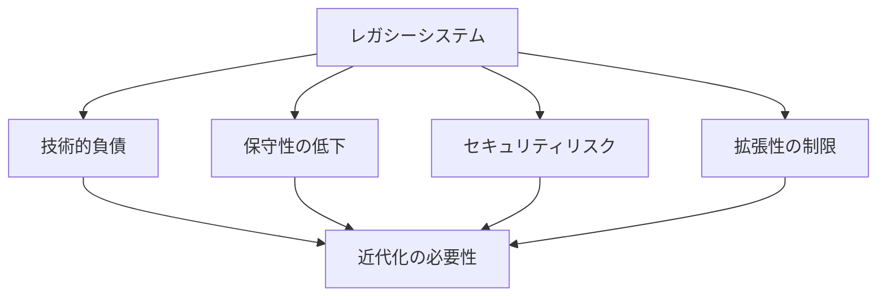

# レガシーシステム近代化

## レガシーシステムの課題

### システムの特徴

レガシーシステムには以下のような特徴があります：

- 古い技術スタック
- 複雑なコードベース
- 不十分なドキュメント
- 保守性の低下

### 近代化の必要性

## AI を活用した近代化

### 1. コード分析と理解

AI を活用したコード分析と理解：

- コードの自動解析
- 依存関係の可視化
- ビジネスロジックの抽出
- リスクの特定

### 2. リファクタリング支援

AI を活用したリファクタリング支援：

- コードの自動改善
- パターンの特定
- 最適化の提案
- 品質の向上

### 3. テスト自動化

AI を活用したテスト自動化：

- テストケースの生成
- カバレッジの向上
- 回帰テストの自動化
- 品質の確保

## 実践的な手法

### 段階的な近代化

AI を活用した段階的な近代化：

- 現状分析
- 優先順位付け
- 段階的な改善
- 継続的な評価

### リスク管理

AI を活用したリスク管理：

- リスクの自動検出
- 影響範囲の分析
- 対策の提案
- モニタリング

## 成功のポイント

### 計画と準備

近代化に向けた計画と準備：

- システム分析
- 目標設定
- リソース確保
- スケジュール策定

### 継続的な改善

AI を活用した継続的な改善：

- パフォーマンスモニタリング
- フィードバックの収集
- プロセスの最適化
- スキルアップの促進

## 実践的なアドバイス

### 導入のステップ

AI をレガシーシステムの近代化に導入するステップ：

1. 現状分析
2. 目標設定
3. ツール選択
4. プロセス確立
5. 評価と改善

### 成功への道筋

レガシーシステムの近代化を成功させるポイント：

- 明確な目標設定
- 段階的な導入
- チームの理解と協力
- 継続的な改善

## まとめ

AI を活用したレガシーシステムの近代化は、システムの品質と保守性を大幅に向上させる可能性を秘めています。適切な計画と継続的な改善が重要です。
