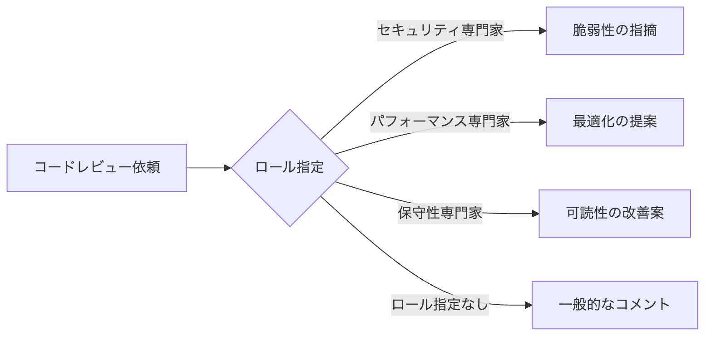
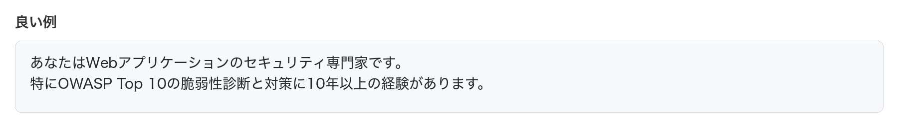
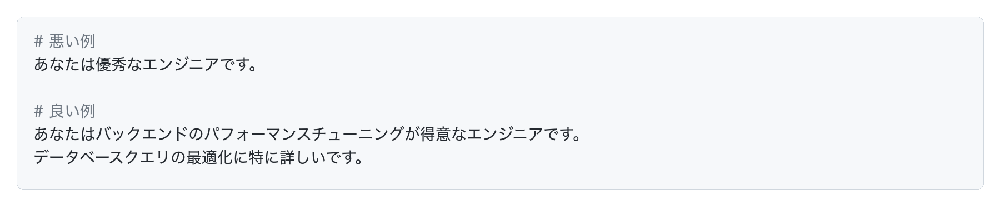
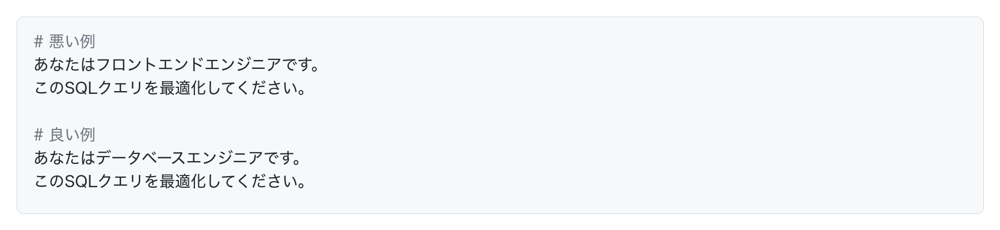

# ロールプレイの活用

AIに何かを依頼する時、こんなプロンプトを見たことがありませんか。

このようにAIに「役割」を与える手法を「ロールプレイ」といいます。

## ロールプレイとは何か

ロールプレイとは、AIに特定の役割や専門性を与えることで、その視点からの回答を引き出すテクニックです。

AIは膨大な知識を持っていますが、何も指定しないと一般的な回答しか返しません。ロールプレイを使うことで、その知識の中から必要な部分だけを引き出すことができます。

例えば、同じコードレビューでも、「セキュリティ専門家」として依頼するのと、「パフォーマンス最適化の専門家」として依頼するのでは、全く違う観点の指摘が返ってきます。

## 基本的な使い方

ロールプレイの基本的な使い方は、プロンプトの最初に役割を明示することです。

この構造で、AIの回答の質は大きく変わります。

## ロール設定のコツ

効果的なロール設定のコツを紹介します。

### 1. 具体的な専門性を指定する

**悪い例：**

**良い例：**

### 2. 経験年数を加える

経験年数を加えることで、より深い知識を引き出せます。

### 3. 複数の観点を組み合わせる

### 4. プロジェクトの文脈を加える

## ロールの指定は1回だけでOK

ロールは、コンテキストウィンドウ（1つのチャット）の最初に1回指定すれば、その後の会話ではずっと有効です。毎回「あなたは専門家です」と繰り返す必要はありません。

## よくある失敗

### 失敗1：ロールが抽象的すぎる

### 失敗2：ロールとタスクが矛盾している

### 失敗3：ロールだけで具体的な指示がない

## まとめ

ロールプレイは、AIの回答の質を劇的に向上させる強力なテクニックです。

重要なポイント：

1. AIに専門家としての役割を与えると、その視点で回答してくれる
2. ロールは具体的で明確に設定する
3. 経験年数や専門分野を詳しく指定する
4. ロールとタスクが一致していることを確認する
5. 複数の観点が必要な場合は、複数回に分けて依頼する

ロールプレイを使いこなすことで、AIは単なる知識の提供者から、信頼できる専門家へと変わります。開発の各フェーズで適切なロールを設定し、AIの真の力を引き出しましょう。
