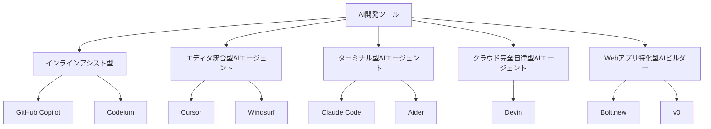
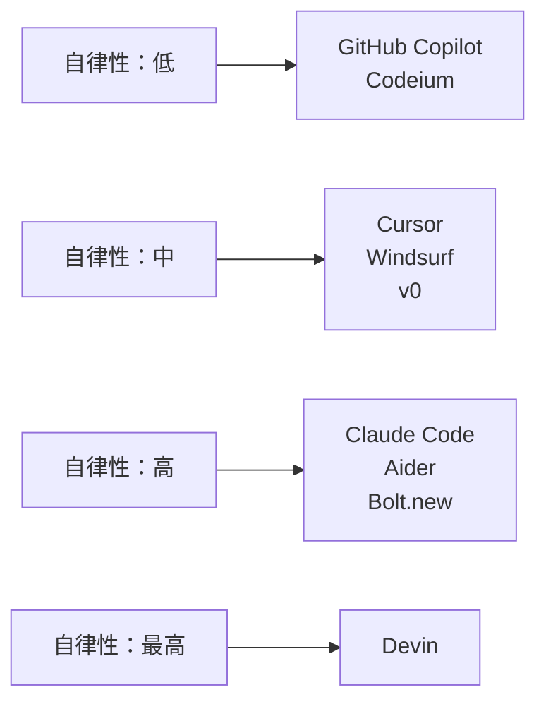

# 主要なAI開発ツールの紹介

この章では、AI駆動開発を実現する主要なツールを紹介します。それぞれのツールの特徴を理解して、あなたの開発スタイルに合ったツールを見つけてください。

## 開発でChatGPTを使うのは卒業しよう

まず、多くの人が最初に使うであろう「ChatGPT」などのLLM（大規模言語モデル）について触れておきます。

### ChatGPTでもコーディングはできるが...

ChatGPTを使って、こんな経験をした方も多いのではないでしょうか。

```
あなた：「Pythonでファイルを読み込むコードを書いて」
ChatGPT：「以下のようなコードで読み込めます。（コードを提示）」
あなた：（コピー＆ペーストして実行）
```

確かに、ChatGPTは質問に答えてコードを生成してくれます。調べ物をしたり、簡単なコードを生成するには便利です。

### ChatGPTの限界：開発ツールとしては手間がかかりすぎる

しかし、実際の開発でChatGPTを使うと、こんな問題に直面します。

**問題1：プロジェクトのコンテキストを理解できない**

ChatGPTはあなたのプロジェクトのファイルを読めません。毎回ファイルの内容をコピー＆ペーストして伝える必要があり、とても手間がかかります。

→ **AI開発ツールなら**：プロジェクトのファイルを自動で読み取り、全体のコンテキストを理解した上でコードを生成してくれます。

**問題2：ファイルを直接編集できない**

ChatGPTはコードを提示するだけです。実際にファイルに反映するのは、あなたが手作業で行う必要があります。複数ファイルの修正が必要な場合、1つ1つコピー＆ペーストする必要があります。

→ **AI開発ツールなら**：複数ファイルを自動で編集してくれます。あなたがファイルを開いて手作業で反映する必要はありません。

**問題3：コードを実行できない**

ChatGPTは実際にコードを実行できません。エラーが出るたびに、エラーメッセージをコピー＆ペーストして質問し、修正案をもらい、また手動で反映する...という往復が必要です。

→ **AI開発ツールなら**：コードを実行してエラーを確認し、自分で修正を試みてくれます。エラーが出ても、自律的にデバッグを進めてくれます。

つまり、**ChatGPTは「提案」はしてくれますが、「実行」はしてくれない**のです。

## ChatGPTは「質問ツール」としては優秀だが、開発のメインとしては物足りない

誤解しないでほしいのは、ChatGPTが悪いツールというわけではありません。

**ChatGPTが向いていること：**
- 技術的な質問への回答
- アルゴリズムの説明
- コードの解説
- 設計の相談
- エラーメッセージの意味を理解する

しかし、**実際の開発作業を進めるツールとしては、正直物足りない**のです。

### もっと良いツールがある

そこで登場するのが、この章で紹介する「AI開発ツール」です。これらのツールは：

- **プロジェクトのコードを自動で理解する**
- **複数ファイルを同時に編集できる**
- **コードを実行してエラーを確認できる**
- **Git操作やテスト実行も自動化できる**

つまり、「質問に答える」だけでなく、「実際に開発作業を進める」ことができます。

それでは、これらのツールを見ていきましょう。

## AI開発ツールの全体像

AI開発ツールは、大きく5つのカテゴリに分けられます。



それぞれのカテゴリは、**自律性の高さ**と**実行できる作業範囲**が異なります。

## 1. インラインアシスト型（AI補完ツール）

### 特徴

インラインアシスト型は、あなたが書く1行1行をリアルタイムでアシストしてくれるツールです。自律性は低く、あなたが主導権を持って開発を進めます。

**動作イメージ：**
```javascript
// あなたがコメントを書くと...
// ユーザーの年齢が20歳以上かチェックする関数

// ↓ AIが次のようなコードを提案
function isAdult(age) {
  return age >= 20;
}
```

あなたがコードを書いている最中に、AIがリアルタイムで次のコードを予測して提案します。提案を受け入れるかどうかは、あなたが決めます。

### 代表的なツール

- GitHub Copilot
- Codeium

### インラインアシスト型は古くて非効率なので非推奨

インラインアシスト型は、AI駆動開発の初期段階で登場したツールですが、現在ではより高機能なツールが登場しているため、お勧めできません。

お勧めなのは、これから紹介する「エディタ統合型AIエージェント」や「ターミナル型AIエージェント」といったツールです
## 2. エディタ統合型AIエージェント

### 特徴

エディタ内で動作し、複数のファイルを同時に編集できるAIエージェントです。自律性は中程度で、あなたがAIと対話しながら開発を進めます。

**動作イメージ：**
```
あなた：「ユーザー認証機能を追加して」

AIエージェント：
  1. auth.jsファイルを作成
  2. login.jsファイルを作成
  3. データベーススキーマを更新
  4. テストファイルを作成
  5. 「認証機能を追加しました」と報告
```

エディタ内でAIと対話しながら、複数のファイルを編集できます。あなたはエディタの操作感を保ったまま、AIの力を活用できます。

### こんな人に向いている

- 既存のエディタ感覚でAIの力を使いたいエンジニア
- 複数ファイルを同時に編集したい
- コードを見ながらAIと対話したい

### 代表的なツール

#### Cursor

**特徴：**
- VS Codeベースで使い慣れた操作感
- 最も人気のあるAI統合エディタ
- 複数ファイルの同時編集が可能
- コードベース全体を理解して提案

**価格：**
- 無料プランあり（制限付き）
- Proプラン：$20/月

**何ができるか：**
- AIとのチャット形式での対話
- 複数ファイルの同時編集
- コードの説明と改善提案
- バグの検出と修正
- リファクタリング

#### その他のツール

この種のツールとして、他には、Windsurf, Clineなどが挙げられます

## 3. ターミナル型AIエージェント

### 特徴

コマンドラインで動作するAIエージェントです。

「エディタ統合型AIエージェント」がGUIのエディタなのに対し、こちらはターミナル上で動作する違いがあります。

### こんな人に向いている

- ターミナル作業が多いエンジニア
- 自動化を重視する人
- エディタを開かずにコードを編集したい
- CIツールやスクリプトと組み合わせたい

### 代表的なツール

#### Claude Code

**特徴：**
- Anthropic社が提供するターミナル型AIエージェント
- 最も注目されているAIコーディングツールの一つ

**価格：**
- 月3000円程度〜

#### その他のツール

この種のツールとして、他には、Aider, Gemini CLIなどが挙げられます


## 4. クラウド完全自律型AIエージェント

### 特徴

クラウド上で完結するAIエージェントです。ブラウザ上で指示を出すと、クラウド上で開発環境が自動作成され、完全に自律して開発を進めます。

つまりあなたはローカルに開発環境を作る必要すらありません。

あなたはタスクを指示するだけで、AIがクラウド上で、自律的にコーディング、テスト、デバッグを行います。

### こんな人に向いている

- AIに開発を任せたい人
- プロトタイプを超高速で作りたい人
- 複雑なプロジェクトを自動化したい
- 時間をかけずにアイデアを形にしたい

### 代表的なツール

#### Devin

**特徴：**
- Cognition AI社が提供するAIソフトウェアエンジニア
- 最も有名な完全自律型AIエージェント
- 独自のブラウザ、ターミナル、エディタを持つ
- 複雑なタスクを完全自律で実行

**価格：**
- 月3000円程度〜
- すぐクレジットを使い切ってしまうので、割高な印象


**何ができるか：**
- プロジェクトの計画立案
- コードベースの作成
- テストの実装と実行
- バグの検出と修正
- デプロイ
- ドキュメント作成


## 5. Webアプリ特化型AIビルダー

### 特徴

Webアプリ開発に特化したツールです。アイデアを伝えるだけで、Webアプリが完成します。デプロイまで一貫してサポートします。

**動作イメージ：**
```
あなた：「Todoアプリを作成して」

AIビルダー：
  1. UIを生成
  2. バックエンドロジックを実装
  3. データベースを設定
  4. プレビューを表示
  5. 「こちらがTodoアプリです。デプロイしますか？」
```

コードを書く必要がなく、アイデアを伝えるだけでWebアプリが完成します。非エンジニアでも使えるツールです。

### こんな人に向いている

- 非エンジニアやプロトタイプを作りたいエンジニア
- Webアプリを超高速で作成したい
- デザインとコードを同時に確認したい
- アイデアをすぐに形にしたい

### 代表的なツール

#### Bolt.new

**特徴：**
- StackBlitzが提供するAI Webアプリビルダー
- シンプルで使いやすい
- リアルタイムプレビュー機能
- デプロイまで一貫サポート

**価格：**
- 無料プランあり
- Proプラン：$15/月

**何ができるか：**
- Webアプリの自動生成
- リアルタイムプレビュー
- コードの編集
- デプロイ（Netlify、Vercelなど）

**使用例：**
```
あなた：「天気予報アプリを作成して。現在地の天気を表示して」

Bolt.new：
  - React + TypeScriptでアプリを生成
  - 天気APIと連携
  - UIを生成（現在地の天気、週間予報など）
  - プレビューを表示
  - 「こちらが天気予報アプリです」
```

#### v0

**特徴：**
- Vercelが提供するUIコンポーネント生成AI
- 美しいUIデザインが得意
- React、Next.jsに特化
- Tailwind CSSを使ったスタイリング

**価格：**
- 無料プランあり
- 有料プランあり

**何ができるか：**
- UIコンポーネントの生成
- デザインシステムの作成
- レスポンシブデザイン
- Next.jsアプリの生成

**使用例：**
```
あなた：「ダッシュボード画面を作成して。売上グラフと統計情報を表示して」

v0：
  - 美しいダッシュボードUIを生成
  - グラフコンポーネントを実装
  - レスポンシブ対応
  - プレビューを表示
```

## 主要AI開発ツール比較表

| カテゴリ | ツール名 | 価格 | 自律性 | 作業範囲 | おすすめレベル |
|---------|---------|------|--------|---------|-------------|
| インラインアシスト型 | GitHub Copilot | $10/月 | 低 | 1ファイル | 初級〜中級 |
| インラインアシスト型 | Codeium | 無料 | 低 | 1ファイル | 初級 |
| エディタ統合型 | Cursor | 無料〜$20/月 | 中 | 複数ファイル | 初級〜上級 |
| エディタ統合型 | Windsurf | $25/月 | 中 | プロジェクト全体 | 上級 |
| ターミナル型 | Claude Code | 従量課金 | 高 | プロジェクト全体 + コマンド実行 | 中級〜上級 |
| ターミナル型 | Aider | LLM API料金のみ | 高 | プロジェクト全体 | 中級〜上級 |
| クラウド完全自律型 | Devin | $500/月 | 最高 | プロジェクト全体 + 自律開発 | 上級 |
| Webアプリ特化型 | Bolt.new | 無料〜$15/月 | 高 | Webアプリ全体 | 初級〜中級 |
| Webアプリ特化型 | v0 | 無料〜有料 | 中 | UIコンポーネント | 初級〜中級 |



## どのツールを選べばいいか

あなたの状況に合わせて、適切なツールを選びます。

### 初めてAI開発ツールを使う場合

まずは**GitHub Copilot**または**Codeium**から始めることをおすすめします。

- 既存のエディタにインストールするだけ
- コードを書きながらAIの提案を体験できる
- 低リスクで試せる

### 複数ファイルを編集したい場合

**Cursor**がおすすめです。

- VS Codeと同じ操作感
- 複数ファイルを同時に編集できる
- AIと対話しながら開発できる

### ターミナルでの作業が多い場合

**Claude Code**または**Aider**がおすすめです。

- ターミナルだけで開発が完結
- Gitやテストの自動化が簡単
- CIツールと組み合わせやすい

### Webアプリを超高速で作りたい場合

**Bolt.new**がおすすめです。

- コードを書かずにアプリが完成
- リアルタイムプレビュー
- デプロイまで一貫サポート

### 複雑なプロジェクトを自動化したい場合

**Devin**がおすすめです。

- 完全自律で開発を進める
- 人間の介入を最小限にできる
- 大規模なプロジェクトに対応

## AI開発ツールを使う際の注意点

AI開発ツールは強力ですが、注意すべき点もあります。

### 1. コードの理解を怠らない

AIが生成したコードをそのまま使うのではなく、必ず内容を理解してください。

- なぜそのコードなのか
- どんな処理をしているのか
- 問題はないか

AIに頼りすぎると、コードを読む力が育ちません。

### 2. セキュリティへの配慮

機密情報を含むコードをAIに見せる際は注意が必要です。

- APIキー、パスワードは絶対に送信しない
- 社内ルールがある場合は必ず確認する
- プライバシー設定を確認する

多くのツールは、コードを学習に利用しないオプションを提供しています。

### 3. コードの品質確認

AIが生成したコードは、必ず動作確認とレビューを行います。

- 実際に動作するか確認
- エッジケースを考慮しているか
- テストコードは書かれているか
- セキュリティ上の問題はないか

AIは完璧ではありません。最終的な責任は人間にあります。

### 4. 適切なツールの選択

プロジェクトの規模や要件に合わせてツールを選びます。

- 小規模プロジェクト：インラインアシスト型やWebアプリ特化型
- 中規模プロジェクト：エディタ統合型やターミナル型
- 大規模プロジェクト：ターミナル型やクラウド完全自律型

## まとめ

この章では、AI開発ツールの5つのカテゴリと代表的なツールを紹介しました。

- **インラインアシスト型**：リアルタイムでコード補完（GitHub Copilot、Codeium）
- **エディタ統合型AIエージェント**：エディタ内でAIと対話しながら開発（Cursor、Windsurf）
- **ターミナル型AIエージェント**：ターミナルで自律的に開発（Claude Code、Aider）
- **クラウド完全自律型AIエージェント**：完全自律で開発を進める（Devin）
- **Webアプリ特化型AIビルダー**：アイデアからWebアプリを生成（Bolt.new、v0）

それぞれのツールは、自律性と作業範囲が異なります。あなたの開発スタイルやプロジェクトの要件に合わせて、適切なツールを選んでください。

次の章では、これらのツールの中から特におすすめのツールを詳しく紹介します。
