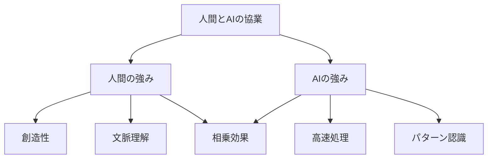

# 人間と AI の協業のコツ

## 人間と AI の協業の重要性

AI 駆動開発において、人間と AI の効果的な協業は、開発の効率性と品質を高めるために不可欠です。それぞれの強みを活かし、弱点を補い合うことで、より良い成果を生み出すことができます。

## 人間と AI の強みと弱み

### 人間の強み

- 創造的思考
- 文脈理解
- 倫理的判断
- 複雑な問題解決

### AI の強み

- 高速な処理
- 大量データの分析
- パターン認識
- 反復作業の自動化



## 効果的な協業のためのポイント

### 1. 役割の明確化

**人間の役割**:

- 要件の定義
- 設計の決定
- 品質の確認
- 創造的な問題解決

**AI の役割**:

- コード生成
- パターン分析
- 反復作業
- データ処理

### 2. コミュニケーションの最適化

**プロンプト設計**:

- 明確な指示
- 具体的な要件
- 期待する出力形式
- 制約条件の明示

**フィードバック**:

- 建設的な批評
- 具体的な改善点
- 成功例の共有
- 継続的な改善

### 3. ワークフローの構築

**タスクの分割**:

- 人間向けタスク
- AI 向けタスク
- 共同タスク
- レビュータスク

**プロセスの最適化**:

- 効率的な連携
- 自動化の活用
- 品質管理
- 継続的改善

## 実践的な協業の例

### 1. コードレビューの協業

```python
# コードレビュープロセスの例
class CodeReviewProcess:
    def __init__(self):
        self.ai_reviewer = AIReviewer()
        self.human_reviewer = HumanReviewer()

    def review_code(self, code: str) -> Dict:
        # AIによる初期レビュー
        ai_feedback = self.ai_reviewer.review(code)

        # 人間による確認と追加レビュー
        human_feedback = self.human_reviewer.review(code, ai_feedback)

        # フィードバックの統合
        return self.merge_feedback(ai_feedback, human_feedback)

    def merge_feedback(self, ai_feedback: Dict, human_feedback: Dict) -> Dict:
        return {
            "technical_issues": ai_feedback["technical_issues"],
            "design_considerations": human_feedback["design_considerations"],
            "improvement_suggestions": [
                *ai_feedback["suggestions"],
                *human_feedback["suggestions"]
            ]
        }
```

### 2. 問題解決の協業

```python
# 問題解決プロセスの例
class ProblemSolvingProcess:
    def __init__(self):
        self.ai_solver = AISolver()
        self.human_solver = HumanSolver()

    def solve_problem(self, problem: str) -> Dict:
        # AIによる初期分析
        ai_analysis = self.ai_solver.analyze(problem)

        # 人間による確認と追加分析
        human_analysis = self.human_solver.analyze(problem, ai_analysis)

        # 解決策の生成
        solution = self.generate_solution(ai_analysis, human_analysis)

        return {
            "problem_analysis": {
                "ai_insights": ai_analysis,
                "human_insights": human_analysis
            },
            "proposed_solution": solution,
            "implementation_steps": self.create_implementation_plan(solution)
        }
```

### 3. 設計の協業

```python
# 設計プロセスの例
class DesignProcess:
    def __init__(self):
        self.ai_designer = AIDesigner()
        self.human_designer = HumanDesigner()

    def create_design(self, requirements: Dict) -> Dict:
        # AIによる初期設計
        ai_design = self.ai_designer.generate_design(requirements)

        # 人間による確認と改善
        human_design = self.human_designer.review_and_improve(ai_design)

        # 最終設計の確定
        final_design = self.finalize_design(ai_design, human_design)

        return {
            "architecture": final_design["architecture"],
            "components": final_design["components"],
            "interfaces": final_design["interfaces"],
            "implementation_guidelines": final_design["guidelines"]
        }
```

## 協業のベストプラクティス

### 1. 信頼関係の構築

- 相互理解の促進
- 期待値の明確化
- フィードバックの共有
- 継続的な改善

### 2. スキル開発

- AI ツールの理解
- プロンプトエンジニアリング
- コードレビュー技術
- 問題解決能力

### 3. プロセスの最適化

- 効率的なワークフロー
- 自動化の活用
- 品質管理
- 継続的改善

## まとめ

人間と AI の効果的な協業は、AI 駆動開発の成功に不可欠です。以下のポイントを意識することで、より良い協業を実現できます：

1. それぞれの強みを活かす
2. 明確な役割分担
3. 効果的なコミュニケーション
4. 継続的な改善

これらの要素を組み合わせることで、人間と AI の相乗効果を最大限に引き出し、より効率的で質の高い開発を実現できます。
