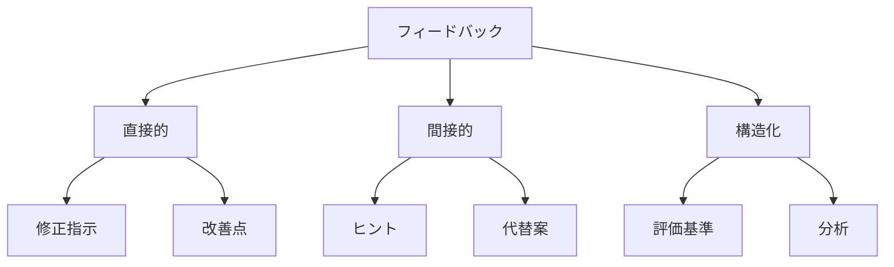

# 効果的なフィードバック方法

## フィードバックの重要性

AI駆動開発において、効果的なフィードバックは、AIの出力品質を向上させ、開発プロセスを改善するために不可欠です。適切なフィードバック方法を理解し、実践することで、より良い結果を得ることができます。

## フィードバックの種類

### 1. 直接的なフィードバック

- 具体的な修正指示
- 明確な改善点の指摘
- 即時のフィードバック
- 直接的な問題解決

### 2. 間接的なフィードバック

- ヒントや示唆
- 代替案の提示
- 学習の促進
- 自己改善の促し

### 3. 構造化されたフィードバック

- 評価基準に基づく
- 体系的な分析
- 定量的な評価
- 継続的な改善



## 効果的なフィードバックの原則

### 1. 明確性

- 具体的な指摘
- 明確な言語
- 具体的な例
- 実行可能な提案

### 2. 建設性

- 前向きな姿勢
- 改善の機会
- 学習の促進
- 成長の支援

### 3. タイミング

- 適切な時期
- 即時のフィードバック
- 定期的なレビュー
- 継続的な改善

## フィードバックの実践

### 1. コードレビューでのフィードバック

```python
# コードレビューフィードバックの例
class CodeReviewFeedback:
    def __init__(self):
        self.feedback_categories = {
            "style": [],
            "functionality": [],
            "performance": [],
            "security": []
        }

    def add_feedback(self, category: str, feedback: str):
        self.feedback_categories[category].append(feedback)

    def generate_summary(self) -> Dict:
        return {
            category: {
                "count": len(feedbacks),
                "items": feedbacks
            }
            for category, feedbacks in self.feedback_categories.items()
        }
```

### 2. プロンプト改善のフィードバック

```python
# プロンプト改善フィードバックの例
class PromptFeedback:
    def __init__(self):
        self.feedback_history = []

    def analyze_prompt(self, prompt: str, result: str) -> Dict:
        return {
            "clarity": self.evaluate_clarity(prompt),
            "specificity": self.evaluate_specificity(prompt),
            "effectiveness": self.evaluate_effectiveness(prompt, result)
        }

    def suggest_improvements(self, analysis: Dict) -> List[str]:
        improvements = []
        if analysis["clarity"] < 0.8:
            improvements.append("より明確な指示を追加してください")
        if analysis["specificity"] < 0.8:
            improvements.append("具体的な要件を追加してください")
        return improvements
```

### 3. 継続的改善のフィードバック

```python
# 継続的改善フィードバックの例
class ContinuousImprovementFeedback:
    def __init__(self):
        self.improvement_tracker = ImprovementTracker()

    def track_improvement(self, feedback: Dict):
        self.improvement_tracker.record_feedback(feedback)

    def analyze_trends(self) -> Dict:
        return {
            "improvement_areas": self.improvement_tracker.get_improvement_areas(),
            "success_metrics": self.improvement_tracker.get_success_metrics(),
            "recommendations": self.improvement_tracker.get_recommendations()
        }
```

## フィードバックの効果測定

### 1. 定量的な測定

- 改善率の追跡
- エラー率の減少
- 生産性の向上
- 品質指標の改善

### 2. 定性的な測定

- 開発者の満足度
- チームの協業
- 学習効果
- イノベーション

## フィードバックの最適化

### 1. フィードバックループの改善

- フィードバックの収集
- 分析と評価
- 改善の実施
- 効果の測定

### 2. フィードバック文化の醸成

- オープンなコミュニケーション
- 建設的な批評
- 継続的な学習
- 相互支援

## まとめ

効果的なフィードバックは、AI駆動開発の成功に不可欠です。以下のポイントを意識することで、より良いフィードバックを実現できます：

1. 明確で具体的なフィードバック
2. 建設的で前向きな姿勢
3. 適切なタイミング
4. 継続的な改善

これらの要素を組み合わせることで、より効果的なフィードバックを提供し、AI駆動開発の品質を向上させることができます。
