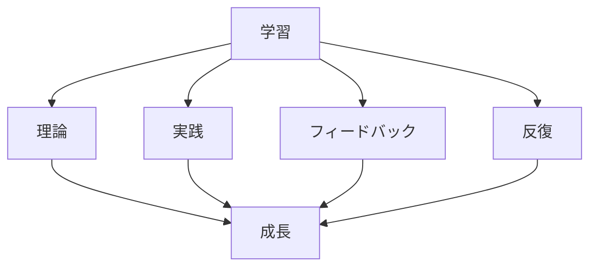

# 効果的な学習方法

## 学習の基本原則

### 学習の重要性

AI 駆動開発における学習の重要性：

- 技術の急速な変化への対応
- 新しいスキルの習得
- 競争力の維持
- 継続的な成長

### 学習の要素

## 効果的な学習方法

### 1. 理論学習

効果的な理論学習の方法：

- 体系的な学習
- 基礎知識の習得
- 概念の理解
- 理論の応用

### 2. 実践学習

効果的な実践学習の方法：

- ハンズオン演習
- プロジェクトへの参加
- コードレビュー
- 問題解決

### 3. フィードバック

効果的なフィードバックの活用：

- コードレビュー
- メンタリング
- 自己評価
- 継続的な改善

## 実践的なアプローチ

### 学習計画

効果的な学習計画の立て方：

- 目標の設定
- スケジュールの作成
- リソースの選択
- 進捗の管理

### 学習の最適化

学習を最適化する方法：

- 集中学習
- 実践的な演習
- フィードバックの活用
- 継続的な改善

## 成功のポイント

### モチベーションの維持

モチベーションを維持するポイント：

- 明確な目標設定
- 進捗の可視化
- コミュニティの活用
- 継続的な学習

### 学習の継続

学習を継続するポイント：

- 習慣化
- スケジュール管理
- リソースの確保
- 環境の整備

## 実践的なアドバイス

### 学習の進め方

効果的な学習の進め方：

1. 目標の設定
2. 学習計画の作成
3. 実践的な演習
4. フィードバックの活用
5. 継続的な改善

### 成功への道筋

学習を成功させるポイント：

- 明確な目標設定
- 計画的なアプローチ
- 継続的な学習
- 実践的な経験

## まとめ

効果的な学習方法は、AI 駆動開発のスキル向上に不可欠です。理論と実践のバランス、フィードバックの活用、そして継続的な改善が重要です。
