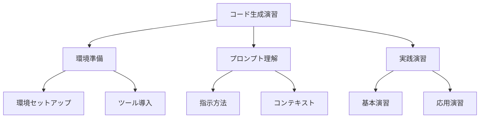

# 基本的なコード生成演習

## コード生成の基本

AI 駆動開発において、基本的なコード生成の演習は、AI ツールの効果的な活用を学ぶための重要なステップです。この演習を通じて、AI との協業の基本を理解し、実践的なスキルを身につけることができます。

## 演習の準備

### 1. 環境のセットアップ

- 開発環境の準備
- AI ツールのインストール
- 必要なライブラリの導入
- プロジェクトの初期化

### 2. 基本的なプロンプトの理解

- 明確な指示の出し方
- コンテキストの提供
- 期待する出力の指定
- 制約条件の設定

### 3. 演習の進め方

- 段階的なアプローチ
- フィードバックの活用
- 継続的な改善
- 実践的な応用



## 基本的な演習例

### 1. シンプルな関数の生成

```python
# プロンプト例
"""
以下の要件に基づいて、Python関数を生成してください：
- 関数名: calculate_average
- 入力: 数値のリスト
- 出力: リストの平均値
- エラーハンドリング: 空のリストの場合は0を返す
"""

# 生成されたコード例
def calculate_average(numbers: List[float]) -> float:
    if not numbers:
        return 0
    return sum(numbers) / len(numbers)
```

### 2. クラスの生成

```python
# プロンプト例
"""
以下の要件に基づいて、Pythonクラスを生成してください：
- クラス名: Student
- 属性: name, age, grades
- メソッド:
  - __init__: 名前と年齢を初期化
  - add_grade: 成績を追加
  - get_average: 平均点を計算
"""

# 生成されたコード例
class Student:
    def __init__(self, name: str, age: int):
        self.name = name
        self.age = age
        self.grades = []

    def add_grade(self, grade: float):
        self.grades.append(grade)

    def get_average(self) -> float:
        if not self.grades:
            return 0
        return sum(self.grades) / len(self.grades)
```

### 3. テストコードの生成

```python
# プロンプト例
"""
以下の関数に対するテストコードを生成してください：
- 関数: calculate_average
- テストケース:
  - 正常な入力
  - 空のリスト
  - 負の数を含むリスト
"""

# 生成されたコード例
import unittest

class TestCalculateAverage(unittest.TestCase):
    def test_normal_input(self):
        numbers = [1, 2, 3, 4, 5]
        self.assertEqual(calculate_average(numbers), 3.0)

    def test_empty_list(self):
        self.assertEqual(calculate_average([]), 0)

    def test_negative_numbers(self):
        numbers = [-1, -2, -3]
        self.assertEqual(calculate_average(numbers), -2.0)
```

## 演習の進め方

### 1. 基本演習

- シンプルな関数の生成
- 基本的なクラスの作成
- 簡単なテストの実装
- エラーハンドリングの追加

### 2. 応用演習

- 複雑な関数の生成
- 継承を含むクラスの作成
- 統合テストの実装
- パフォーマンス最適化

### 3. 実践演習

- 実際のプロジェクトでの応用
- チーム開発での活用
- コードレビューの実施
- 継続的な改善

## 演習の効果測定

### 1. 定量的な評価

- コードの品質
- テストカバレッジ
- エラー率
- 開発速度

### 2. 定性的な評価

- コードの可読性
- 保守性
- 拡張性
- 再利用性

## まとめ

基本的なコード生成演習は、AI 駆動開発の基礎を固めるために重要です。以下のポイントを意識することで、より効果的な演習を実現できます：

1. 明確な要件定義
2. 段階的なアプローチ
3. 継続的なフィードバック
4. 実践的な応用

これらの要素を組み合わせることで、AI 駆動開発のスキルを効果的に向上させることができます。
